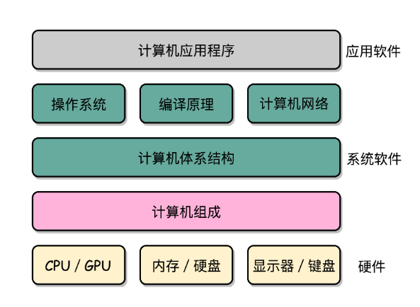
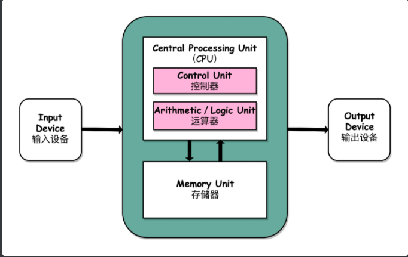

## 计算机底层知识的第一课

“计算机组成原理”是入门和底层层面的第一课。

除此之外，组成原理是计算机其他核心课程的一个“导引”。

<!--more-->

## 计算机的基本硬件组成

早年，要自己组装一台计算机，要先有**三大件，CPU、内存和主板**。

在这三大件中，我们首先要说的是 CPU，它是**计算机最重要的核心配件**，全名你肯定知道，叫中央处理器（Central Processing Unit）。为什么说 CPU 是“最重要”的呢？因为计算机的所有“计算”都是由 CPU 来进行的。自然，CPU 也是整台计算机中造价最昂贵的部分之一。

第二个重要的配件，就是内存（Memory）。你撰写的程序、打开的浏览器、运行的游戏，都要加载到内存里才能运行。程序读取的数据、计算得到的结果，也都要放在内存里。内存越大，能加载的东西自然也就越多。

存放在内存里的程序和数据，需要被 CPU 读取，CPU 计算完之后，还要把数据写回到内存。然而 CPU 不能直接插到内存上，反之亦然。于是，就带来了最后一个大件——主板（Motherboard）。

主板是一个有着各种各样，有时候多达数十乃至上百个插槽的配件。我们的 CPU 要插在主板上，内存也要插在主板上。主板的芯片组（Chipset）和总线（Bus）解决了 CPU 和内存之间如何通信的问题。芯片组控制了数据传输的流转，也就是数据从哪里到哪里的问题。总线则是实际数据传输的高速公路。因此，总线速度（Bus Speed）决定了数据能传输得多快。

有了三大件，只要配上电源供电，计算机差不多就可以跑起来了。但是现在还缺少各类输入（Input）/ 输出（Output）设备，也就是我们常说的 I/O 设备。如果你用的是自己的个人电脑，那显示器肯定必不可少，只有有了显示器我们才能看到计算机输出的各种图像、文字，这也就是所谓的输出设备。同样的，鼠标和键盘也都是必不可少的配件。这样我才能输入文本，写下这篇文章。它们也就是所谓的输入设备。

最后，你自己配的个人计算机，还要配上一个硬盘。这样各种数据才能持久地保存下来。绝大部分人都会给自己的机器装上一个机箱，配上风扇，解决灰尘和散热的问题。不过机箱和风扇，算不上是计算机的必备硬件，我们拿个纸板或者外面放个电风扇，也一样能用。

说了这么多，其实你应该有感觉了，显示器、鼠标、键盘和硬盘这些东西并不是一台计算机必须的部分。你想一想，我们其实只需要有 I/O 设备，能让我们从计算机里输入和输出信息，是不是就可以了？答案当然是肯定的。

你肯定去过网吧吧？不知道你注意到没有，很多网吧的计算机就没有硬盘，而是直接通过局域网，读写远程网络硬盘里面的数据。我们日常用的各类云服务器，只要让计算机能通过网络，SSH 远程登陆访问就好了，因此也没必要配显示器、鼠标、键盘这些东西。这样不仅能够节约成本，还更方便维护。

还有一个很特殊的设备，就是显卡（Graphics Card）。现在，使用图形界面操作系统的计算机，无论是 Windows、Mac OS 还是 Linux，显卡都是必不可少的。有人可能要说了，我装机的时候没有买显卡，计算机一样可以正常跑起来啊！那是因为，现在的主板都带了内置的显卡。如果你用计算机玩游戏，做图形渲染或者跑深度学习应用，你多半就需要买一张单独的显卡，插在主板上。显卡之所以特殊，是因为显卡里有除了 CPU 之外的另一个“处理器”，也就是 GPU（Graphics Processing Unit，图形处理器），GPU 一样可以做各种“计算”的工作。

鼠标、键盘以及硬盘，这些都是插在主板上的。作为外部 I/O 设备，它们是通过主板上的南桥（SouthBridge）芯片组，来控制和 CPU 之间的通信的。“南桥”芯片的名字很直观，一方面，它在主板上的位置，通常在主板的“南面”。另一方面，它的作用就是作为“桥”，来连接鼠标、键盘以及硬盘这些外部设备和 CPU 之间的通信。

## 冯·诺依曼体系结构

刚才我们讲了一台计算机的硬件组成，这说的是我们平时用的个人电脑或者服务器。那我们平时最常用的智能手机的组成，也是这样吗？

我们手机里只有 SD 卡（Secure Digital Memory Card）这样类似硬盘功能的存储卡插槽，并没有内存插槽、CPU 插槽这些东西。没错，因为手机尺寸的原因，手机制造商们选择把 CPU、内存、网络通信，乃至摄像头芯片，都封装到一个芯片，然后再嵌入到手机主板上。这种方式叫 SoC，也就是 System on a Chip（系统芯片）。

这样看起来，个人电脑和智能手机的硬件组成方式不太一样。可是，我们写智能手机上的 App，和写个人电脑的客户端应用似乎没有什么差别，都是通过“高级语言”这样的编程语言撰写、编译之后，一样是把代码和数据加载到内存里来执行。这是为什么呢？因为，无论是个人电脑、服务器、智能手机，还是 Raspberry Pi 这样的微型卡片机，<u>都遵循着同一个“计算机”的抽象概念</u>。这是怎么样一个“计算机”呢？这其实就是，计算机祖师爷之一冯·诺依曼（John von Neumann）提出的**冯·诺依曼体系结构**（Von Neumann architecture），也叫**存储程序计算机**。

什么是存储程序计算机呢？这里面其实暗含了两个概念，**一个是“可编程”计算机，一个是“存储”计算机**。

说到“可编程”，估计你会有点懵，你可以先想想，什么是“不可编程”。计算机是由各种门电路组合而成的，然后通过组装出一个固定的电路板，来完成一个特定的计算程序。一旦需要修改功能，就要重新组装电路。这样的话，计算机就是“不可编程”的，因为程序在计算机硬件层面是“写死”的。最常见的就是老式计算器，电路板设好了加减乘除，做不了任何计算逻辑固定之外的事情。

> 例如计算器的本质是一个不可编程的计算机。

我们再来看“存储”计算机。这其实是说，程序本身是存储在计算机的内存里，可以通过加载不同的程序来解决不同的问题。有“存储程序计算机”，自然也有不能存储程序的计算机。典型的就是早年的“Plugboard”这样的插线板式的计算机。整个计算机就是一个巨大的插线板，通过在板子上不同的插头或者接口的位置插入线路，来实现不同的功能。这样的计算机自然是“可编程”的，但是编写好的程序不能存储下来供下一次加载使用，不得不每次要用到和当前不同的“程序”的时候，重新插板子，重新“编程”。

可以看到，无论是“不可编程”还是“不可存储”，都会让使用计算机的效率大大下降。而这个对于效率的追求，也就是“存储程序计算机”的由来。

祖师爷冯诺依曼在EDVAC的第一份草案First Draft 里面说了一台计算机应该有哪些部分组成，我们一起来看看。

首先是一个包含**算术逻辑单元**（Arithmetic Logic Unit，ALU）和处理器寄存器（Processor Register）的**处理器单元**（Processing Unit），用来完成各种算术和逻辑运算。因为它能够完成各种数据的处理或者计算工作，因此也有人把这个叫作数据通路（Datapath）或者运算器。

然后是一个包含指令寄存器（Instruction Register）和程序计数器（Program Counter）的**控制器单元**（Control Unit/CU），用来控制程序的流程，通常就是不同条件下的分支和跳转。在现在的计算机里，**上面的算术逻辑单元和这里的控制器单元，共同组成了我们说的 CPU**。

接着是用来存储数据（Data）和指令（Instruction）的内存。以及更大容量的外部存储，在过去，可能是磁带、磁鼓这样的设备，现在通常就是硬盘。

最后就是各种输入和输出设备，以及对应的输入和输出机制。我们现在无论是使用什么样的计算机，其实都是和输入输出设备在打交道。个人电脑的鼠标键盘是输入设备，显示器是输出设备。我们用的智能手机，触摸屏既是输入设备，又是输出设备。而跑在各种云上的服务器，则是通过网络来进行输入和输出。这个时候，网卡既是输入设备又是输出设备。

**任何一台计算机的任何一个部件都可以归到运算器、控制器、存储器、输入设备和输出设备中，而所有的现代计算机也都是基于这个基础架构来设计开发的。**

而所有的计算机程序，也都可以抽象为从输入设备读取输入信息，通过运算器和控制器来执行存储在存储器里的程序，最终把结果输出到输出设备中。而我们所有撰写的无论高级还是低级语言的程序，也都是基于这样一个抽象框架来进行运作的。

## 冯·诺依曼机与图灵机的思考

计算机行业的两大祖师爷之一，除了冯·诺依曼机之外，还有一位就是著名的图灵（Alan Mathison Turing）。对应的，我们现在的计算机也叫图灵机（Turing Machine）。那么图灵机和冯·诺依曼机是两种不同的计算机么？图灵机是一种什么样的计算机抽象呢？

两者有交叉但是不同，根据了解整理如下：
\- 图灵机是一种思想模型（计算机的基本理论基础），是一种有穷的、构造性的问题的问题求解思路，图灵认为凡是能用算法解决的问题也一定能用图灵机解决；
\- 冯诺依曼提出了“存储程序”的计算机设计思想，并“参照”图灵模型设计了历史上第一台电子计算机，即冯诺依曼机。
ps：有看到一种有争议说法：冯诺依曼机是图灵机的实现，感觉这有点过于片面，所以上述姑且改为参照