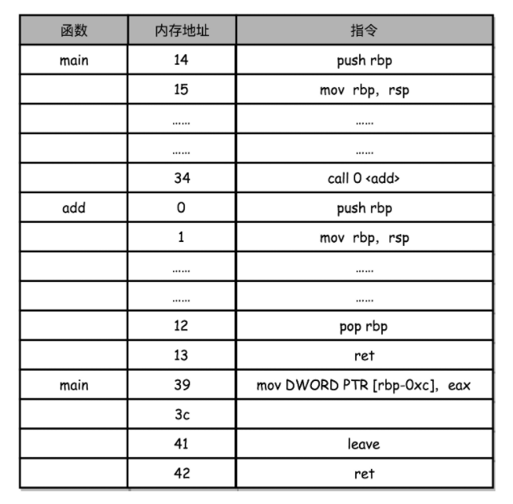

今天，我们就从程序的函数调用开始，讲讲函数间的相互调用，在计算机指令层面是怎么实现的，以及什么情况下会发生栈溢出这个错误。

<!--more-->

## 为什么我们需要程序栈？

```c
// function_example.c
#include <stdio.h>
int static add(int a, int b)
{
    return a+b;
}
int main()
{
    int x = 5;
    int y = 10;
    int u = add(x, y);
}
```

这个程序定义了一个简单的函数 add，接受两个参数 a 和 b，返回值就是 a+b。而 main 函数里则定义了两个变量 x 和 y，然后通过调用这个 add 函数，来计算 u=x+y，最后把 u 的数值打印出来。

我们来看一看对应的汇编代码。

```shell
int static add(int a, int b)
{
   0:   55                      push   rbp
   1:   48 89 e5                mov    rbp,rsp
   4:   89 7d fc                mov    DWORD PTR [rbp-0x4],edi
   7:   89 75 f8                mov    DWORD PTR [rbp-0x8],esi
    return a+b;
   a:   8b 55 fc                mov    edx,DWORD PTR [rbp-0x4]
   d:   8b 45 f8                mov    eax,DWORD PTR [rbp-0x8]
  10:   01 d0                   add    eax,edx
}
  12:   5d                      pop    rbp
  13:   c3                      ret    
0000000000000014 <main>:
int main()
{
  14:   55                            push   rbp
  15:   48 89 e5                  mov    rbp,rsp
  18:   48 83 ec 10             sub    rsp,0x10
    int x = 5;
  1c:   c7 45 fc 05 00 00 00    mov    DWORD PTR [rbp-0x4],0x5
    int y = 10;
  23:   c7 45 f8 0a 00 00 00    mov    DWORD PTR [rbp-0x8],0xa
    int u = add(x, y);
  2a:   8b 55 f8                mov    edx,DWORD PTR [rbp-0x8]
  2d:   8b 45 fc                mov    eax,DWORD PTR [rbp-0x4]
  30:   89 d6                   mov    esi,edx
  32:   89 c7                   mov    edi,eax
  34:   e8 c7 ff ff ff          call   0 <add>
  39:   89 45 f4                mov    DWORD PTR [rbp-0xc],eax
  3c:   b8 00 00 00 00          mov    eax,0x0
}
  41:   c9                      leave  
  42:   c3                      ret    
```

可以看出来，在这段代码里，main 函数和上一节我们讲的的程序执行区别并不大，它主要是把 jump 指令换成了函数调用的 call 指令。call 指令后面跟着的，仍然是跳转后的程序地址。


这些你理解起来应该不成问题。我们下面来看一个有意思的部分。

我们来看 add 函数。可以看到，add 函数编译之后，代码先执行了一条 push 指令和一条 mov 指令；在函数执行结束的时候，又执行了一条 pop 和一条 ret 指令。这四条指令的执行，其实就是在进行我们接下来要讲**压栈**（Push）和**出栈**（Pop）操作。


你有没有发现，函数调用和上一节我们讲的 if…else 和 for/while 循环有点像。它们两个都是在原来顺序执行的指令过程里，执行了一个内存地址的跳转指令，让指令从原来顺序执行的过程里跳开，从新的跳转后的位置开始执行。

但是，这两个跳转有个区别，if…else 和 for/while 的跳转，是跳转走了就不再回来了，就在跳转后的新地址开始顺序地执行指令，就好像徐志摩在《再别康桥》里面写的：“我挥一挥衣袖，不带走一片云彩”，继续进行新的生活了。而函数调用的跳转，在对应函数的指令执行完了之后，还要再回到函数调用的地方，继续执行 call 之后的指令，就好像贺知章在《回乡偶书》里面写的那样：“少小离家老大回，乡音未改鬓毛衰”，不管走多远，最终还是要回来。


那我们有没有一个可以不跳转回到原来开始的地方，来实现函数的调用呢？直觉上似乎有这么一个解决办法。你可以把调用的函数指令，直接插入在调用函数的地方，替换掉对应的 call 指令，然后在编译器编译代码的时候，直接就把函数调用变成对应的指令替换掉。

不过，仔细琢磨一下，你会发现这个方法有些问题。如果函数 A 调用了函数 B，然后函数 B 再调用函数 A，我们就得面临在 A 里面插入 B 的指令，然后在 B 里面插入 A 的指令，这样就会产生无穷无尽地替换。就好像两面镜子面对面放在一块儿，任何一面镜子里面都会看到无穷多面镜子。


那我们就换一个思路，能不能把后面要跳回来执行的指令地址给记录下来呢？就像前面讲 PC 寄存器一样，我们可以专门设立一个“程序调用寄存器”，来存储接下来要跳转回来执行的指令地址。等到函数调用结束，从这个寄存器里取出地址，再跳转到这个记录的地址，继续执行就好了。

但是在多层函数调用里，简单只记录一个地址也是不够的。我们在调用函数 A 之后，A 还可以调用函数 B，B 还能调用函数 C。这一层又一层的调用并没有数量上的限制。在所有函数调用返回之前，每一次调用的返回地址都要记录下来，但是我们 CPU 里的寄存器数量并不多。像我们一般使用的 Intel i7 CPU 只有 16 个 64 位寄存器，调用的层数一多就存不下了。


最终，计算机科学家们想到了一个比单独记录跳转回来的地址更完善的办法。我们在内存里面开辟一段空间，用栈这个**后进先出**（LIFO，Last In First Out）的数据结构。栈就像一个乒乓球桶，每次程序调用函数之前，我们都把调用返回后的地址写在一个乒乓球上，然后塞进这个球桶。这个操作其实就是我们常说的**压栈**。如果函数执行完了，我们就从球桶里取出最上面的那个乒乓球，很显然，这就是**出栈**。

拿到出栈的乒乓球，找到上面的地址，把程序跳转过去，就返回到了函数调用后的下一条指令了。如果函数 A 在执行完成之前又调用了函数 B，那么在取出乒乓球之前，我们需要往球桶里塞一个乒乓球。而我们从球桶最上面拿乒乓球的时候，拿的也一定是最近一次的，也就是最下面一层的函数调用完成后的地址。乒乓球桶的底部，就是**栈底**，最上面的乒乓球所在的位置，就是**栈顶**。


在真实的程序里，压栈的不只有函数调用完成后的返回地址。比如函数 A 在调用 B 的时候，需要传输一些参数数据，这些参数数据在寄存器不够用的时候也会被压入栈中。整个函数 A 所占用的所有内存空间，就是函数 A 的**栈帧**（Stack Frame）。Frame 在中文里也有“相框”的意思，所以，每次到这里，我都有种感觉，整个函数 A 所需要的内存空间就像是被这么一个“相框”给框了起来，放在了栈里面。

而实际的程序栈布局，顶和底与我们的乒乓球桶相比是倒过来的。底在最上面，顶在最下面，这样的布局是因为栈底的内存地址是在一开始就固定的。而一层层压栈之后，栈顶的内存地址是在逐渐变小而不是变大。

