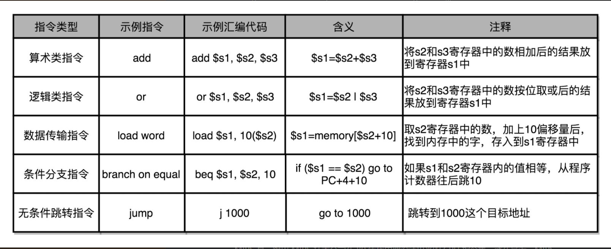
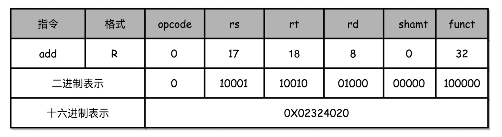
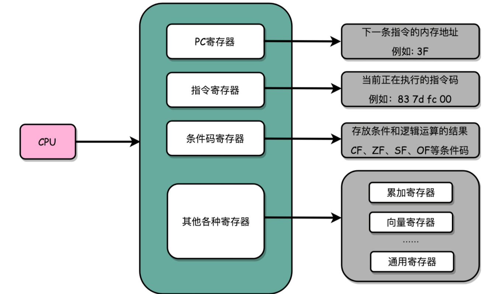

## 在软硬件接口中，CPU 帮我们做了什么事？

我们前面，从**硬件**的角度来看，CPU 就是一个超大规模集成电路，通过电路实现了加法、乘法乃至各种各样的处理逻辑。

<!--more-->

如果我们从**软件**工程师的角度来讲，CPU 就是一个执行各种计算机指令（Instruction Code）的逻辑机器。这里的**计算机指令**，就好比一门 CPU 能够听得懂的语言，我们也可以把它叫作机器语言（Machine Language）。

不同的 CPU 能够听懂的语言不太一样。比如，我们的个人电脑用的是 Intel 的 CPU，苹果手机用的是 ARM 的 CPU。这两者能听懂的语言就不太一样。类似这样两种 CPU 各自支持的语言，就是两组不同的**计算机指令集**，英文叫 Instruction Set。这里面的“Set”，其实就是数学上的集合，代表不同的单词、语法。

一个计算机程序，不可能只有一条指令，而是由成千上万条指令组成的。但是 CPU 里不能一直放着所有指令，所以计算机程序平时是存储在存储器中的。这种程序指令存储在存储器里面的计算机，我们就叫作**存储程序型计算机**（Stored-program Computer）。

## 从编译到汇编，代码怎么变成机器码？

```c
// test.c
int main()
{
  int a = 1; 
  int b = 2;
  a = a + b;
}
```

要让这段程序在一个 Linux 操作系统上跑起来，我们需要把整个程序翻译成一个**汇编语言**（ASM，Assembly Language）的程序，这个过程我们一般叫**编译**（Compile）成汇编代码。

针对汇编代码，我们可以再用汇编器（Assembler）翻译成机器码（Machine Code）。这些机器码由“0”和“1”组成的机器语言表示。这一条条**机器码**，就是一条条的**计算机指令**。这样一串串的 16 进制数字，就是我们 CPU 能够真正认识的计算机指令。


在一个 Linux 操作系统上，我们可以简单地使用 gcc 和 objdump 这样两条命令，把对应的汇编代码和机器码都打印出来。

```shell
$ gcc -g -c test.c
$ objdump -d -M intel -S test.o
```

可以看到，左侧有一堆数字，这些就是一条条机器码；右边有一系列的 push、mov、add、pop 等，这些就是对应的汇编代码。一行 C 语言代码，有时候只对应一条机器码和汇编代码，有时候则是对应多条机器码和汇编代码。<u>汇编代码和机器码之间是一一对应的</u>。

```shell
test.o:     file format elf64-x86-64
Disassembly of section .text:
0000000000000000 <main>:
int main()
{
   0:   55                      push   rbp
   1:   48 89 e5                mov    rbp,rsp
  int a = 1; 
   4:   c7 45 fc 01 00 00 00    mov    DWORD PTR [rbp-0x4],0x1
  int b = 2;
   b:   c7 45 f8 02 00 00 00    mov    DWORD PTR [rbp-0x8],0x2
  a = a + b;
  12:   8b 45 f8                mov    eax,DWORD PTR [rbp-0x8]
  15:   01 45 fc                add    DWORD PTR [rbp-0x4],eax
}
  18:   5d                      pop    rbp
  19:   c3                      ret    
```

**因为汇编代码其实就是“给程序员看的机器码”**，也正因为这样，机器码和汇编代码是一一对应的。我们人类很容易记住 add、mov 这些用英文表示的指令，而 8b 45 f8 这样的指令，由于很难一下子看明白是在干什么，所以会非常难以记忆。

从高级语言到汇编代码，再到机器码，就是一个日常开发程序，最终变成了 CPU 可以执行的计算机指令的过程。

## 解析指令和机器码

一般来说，常见的指令可以分成五大类。

- 第一类是算术类指令。我们的加减乘除，在 CPU 层面，都会变成一条条算术类指令。

  

- 第二类是数据传输类指令。给变量赋值、在内存里读写数据，用的都是数据传输类指令。

  

- 第三类是逻辑类指令。逻辑上的与或非，都是这一类指令。

  

- 第四类是条件分支类指令。日常我们写的“if/else”，其实都是条件分支类指令。

  

- 最后一类是无条件跳转指令。写一些大一点的程序，我们常常需要写一些函数或者方法。在调用函数的时候，其实就是发起了一个无条件跳转指令。你可能一下子记不住，或者对这些指令的含义还不能一下子掌握，这里我画了一个表格，给你举例子说明一下，帮你理解、记忆。



下面我们来看看，汇编器是怎么把对应的汇编代码，翻译成为机器码的。

我们说过，不同的 CPU 有不同的指令集，也就对应着不同的汇编语言和不同的机器码。为了方便你快速理解这个机器码的计算方式，我们选用最简单的 MIPS 指令集，来看看机器码是如何生成的。


MIPS 的指令是一个 **32 位**的整数，高 6 位叫**操作码**（Opcode），也就是代表这条指令具体是一条什么样的指令，剩下的 26 位有三种格式，分别是 R、I 和 J。

**R 指令**是一般用来做算术和逻辑操作，里面有读取和写入数据的寄存器的地址。如果是逻辑位移操作，后面还有位移操作的位移量，而最后的功能码，则是在前面的操作码不够的时候，扩展操作码表示对应的具体指令的。

**I 指令**，则通常是用在数据传输、条件分支，以及在运算的时候使用的并非变量还是常数的时候。这个时候，没有了位移量和操作码，也没有了第三个寄存器，而是把这三部分直接合并成了一个地址值或者一个常数。

**J 指令**就是一个跳转指令，高 6 位之外的 26 位都是一个跳转后的地址。

```shell
add $t0,$s2,$s1
```

我以一个简单的加法算术指令 add t0,s1, $s2, 为例，给你解释。为了方便，我们下面都用十进制来表示对应的代码。

对应的 MIPS 指令里 opcode 是 0，rs 代表第一个寄存器 s1 的地址是 17，rt 代表第二个寄存器 s2 的地址是 18，rd 代表目标的临时寄存器 t0 的地址，是 8。因为不是位移操作，所以位移量是 0。把这些数字拼在一起，就变成了一个 MIPS 的加法指令。

为了读起来方便，我们一般把对应的二进制数，用 16 进制表示出来。在这里，也就是 0X02324020。这个数字也就是这条指令对应的机器码。

> 注：这里MIPS指令是一个32位的二进制数，对应的十六进制机器码就是8位。



## CPU 是如何执行指令的？

对于我们这些做软件的程序员来说，我们只要知道，写好的代码变成了指令之后，是一条一条**顺序**执行的就可以了。

我们先不管几百亿的晶体管的背后是怎么通过电路运转起来的，**逻辑上，我们可以认为，CPU 其实就是由一堆寄存器组成的。**而寄存器就是 CPU 内部，由多个触发器（Flip-Flop）或者锁存器（Latches）组成的简单电路。

触发器和锁存器，其实就是两种不同原理的数字电路组成的逻辑门。这块内容并不是我们这节课的重点，所以你只要了解就好。如果想要深入学习的话，你可以学习数字电路的相关课程，这里我们不深入探讨。

好了，现在我们接着前面说。N 个触发器或者锁存器，就可以组成一个 N 位（Bit）的寄存器，能够保存 N 位的数据。比方说，我们用的 64 位 Intel 处理器，寄存器就是 64 位的。

