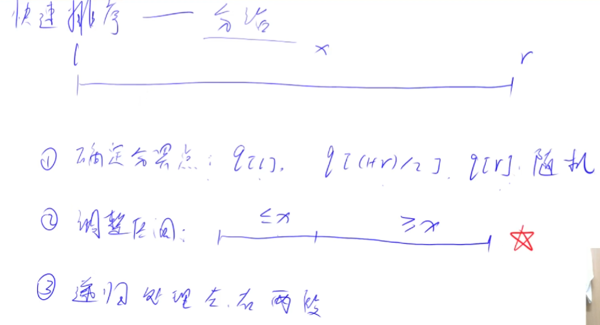
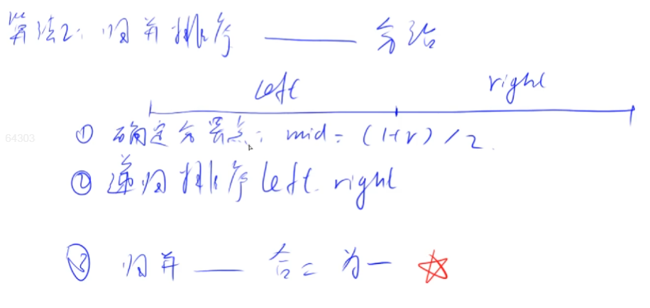
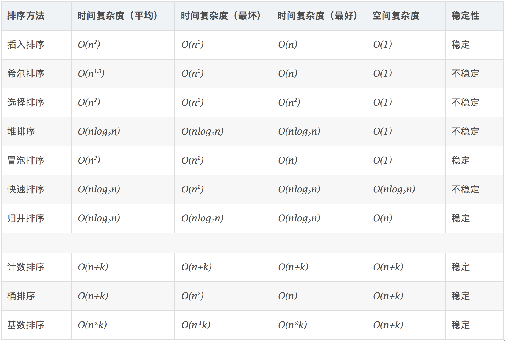

# 一：基础算法

算法学习一般过程：上课理解核心思想，知道为什么这样写和为什么是对的，下课理解模板并背过直到能默写出来调试通过，最后用题目巩固知识模板，时常复习，提高熟练度。

<!--more-->

排序基础知识可以参照：

1. 初等排序算法： https://www.grantdrew.top/posts/578803b6.html
2. 高等排序算法：https://www.grantdrew.top/posts/7ff5bb67.html
3. 归并排序算法：https://www.grantdrew.top/posts/2aed1d1d.html

第一章：基础算法模板整理， https://www.acwing.com/blog/content/277/

## 1.1：快速排序

这里就不在赘述具体过程了，大致讲解一下原理，然后上代码。

快排的核心就是利用--分治思想。

一般在算法笔试中不太会用到，可以用库函数sort代替，只有在面试时可能要求手写。



原理图如上。

第2步，调整分区有2种做法。

第1种是非原地排序，就是开2个临时数组a和b，然后扫描数组q，对于<=x的数拷贝到a，对于>x的数拷贝到b，最后把a和b拷贝到q，即完成了分区操作。

第2种是原地排序，利用双指针扫描数组q，两个指针i和j分别从左边和右边开始扫描，当左边的数>x且右边的数<=x就交换两个数，直到两指针相遇。

**例题：acwing.785. 快速排序（模板题）**

```C++
给定你一个长度为 n 的整数数列。
请你使用快速排序对这个数列按照从小到大进行排序。
并将排好序的数列按顺序输出。

输入格式
输入共两行，第一行包含整数 n。
第二行包含 n 个整数（所有整数均在 1∼10^9 范围内），表示整个数列。

输出格式
输出共一行，包含 n 个整数，表示排好序的数列。

数据范围
1≤n≤100000
输入样例：
5
3 1 2 4 5
输出样例：
1 2 3 4 5
```

y总代码：

平均时间复杂度：O(n*logn)。双指针扫描区间[0,n-1]耗时O(n)，递归处理耗时O(logn)。

最坏时间复杂度：O(n^2)。

```C++
#include <cstdio>
#include <algorithm>
using namespace std;

const int N = 100010;
int n;
int q[N];

void quick_sort(int q[],int l,int r){
    if (l >= r) return;// 递归终止，注意：不能写成l == r
    int i = l - 1,j = r + 1,x = q[l+r>>1];// 注意两指针都取到边界之外
    while (i < j){
        do i ++;while (q[i] < x);
        do j --;while (q[j] > x);
        // 不用do-while等价的做法
        // while (q[++ i] < x);while (q[--j] > x);
        if (i < j) swap(q[i],q[j]);
    }
    // while循环结束后，q[l..j] <= x,q[j+1..r] >= x
    quick_sort(q,l,j),quick_sort(q,j+1,r);// 注意：这个模板必须以j为划分点，不能取i
}

int main(){
    scanf("%d",&n);
    for (int i = 0;i < n;i++) scanf("%d",&q[i]);
    quick_sort(q,0,n-1);
    for (int i = 0;i < n;i++) printf("%d ",q[i]);
    return 0;
}
```

算法正确性证明参考：https://www.acwing.com/solution/content/16777/

参考题解：https://www.acwing.com/solution/content/2089/

注意：分界点x取左右边界会被卡掉，所以这里取中点。

补充一个从大到小的快排模板：

```C++
void quick_sort(int q[],int l,int r){
    if (l >= r) return;// 递归终止
    int i = l - 1,j = r + 1,x = q[l+r>>1];// 注意两指针都取到边界之外
    while (i < j){
        do i ++;while (q[i] > x);
        do j --;while (q[j] < x);// 只是把这两行的大小交换一下
        if (i < j) swap(q[i],q[j]);
    }
    // while循环结束后，q[l..j] <= x,q[j+1..r] >= x
    quick_sort(q,l,j),quick_sort(q,j+1,r);// 注意：这个模板必须以j为划分点，不能取i
    // 如果要以i为划分点划分子问题，参考上面的正确性证明,递归划分为[l,i-1]和[i,r]
    // 分界点x取q[l+r+1>>1]
}
```

找一组特殊样例：`2 ,1 2`。

当以j为划分点划分子问题时，分界点x一定不能取到右边界（否则会递归陷入死循环），而l+r>>1是一定不会取到的（下取整），所以正确；

当以i为划分点划分子问题时，分界点x一定不能取到左边界，而改成l+r+1>>1是一定不会取到的（上取整），所以正确。

手动模拟一下，就很清楚了。

快排模板一定要背过，边界问题处理很麻烦。（y总NB！！！）

## 1.2：归并排序

在蓝桥杯系列（十五）已经讲解过，这里再介绍一次。

归并的核心还是利用--分治思想。

快排：先处理，再递归。

归并：先递归，再处理。



原理图如上。

先递归使得左右两边的内部有序，再归并两个有序部分，形成一个整体。

**例题：acwing.787. 归并排序（模板题）**

```C++
给定你一个长度为 n 的整数数列。
请你用归并排序对这个数列按照从小到大进行排序。
并将排好序的数列按顺序输出。

输入格式
输入共两行，第一行包含整数 n。
第二行包含 n 个整数（所有整数均在 1∼10^9 范围内），表示整个数列。

输出格式
输出共一行，包含 n 个整数，表示排好序的数列。

数据范围
1≤n≤100000
输入样例：
5
3 1 2 4 5
输出样例：
1 2 3 4 5
```

y总代码：

时间复杂度：O(n*logn)。双指针扫描左右区间耗时O(n)，递归处理耗时O(logn)。

快排递归划分的期望是O(logn)，而归并递归划分一定是O(logn)。

```C++
#include <cstdio>
#include <algorithm>
using namespace std;

const int N = 1000010;
int n;
int q[N],tmp[N];

void merge_sort(int q[],int l,int r){
    if (l >= r) return;
    int mid = l + r >> 1;
    merge_sort(q,l,mid),merge_sort(q,mid+1,r);// 以下标中点划分递归
    // 对两个有序数组进行排序，需要临时数组tmp
    int k = 0,i = l,j = mid+1;
    while (i <= mid && j <= r){
        if (q[i] <= q[j]) tmp[k++] = q[i++];
        else tmp[k++] = q[j++];
    }
    while (i <= mid) tmp[k++] = q[i++];
    while (j <= r) tmp[k++] = q[j++];
    
    for (int i = l,j = 0;i <= r;i++,j++) q[i] = tmp[j];// 将tmp拷贝回q
}

int main(){
    scanf("%d",&n);
    for (int i = 0;i < n;i++) scanf("%d",&q[i]);
    
    merge_sort(q,0,n-1);
    for (int i = 0;i < n;i++) printf("%d ",q[i]);
    return 0;
}
```

排序算法时间复杂度图：



