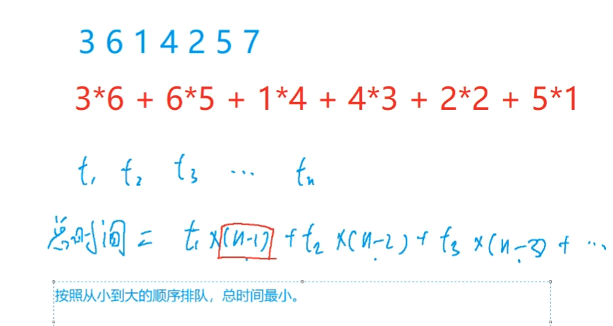
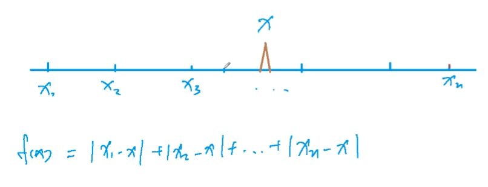
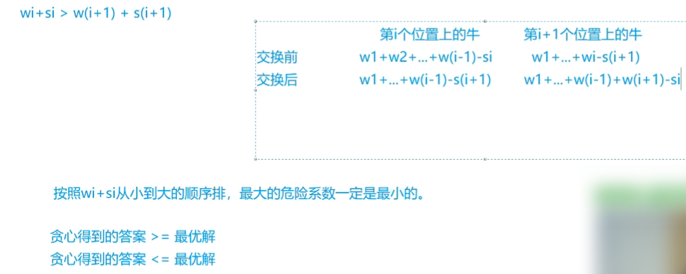
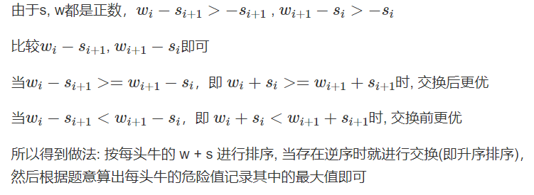

## 5.3：排序不等式

<!--more-->

**例题：913. 排队打水（模板题）**

```C++
有 n 个人排队到 1 个水龙头处打水，第 i 个人装满水桶所需的时间是 ti，请问如何安排他们的打水顺序才能使所有人的等待时间之和最小？

输入格式
第一行包含整数 n。
第二行包含 n 个整数，其中第 i 个整数表示第 i 个人装满水桶所花费的时间 ti。

输出格式
输出一个整数，表示最小的等待时间之和。

数据范围
1≤n≤10^5,
1≤ti≤10^4
输入样例：
7
3 6 1 4 2 5 7
输出样例：
56
```

这题看起来做法很简单，安排打水时间少的先排队。

y总：小学数奥就有这种题目。

计算总的等待时间，我们可以得出一个公式，会发现从小到大排序是最合理的安排。

证明思路参考： https://www.acwing.com/solution/content/5943/。



```C++
// 注意爆int
#include <cstdio>
#include <algorithm>
using namespace std;
const int N = 1e5+5;
typedef long long LL;
int a[N];

int main(){
    int n;
    scanf("%d", &n);
    
    for (int i = 0; i < n; i ++ ) scanf("%d", &a[i]);
    sort(a,a + n);
    
    LL res = 0;
    for (int i = 0; i < n; i ++ ){
        res += a[i]*(n-i-1);
    }
    printf("%lld\n",res);
    return 0;
}
```

## 5.4：绝对值不等式

**例题：104. 货仓选址（模板题）**

蓝桥杯（二二），寒假每日一题（一）中都讲解过这题。

这里不再重复讲解。



使得绝对值函数最小化，货仓取中位数。奇数个选中间的，偶数个中间两数之间（包括端点）任选。

```C++
#include <cstdio>
#include <algorithm>
using namespace std;
typedef long long LL;
const int N = 1e5+5;
int a[N];
int n;

int main(){
    scanf("%d", &n);
    
    for (int i = 0; i < n; i ++ ) scanf("%d", &a[i]);
    sort(a,a+n);
    
    LL res = 0;int mid = a[n/2];
    for (int i = 0; i < n; i ++ ) res += abs(a[i] - mid);
    
    printf("%lld\n",res);
    return 0;
}
```

## 5.5：推公式

**例题：125. 耍杂技的牛（模板题）**

```C++
农民约翰的 N 头奶牛（编号为 1..N）计划逃跑并加入马戏团，为此它们决定练习表演杂技。
奶牛们不是非常有创意，只提出了一个杂技表演：
叠罗汉，表演时，奶牛们站在彼此的身上，形成一个高高的垂直堆叠。
奶牛们正在试图找到自己在这个堆叠中应该所处的位置顺序。
这 N 头奶牛中的每一头都有着自己的重量 Wi 以及自己的强壮程度 Si。
一头牛支撑不住的可能性取决于它头上所有牛的总重量（不包括它自己）减去它的身体强壮程度的值，现在称该数值为风险值，风险值越大，这只牛撑不住的可能性越高。
您的任务是确定奶牛的排序，使得所有奶牛的风险值中的最大值尽可能的小。

输入格式
第一行输入整数 N，表示奶牛数量。
接下来 N 行，每行输入两个整数，表示牛的重量和强壮程度，第 i 行表示第 i 头牛的重量 Wi 以及它的强壮程度 Si。

输出格式
输出一个整数，表示最大风险值的最小可能值。

数据范围
1≤N≤50000,
1≤Wi≤10,000,
1≤Si≤1,000,000,000
输入样例：
3
10 3
2 5
3 3
输出样例：
2
```

参考题解： https://www.acwing.com/solution/content/845/。（详细证明）

直接给出贪心思路。按照`wi + si`从小到大排序，最大的危险系数能降到最低。



证明：

1. 首先贪心排序得到的答案肯定`>=`最优解；

2. 然后证明贪心得到的答案`<=`最优解，如果贪心思路还能继续优化，一定存在两个相邻的牛，可以交换顺序以降低最大危险系数，上图（注：交换后两个位置反了，下表已纠正）给出了交换前后两头牛的危险系数，其他位置的牛不受影响。

    我们可以消去共同项，得到下表：

    | 牛的位置 | 交换前        | 交换后        |
    | -------- | ------------- | ------------- |
    | $i$      | $-S_i$        | $W_{i+1}-S_i$ |
    | $i+1$    | $W_i-S_{i+1}$ | $-S_{i+1}$    |

    

```C++
#include <iostream>
#include <algorithm>
using namespace std;
typedef pair<int,int> PII;
#define IOS \
    ios::sync_with_stdio(false); \
    cin.tie(0); \
    cout.tie(0)
const int N = 5e4 + 5;
PII cow[N];
int n;

int main(){
    IOS;
    cin >> n;
    int w,s;
    for (int i = 0;i < n;i ++){
        cin >> w >> s;
        cow[i] = {w + s,s};// 巧妙地对w + s排序
    }

    sort(cow,cow + n);
    int res = -0x3f3f3f3f,sum = 0;// res表示最大危险系数，sum表示前i-1项的w之和
    for (int i = 0;i < n;i ++){
        int w = cow[i].first - cow[i].second,s = cow[i].second;
        res = max(res,sum - s);// 利用公式求第i项的危险系数
        sum += w;
    }
    cout << res << '\n';
    return 0;
}
```

