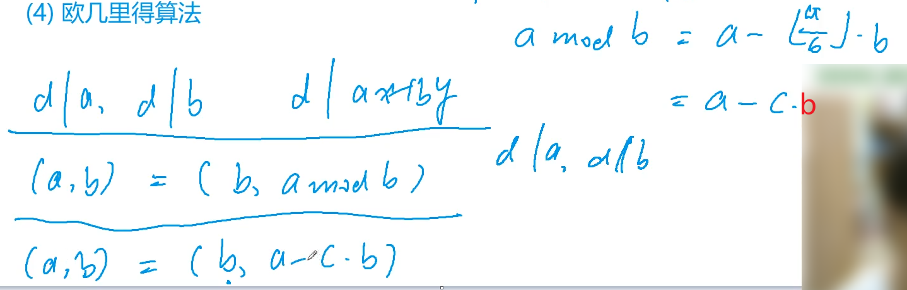
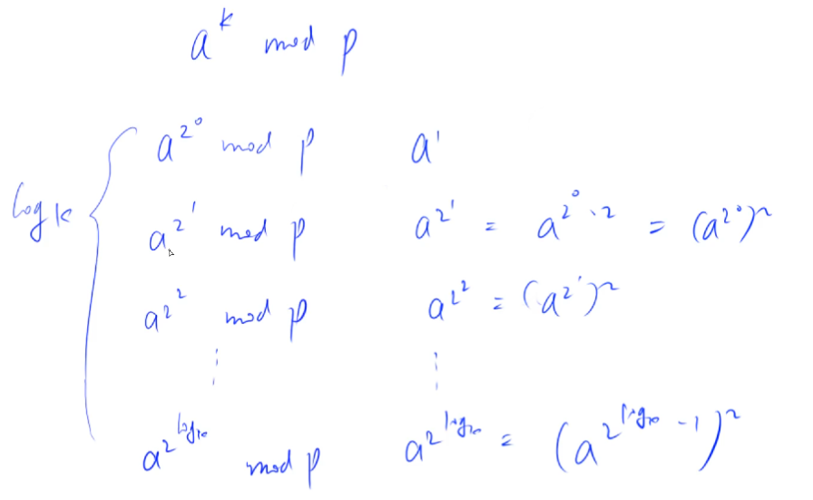
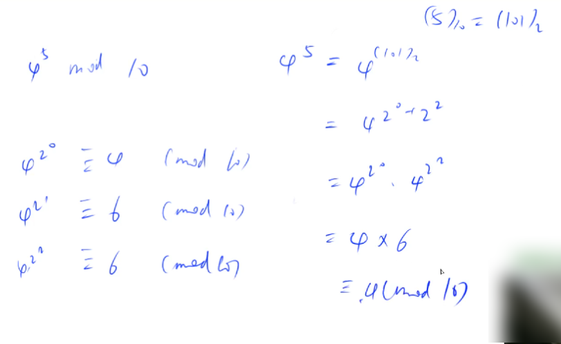

**例题：872. 最大公约数（模板题）**

<!--more-->

```C++
给定 n 对正整数 ai,bi，请你求出每对数的最大公约数。

输入格式
第一行包含整数 n。
接下来 n 行，每行包含一个整数对 ai,bi。

输出格式
输出共 n 行，每行输出一个整数对的最大公约数。

数据范围
1≤n≤10^5,
1≤ai,bi≤2×10^9
输入样例：
2
3 6
4 6
输出样例：
3
2
```

《最大公因数与最小公倍数问题》已经讲过。

经典问题，常用模板。



证明$(a,b) = (b,a-c*b)$。

$\Rightarrow : 已知d |a,d | b;由基本运算性质，d | \;a和b的线性组合\therefore d | a - c*b,得证;$

$\Leftarrow : 已知d | b,d | a - c \star b \therefore d | a-c \star b+c \star b \Leftrightarrow d | a,得证.$

时间复杂度：$O(log n)$。

```C++
#include <iostream>
using namespace std;
int n,a,b;

int gcd(int a,int b){// 当b = 0时，0与a的最大公约数是a
    return b ? gcd(b,a%b) : a;
}

int main(){
    cin >> n;
    while (n -- ){
        cin >> a >> b;
        cout << gcd(a,b) << '\n';
    }
    return 0;
}
```

## 7.3：欧拉函数

参考资料1： https://oi-wiki.org/math/number-theory/euler/。

参考资料2： https://zhuanlan.zhihu.com/p/35060143。（欧拉函数相关的完整数论知识）

互质也就是指`gcd = 1`。

欧拉函数（Euler's totient function），即$\varphi (n)$，表示的是小于等于n且和n互质的数的个数。

比如$\varphi(1)=1$，1与任何数互质（包括1自己）；当n是质数时，$\varphi(n)=n-1$。

>若在算术基本定理中，$N = p_1^{a_1}\star p_2^{a_2}*...\star p_k^{a_k}$，
>
>则：$\varphi (N) = N * \displaystyle\prod_{质数p|N}1-\frac 1 p$.

蓝书的推导最为简洁，利用容斥原理，y总视频用的也是这个方法hh。

根据上面的公式，C++求解欧拉函数，只需要分解N的质因数就行。时间复杂度为：$O(\sqrt n)$。

**例题：873. 欧拉函数（模板题）**

```C++
给定 n 个正整数 ai，请你求出每个数的欧拉函数。

输入格式
第一行包含整数 n。
接下来 n 行，每行包含一个正整数 ai。

输出格式
输出共 n 行，每行输出一个正整数 ai 的欧拉函数。

数据范围
1≤n≤100,
1≤ai≤2×10^9
输入样例：
3
3
6
8
输出样例：
2
2
4
```

用公式计算欧拉函数，本题的时间复杂度为：$O(n*\sqrt a_i)$。

计算欧拉函数时，先做除法再做乘法，防止溢出。

```C++
#include <iostream>
using namespace std;
int n,x;

int main(){
    cin >> n;
    while (n -- ){
        cin >> x;
        int ans = x;
        for (int i = 2;i <= x/i;i ++){
            if (x % i == 0){
                ans = ans / i * (i-1);
                while (x % i == 0) x /= i;
            }
        }
        if (x > 1) ans = ans / x * (x-1);
        cout << ans << '\n';
    }
    return 0;
}
```

**例题：874. 筛法求欧拉函数（模板题）**

```C++
给定一个正整数 n，求 1∼n 中每个数的欧拉函数之和。

输入格式
共一行，包含一个整数 n。

输出格式
共一行，包含一个整数，表示 1∼n 中每个数的欧拉函数之和。

数据范围
1≤n≤10^6
输入样例：
6
输出样例：
12
```

求`1~n`中每个数的欧拉函数，如果用公式时间复杂度为：$O(n*\sqrt n)$。

如果用线性筛法，时间复杂度将降为$O(n)$。

如果一个数p是质数，那么$\varphi(p)=p-1$，也就是是说`1~p-1`都与p互质。

```C++
#include <iostream>
typedef long long LL;
using namespace std;
const int N = 1e6+5;
int n;
int primes[N];
int phi[N];
bool st[N]; // 判重数组不能省略

LL get_eulers(int n){
    LL res = 0;int cnt = 0;
    phi[1] = 1;
    for (int i = 2; i <= n; i ++ ){
        if (!st[i]){
            primes[cnt++] = i;phi[i] = i - 1;
        }
        for (int j = 0; primes[j] <= n/i; j ++ ){
            st[i*primes[j]] = true;
            if (i % primes[j] == 0){
                phi[i*primes[j]] = phi[i]*primes[j];
                break;
            }
            phi[i*primes[j]] = phi[i]*(primes[j] - 1);
        }
    }
    
    for (int i = 1; i <= n; i ++ ) res += phi[i];
    return res;
}

int main(){
    cin >> n;
    cout << get_eulers(n) << '\n';
    return 0;
}
```

代码解释看这： https://www.acwing.com/solution/content/3952/。（分情况讨论）

**欧拉定理：**

与欧拉函数紧密相关的一个定理。

>若$gcd(n,m) = 1$，则 $n^{\varphi(m)} \equiv 1 (mod \;m)$。

欧拉定理与费马小定理及其相关证明请参考蓝书“0x33 同余”部分。

## 7.4：快速幂

《快速幂算法》详细介绍了快速幂的两种写法，常用迭代的写法。

**例题：875. 快速幂（模板题）**

```C++
给定 n 组 ai,bi,pi，对于每组数据，求出 a^{bi}_i mod pi 的值。

输入格式
第一行包含整数 n。
接下来 n 行，每行包含三个整数 ai,bi,pi。

输出格式
对于每组数据，输出一个结果，表示 a^{bi}_i mod pi 的值。
每个结果占一行。

数据范围
1≤n≤100000,
1≤ai,bi,pi≤2×10^9
输入样例：
2
3 2 5
4 3 9
输出样例：
4
1
```

朴素做法时间复杂度是：O(b)。

快速幂做法时间复杂度是：O(log b)。





数论中不少题目需要用到`long long`。

```C++
#include <iostream>
typedef long long LL;
using namespace std;
#define IOS \
    ios::sync_with_stdio(false); \
    cin.tie(0); \
    cout.tie(0)
int n;

LL qmi(int a,int b,int p){
    int res = 1;
    while (b){
        if (b & 1) res = (LL)res*a % p;
        a = (LL)a*a % p;
        b >>= 1;
    }
    return res;
}

int main(){
    IOS;
    cin >> n;
    int a,b,p;
    while (n--){
        cin >> a >> b >> p;
        cout << qmi(a,b,p) << '\n';
    }    
    return 0;
}
```

