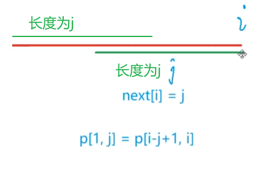

## 2.3：KMP匹配算法

在字符串中查找子串：Knuth-Morris-Pratt 算法。KMP是比较难学的算法。

给定非空字符串s和p，其长度分别为n和m，为了便于讨论，将s称为主串（长文本），p称为模式串。

<!--more-->

参考资料1： Programming Challenges。

参考资料2：  https://mp.weixin.qq.com/s/JO8x4q7OQG_qOk29Dt71aw。

**例题：831. KMP字符串（模板题）**

```C++
给定一个模式串 S，以及一个模板串 P，所有字符串中只包含大小写英文字母以及阿拉伯数字。
模板串 P 在模式串 S 中多次作为子串出现。
求出模板串 P 在模式串 S 中所有出现的位置的起始下标。

输入格式
第一行输入整数 N，表示字符串 P 的长度。
第二行输入字符串 P。
第三行输入整数 M，表示字符串 S 的长度。
第四行输入字符串 S。

输出格式
共一行，输出所有出现位置的起始下标（下标从 0 开始计数），整数之间用空格隔开。

数据范围
1≤N≤10^5
1≤M≤10^6
输入样例：
3
aba
5
ababa
输出样例：
0 2
```

我们先来看看朴素（暴力）做法。

将p的第一个字符与s的某个字符对齐，检查对应的字符是否相同，若从主串的某个位置开始，两者字符全部相同，则发现了匹配。

```C++
S[N],p[M]
for (int i = 1;i <= n;i++){// KMP中习惯i从1开始
    bool flag = true;
    for (int j = 1;j <= m;j++){
        if (s[i+j-1] != s[j]){
            flag = false;break;
        }
    }
}

// 使用暴力匹配的方法检查字符串p是否为字符串s的子串
bool match(const string &s, const string &p) { 
    for (int si = 0; si < s.length(); si++) {
        int i = si, j = 0;
        while (i < s.length() && j < p.length() && s[i] == p[j]) i++, j++; 
        if (j >= p.length()){
            cout << i;// 如果p串比较完了，输出开始位置
            return true;
        }
    }
    cout << -1;// 匹配失败
    return false;
}
```

一般来说，当s中的字符不存在较多重复的情况下，朴素匹配算法的时间复杂度能够接近Ο(n＋m)。但最坏的情况下时间复杂度为Ο(n*m)。没有额外开辟空间，空间复杂度为O(1)。

图解朴素做法：


再来考虑优化问题。


假设蓝色线段是主串，红色线段是模式串。

当匹配到2处时，发现绿色圆圈以左的模式串与主串匹配，但绿色圆圈处开始不匹配时，我们需要移动模式串以找到正确匹配位置；假设3处为正确的匹配位置，模式串向右移动了若干距离，此时1，2，3表示的黑色线段是完全相同的，正确理解这个性质就能学好KMP算法。

由此定义一个next数组，**也就是最长公共前后缀长度数组:next**，next[i]表示p[i]前面的字符串的最长公共前后缀长度。看图理解：



next[i] = j：模式串p中下标从1到i的这段字符串中的最长公共前后缀长度为j。

“非平凡前缀”：指除了最后一个字符以外，一个字符串的全部头部组合。简称前缀。

“非平凡后缀”：指除了第一个字符以外，一个字符串的全部尾部组合。简称后缀。

(next[i]>=0且不等于子串自身长度)


每次判断p[j+1]和S[i]是否相等，相等则移动j，然后i在for循环中++，看看是否匹配下个位置的j+1和i。

设k为满足p从1到j的子串的公共前后缀长度（没有最长）。**显然，模式串需要移动的距离一定是j - k**。由上图可以得到这个性质。下证k=next[j]**。**若移动距离短了，需要的公共前后缀长度必须比next[j]更大，但next[j]已经是最长的，所以不行。

 当移动后再次出现不匹配的情况时，继续移动，继续计算next值，递归处理。

问：如何求出模式串对应的next数组？

让模式串p和自己匹配，过程与S和p匹配类似。next数组与主串没有任何关系。

前后缀相同也就是p的一段前缀和一段后缀匹配，以此求next数组。求next数组的代码部分是KMP中特别难的部分！


参考题解1： https://www.acwing.com/solution/content/14666/。（特别推荐！！！）

参考题解2 ：https://www.acwing.com/solution/content/23907/。

注意：题目要求是下标从0开始，但是代码按从1开始算，输出要处理一下。

题解1：y总代码。

```C++
#include <iostream>
using namespace std;

const int N = 1e5+5, M = 1e6+5;
char p[N],S[M];
int n,m;
int ne[N];// 保存next数组，next重名

int main(){
    ios::sync_with_stdio(false);
    cin.tie(0);
    cout.tie(0);
    
    cin >> n >> p + 1 >> m >> S + 1;// 下标均从1开始
    // 计算模式串p的next表，从ne[2]开始计算，所以i从2开始
    // j表示匹配成功的长度，i表示ne数组的下标
    for (int i = 2,j = 0;i <= n;i ++){// ne[1]定义为0，不会用到
        while (j && p[i] != p[j+1]) j = ne[j];// 如果不匹配j移动到ne[j]
        if (p[i] == p[j+1]) j ++;// 匹配成功了,那么j就加1,继续后面的匹配
        // 关键在于每次移动 i 前，将 i 前面已经匹配的长度记录到next数组中
        ne[i] = j;// 记录最长前缀的尾部下标j，也就是匹配成功的长度
    }
    // KMP匹配过程
    // j表示匹配成功的长度，i表示主串S的下标
    for (int i = 1,j = 0;i <= m;i ++){
        while (j && S[i] != p[j+1]) j = ne[j];// 如果不匹配j移动到ne[j]
        if (S[i] == p[j+1]) j ++;// 匹配成功了,那么j就加1,继续后面的匹配
        if (j == n){// 匹配成功
            cout << i - n << ' ';// 题目要求下标从0开始
            j = ne[j];// 本题可以不加，推荐加上避免边界问题
        }
    }
    
    return 0;
}
```

题解2：字符串下标从0开始，用string处理。

```C++
#include <bits/stdc++.h>

using namespace std;

const int N = 100010;
int ne[N];
int n, m;
string p, s;

int main(){
    cin >> n >> p >> m >> s;

    //i是待匹配位置，j是已匹配长度，j - 1是已匹配的最后一个位置
    //与自身匹配i从1开始
    for(int i = 1, j = 0; i < n; i ++){// 字符串下标从0开始
        while(j && p[i] != p[j]) j = ne[j - 1];
        if(p[i] == p[j]) j ++;
        ne[i] = j;
    }

    //与长字符串匹配i从0开始
    for(int i = 0, j = 0; i < m; i ++){
        while(j && s[i] != p[j]) j = ne[j - 1];
        if(s[i] == p[j]){
            j ++;
            if(j == n){
                cout << i - n + 1 << " ";
                j = ne[n - 1];
            }
        }
    }
    return 0;
}
```

KMP的时间复杂度分析：

O(n+m)=O( [n,2n] +[m,2m]) = 计算next数组的时间复杂度+遍历比较的复杂度。
