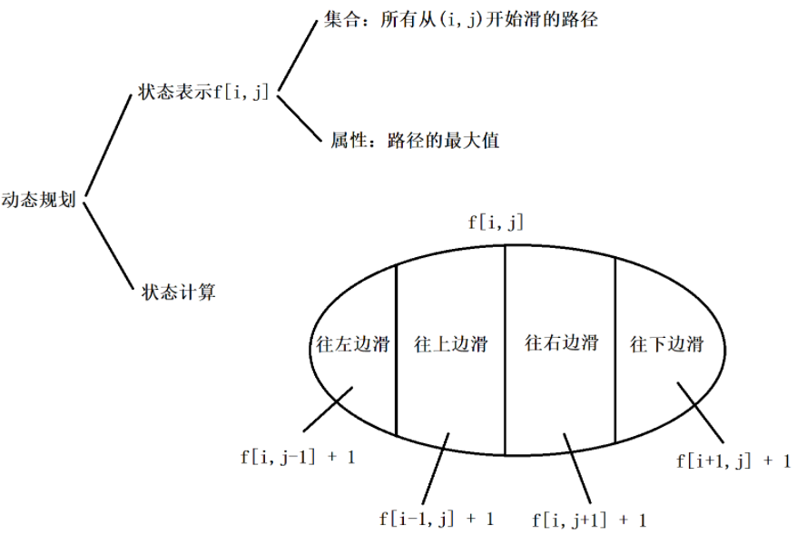
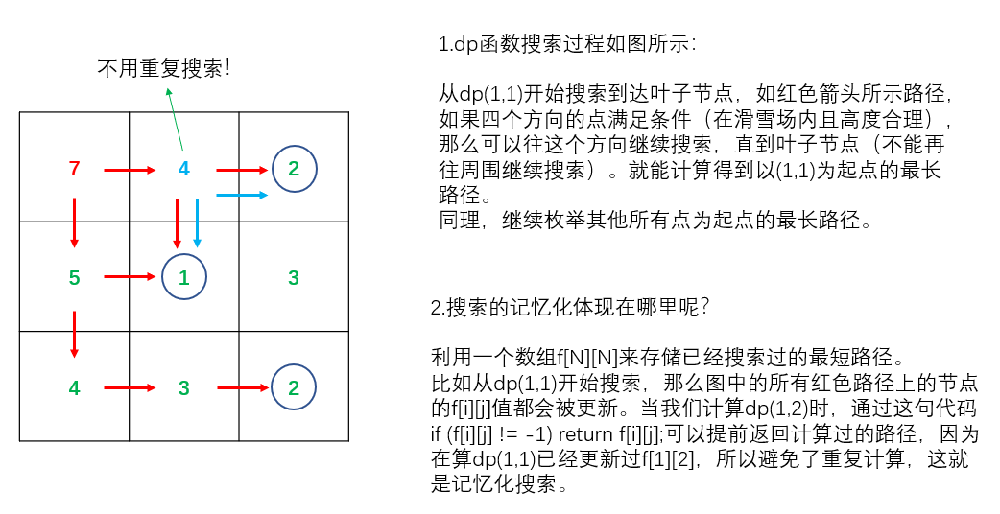

## 4.9：树形DP

**例题：285. 没有上司的舞会（模板题）**

<!--more-->

```C++
Ural 大学有 N 名职员，编号为 1∼N。
他们的关系就像一棵以校长为根的树，父节点就是子节点的直接上司。
每个职员有一个快乐指数，用整数 Hi 给出，其中 1≤i≤N。
现在要召开一场周年庆宴会，不过，没有职员愿意和直接上司一起参会。
在满足这个条件的前提下，主办方希望邀请一部分职员参会，使得所有参会职员的快乐指数总和最大，求这个最大值。

输入格式
第一行一个整数 N。
接下来 N 行，第 i 行表示 i 号职员的快乐指数 Hi。
接下来 N−1 行，每行输入一对整数 L,K，表示 K 是 L 的直接上司。

输出格式
输出最大的快乐指数。

数据范围
1≤N≤6000,
−128≤Hi≤127
输入样例：
7
1
1
1
1
1
1
1
1 3
2 3
6 4
7 4
4 5
3 5
输出样例：
5
```

考察**树形DP**，其实就是把DP放在树上处理，一般采用深度优先遍历的方式递归处理。

树形DP在蓝桥杯（三五）中有讲解。

搜索这棵树可以用dfs，bfs或者拓扑来做。

状态表示：

`f[u][0]`：所有以u为根的子树中选择，并且不选u这个点的方案

`f[u][1]`：所有以u为根的子树中选择，并且选u这个点的方案

属性：Max

时间复杂度：O(n)，dfs时只要处理每条边

算法1：自顶向下dfs，由子节点状态更新父节点状态。

```C++
#include <iostream>
#include <algorithm>
#include <cstring>
using namespace std;
#define IOS \
    ios::sync_with_stdio(false); \
    cin.tie(0); \
    cout.tie(0)
const int N = 6010;
int h[N],e[N],ne[N],idx;// 邻接表存树
int n;
int happy[N];
bool has_father[N];// 存放每个点的父节点是否存在
int dp[N][2];

void add(int a,int b){
    e[idx] = b,ne[idx] = h[a],h[a] = idx ++;
}

void dfs(int u){
    dp[u][1] = happy[u];// 选择u这个点，先把开心值加上

    for (int i = h[u]; ~i;i = ne[i]){
        int j = e[i];// 树中只有有向边，不会重复遍历节点，无需判重
        dfs(j);// 父节点状态由子节点状态更新而来，所以先递归再计算
        dp[u][1] += dp[j][0];
        dp[u][0] += max(dp[j][0],dp[j][1]);
    }
}

int main(){
    IOS;
    cin >> n;
    memset(h,-1,sizeof h);
    
    for (int i = 1;i <= n;i ++) cin >> happy[i];

    int a,b; 
    for (int i = 1;i <= n-1;i ++){
        cin >> a >> b;
        has_father[a] = true;
        add(b,a); // b是a的直接上司
    }

    int root = 1;
    while (has_father[root]) root ++;
    dfs(root);// 找到树根

    cout << max(dp[root][0],dp[root][1]) << '\n';
    return 0;
}
```

算法2：自下向顶dfs，直接由子节点状态更新父节点状态，不需要回溯时处理。

类似拓扑的做法，无需建图。

参考题解： https://www.acwing.com/solution/content/4757/。

分析可得，每个人的状态要在下属的状态更新完了才能更新，所以用类似拓扑的方法，只记录每个子节点的父亲，最后从所有入度为0的点开始跑就行了。

```C++
#include <iostream>
#include <cstdio>
using namespace std;
int dp[2][6010];//dp解释见上
int f[2][6010];//f[0]为父亲，f[1]为高兴值
int ind[6010];//入度
int vis[6010];//访问标记
int root;//树的根
void dfs(int u){//递归从后往前更新
    vis[u]=1;//已访问
    root=u;//最后一个访问到的一定是根，所以一直更新根就行了
    dp[0][f[0][u]]+=max(dp[1][u]+f[1][u],dp[0][u]);//给父亲更新
    dp[1][f[0][u]]+=dp[0][u];
    ind[f[0][u]]--;//更新完一个子节点
    if(!ind[f[0][u]]) dfs(f[0][u]);//在所有子节点更新后再更新（入度为0）
}
int main(){
    int n=0;
    scanf("%d",&n);
    for(int i=1;i<=n;i++)
        scanf("%d",&f[1][i]);
    int a,b;
    for(int i=1;i<n;i++){
        scanf("%d%d",&a,&b);
        f[0][a]=b;//保存节点信息
        ind[b]++;
    }
    for(int i=1;i<=n;i++)
        if(!vis[i]&&!ind[i])//没有被访问过，没有入度，说明是叶子节点
            dfs(i);
    printf("%d\n",max(dp[0][root],dp[1][root]+f[1][root]));//取根节点两种方案的最大值
    return 0;
}
```

## 4.10：记忆化搜索

记忆化搜索也就是：搜索+dp。

记忆化搜索的特征：

- 不依赖任何 **外部变量**
- 答案以返回值的形式存在，而不能以参数的形式存在
- 对于相同一组参数，dfs 返回值总是相同的

**例题：901. 滑雪（模板题）**

```C++
给定一个 R 行 C 列的矩阵，表示一个矩形网格滑雪场。
矩阵中第 i 行第 j 列的点表示滑雪场的第 i 行第 j 列区域的高度。
一个人从滑雪场中的某个区域内出发，每次可以向上下左右任意一个方向滑动一个单位距离。
当然，一个人能够滑动到某相邻区域的前提是该区域的高度低于自己目前所在区域的高度。
下面给出一个矩阵作为例子：
 1  2  3  4 5
16 17 18 19 6
15 24 25 20 7
14 23 22 21 8
13 12 11 10 9
在给定矩阵中，一条可行的滑行轨迹为 24−17−2−1。
在给定矩阵中，最长的滑行轨迹为 25−24−23−…−3−2−1，沿途共经过 25 个区域。
现在给定你一个二维矩阵表示滑雪场各区域的高度，请你找出在该滑雪场中能够完成的最长滑雪轨迹，并输出其长度(可经过最大区域数)。

输入格式
第一行包含两个整数 R 和 C。
接下来 R 行，每行包含 C 个整数，表示完整的二维矩阵。

输出格式
输出一个整数，表示可完成的最长滑雪长度。

数据范围
1≤R,C≤300,
0≤矩阵中整数≤10000
输入样例：
5 5
1 2 3 4 5
16 17 18 19 6
15 24 25 20 7
14 23 22 21 8
13 12 11 10 9
输出样例：
25
```

本题比前几题简单不少。

能用DP做的前提：图必须是拓扑图，不能存在环。

参考题解： https://www.acwing.com/solution/content/10201/。

本来是一个dfs的过程，遍历所有的位置，找到从当前位置往下走的最大路径，再取最大值，可是这样做会有很多重复的位置被重新计算过，因此可以利用空间换时间的思想，把遍历过的位置往下走的路径的最大值进行记录，这就是记忆化搜索。



**注意：**`f[][]`二维数组初始化的时候最好统一赋值为-1，如果不进行初始化直接用0判断，此题可以，可是如果遇到一些记忆化搜索的问题要求方案数的时候，初始化是0可能会导致个别情况计算出来的恰好结果是0时，却被认为未遍历过，因此统一赋值为-1就没错了。

这是个典型的空间换时间的例子。



```C++
#include <iostream>
#include <algorithm>
#include <cstring>
using namespace std;
#define IOS \
    ios::sync_with_stdio(false); \
    cin.tie(0); \
    cout.tie(0)
const int N = 310;
int f[N][N];
int h[N][N];
int r,c;

int dx[] = {-1,0,0,1},dy[] = {0,1,-1,0};
int dp(int i,int j){
    if (f[i][j] != -1) return f[i][j];// 已经计算过答案，直接返回

    f[i][j] = 1; // (i,j)这个点可以走，长度至少是1
    for (int t = 0;t < 4;t ++){// 枚举四个方向
        int a = i + dx[t],b = j + dy[t];
        // 判断方向是否在场内且高度合理
        if (a >= 1 && a <= r && b >= 1 && b <= c && h[a][b] < h[i][j])
            f[i][j] = max(f[i][j],dp(a,b) + 1);// 注意这里是递归，和一般dp方程有区别
    }
    return f[i][j];
}

int main(){
    IOS;
    cin >> r >> c;

    for (int i = 1;i <= r;i ++)
        for (int j = 1;j <= c;j ++) cin >> h[i][j];

    memset(f,-1,sizeof f);// 初始化为-1

    int res = 0;
    for (int i = 1;i <= r;i ++)
        for (int j = 1;j <= c;j ++)
            res = max(res,dp(i,j));
    cout << res << '\n';
    return 0;
}
```

