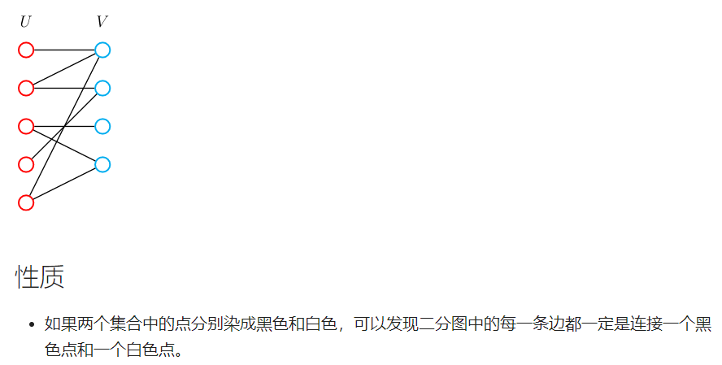
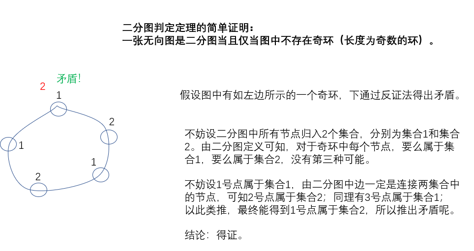
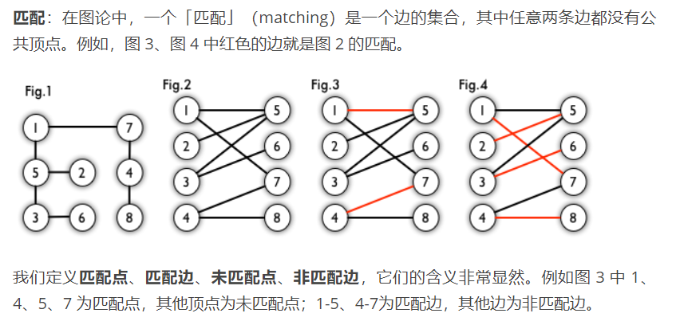
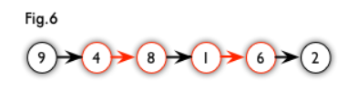

## 3.8：二分图

二分图，又称二部图，英文名叫 Bipartite graph。

二分图是什么？节点由两个集合组成，且**两个集合内部没有边**的图。

换言之，存在一种方案，将节点划分成满足以上性质的两个集合。

<!--more-->



### 3.8.1：染色法判定二分图

> 二分图判定定理：一张无向图是二分图当且仅当图中不存在奇环（长度为奇数的环）。

简单证明：



以上证明必要性。

**例题：860. 染色法判定二分图（模板题）**

```C++
给定一个 n 个点 m 条边的无向图，图中可能存在重边和自环。
请你判断这个图是否是二分图。

输入格式
第一行包含两个整数 n 和 m。
接下来 m 行，每行包含两个整数 u 和 v，表示点 u 和点 v 之间存在一条边。

输出格式
如果给定图是二分图，则输出 Yes，否则输出 No。

数据范围
1≤n,m≤10^5
输入样例：
4 4
1 3
1 4
2 3
2 4
输出样例：
Yes
```

染色法可以用DFS或者BFS实现。它可以处理重边和自环。

注意：二分图不一定是连通图。所以需要把每个点都搜一遍。

处理所有边和所有点，时间复杂度：O(n+m)。

**算法1：DFS版本。**

代码思路：

- 染色可以使用1和2区分不同颜色，用0表示未染色；
- 遍历所有点，每次将未染色的点进行dfs, 默认染成1或者2；
- 由于某个点染色成功不代表整个图就是二分图,因此只有某个点染色失败才能立刻break/return；
- 染色失败相当于存在相邻的2个点染了相同的颜色。

```C++
#include <iostream>
#include <cstring>
#include <algorithm>
using namespace std;
#define IOS \
    ios::sync_with_stdio(false); \
    cin.tie(0); \
    cout.tie(0)
const int N = 1e5+5,M = 2e5+5;
int n,m;
int color[N];
int h[N], e[M], ne[M], idx;

void add(int a,int b){
    e[idx] = b,ne[idx] = h[a],h[a] = idx ++;
}

bool dfs(int u,int c){// 把u所在连通块染色，判断是否矛盾
    color[u] = c;
    
    for (int i = h[u]; ~i;i = ne[i]){
        int j = e[i];
        if (!color[j]){
            // 3-1=2，3-2=1 把相邻点分别染成1和2
            if (!dfs(j,3 - c)) return false;// 若j未染色，递归将j相邻节点染色，并判断是否矛盾
        }
        else if (color[j] == c) return false;// 若j染色，且颜色与u相同，说明矛盾
    }
    return true;
}

int main(){
    IOS;
    
    cin >> n >> m;
    memset(h, -1, sizeof h);
    while (m -- ){
        int u,v;
        cin >> u >> v;
        add(u,v),add(v,u);// 无向图存两条边
    }
    
    bool flag = true;// 染色成功的标志
    for (int i = 1;i <= n;i ++){// 把图中每个点都搜索一遍
        if (!color[i]){// 没有染色的才需要染色，搜索
            if (!dfs(i,1)){// 把i所在连通块染色，判断是否矛盾
                flag = false;// 染色失败，退出
                break;
            }
        }
    }
    
    if (flag) cout << "Yes\n";
    else cout << "No\n";
    return 0;
}
```

**算法2：BFS版本。**改写成BFS，这样搜索不会像DFS可能造成栈溢出。

代码思路：

- 颜色 1 和 2 表示不同颜色, 0 表示 未染色；

- 同理，遍历所有点, 将未染色的点都进行bfs；
- 队列初始化将第i个点入队, 默认颜色可以是1或2；
- while (队列不空)
- 每次获取队头t, 并遍历队头t的所有邻边
- 若邻边的点未染色则染上与队头t相反的颜色，并添加到队列
- 若邻边的点已经染色且与队头t的颜色相同, 则返回false。

```C++
#include <iostream>
#include <queue>
#include <cstring>
#include <algorithm>
using namespace std;
#define IOS \
    ios::sync_with_stdio(false); \
    cin.tie(0); \
    cout.tie(0)
const int N = 1e5+5,M = 2e5+5;
int n,m;
int color[N];
int h[N], e[M], ne[M], idx;

void add(int a,int b){
    e[idx] = b,ne[idx] = h[a],h[a] = idx ++;
}

bool bfs(int u,int c){
    queue<int> q;
    color[u] = c;
    q.push(u);
    
    while (q.size()){
        int t = q.front();
        q.pop();
        
        for (int i = h[t]; ~i;i = ne[i]){
            int j = e[i];
            if (!color[j]){
                color[j] = 3 - color[t];// 注意：不要写成color[u]，是和相邻点比较，不是和根比较
                q.push(j);
            }
            else if (color[j] == color[t]) return false;
        }
    }
    return true;
}

int main(){
    IOS;
    
    cin >> n >> m;
    memset(h, -1, sizeof h);
    while (m -- ){
        int u,v;
        cin >> u >> v;
        if (u != v) add(u,v),add(v,u);
    }
    
    bool flag = true;
    for (int i = 1;i <= n;i ++){
        if (!color[i]){
            if (!bfs(i,1)){
                flag = false;
                break;
            }
        }
    }
    
    if (flag) cout << "Yes\n";
    else cout << "No\n";
    return 0;
}
```

### 3.8.2：匈牙利算法

参考资料： https://www.renfei.org/blog/bipartite-matching.html。（很不错！）

二分图的最大权匹配是指二分图中边权和最大的匹配。

Hungarian Algorithm（Kuhn-Munkres Algorithm）

匈牙利算法又称为 **KM** 算法，可以在O(n^3)时间内求出二分图的 **最大权完美匹配**。

时间复杂度：`O(n*m)`，常数小，实际运行时间远小于`O(n*m)`。

y总讲解： https://www.acwing.com/video/25/ 1:18:48。（有意思！）



**最大匹配**：一个图所有匹配中，所含匹配边数最多的匹配，称为这个图的最大匹配。图 4 是一个最大匹配，它包含 4 条匹配边。

**完美匹配**：如果一个图的某个匹配中，所有的顶点都是匹配点，那么它就是一个完美匹配。图 4 是一个完美匹配。显然，完美匹配一定是最大匹配（完美匹配的任何一个点都已经匹配，添加一条新的匹配边一定会与已有的匹配边冲突）。但并非每个图都存在完美匹配。

举例来说：如下图所示，如果在某一对男孩和女孩之间存在相连的边，就意味着他们彼此喜欢。是否可能让所有男孩和女孩两两配对，使得每对儿都互相喜欢呢？图论中，这就是**完美匹配**问题。如果换一个说法：最多有多少互相喜欢的男孩/女孩可以配对儿？这就是**最大匹配**问题。

**例题：861. 二分图的最大匹配（模板题）**

二分图的匹配：给定一个二分图 G，在 G 的一个子图 M 中，M 的边集 {E} 中的任意两条边都不依附于同一个顶点，则称 M 是一个匹配。

二分图的最大匹配：所有匹配中包含边数最多的一组匹配被称为二分图的最大匹配，其边数即为最大匹配数。

```C++
给定一个二分图，其中左半部包含 n1 个点（编号 1∼n1），右半部包含 n2 个点（编号 1∼n2），二分图共包含 m 条边。
数据保证任意一条边的两个端点都不可能在同一部分中。
请你求出二分图的最大匹配数。

输入格式
第一行包含三个整数 n1、 n2 和 m。
接下来 m 行，每行包含两个整数 u 和 v，表示左半部点集中的点 u 和右半部点集中的点 v 之间存在一条边。

输出格式
输出一个整数，表示二分图的最大匹配数。

数据范围
1≤n1,n2≤500,
1≤u≤n1,
1≤v≤n2,
1≤m≤10^5
输入样例：
2 2 4
1 1
1 2
2 1
2 2
输出样例：
2
```

匈牙利算法前置概念。

**交替路**：从一个未匹配点出发，依次经过非匹配边、匹配边、非匹配边…形成的路径叫交替路。

**增广路**：从一个未匹配点出发，走交替路，如果途径另一个未匹配点（出发的点不算），则这条交替路称为增广路（agumenting path）。例如，图 5 中的一条增广路如图 6 所示（图中的匹配点均用红色标出）：



增广路有一个重要特点：非匹配边比匹配边多一条。因此，研究增广路的意义是**改进匹配**。

只要把增广路中的匹配边和非匹配边的身份交换即可。由于中间的匹配节点不存在其他相连的匹配边，所以这样做不会破坏匹配的性质。交换后，图中的匹配边数目比原来多了 1 条。

我们可以通过不停地找增广路来增加匹配中的匹配边和匹配点。找不到增广路时，达到最大匹配（这是增广路定理）。匈牙利算法正是这么做的。

---

存储图的时候只需要存储左半部指向右半部的边就行，因为是从左半部找匹配。

左右两个点集的编号可以是重复的，因为两集合是独立的。

优质题解： https://www.acwing.com/solution/content/5334/。

```C++
#include <iostream>
#include <cstring>
#include <algorithm>
using namespace std;
#define IOS \
    ios::sync_with_stdio(false); \
    cin.tie(0); \
    cout.tie(0)
const int N = 510,M = 1e5+5;
int h[N],e[M],ne[M],idx;// 邻接表存储图
bool st[N];// 临时预定数组，st[j]=a表示一轮模拟匹配中，女孩j被男孩a预定了，每轮模拟需重置
int match[N];// match[j]=a表示女孩j的配对男友是a，一旦确定不再修改
int n1,n2,m;

void add(int a, int b){
    e[idx] = b, ne[idx] = h[a], h[a] = idx ++ ;
}

bool find(int x){// 判断,如果加入x来参与模拟配对,会不会使匹配数增多，也就是男孩x能不能找到对象
    for (int i = h[x]; ~i;i = ne[i]){// 遍历自己喜欢的女孩
        int j = e[i];
        if (!st[j]){// 女孩j在本轮模拟尚未被预定
            st[j] = true;
            if (!match[j] || find(match[j])){
                // 如果女孩j没有男朋友，或者她原来的男朋友能够预定其它喜欢的女孩。配对成功,更新match
                match[j] = x;
                return true;
            }
        }
    }//自己中意的全部都被预定，或者找不到单身女孩，配对失败
    return false;
}


int main(){
    IOS;
    
    memset(h, -1, sizeof h);// 初始化
    cin >> n1 >> n2 >> m;
    while (m -- ){
        int a,b;
        cin >> a >> b;
        add(a, b);// 只需要用到左边集合指向右边集合的边
    }
    
    int res = 0;
    for (int i = 1;i <= n1;i ++){
        memset(st,false,sizeof st);// 每轮模拟需重置预定情况
        if (find(i)) res ++;// 男孩i找到对象，res++
    }
    cout << res << '\n';// 最大匹配数
    return 0;
}
```

注意：每一轮find(i)，st数组都会重置。

不理解建议手动模拟一组数据。

匹配结果记录在match中，st数组用来判重，避免在某次匹配中重复遍历点和边。

st数组用来防止重复搜索相同的点。当图中有环的时候，不加st数组可能会无限循环下去，就出现段错误了。如果没有st数组，那么假设左边1与右边1匹配，左边2也与右边1匹配，那么在给左边第二个点找匹配的时候，就会有，去递归右边1的对象（左边1），继而左边1执行`find(1)`的时候因为不加st数组的原因会无限递归`find(1)`,从而导致爆栈。

match数组用来记录右边妹子的男朋友在左边的编号。

