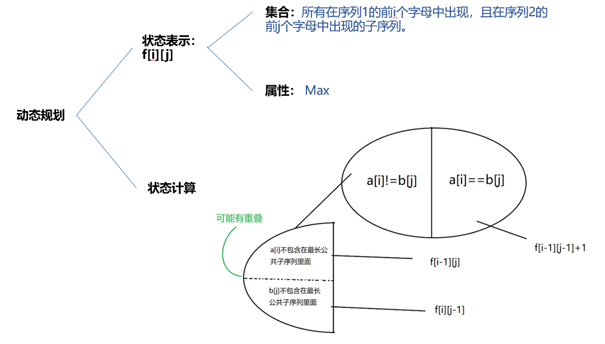
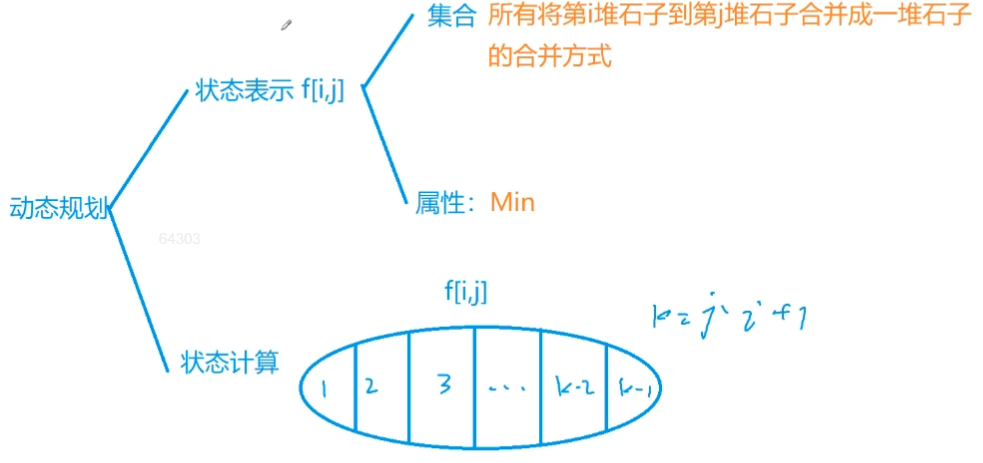
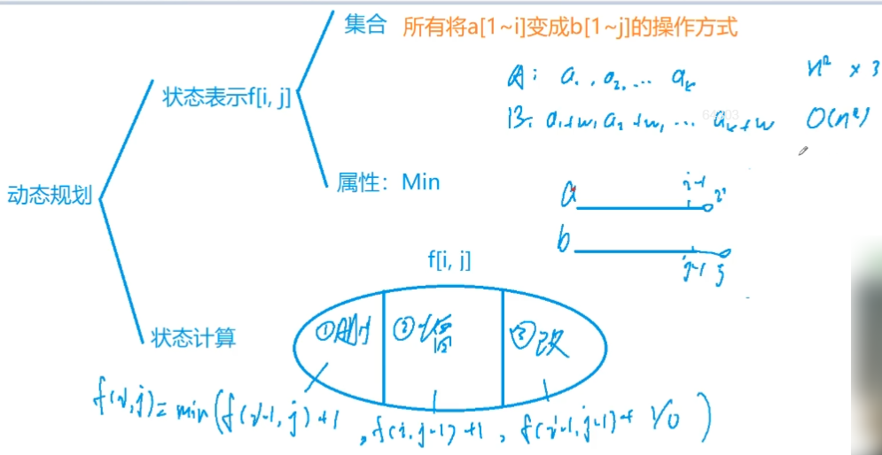

**例题：897. 最长公共子序列（模板题）**

<!--more-->

```java
给定两个长度分别为 N 和 M 的字符串 A 和 B，求既是 A 的子序列又是 B 的子序列的字符串长度最长是多少。

输入格式
第一行包含两个整数 N 和 M。
第二行包含一个长度为 N 的字符串，表示字符串 A。
第三行包含一个长度为 M 的字符串，表示字符串 B。
字符串均由小写字母构成。

输出格式
输出一个整数，表示最大长度。

数据范围
1≤N,M≤1000
输入样例：
4 5
acbd
abedc
输出样例：
3
```

最长公共子序列，英文缩写为LCS（Longest Common Subsequence）。其定义是，一个序列 S ，如果分别是两个或多个已知序列的子序列，且是所有符合此条件序列中最长的，则 S 称为已知序列的最长公共子序列。

LCS也是一个非常经典的DP问题。

算法思路：

涉及到两个字符串序列的问题，DP做法的状态表示考虑序列1的前`i`个字母构成的序列，序列2的前`j`个字母构成的序列。

求序列x和序列y的LCS也就是处理`x[1...i]`和`y[1...j]`的LCS。

参考：《算法训练营》。

题解： https://www.acwing.com/solution/content/8111/。



说明：对于状态的重复问题，由于状态属性是求Max值，所以重复无影响，这里可以重复但不能遗漏。

```java
import java.util.Scanner;
public class Main {

	public static void main(String[] args) throws Exception {
		Scanner scan = new Scanner(System.in);
		int n = scan.nextInt();
		int m = scan.nextInt();
		int[][] dp = new int[n+5][m+5];
		
		String a = " " + scan.next();// 字符串从下标为1处开始存储
		String b = " " + scan.next();
		scan.close();
		
		for (int i = 1;i <= n;i ++){
			for (int j = 1;j <= m;j ++){// 先考虑一般情况，a[i] != b[j]
				dp[i][j] = Math.max(dp[i-1][j], dp[i][j-1]);
				if (a.charAt(i) == b.charAt(j))// 再考虑a[i] == b[j]的情况
					dp[i][j] = Math.max(dp[i][j], dp[i-1][j-1] + 1);
			}
		}
		System.out.println(dp[n][m]);
	}
}
```

## 4.3：区间DP

区间DP在蓝桥杯（三五）、（三六）已经介绍过了。

**例题：282. 石子合并（模板题）**

```java
设有 N 堆石子排成一排，其编号为 1，2，3，…，N。
每堆石子有一定的质量，可以用一个整数来描述，现在要将这 N 堆石子合并成为一堆。
每次只能合并相邻的两堆，合并的代价为这两堆石子的质量之和，合并后与这两堆石子相邻的石子将和新堆相邻，合并时由于选择的顺序不同，合并的总代价也不相同。
例如有 4 堆石子分别为 1 3 5 2， 我们可以先合并 1、2 堆，代价为 4，得到 4 5 2， 又合并 1，2 堆，代价为 9，得到 9 2 ，再合并得到 11，总代价为 4+9+11=24；
如果第二步是先合并 2，3 堆，则代价为 7，得到 4 7，最后一次合并代价为 11，总代价为 4+7+11=22。
问题是：找出一种合理的方法，使总的代价最小，输出最小代价。

输入格式
第一行一个数 N 表示石子的堆数 N。
第二行 N 个数，表示每堆石子的质量(均不超过 1000)。

输出格式
输出一个整数，表示最小代价。

数据范围
1≤N≤300
输入样例：
4
1 3 5 2
输出样例：
22
```

相邻的石子堆才能合并，石子合并有不同的顺序，每种顺序代价不一样，求最小代价。

具有明显的阶段性（相邻的合并），所以只能区间dp，不能贪心。



很棒的区间DP题解： https://www.acwing.com/solution/content/13945/。

区间DP的过程：

第一维都是枚举区间长度，一般 `len = 1` 用来初始化，枚举从 `len = 2` 开始，第二维枚举起点 i （右端点 j 自动获得，`j = i + len - 1`）；

先求长度为1的DP区间，再求长度为2的，以此类推，由递推关系：长度为`i+1`的DP区间通过长度为`i`的DP区间求得；

对于每个DP区间`dp[i][j]`，利用`k`作为分割点，也就是枚举从`i`到`j`的石堆合并成整体的**最后一步合并**的合并方法。`k = l`时，将`k+1`到`r`看作整体，与第`l`堆合并；`k = l+1`时，将`l`到`k`看作整体，将`k+1`到`r`看作整体，将它们合并。计算`dp[l][r]`时，需要用到的`dp[l][k]`和`dp[k+1][r]`都已经计算过了，所以算法是正确的。

```java
import java.util.Scanner;
public class Main {

	public static void main(String[] args) throws Exception {
		Scanner scan = new Scanner(System.in);
		int n = scan.nextInt();
		int[] a = new int[n+5];
		int[] s = new int[n+5];
		int[][] dp = new int[n+5][n+5];
		for (int i = 1;i <= n;i ++){
			a[i] = scan.nextInt();
		}
		scan.close();
		// 默认长度为1的DP区间的代价为0，不用合并
		for (int i = 1;i <= n;i ++) a[i] += a[i-1];// 处理前缀和
		for (int len = 2;len <= n;len ++){// 枚举DP区间长度，从2开始
			for (int l = 1;l + len - 1 <= n;l ++){// 枚举DP区间的左端点l
				int r = l + len - 1;// 计算得到右端点r
				dp[l][r] = 0x3f3f3f3f;// 区间求min，初始化为INF
				for (int k = l;k < r;k ++){
               // 枚举分割点，构造状态转移方程，计算从l到k的整体石堆与从k+1到r的整体石堆合并的代价
					dp[l][r] = Math.min(dp[l][r],dp[l][k] + dp[k+1][r] + a[r] - a[l-1]);
				}
			}
		}
		System.out.println(dp[1][n]);
	}
}
```

## 4.4：习题

**例题：902. 最短编辑距离（模板题）**

```c++
给定两个字符串 A 和 B，现在要将 A 经过若干操作变为 B，可进行的操作有：
删除–将字符串 A 中的某个字符删除。
插入–在字符串 A 的某个位置插入某个字符。
替换–将字符串 A 中的某个字符替换为另一个字符。
现在请你求出，将 A 变为 B 至少需要进行多少次操作。

输入格式
第一行包含整数 n，表示字符串 A 的长度。
第二行包含一个长度为 n 的字符串 A。
第三行包含整数 m，表示字符串 B 的长度。
第四行包含一个长度为 m 的字符串 B。
字符串中均只包含大写字母。

输出格式
输出一个整数，表示最少操作次数。

数据范围
1≤n,m≤1000
输入样例：
10 
AGTCTGACGC
11 
AGTAAGTAGGC
输出样例：
4
```

DP问题分析总结：状态计算往往以最后一步的选择方式进行划分，然后根据状态属性计算。

本题还是有难度的，思路比较独特，边界初始化很特殊。



y总思路太强了！！！

参考优秀题解： https://www.acwing.com/solution/content/5607/。

```C++
1)删除操作：把a[i]删掉之后a[1~i]和b[1~j]匹配
            所以之前要先做到a[1~(i-1)]和b[1~j]匹配
            f[i-1][j] + 1
2)插入操作：插入之后a[i]与b[j]完全匹配，所以a中插入的就是b[j] 
            那填之前a[1~i]和b[1~(j-1)]匹配
            f[i][j-1] + 1 
3)替换操作：把a[i]改成b[j]之后想要a[1~i]与b[1~j]匹配 
            那么修改这一位之前，a[1~(i-1)]应该与b[1~(j-1)]匹配
            f[i-1][j-1] + 1
            但是如果本来a[i]与b[j]这一位上就相等，那么不用改，即
            f[i-1][j-1] + 0

好的那么f[i][j]就由以上三个可能状态转移过来，取个min
```

```C++
关于边界初始化问题：
先考虑有哪些初始化嘛
1.你看看在for遍历的时候需要用到的但是你事先没有的
（往往就是什么0啊1啊之类的）就要预处理 
2.如果要找min的话别忘了INF
  要找有负数的max的话别忘了-INF
    
ok对应的： 
1.f[0][i] = i如果a初始长度就是0，那么只能用插入操作让它变成b
  f[i][0] = i同样地，如果b的长度是0，那么a只能用删除操作让它变成b
2.f[i][j] = INF //虽说这里没有用到，但是把考虑到的边界都写上还是保险 
```

代码：

```C++
#include <iostream>
#include <algorithm>
using namespace std;
#define IOS \
    ios::sync_with_stdio(false); \
    cin.tie(0); \
    cout.tie(0)
const int N = 1010,INF = 0x3f3f3f3f;
int n,m;
char a[N],b[N];
int dp[N][N];

int main(){
    IOS;
    
    cin >> n;
    for (int i = 1;i <= n;i ++) cin >> a[i];
    cin >> m;
    for (int i = 1;i <= m;i ++) cin >> b[i];

    for (int i = 1;i <= n;i ++)
        for (int j = 1;j <= m;j ++)
            dp[i][j] = INF; // 这里可以省略，保险起见加上

    for (int i = 0;i <= n;i ++) dp[i][0] = i;
    for (int i = 0;i <= m;i ++) dp[0][i] = i;// 边界初始化

    for (int i = 1;i <= n;i ++)
        for (int j = 1;j <= m;j ++){
            dp[i][j] = min(dp[i-1][j] + 1,dp[i][j-1] + 1);
            if (a[i] == b[j]) dp[i][j] = min(dp[i][j],dp[i-1][j-1]);
            else dp[i][j] = min(dp[i][j],dp[i-1][j-1] + 1);
            // dp[i][j] = min(dp[i][j],dp[i-1][j-1] + (a[i] == b[j] ? 0 : 1));
        }
    
    cout << dp[n][m] << '\n';
    return 0;
}
```

