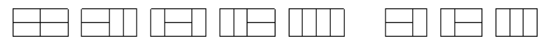

## 4.8：状态压缩DP

状压 dp 通过将状态二进制压缩为整数来达到优化转移的目的。

**例题：291. 蒙德里安的梦想（模板题）**

> tips：291题建议看新视频。

<!--more-->

求把 N×M 的棋盘分割成若干个 1×2 的的长方形，有多少种方案。

例如当 N=2，M=4 时，共有 55 种方案。当 N=2，M=3 时，共有 33 种方案。

如下图所示：



输入格式：

输入包含多组测试用例。

每组测试用例占一行，包含两个整数 N 和 M。

当输入用例 N=0，M=0 时，表示输入终止，且该用例无需处理。

输出格式：

每个测试用例输出一个结果，每个结果占一行。

数据范围：

1≤N,M≤11

输入样例：

```
1 2
1 3
1 4
2 2
2 3
2 4
2 11
4 11
0 0
```

输出样例：

```
1
0
1
2
3
5
144
51205
```

本题有难度！思路和状态表示很难想到。经典的状压DP例题。

优质题解： https://www.acwing.com/solution/content/28088/ （不带图版本），

https://lishizheng.blog.csdn.net/article/details/112706309（带图版本）。

小长方形只有两种摆法，横着放和竖着放。

核心思路：

**先摆横着的，再摆竖着的。**放完横着的，竖着的就确定了，总方案数等于只放横着的小方块的合法方案数。

如何判断，当前方案数是否合法？ 所有剩余位置能否填充满竖着的小方块。可以按列来看，每一列内部所有连续的空着的小方块需要是偶数个。

状态表示：f [i] [j]  表示已经将前 i -1 列摆好，且从第i − 1 列，伸出到第 i  列的状态是 j  的所有方案。其中j是一个二进制数，用来表示哪一行的小方块是横着放的，其位数和棋盘的行数一致。请看图示：


解释：上图中 i=2，j =10101（二进制数，但是存的时候用十进制） 所以这里的f[i] [j] 表示的是 所有前i列摆完之后，从第 i-1列伸到第i列的状态是10101（第1行伸出来，第3行伸出来，第5行伸出来，其他行没伸出来）的方案数。

状态计算：一般根据最后一步不同点计算。

因为 j 这个数的二进制形式已经固定了第 i 列的摆放方式，所以最后一步考虑**第i-2 列是怎么转移到到第 i-1列的**（看最后转移过来的状态）。假设此时对应的状态是k（**第i-2列到第i-1列伸出来的二进制数**，比如00100），k也是一个二进制数，1表示哪几行小方块是横着伸出来的，0表示哪几行不是横着伸出来的。

它对应的方案数是  f[i-1,k] ，即前i-2列都已摆完，且从第i-2列伸到第i-1列的状态为 k 的所有方案数。

这个k需要满足什么条件呢？

首先k不能和j在同一行都是1，否则会与从第i-1列伸到第i列的方块重叠。那么对应的代码为`(k & j ) ==0`，表示 k和j没有1位相同， 即没有1行有冲突。

既然从第i-1列到第i列横着摆的（由j确定），和第i-2列到第i-1列横着摆的（由k确定）都确定了，那么第i-1列空着的格子就确定了，这些空着的格子将要竖着放。如果 某一列有这些空着的位置，**那么该列所有连续的空着的位置长度必须是偶数**。

那么最终答案就是：`f[m][0]`， 意思是 前m-1列全部摆好,且从第m-1列到m列状态是0（意即从第m-1列到第m列没有伸出来的）的所有方案，即整个棋盘全部摆好的方案。（列数从0开始）

> 状态表示是化零为整的过程，状态计算是化整为零的过程。

时间复杂度分析：

dp的时间复杂度 =状态表示× 状态转移（可以看成公式了）

状态表示 `f[i][j]` ，第一维i可取11，第二维j（二进制数）可取$2^{11}$ ，所以状态表示 ：$11*2^{11}$；

状态转移：枚举k，也是$2^{11}$ ；

总时间复杂度：$11*2^{11}*2^{11} \approx 4*10^7$。

时间比较极限，需要预处理优化一下。


```C++
#include <iostream>
#include <vector>
#include <cstring>
using namespace std;
typedef long long LL;
#define IOS \
    ios::sync_with_stdio(false); \
    cin.tie(0); \
    cout.tie(0)
const int N = 12;
LL dp[N][1 << N];
bool st[1 << N];
vector<int> state[1 << N];// 存放每一列的

int main(){
    IOS;
    int n,m;
    while (cin >> n >> m,n){
        if ((n*m) & 1){// n*m是奇数就不可能放得下
            cout << 0 << '\n';continue;
        }
        // 预处理1
        // 对于每种状态i，判断是否有连续的奇数个0，有则is_valid = false
        for (int i = 0;i < 1 << n;i ++){
            int cnt = 0;// 计算两个1之间的0的个数
            bool is_valid = true;
            for (int j = 0;j < n;j ++){// 提取出i的每个二进制位
                if (i >> j & 1){
                    if (cnt & 1){// 如果cnt是奇数，存在连续的奇数个0
                        is_valid = false;break;
                    }
                    cnt = 0;// 重新计数
                }
                else cnt ++;
            }
            if (cnt & 1) is_valid = false;// 判断最后一段是否存在连续的奇数个0
            st[i] = is_valid;// 记录状态
        }

        // 预处理2
        // 下面来看进一步的判断：看看对于第i列的每个状态j，有哪些第i-1列的状态k是合法的
        for (int i = 0;i < 1 << n;i ++){
            state[i].clear();// 注意多组测试数据，清空本次操作遗留
            for (int k = 0;k < 1 << n;k ++){// i & k注意加括号！
                if ((i & k) == 0 && st[i | k]) state[i].push_back(k);
            }
        }

        // 计算DP
        memset(dp,0,sizeof dp);// 注意多组测试数据，dp数组置零
        dp[0][0] = 1;
        for (int i = 1;i <= m;i ++){
            for (int j = 0;j < 1 << n;j ++)
                for (auto k : state[j]){
                    dp[i][j] += dp[i-1][k];// 当前列的方案数就等于之前的第i-1列所有状态k的累加
                }
        }
        cout << dp[m][0] << '\n';
    }
    return 0;
}
```

**例题：91. 最短Hamilton路径（模板题）**

```C++
给定一张 n 个点的带权无向图，点从 0∼n−1 标号，求起点 0 到终点 n−1 的最短 Hamilton 路径。
Hamilton 路径的定义是从 0 到 n−1 不重不漏地经过每个点恰好一次。

输入格式
第一行输入整数 n。
接下来 n 行每行 n 个整数，其中第 i 行第 j 个整数表示点 i 到 j 的距离（记为 a[i,j]）。
对于任意的 x,y,z，数据保证 a[x,x]=0，a[x,y]=a[y,x] 并且 a[x,y]+a[y,z]≥a[x,z]。

输出格式
输出一个整数，表示最短 Hamilton 路径的长度。

数据范围
1≤n≤20
0≤a[i,j]≤10^7
输入样例：
5
0 2 4 5 1
2 0 6 5 3
4 6 0 8 3
5 5 8 0 5
1 3 3 5 0
输出样例：
18
```

仔细读题：从 0 到 n−1 不重不漏地经过每个点恰好一次，**起点是0，终点是n-1，中间点任意**。

算法1：暴力枚举，枚举0~n-1的全排列，计算路径总长度并取最小值，时间复杂度为$O(n*n!)$。

算法2：状压DP，考虑到使用位运算，状态压缩等来降低时间复杂度。

优质题解： https://www.acwing.com/solution/content/18533/。（模拟过程很棒）

参考题解： https://www.acwing.com/solution/content/15328/。

我们可以发现，我们所需要的不是整个方案，而只是方案最优解，所以我们只需要记录当前这个方案的最优解即可，那么我们考虑的状态，就是在当前方案i中，目前抵达的点是j。


用 i 的二进制形式来表示0~j这些点中是否走过，1表示走过，0表示没走过。

状态计算：考虑转移到点j的最后一步，设走到j之前的最后一个点是k（0<=k<n-1），

**我们要求的是：`0-->...-->k-->j-->n-1`这条线的最小路径，`0<=k<n-1`且`k != j`，需要枚举合法的k。**

所以状态转移方程是：`f[i][j]=min(f[i][j],f[i-(1<<j)][k]+w[k][j])`。

`i-(1<<j)`也可改成`i xor (1<<j)`，也就是将第 j 位上的1改成0。

把 i 看成一个点集更好理解（`0 <= i < 1 << n`，将0~n-1放入点集）。（抽风聚聚题解）

注意：当`j = k`时，`i - (1 << j)`点集中就不包含k了，那么`f[i - (1 << j)][k]`这个状态就是一个不合法状态，值是正无穷，对`f[i][j]`的值是没有影响的。当点集i中的点有不在0~j中的，说明这个`f[i][j]`是不合法的。那么为什么它是不合法的呢？如果它是合法的，值就不是INF，说明它一定由某个合法状态转移而来，合法状态进行状态转移，只会将0变为1，还是一个合法状态。还要深究的话建议拿一个样例模拟一下。

初始化：`f[1][0] = 0`，点集中只有一个点0，从0到0的距离是0；

最终状态：`f[(1<<n)-1][n-1]`，从0走到n-1，且0到n-1的所有点走过的状态都是1。

```C++
#include <iostream>
#include <cstring>
#include <algorithm>
using namespace std;
#define IOS \
    ios::sync_with_stdio(false); \
    cin.tie(0); \
    cout.tie(0)
const int N = 20;
int n;
int a[N][N];
int dp[1 << N][N];

int main(){
    IOS;
    cin >> n;

    for (int i = 0;i < n;i ++)
        for (int j = 0;j < n;j ++) cin >> a[i][j];

    memset(dp,0x3f,sizeof dp);// 求min，dp数组置INF
    dp[1][0] = 0;// dp初始化
    // 合法的点集必须包含0号点，所以十进制i必须都是奇数
    for (int i = 1;i < 1 << n;i += 2)// 写成for (int i = 0;i < 1 << n;i ++)也行
        for (int j = 1;j < n;j ++)// j可以从1开始枚举，0是固定起点
            if (i >> j & 1)
                for (int k = 0;k < n;k ++)// 枚举合理的k-->j的方案才能更新状态
                    if (i >> k & 1)// 状态转移方程
                        dp[i][j] = min(dp[i][j],dp[i^(1<<j)][k]+a[k][j]);
    cout << dp[(1<<n)-1][n-1] << '\n';// 输出答案                    
    return 0;
}
```

状压DP总结：n的范围一般不会超过20，压缩之后2^20已经很大。