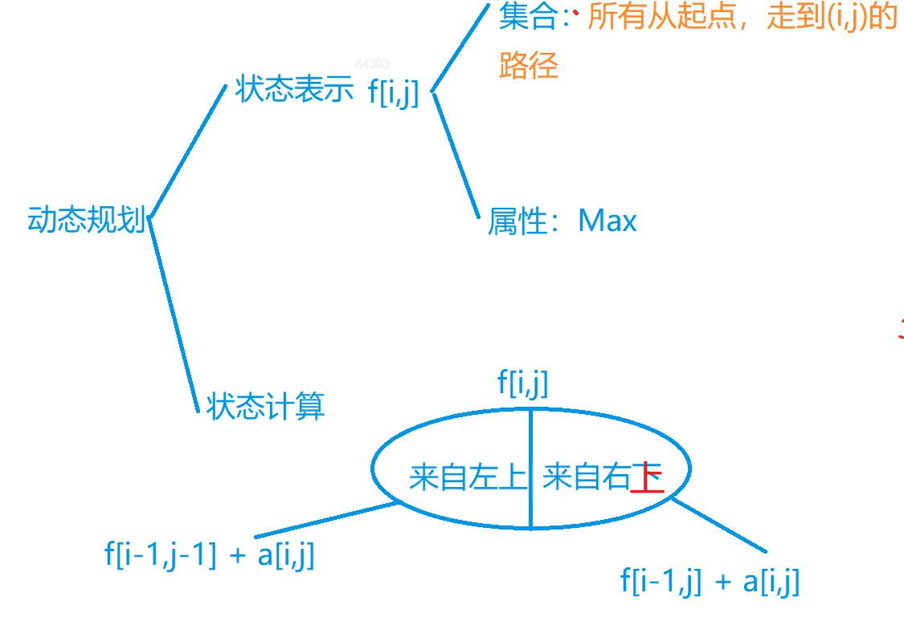

## 4.2：线性DP

什么是线性DP？

具有线性阶段划分的DP算法就是线性DP。

**例题：898. 数字三角形（模板题）**

<!--more-->

经典DP入门题。

```C++
给定一个如下图所示的数字三角形，从顶部出发，在每一结点可以选择移动至其左下方的结点或移动至其右下方的结点，一直走到底层，要求找出一条路径，使路径上的数字的和最大。

        7
      3   8
    8   1   0
  2   7   4   4
4   5   2   6   5
输入格式
第一行包含整数 n，表示数字三角形的层数。
接下来 n 行，每行包含若干整数，其中第 i 行表示数字三角形第 i 层包含的整数。

输出格式
输出一个整数，表示最大的路径数字和。

数据范围
1≤n≤500,
−10000≤三角形中的整数≤10000
输入样例：
5
7
3 8
8 1 0 
2 7 4 4
4 5 2 6 5
输出样例：
30
```

**算法1：自顶向下DP求解。**（边界问题处理麻烦）

思路：熟悉的y氏DP分析法。



```java
import java.io.*;
public class Main {
	static final int INF = 0x3f3f3f3f;
	public static void main(String[] args) throws IOException {
		BufferedReader reader = new BufferedReader(new InputStreamReader(System.in));
		int n = Integer.parseInt(reader.readLine());
		int[][] dp = new int[n+5][n+5];
		int[][] a = new int[n+5][n+5];
		
		for (int i = 1;i <= n;i ++){
			String[] str = reader.readLine().split(" ");
			for (int j = 1;j <= i;j ++){
				a[i][j] = Integer.parseInt(str[j-1]);
			}
		}
		reader.close();
		// 处理dp数组的边界问题，注意第二个循环j <= i + 1，覆盖三角形外面一圈，否则WA
		for (int i = 0;i <= n;i ++){
			for (int j = 0;j <= i + 1;j ++){
				dp[i][j] = -INF;// 初始化dp数组
			}
		}
		dp[1][1] = a[1][1];
		
		for (int i = 2;i <= n;i ++){
			for (int j = 1;j <= i;j ++){
			    // 一定要注意，先取MAX，再求和，否则dp值为-INF时+a[i][j]可能溢出
				dp[i][j] = Math.max(dp[i-1][j-1], dp[i-1][j]) + a[i][j];
			}
		}
		
		int res = -INF;
		for (int i = 1;i <= n;i ++){
			res = Math.max(res, dp[n][i]);
		}
		System.out.println(res);
	}
}
```

注意：如果这样写`dp[i][j] = max(dp[i - 1][j - 1] + a[i][j], dp[i - 1][j] + a[i][j]);`，当设置最小值为`INT_MIN`时，会溢出！！！

**算法2：自下向上DP求解。**（不需要考虑边界问题）

两种算法的区别：

- 算法1，不是所有点都能由两个父节点走到，可能只有一个父节点；
- 算法2，每个父节点必然由两个子节点走到，没有特殊情况。

```java
import java.io.*;
public class Main {
	public static void main(String[] args) throws IOException {
		BufferedReader reader = new BufferedReader(new InputStreamReader(System.in));
		int n = Integer.parseInt(reader.readLine());
		int[][] dp = new int[n+5][n+5];
		int[][] a = new int[n+5][n+5];
		
		for (int i = 1;i <= n;i ++){
			String[] str = reader.readLine().split(" ");
			for (int j = 1;j <= i;j ++){
				a[i][j] = Integer.parseInt(str[j-1]);
			}
		}
		reader.close();
		
		for (int i = n;i >= 1;i --){ // 必须从n开始枚举
		    for (int j = 1;j <= i;j ++){
		        dp[i][j] = Math.max(dp[i+1][j],dp[i+1][j+1]) + a[i][j];
		    }
		}
		System.out.println(dp[1][1]);
	}
}
```

关于滚动数组有个处理技巧，如果上一层是j,j+1, 那么j直接顺序枚举即可。如果上一层是j,j-1,那么需要保证j是在j-1之前更新，于是就需要倒序枚举。（画个DP表就很好理解）

滚动数组空间优化：

```java
reader.close();
		
for (int i = 1;i <= n;i ++){
    dp[i] = a[n][i];
}
for (int i = n - 1;i >= 1;i --){
    for (int j = 1;j <= i;j ++){ // 必须正向遍历
        dp[j] = Math.max(dp[j],dp[j+1]) + a[i][j];
    }
}
System.out.println(dp[1]);
```

**例题：895. 最长上升子序列（模板题）**

最长上升子序列也是一类经典的DP问题。

Longest Increasing Sequence，简称LIS。

这题在蓝桥杯中讲过： https://www.grantdrew.top/posts/9748a29e.html。

不再重复讲解。

时间复杂度：O(n^2)。

```java
import java.io.*;
public class Main {
	public static void main(String[] args) throws IOException{
		BufferedReader reader = new BufferedReader(new InputStreamReader(System.in));
		int n = Integer.parseInt(reader.readLine());
		int[] a = new int[n+2];
		int[] dp = new int[n+2];
		
		String[] str = reader.readLine().split(" ");
// 		for (int i = 1;i <= n;i ++){
// 			a[i] = Integer.parseInt(str[i-1]);
// 		}
		reader.close();
		int ans = 0;
		for (int i = 1;i <= n;i ++){
		    a[i] = Integer.parseInt(str[i-1]);
			dp[i] = 1;
			for (int j = 1;j < i;j ++){
				if (a[j] < a[i])
					dp[i] = Math.max(dp[i], dp[j] + 1);
			}
			if (dp[i] > dp[ans])// 更新最终答案
			    ans = i;
		}
		System.out.println(dp[ans]);
	}
}
```

如何输出最长子序列？

额外维护一个数组，在状态转移时记录由哪个状态转移而来。

**例题：896. 最长上升子序列 II（模板题）**

```java
给定一个长度为 N 的数列，求数值严格单调递增的子序列的长度最长是多少。

输入格式
第一行包含整数 N。

第二行包含 N 个整数，表示完整序列。

输出格式
输出一个整数，表示最大长度。

数据范围
1≤N≤100000，
−10^9≤数列中的数≤10^9
输入样例：
7
3 1 2 1 8 5 6
输出样例：
4
```

相比上一道题，本题数据加强，O(n^2)的算法肯定过不了，需要考虑O(n*logn)的算法。

参考：《算法训练营》，《蓝桥杯十二》。

类似贪心的做法。

根据上升子序列的特性，开一个辅助数组`d[]`来记录最长上升子序列的长度，**`d[i]`表示长度为`i`的上升子序列末尾的最小数字。**（加粗句子是理解的关键）用`len`来记录最长上升子序列的长度。上升子序列的特性可以使用二分查找。

看算法训练营的表格图解模拟一下就很容易理解了。

特别注意：`d[]`数组并不能真实记录最长上升子序列，只是辅助数组，这种做法只能求出最长上升子序列长度`len`。正确理解加粗句子就能看懂。最终的`d[]`数组是严格单调递增的，因为长度为`i`的上升子序列末尾的最小数字是逐渐变大的。

样例：`1 7 3 5 8 4`。最终得到的d数组：`1 3 4 9`，显然不是最长上升子序列，但长度没错。

```java
// 参考：《算法训练营》，注意将upper_bound改成lower_bound，勘误了
import java.io.*;
public class Main {
	
	public static void main(String[] args) throws IOException {
		BufferedReader reader = new BufferedReader(new InputStreamReader(System.in));
		int n = Integer.parseInt(reader.readLine());
		int[] a = new int[n+5];
		int[] d = new int[n+5];
		String[] str = reader.readLine().split(" ");
		
		for (int i = 1;i <= n;i ++){
			a[i] = Integer.parseInt(str[i-1]);
		}
		reader.close();
		int len = 1;
		d[1] = a[1];// 边界初始化
		
		for (int i = 2;i <= n;i ++){
			if (d[len] == a[i]) continue;
			else if (d[len] < a[i])
				d[++len] = a[i];
			else{
				int l = 1,r = len; // lower_bound找到第一个大于a[i]的位置
				while (l < r){
					int mid  = l + r >> 1;
					if (d[mid] < a[i]) l = mid + 1;
					else r = mid;
				}
				d[l] = a[i];
			}
		}
		System.out.println(len);
	}
}
```

