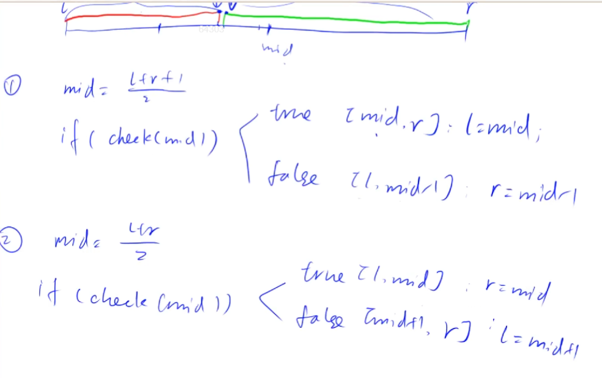

## 1.3：二分

相关文章：

1. 蓝桥杯系列二分介绍：https://www.grantdrew.top/posts/d50f01e.html
2. 二分查找：https://www.grantdrew.top/posts/e8eb0481.html

<!--more-->

二分一般包括整数二分和浮点数二分。

整数二分边界处理比较麻烦，浮点数二分会更好做。

### 1.3.1：整数二分

有单调性的区间可以用二分处理，能用二分不一定有单调性。

二分的核心在于有二段性的区间，左边满足某一性质，右边不满足（或者相反），两部分没有交集。



整数二分的2个模板原理图如上。

两个check函数分别判断mid是否满足红色、绿色性质。

当`l = mid`时，mid需要+1上取整，`r = mid`时不需要。

为什么需要+1？

当区间只有l和r两个数时，mid下取整恰好取到l，且check(mid)返回true，那么[l,r]并不会更新，陷入死循环。

**说明：**整数二分中用到的`l + r / 2`最好写成`l + r >> 1`的形式，因为C++中除法是向零整除，对于负数二分可能出现错误。

**例题：acwing.789. 数的范围（模板题）**

```C++
给定一个按照升序排列的长度为 n 的整数数组，以及 q 个查询。
对于每个查询，返回一个元素 k 的起始位置和终止位置（位置从 0 开始计数）。
如果数组中不存在该元素，则返回 -1 -1。

输入格式
第一行包含整数 n 和 q，表示数组长度和询问个数。
第二行包含 n 个整数（均在 1∼10000 范围内），表示完整数组。
接下来 q 行，每行包含一个整数 k，表示一个询问元素。

输出格式
共 q 行，每行包含两个整数，表示所求元素的起始位置和终止位置。
如果数组中不存在该元素，则返回 -1 -1。

数据范围
1≤n≤100000
1≤q≤10000
1≤k≤10000
输入样例：
6 3
1 2 2 3 3 4
3
4
5
输出样例：
3 4
5 5
-1 -1
```

题解1：STL，见蓝桥杯学习总结（五）。

题解2：手写二分。

y总代码：

```C++
#include <cstdio>
#include <algorithm>
using namespace std;

const int N = 100010;
int q[N];
int n,m;

int main(){
    scanf("%d %d",&n,&m);
    for (int i = 0;i < n;i++) scanf("%d",&q[i]);
    
    int x;
    while (m--){
        scanf("%d",&x);
        int l = 0,r = n-1;
        while (l < r){// 先二分查找x的起始位置
            int mid = l + r >> 1;
            if (q[mid] >= x) r = mid;
            else l = mid + 1;
        }
        if (q[l] != x) puts("-1 -1");
        else{
            printf("%d ",l);
            int l = 0,r = n-1;
            while (l < r){// 再二分查找x的终止位置
                int mid = l + r + 1 >> 1;// l = mid补上+1上取整
                if (q[mid] <= x) l = mid;
                else r = mid - 1;
            }
            printf("%d\n",l);
        }
    }
    return 0;
}
```

### 1.3.2：浮点数二分

浮点数二分不需要考虑复杂的边界问题。

**例题：acwing.7890. 数的三次方根（模板题）**

```C++
给定一个浮点数 n，求它的三次方根。

输入格式
共一行，包含一个浮点数 n。

输出格式
共一行，包含一个浮点数，表示问题的解。
注意，结果保留 6 位小数。

数据范围
−10000≤n≤10000
输入样例：
1000.00
输出样例：
10.000000
```

y总代码：

```C++
#include <cstdio>
using namespace std;

int main(){
    double n;
    scanf("%lf",&n);
    
    double l = -100,r = 100;// 算平方根左边界取0，立方根左边界取-100
    while (r - l > 1e-8){// 经验值，比要求的1e-6多开2位
        double mid = (l+r) / 2;
        if (mid*mid*mid >= n) r = mid;
        else l = mid;
    }
    printf("%lf",l);// 默认输出6位小数
    return 0;
}
```

## 1.4：高精度

有时候遇到数据非常大，超过long long的上限时，需要高精度。

只有C++才需要高精度，python自带，Java有BigDecimal。

高精度面试不常考，笔试中偶尔出现。

一般包括高精度加法、减法、乘法和除法。（A+B,A-B,A*a,A/a）

加、减法都是两个大数A和B之间运算，乘、除法是大数A和小数a（位数小）运算。

位数范围：A、B一般<=10^6，a一般<=10000。

Java处理高精度问题：

Java中有两个类可以来处理高精度的计算，分别是处理整数的BigInteger和处理小数的BigDecimal。

参考：  https://www.acwing.com/solution/content/34210/。

python处理高精度问题：

```Python
# python可以直接过
a = int(input())
b = int(input())
print(a+b)
print(a-b)
print(a*b)
# 高精度除法求商和余数
c = divmod(a,b)
print(c[0])
print(c[1])
# 也可以输出a//b和a%b
```

C++处理高精度问题：

如何存放一个大数A？假设有9位，A=123456789，将它存入数组，采取小端模式：数组按低位到高位存入A，987654321。这样处理方便进位。

参考资料： https://oi-wiki.org/math/bignum/。

高精度加法：

**例题：acwing.791. 高精度加法（模板题）**

```C++
给定两个正整数，计算它们的和。

输入格式
共两行，每行包含一个整数。

输出格式
共一行，包含所求的和。

数据范围
1≤整数长度≤100000
输入样例：
12
23
输出样例：
35
```

首先复习一下整数的笔算加法。

```C++
 1 2 3
+  8 9
--------
 2 1 2   
```

然后用数组来模拟笔算的过程。

对于A和B的每一位的加法计算，实际上是三个数Ai、Bi和t（进位）的和。

y总代码。

```C++
#include <cstdio>
#include <string>
#include <iostream>
#include <vector>
using namespace std;


// C = A + B，A和B都是正整数
vector<int> add(vector<int> &A,vector<int> &B){
    vector<int> C;
    int t = 0;
    for (int i = 0;i < A.size() || i < B.size();i++){
        if (i < A.size()) t += A[i];
        if (i < B.size()) t += B[i];
        C.push_back(t % 10);
        t /= 10;// 进位到下一位
    }
    if (t) C.push_back(1);// 判断最高位是否需要进位
    return C;
}

int main(){
    string a,b;
    vector<int> A,B;

    cin >> a >> b;
    for (int i = a.size()-1;i >= 0;i--) A.push_back(a[i] - '0');
    for (int i = b.size()-1;i >= 0;i--) B.push_back(b[i] - '0');

    auto C = add(A,B);
    for (int i = C.size()-1;i >= 0;i--) printf("%d",C[i]);
    return 0;
}
```

