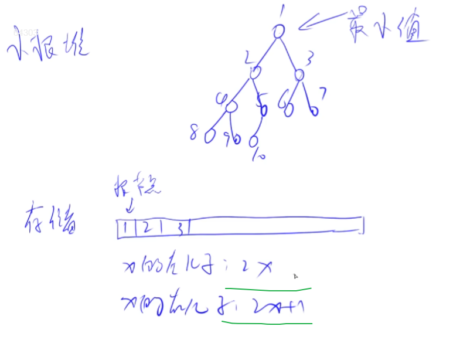
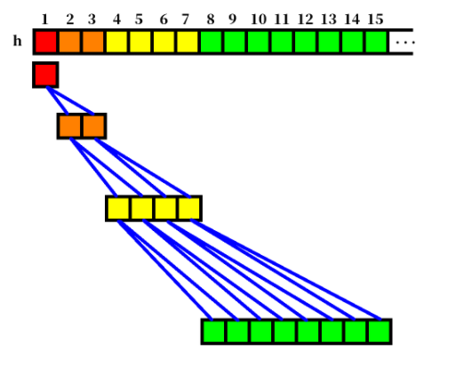
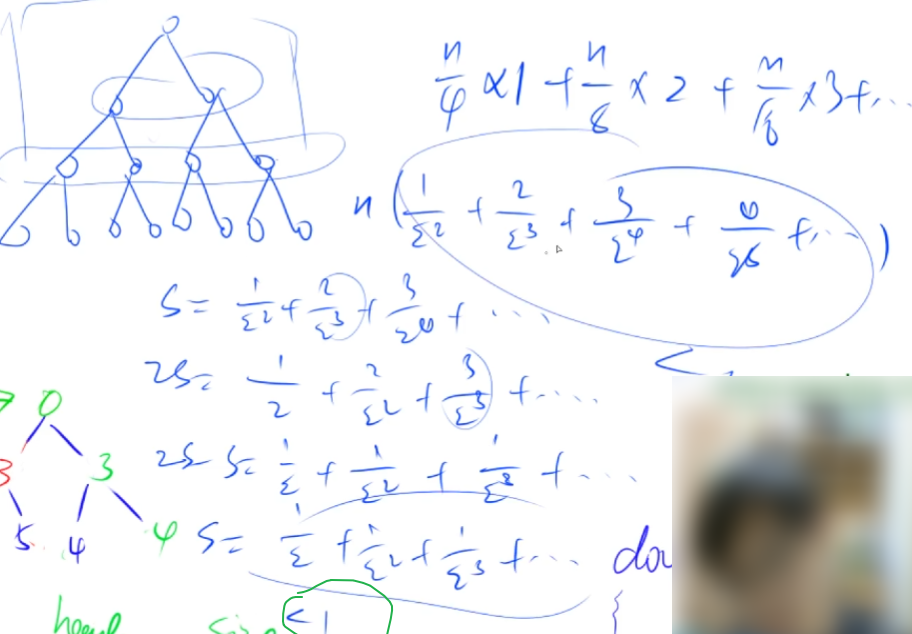

## 2.6：并查集

并查集知识在《并查集详解》中有介绍。

并查集：

1. 将两个集合合并；

2. 询问两个元素是否在一个集合中。

    <!--more-->

暴力做法：

开一个数组存放元素属于哪个集合，`belong[x] = a`。

询问操作可以这样写：`if (belong[x] == belong[y])`，可以做到O(1)。

但是集合合并操作，至少要把元素少的集合的belong值全部修改，非常费时。

所以需要并查集来提高效率。

并查集对于合并与查询两个操作的时间复杂度近似O(1)（较好情况下）。

最坏情况时间复杂度为：O(m*logn)。这个记住就行。

**并查集基本原理：**

每个集合用一棵树 来表示。树根的编号就是整个集合的编号。每个节点存放的p值就是它的父节点编号,p[x]表示x的父节点。

这样做如果每棵树有非常多层，一层一层查询到树根效率较低，我们可以把树根以外的所有节点全部直接连到树根节点，提高查找效率，设u为数根，那么可以这样表示：$p[x](x \ne u)=u$，这个过程称为**路径压缩**。

**例题1：836. 合并集合（模板题）**

```C++
一共有 n 个数，编号是 1∼n，最开始每个数各自在一个集合中。
现在要进行 m 个操作，操作共有两种：
M a b，将编号为 a 和 b 的两个数所在的集合合并，如果两个数已经在同一个集合中，则忽略这个操作；
Q a b，询问编号为 a 和 b 的两个数是否在同一个集合中；
    
输入格式
第一行输入整数 n 和 m。
接下来 m 行，每行包含一个操作指令，指令为 M a b 或 Q a b 中的一种。

输出格式
对于每个询问指令 Q a b，都要输出一个结果，如果 a 和 b 在同一集合内，则输出 Yes，否则输出 No。
每个结果占一行。

数据范围
1≤n,m≤10^5
输入样例：
4 5
M 1 2
M 3 4
Q 1 2
Q 1 3
Q 3 4
输出样例：
Yes
No
Yes
```

代码。

```C++
#include <iostream>
using namespace std;
#define IOS \
    ios::sync_with_stdio(false); \
    cin.tie(0); \
    cout.tie(0)
const int N = 1e5+ 5;
int p[N];
int n,m;

int find(int x){// 查找编号x的点所在树的根节点
    if (p[x] != x) p[x] = find(p[x]);
    return p[x];
}

int main(){
    IOS;
    cin >> n >> m;
    
    for (int i = 1;i <= n;i ++) p[i] = i;// 并查集编号一般从1开始
    
    char op;
    int a,b;
    while (m--){
        cin >> op >> a >> b;
        if (op == 'M') p[find(a)] = find(b);// 将a所在的树的根节点并入b所在树的根节点
        else cout << (find(a) == find(b) ? "Yes" : "No") << '\n';
    }
    
    return 0;
}
```

补充字符读入的小技巧（避免读入一些空格、回车等特殊字符）：避免踩坑！

```C++
#include <iostream>
#include <cstdio>
using namespace std;

int main(){
    //  读入一个字符的技巧
    //  scanf读入技巧1
    char op,t;
    scanf(" %c %c",&op,&t);// 以%c形式读入，在%c之前加一个空格来过滤空格回车等字符
    printf("%c\n%c\n",op,t);
    
    //  scanf读入技巧2
    char str[2];
    scanf("%s",str);// 以%s形式读入，过滤空格回车等字符
    printf("%c\n",str[0]);// 取str[0]即为需要读入的一个字符
    
    return 0;
}
/* input:
   t 
 f
 s
output:
t
f
s*/
```

**例题2：837. 连通块中点的数量（模板题）**

```C++
给定一个包含 n 个点（编号为 1∼n）的无向图，初始时图中没有边。
现在要进行 m 个操作，操作共有三种：
C a b，在点 a 和点 b 之间连一条边，a 和 b 可能相等；
Q1 a b，询问点 a 和点 b 是否在同一个连通块中，a 和 b 可能相等；
Q2 a，询问点 a 所在连通块中点的数量；
    
输入格式
第一行输入整数 n 和 m。
接下来 m 行，每行包含一个操作指令，指令为 C a b，Q1 a b 或 Q2 a 中的一种。

输出格式
对于每个询问指令 Q1 a b，如果 a 和 b 在同一个连通块中，则输出 Yes，否则输出 No。
对于每个询问指令 Q2 a，输出一个整数表示点 a 所在连通块中点的数量
每个结果占一行。

数据范围
1≤n,m≤10^5
输入样例：
5 5
C 1 2
Q1 1 2
Q2 1
C 2 5
Q2 5
输出样例：
Yes
2
3
```

和上一题类似，这里可以把每个连通块看作是一个集合。

相比上一题多维护了一个Size数组。

```C++
#include <iostream>
using namespace std;
#define IOS \
    ios::sync_with_stdio(false); \
    cin.tie(0); \
    cout.tie(0)
const int N = 1e5+ 5;
int p[N],Size[N];// size存放每个集合中元素的个数，规定只有根节点的size才有意义
int n,m;

int find(int x){// 查找编号x的点所在树的根节点
    if (p[x] != x) p[x] = find(p[x]);
    return p[x];
}

int main(){
    IOS;
    cin >> n >> m;
    
    for (int i = 1;i <= n;i ++){
        p[i] = i;// 并查集编号一般从1开始
        Size[i] = 1;// 每个连通块初始大小为1
    }
    
    string op;
    int a,b;
    while (m--){
        cin >> op;
        if (op == "C"){
            cin >> a >> b;
            a = find(a),b = find(b);// 必须用变量存一下find，否则下面会改变find导致bug
            if (find(a) != find(b)){// a,b祖宗不同才需要合并，否则已经合并了
                p[a] = b;// 将a所在的树的根节点并入b所在树的根节点
                Size[b] += Size[a];// 此时find(b)是合并集合的根节点，find(b)的size更新,find(a)没有意义了
            }
        }
        else if (op == "Q1"){
            cin >> a >> b;
            cout << (find(a) == find(b) ? "Yes" : "No") << '\n';
        }
        else{
            cin >> a;
            cout << Size[find(a)] << '\n';
        }
    }
    
    return 0;
}
```

错误示范：

```C++
if (op == "C"){
    cin >> a >> b;
	p[find(a)] = find(b);
	Size[find(b)] += Size[find(a)];// 执行完第3行操作时find(a)已经=b了
    // 所以再执行第4行会把b集合的元素算2倍
	}
}
```

所以必须`a = find(a),b = find(b);`才不会修改find导致bug。

## 2.7：堆（heap）

参考资料： https://oi-wiki.org/ds/binary-heap/。

堆是一棵**完全二叉树**，其每个节点都有一个键值，且每个节点的键值都大于等于/小于等于其父亲的键值。

每个节点的键值都大于等于其父亲键值的堆叫做小根堆，否则叫做大根堆。STL 中的 `priority_queue`其实就是一个大根堆。

（小根）堆主要支持的操作有：**插入一个数、查询最小值、删除最小值**、合并两个堆、减小一个元素的值。

前三个操作是基础操作，STL也支持；还包括删除、修改任意一个元素，STL不支持。

**小根堆：**

每个节点的键值小于或等于左右孩子，堆顶就是整个堆的最小值。

堆的存储：用一维数组来存储。





这主要和完全二叉树的特点有关，节点编号从1开始，每层从左到右编号。

编号从1开始，则编号为x的左孩子为2x，右孩子为2x+1，父节点为：$\lfloor x/2 \rfloor$。

**如何手写一个堆?**

1. 揷入一个数 $\quad$ `heap [++​size ]=x ;​ up(size);`
2. 求集合当中的最小值 $\quad$ `heap[1];`
3. 删除最小值 $\quad$ `heap [1]= heap[size]; szie - - ; down(1) ;`
4. 删除任意一个元素 $\quad$ `heap [k]= heap[size]; size - - ; down(k); up(k);` 
5. 修改任意一个元素 $\quad$ `heap [k]=x ; down(k) ; up(k);`
6. 注意：up，down处理的都是下标，不是元素值。

**如何将一个一维数组建堆？**

一个一个插入数组元素，每次插入为O(logn)，总时间复杂度为O(n*logn)。

还有更好的方法吗？

换一种思路，从倒数第2层开始往上的节点，逐个向下调整，叶节点无需调整，可以实现O(n)建堆。

> `for(i=n>>1;i;--i) down(i);`



证明如上图，倒数第2层节点数约n/4，往下down 1层；倒数第3层节点数约n/8，往下down 2层；……

总时间复杂度约为：n/4 * 1+ n/8 * 2 + n/16 * 3 + ...  = O(n)。

之所以能O(n)建堆，是因为堆性质很弱，二叉堆并不是唯一的。

其实还可以通过向上调整建堆，但是比向下调整慢一点。

**例题1：838. 堆排序（模板题）**

```C++
输入一个长度为 n 的整数数列，从小到大输出前 m 小的数。

输入格式
第一行包含整数 n 和 m。
第二行包含 n 个整数，表示整数数列。

输出格式
共一行，包含 m 个整数，表示整数数列中前 m 小的数。

数据范围
1≤m≤n≤10^5，
1≤数列中元素≤10^9
输入样例：
5 3
4 5 1 3 2
输出样例：
1 2 3
```

思路：

先根据一维数组建堆，然后每次输出堆顶元素并删除。所以只需要实现查询最小值、删除最小值操作。

**向下调整down**：在该结点的儿子中，找一个最小的，与该结点交换，重复此过程直到底层。

可以证明，删除并向下调整后，没有其他结点不满足堆性质。

这样做也就是使得当前节点调整后满足堆性质。

时间复杂度：O(logn)。

注意：`down(u)`的前提是u的孩子的下面一层及以下层都已经调整好了，现在需要调整的是u以及它的两个孩子，如果u与它的最小孩子发生交换，则u换到最小孩子的位置，需要`down(t)`调整。

向上调整类似。

```C++
#include <cstdio>
#include <algorithm>
using namespace std;

const int N = 1e5+5;
int h[N],Size;// h[N]存储堆中的值,Size存放堆的元素个数
int n,m;

void down(int u){// n个节点的堆最多约logn层，递归消耗不会很大
    int t = u;// t的元素值为当前节点与它的左右孩子三者的最小值，标记最小值
    if (2*u <= Size && h[2*u] < h[t]) t = 2*u;// 左孩子存在且左孩子元素值小则更新t为左孩子
    if (2*u+1 <= Size && h[2*u+1] < h[t]) t = 2*u+1;// 右孩子同理
    if (u != t){// 如果当前节点的元素值不是三者最小值
        swap(h[u],h[t]);// 交换u和t的元素值
        down(t);// 重复down过程直到底层
    }
}

void up(int u){// up操作只需要和父节点比较
    while (u / 2 && h[u/2] > h[u]){// 父节点存在且当前节点元素值比父节点小
        swap(h[u],h[u/2]);
        u /= 2;// 重复过程直到堆顶
    }
}

int main(){
    scanf("%d%d",&n,&m);
    
    for (int i = 1;i <= n;i ++) scanf("%d",&h[i]);
    Size = n;
    
    for (int i = n >> 1;i ; i--) down(i);// O(n)建堆
    
    while (m--){
        printf("%d ",h[1]);// 输出堆顶（最小值）
        h[1] = h[Size];// 删除堆顶（用最后一个数覆盖第一个数） 并且长度 减1
        Size --;// 可以合并为h[1] = h[Size--]
        down(1);// 让覆盖好的数往下面走
    }
    return 0;
}
```

拓展，循环版本的down函数：

```C++
void down(int u)
{
    int t = u;
    while (1)
    {
        if (2 * u <= cnt && h[2 * u] < h[t]) t = 2 * u;
        if (2 * u + 1 <= cnt && h[2 * u + 1] < h[t]) t = 2 * u + 1;
        if (u != t)
        {
            swap(h[u], h[t]);
            u = t;
        }
        else break;
    }
}
```

递归版本的up函数：

```C++
void up(int u){
    if (u/2 && h[u/2] > h[u]){
        swap(h[u],h[u/2]);
        up(u/2);
    }
}
```

