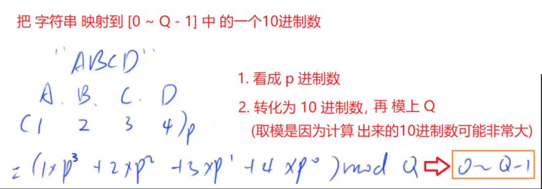
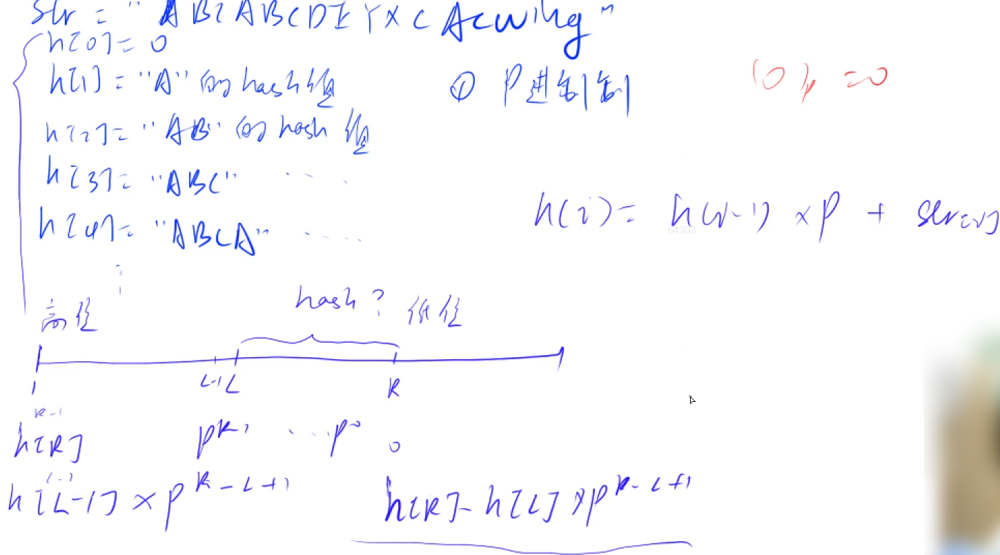

## 2.9：哈希表

蓝桥杯（四十）中介绍了模拟哈希表的两种方法，拉链法和开放寻址法。

<!--more-->

**例题：840. 模拟散列表（模板题）**

```C++
维护一个集合，支持如下几种操作：
I x，插入一个数 x；
Q x，询问数 x 是否在集合中出现过；
现在要进行 N 次操作，对于每个询问操作输出对应的结果。

输入格式
第一行包含整数 N，表示操作数量。
接下来 N 行，每行包含一个操作指令，操作指令为 I x，Q x 中的一种。

输出格式
对于每个询问指令 Q x，输出一个询问结果，如果 x 在集合中出现过，则输出 Yes，否则输出 No。
每个结果占一行。

数据范围
1≤N≤10^5
−10^9≤x≤10^9
输入样例：
5
I 1
I 2
I 3
Q 2
Q 5
输出样例：
Yes
No
```

离散化和哈希表的区别：离散化通过二分将稀疏的数据映射到连续的一串数1~n，而哈希表不会映射到连续的一串数。离散化方便后续的前缀和等对连续量的处理，而哈希表不能排序，不能这样做。

离散化能保持数据的相对大小关系，而哈希表可能会打乱顺序。离散化比哈希更慢，要求高。

离散化之前需要排序去重，保证不会冲突，而哈希表需要处理冲突。

1.拉链法。

```C++
#include <iostream>
#include <cstring>
using namespace std;

const int MOD = 100003;
int h[MOD],e[MOD],ne[MOD],idx;// h[N]是邻接表的数组槽，作为每个单链表的头指针

void insert(int x){
    int k = (x % MOD + MOD) % MOD;// x转为正余数
    e[idx] = x,ne[idx] = h[k],h[k] = idx++;
}

bool find(int x){
    int k = (x % MOD + MOD) % MOD;
    for (int i = h[k]; ~i;i = ne[i]){
        if (e[i] == x) return true;
    }
    return false;
}

int main(){
    // 计算hash函数的模数MOD
    // for (int i = 100000; ; i ++){
    //     bool flag = true;
    //     for (int j = 2;j * j <= i;j ++){
    //         if (i % j == 0){
    //             flag = false;
    //             break;
    //         }
    //     }
    //     if (flag){
    //         cout << i;
    //         break;
    //     }
    // }
    memset(h,-1,sizeof h);// 使用链表前记得置为-1
    
    int n;
    cin >> n;
    string op;
    int x;
    while (n--){
        cin >> op >> x;
        if (op == "I") insert(x);
        else cout << (find(x) ? "Yes" : "No") << '\n';
    }
    
    return 0;
}
```

2.开放寻址法。

```C++
#include <iostream>
#include <cstring>
using namespace std;

const int MOD = 200003,null = 0x3f3f3f3f;
int h[MOD];

int find(int x){
    // 如果x在哈希表中，返回x的下标；如果x不在哈希表中，返回x应该插入的位置
    int k = (x % MOD + MOD) %  MOD;
    while (h[k] != null && h[k] != x){// k走到MOD处重新从开头找空位
        k ++;
        if (k == MOD) k = 0;
    }
    return k;
}

int main(){
    // 计算hash函数的模数MOD
    // for (int i = 200000; ; i ++){
    //     bool flag = true;
    //     for (int j = 2;j * j <= i;j ++){
    //         if (i % j == 0){
    //             flag = false;
    //             break;
    //         }
    //     }
    //     if (flag){
    //         cout << i;
    //         break;
    //     }
    // }
    memset(h,null,sizeof h);
    
    int n;
    cin >> n;
    string op;
    int x;
    while (n--){
        cin >> op >> x;
        int k = find(x);
        if (op == "I") h[k] = x;
        else cout << (h[k] == x ? "Yes" : "No") << '\n';
        // 可以写成：else cout << (h[k] != null ? "Yes" : "No") << '\n';
    }
    return 0;
}

```

## 2.10：字符串哈希

有很多字符串的问题可以用字符串哈希来做，不一定要用KMP算法。两者时间复杂度一样。

介绍一下**字符串前缀哈希法**。用于快速判断两字符串是否相等。

把字符串变成一个p进制数字（哈希值），实现不同的字符串映射到不同的数字。

**例题：841. 字符串哈希（模板题）**

```C++
给定一个长度为 n 的字符串，再给定 m 个询问，每个询问包含四个整数 l1,r1,l2,r2，请你判断 [l1,r1] 和 [l2,r2] 这两个区间所包含的字符串子串是否完全相同。

字符串中只包含大小写英文字母和数字。

输入格式
第一行包含整数 n 和 m，表示字符串长度和询问次数。
第二行包含一个长度为 n 的字符串，字符串中只包含大小写英文字母和数字。
接下来 m 行，每行包含四个整数 l1,r1,l2,r2，表示一次询问所涉及的两个区间。
注意，字符串的位置从 1 开始编号。

输出格式
对于每个询问输出一个结果，如果两个字符串子串完全相同则输出 Yes，否则输出 No。
每个结果占一行。

数据范围
1≤n,m≤10^5
输入样例：
8 3
aabbaabb
1 3 5 7
1 3 6 8
1 2 1 2
输出样例：
Yes
No
Yes
```

对于一个字符串，如何计算它的哈希值？

将它通过哈希函数映射到一个p进制数字（哈希值）。

字符串变成一个p进制数字，体现了字符+顺序，需要确保不同的字符串对应不同的数字，相同的字符串对应相同的数字。



上图给出了从p进制数到十进制数的转换公式。

**注意点：**

1. 任意字符不可以映射成0，否则会出现不同的字符串都映射成0的情况，比如A,AA,AAA皆为0。
2. 冲突问题：通过**巧妙设置P (131 或 13331) , Q (2^64)的值**，一般可以理解为不产生冲突。这是P，Q的经验值。

`unsigned long long`的范围是0~2^64-1，可以表示成0~Q-1，Q=2^64，对于ULL溢出的数就相当于对Q取模，就可以省略取模的步骤。

题目问的是**比较不同区间的子串是否相同，就转化为对应的哈希值是否相同**。



求一个字符串的哈希值就相当于求前缀和，求一个字符串的子串哈希值就相当于求部分和。

前缀和计算公式：字符串数组下标从1开始！

前缀和公式 `h[i]=h[i-1]×P+s[i] ，i∈[1,n]`，其中 h为前缀和数组，s为字符串数组。

区间和公式 `h[l,r]=h[r]−h[l−1]×P^(r−l+1)`。**重点！！！**

**区间和公式的理解:** ABCDE 与 ABC 的前三个字符值是一样，只差两位，乘上P的二次方把 ABC 变为 ABC00，再用 ABCDE - ABC00 得到 DE 的哈希值。

很多时候，字符串哈希比KMP更好做题。

代码。

```C++
#include <iostream>
typedef unsigned long long ULL;
using namespace std;
#define IOS \
    ios::sync_with_stdio(false); \
    cin.tie(0); \
    cout.tie(0)
const int N = 1e5+ 5,P = 131;
char str[N];
ULL h[N],p[N];// h数组是哈希的前缀和数组，p[i]表示P^i，处理乘幂
int n,m;

ULL get(int l,int r){// 区间和计算公式
    return h[r] - h[l-1]*p[r-l+1];
}

int main(){
    IOS;
    cin >> n >> m;
    cin >> (str+1);// 字符串数组下标从1开始
    
    p[0] = 1;// P^0 = 1
    for (int i = 1;i <= n;i ++){// 预处理乘幂和前缀和
        p[i] = p[i-1] * P;
        h[i] = h[i-1] * P + str[i];// 前缀和计算公式
    }
    
    int l1,r1,l2,r2;
    while (m--){
        cin >> l1 >> r1 >> l2 >> r2;// 子串与哈希值一一对应
        cout << (get(l1,r1) == get(l2,r2) ? "Yes" : "No") << '\n';
    }
    
    return 0;
}
```

时间复杂度：O(n+m)。