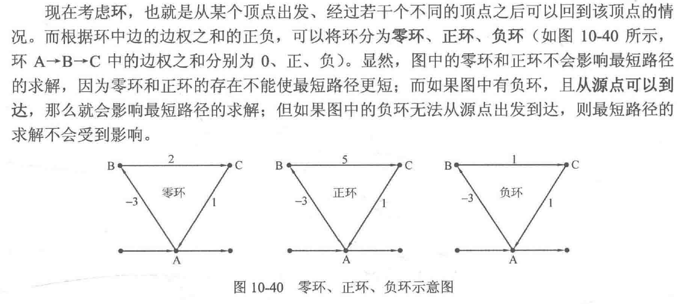
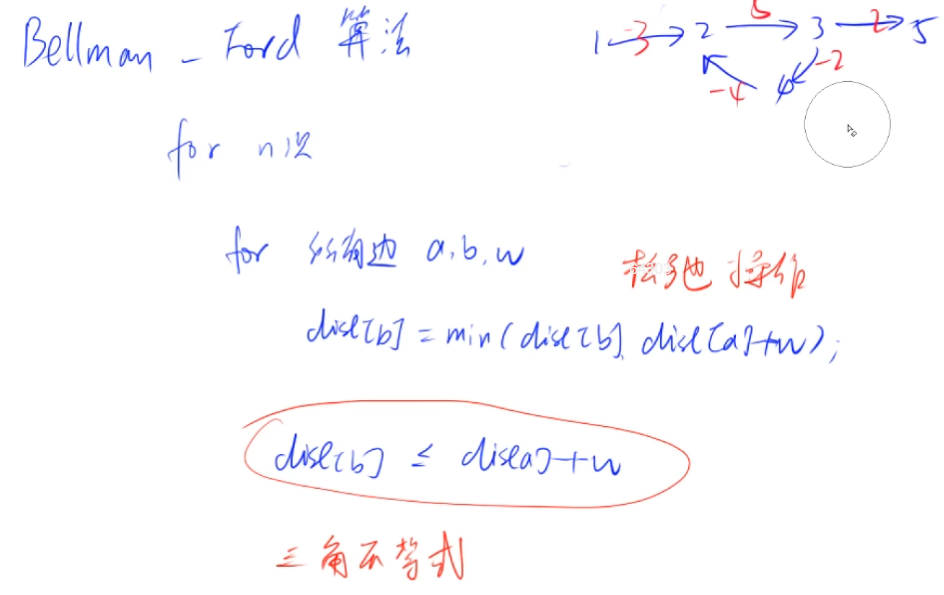
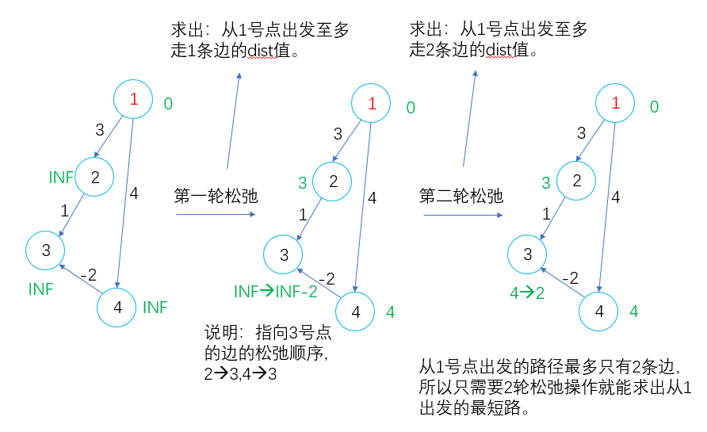

### 3.6.3：Bellman-Ford 算法

一种基于松弛（relax）操作的 最短路算法，支持负权。简称BF算法。

<!--more-->

明确环的相关概念。

**若图中从起点到终点的路上含有负环，那么不存在最短路，**只要重复走负环，最短路会变为负无穷。

存在负权回路的图不一定存在最短路。



**例题：853. 有边数限制的最短路（模板题）**

```C++
给定一个 n 个点 m 条边的有向图，图中可能存在重边和自环， 边权可能为负数。
请你求出从 1 号点到 n 号点的最多经过 k 条边的最短距离，如果无法从 1 号点走到 n 号点，输出 impossible。
注意：图中可能存在负权回路 。

输入格式
第一行包含三个整数 n,m,k。
接下来 m 行，每行包含三个整数 x,y,z，表示存在一条从点 x 到点 y 的有向边，边长为 z。

输出格式
输出一个整数，表示从 1 号点到 n 号点的最多经过 k 条边的最短距离。
如果不存在满足条件的路径，则输出 impossible。

数据范围
1≤n,k≤500,
1≤m≤10000,
任意边长的绝对值不超过 10000。

输入样例：
3 3 1
1 2 1
2 3 1
1 3 3
输出样例：
3
```

参考题解： https://www.acwing.com/solution/content/6320/。

Bellman-Ford 算法效率较低，代码难度较小。它比dijkstra算法更具普遍性，因为它对边没有要求，可以处理负权边，判断是否存在负权回路，缺点是时间复杂度高。

其原理为连续进行松弛，在每次松弛时把每条边都更新一下，若在 n-1 次松弛后还能更新，则说明图中有负环，因此无法得出结果，否则就完成。



若最外层循环k次，那么dist数组表示从1号点开始不超过k条边走到各个1点的距离。

参考资料： https://zhuanlan.zhihu.com/p/72185593。

其主要思想：对所有的边进行n-1轮松弛操作，因为在一个含有n个顶点的图中，任意两点之间的最短路径最多包含n-1边。换句话说，第1轮在对所有的边进行松弛后，得到的是源点最多经过一条边到达其他顶点的最短距离；第2轮在对所有的边进行松弛后，得到的是源点最多经过两条边到达其他顶点的最短距离；第3轮在对所有的边进行松弛后，得到的是源点最多经过一条边到达其他顶点的最短距离......

若最外层循环到第n次，还有可以松弛的点，说明存在负环，因为含有n个点的图的最短路至多有n-1条边。

bellman - ford算法的伪代码实现：

```C++
for n次
for 所有边 a,b,w (松弛操作)
dist[b] = min(dist[b],back[a] + w)
```

注意：back[] 数组是上一次迭代后 dist[] 数组的备份，由于是每个点同时向外出发，因此需要对 dist[] 数组进行备份，若不进行备份会因此发生串联效应，影响到下一个点。发生串联不能保证使用边数<=k。

也就类似数值分析中的雅可比迭代法（可能记错了，差不多意思），一轮迭代完所有方程，再进行下一轮的迭代。

如果不限制边数就不需要备份数组。

时间复杂度：O(n*m)。



```C++
#include <iostream>
#include <cstring>
#include <algorithm>
using namespace std;
#define IOS \
    ios::sync_with_stdio(false); \
    cin.tie(0); \
    cout.tie(0)
const int N = 510,M = 1e4+5;
int d[N],backup[N];
int n,m,k;
struct Edge{
    int a,b,w;// 结构体存储有向边
}edge[M];

int bellman_ford(){
    memset(d,0x3f,sizeof d);
    d[1] = 0;// dist数组初始化
    
    for (int i = 0; i < k; i ++ ){// 限制最短路边数不超过k
        memcpy(backup,d,sizeof d);// 执行一轮松弛操作之前先备份dist数组
        for (int i = 0;i < m;i ++){// 对每条边都进行一次边松弛
            int a = edge[i].a,b = edge[i].b,w = edge[i].w;
            d[b] = min(d[b],backup[a] + w);// 边松弛
        }
    }
    return d[n];
}

int main(){
    IOS;
    
    cin >> n >> m >> k;
    for (int i = 0;i < m;i ++){
        int a,b,c;
        cin >> a >> b >> c;
        edge[i].a = a,edge[i].b = b,edge[i].w = c;// 等价于edge[i] = {a,b,c};
    }
    int t = bellman_ford();// 题目限制边权绝对值不超过10000
    if (t > 0x3f3f3f3f / 2) cout << "impossible" << '\n';
    else cout << t << '\n';
    return 0;
}
```

在下面代码中，是否能到达n号点的判断中需要进行if(dist[n] > INF/2)判断，而并非是if(dist[n] == INF)判断，原因是INF是一个确定的值，并非真正的无穷大，会随着其他数值而受到影响，在上图的示例中就有变成INF-2的情况，所以dist[n]大于某个与INF相同数量级的数即可。

### 3.6.4：SPFA 算法

SPFA 算法（Shortest Path Faster Algorithm）是 Bellman-Ford算法 的队列优化算法的别称。

BF能处理边数限制的负权图，而SPFA不能处理边数限制。

缺点：时间复杂度不稳定，容易被卡，非负权图最好用Dijkstra（朴素或堆优化）来做。

> 关于spfa，它死了。---NOI 2018

考试时要谨慎使用spfa，真被卡了，只能换BF。（交1次的题谨慎考虑，多次提交的题可以考虑）

考察BF算法的边松弛操作`d[b] = min(d[b],backup[a] + w);`，可知：只有当d[a]减小时才会更新d[b]。

换句话说，a是b的前驱节点，只有当一个点的前驱结点更新了，该节点才会得到更新；因此考虑到这一点，我们将创建一个队列，每一次加入距离被更新的节点。

参考题解： https://www.acwing.com/solution/content/9306/。

如何卡SPFA： https://www.cnblogs.com/luckyblock/p/14317096.html。

**例题1：851. spfa求最短路（模板题）**

```C++
给定一个 n 个点 m 条边的有向图，图中可能存在重边和自环， 边权可能为负数。
请你求出 1 号点到 n 号点的最短距离，如果无法从 1 号点走到 n 号点，则输出 impossible。
数据保证不存在负权回路。

输入格式
第一行包含整数 n 和 m。
接下来 m 行每行包含三个整数 x,y,z，表示存在一条从点 x 到点 y 的有向边，边长为 z。

输出格式
输出一个整数，表示 1 号点到 n 号点的最短距离。
如果路径不存在，则输出 impossible。

数据范围
1≤n,m≤10^5,
图中涉及边长绝对值均不超过 10000。

输入样例：
3 3
1 2 5
2 3 -3
1 3 4
输出样例：
2
```

SPFA思路伪代码：

```C++
queue <– 1
while queue 不为空
 (1) t <– 队头
 queue.pop()
 (2)用 t 更新所有出边 t –> b，权值为w   也就是更新t的所有后继节点！
 queue <– b (若该点被更新过，则拿该点更新其他点)
```

时间复杂度：一般O(m)，最坏O(n*m)。

```C++
#include <iostream>
#include <cstring>
#include <queue>
#include <algorithm>
using namespace std;
#define IOS \
    ios::sync_with_stdio(false); \
    cin.tie(0); \
    cout.tie(0)
const int N = 1e5+5;
int d[N];
int h[N],e[N],w[N],ne[N],idx;// 邻接表存储，不需要判重边
int n,m;
bool s[N];// 记录节点是否进入队列

void add(int a,int b,int c){
    e[idx] = b,w[idx] = c,ne[idx] = h[a],h[a] = idx ++;
}

int spfa(){
    queue<int> q;// 队列优化
    q.push(1);// 1号点入队
    memset(d,0x3f,sizeof d);
    d[1] = 0;
    
    while (q.size()){
        int t = q.front();
        q.pop();// 取队头并出队
        s[t] = false;
        //从队列中取出来之后该节点st被标记为false,代表之后该节点如果发生更新可再次入队
        for (int i = h[t]; ~i;i = ne[i]){// 拓展队头t的所有后继节点
            int j = e[i];
            if (d[j] > d[t] + w[i]){
                d[j] = d[t] + w[i];// 边松弛
                if (!s[j]){//已经入队的节点，无需再次入队，即便发生了更新也只用更新数值即可
                    s[j] = true;
                    q.push(j);// j的距离发生更新，加入队列
                }
            }
        }
    }
    return d[n];
}

int main(){
    IOS;
    
    memset(h, -1, sizeof h);
    cin >> n >> m;
    for (int i = 0;i < m;i ++){
        int a,b,c;
        cin >> a >> b >> c;
        add(a, b, c);
    }
    int t = spfa();// 题目限制边权绝对值不超过10000
    if (t == 0x3f3f3f3f) cout << "impossible" << '\n';
    else cout << t << '\n';
    return 0;
}
```

本题BF被卡，数据太大，只能过4个数据，用spfa才能AC。

st数组的作用：判断当前的点是否已经加入到队列当中了；已经加入队列的结点就不需要反复的把该点加入到队列中了，就算此次还是会更新到源点的距离，那只用更新一下数值而不用加入到队列当中。

也可以数组模拟队列，但是要写循环队列（节点会重复入队，数组容量有限），可以这样写，`if (head == N) head = 0;if (tail == N) tail = 0;`分别在出队入队时加上，保证队列循环。

 Dijkstra算法和spfa算法中st数组的一个不同：前者一旦标记为true之后，就不在再变化；后者出队后，还可以重新入队。

Bellman_ford算法里最后return-1的判断条件写的是dist[n]>0x3f3f3f3f/2;而spfa算法写的是dist[n]==0x3f3f3f3f;其原因在于Bellman_ford算法会遍历所有的边，因此不管是不是和源点连通的边它都会得到更新；但是SPFA算法不一样，它相当于采用了BFS，因此遍历到的结点都是与源点连通的，因此如果你要求的n和源点不连通，它不会得到更新，还是保持的0x3f3f3f3f。

Bellman_ford算法可以存在负权回路，是因为其循环的次数是有限制的因此最终不会发生死循环；但是SPFA算法不可以，由于用了队列来存储，只要发生了更新就会不断的入队，**因此假如有负权回路请你不要用SPFA否则会死循环。**

补充：三种最短路算法的区别，https://www.acwing.com/solution/content/21057/。