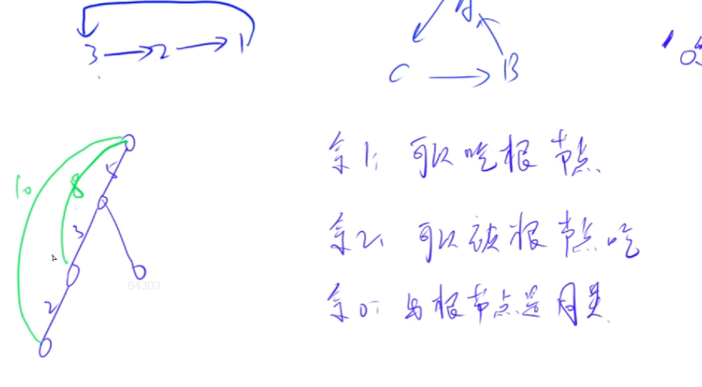
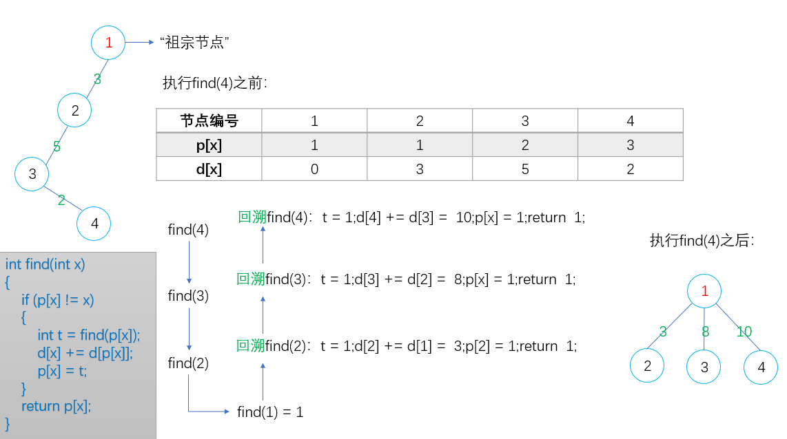

**例题2：839. 模拟堆（模板题）**

<!--more-->

```C++
维护一个集合，初始时集合为空，支持如下几种操作：
I x，插入一个数 x；
PM，输出当前集合中的最小值；
DM，删除当前集合中的最小值（数据保证此时的最小值唯一）；
D k，删除第 k 个插入的数；
C k x，修改第 k 个插入的数，将其变为 x；
现在要进行 N 次操作，对于所有第 2 个操作，输出当前集合的最小值。

输入格式
第一行包含整数 N。
接下来 N 行，每行包含一个操作指令，操作指令为 I x，PM，DM，D k 或 C k x 中的一种。

输出格式
对于每个输出指令 PM，输出一个结果，表示当前集合中的最小值。
每个结果占一行。

数据范围
1≤N≤10^5
−10^9≤x≤10^9
数据保证合法。

输入样例：
8
I -10
PM
I -10
D 1
C 2 8
I 6
PM
DM
输出样例：
-10
6
```

思路：

数组模拟一个带映射的堆，不太常用，主要用于迪杰斯特拉堆优化，一般用之前讲的普通堆就行。

参考题解： https://www.acwing.com/solution/content/5661/。

1.首先需要理解的是hp和ph这两个数组到底存的是啥，到底有啥作用？

hp是heap pointer的缩写，表示堆数组中下标到第k个插入的映射；

ph是pointer heap的缩写，表示第k个插入到堆数组中的下标的映射；

hp和ph数组是互为反函数的，比如：`hp[u]=k`，则`ph[k]=u`，第k个插入的数的下标为u，下标为u对应第k个插入的数。

2.为什么会用ph和hp这两个数组呢？

原因在于在删除第k个插入元素的操作中，我们首先得知道第k个插入元素在堆数组中的什么位置，即堆数组下标是啥。

很显然，用一个ph数组来存储会方便查找。这样我们就知道了第k个插入的元素在哪了。然后我们需要做的是和堆尾元素交换，最后再在原来第k个元素所在的位置进行down和up操作。

由于交换完后ph[k]的值变了，为ph[size]了，所以必须要在之前保存ph[k]的值，不然无法进行down和up操作。

3.似乎有了ph数组就可以完成所有操作了，但为什么还要有一个hp数组呢？

原因就在于在swap操作中我们输入是堆数组的下标，无法知道每个堆数组的下标对应的是第几个插入的元素。所以需要hp数组方便查找。

明白了这些也不难理解heap_swap函数啦！

**相比朴素版本的手写堆，涉及到swap的地方或者数组h元素的修改都换成heap_swap。**

```C++
#include <iostream>
#include <algorithm>
using namespace std;
#define IOS \
    ios::sync_with_stdio(false); \
    cin.tie(0); \
    cout.tie(0)
const int N = 1e5+ 5;
int h[N],ph[N],hp[N],Size;

void heap_swap(int a, int b)
{
    swap(ph[hp[a]],ph[hp[b]]);// 注意：hp和ph的顺序不要写反！！！
    swap(hp[a], hp[b]);
    swap(h[a], h[b]);
}

void down(int u){
    int t = u;
    if (2*u <= Size && h[2*u] < h[t]) t = 2*u;
    if (2*u + 1 <= Size && h[2*u + 1] < h[t]) t = 2*u + 1;
    if (u != t){
        heap_swap(u,t);
        down(t);
    }

}

void up(int u){
    while (u / 2 && h[u/2] > h[u]){
        heap_swap(u,u/2);
        u /= 2;
    }
}

int main(){
    IOS;
    
    int n,id = 0;
    string op;
    int x,y;
    cin >> n;
    while (n--){
        cin >> op;
        if (op == "I"){
            cin >> x;
            Size ++,id ++;// Size表示堆的大小，id表示第几个插入的数，编号
            h[Size] = x;
            ph[id] = Size,hp[Size] = id;
            up(Size); // 从底下插入的元素往上浮
        }
        else if (op == "PM"){
            cout << h[1] << '\n';
        }
        else if (op == "DM"){
            heap_swap(1,Size);// 删除堆顶，将它与尾部交换然后Size--，堆顶重新向下调整
            Size --;
            down(1);
        }
        else if (op == "D"){
            cin >> x;
            int u = ph[x];// 这里一定要用u=ph[k]保存第k个插入点的下标
            heap_swap(u,Size);// 因为在此处heap_swap操作后ph[k]的值已经发生
            // 如果在up,down操作中仍然使用ph[k]作为参数就会发生错误
            Size --;
            down(u),up(u);
        }
        else{// 将第x个插入的数修改成y
            cin >> x >> y;
            h[ph[x]] = y;// 此处由于未涉及heap_swap操作且下面的up、down操作只会发生一个
            down(ph[x]),up(ph[x]);// 所以可直接传入ph[k]作为参数
        }
    }
    return 0;
}
```

注意：上面的`heap_swap`不能反过来写：

```C++
swap(hp[ph[a]],hp[ph[b]]);
swap(ph[a],ph[b]);
swap(h[a],h[b]);
```

错的！！！

解释如下：

```C++
void heap_swap(int u,int v)
{
    swap(h[u],h[v]);
    swap(hp[u],hp[v]);
    swap(ph[hp[u]],ph[hp[v]]);
}
三条语句顺序可以交换，但是hp与ph不可交换
```

仔细想一想，上面的错解中`swap(ph[a],ph[b]);`究竟是什么意思呢？

ph函数的映射关系：

是从节点的插入次序（第几个插入，也即hp[a]，hp[b]）映射到堆数组中的下标（也即a，b）。

所以`ph[hp[a]]`才是有意义的，`ph[a]`的自变量取值就不在定义域内，它是无意义的，所以这条`swap`语句没有意义。显然是错的！

## 2.8：习题

### 2.8.1Trie.acwing.143. 最大异或对（模板题）

```C++
在给定的 N 个整数 A1，A2……AN 中选出两个进行 xor（异或）运算，得到的结果最大是多少？

输入格式
第一行输入一个整数 N。
第二行输入 N 个整数 A1～AN。

输出格式
输出一个整数表示答案。

数据范围
1≤N≤10^5,
0≤Ai<2^31
输入样例：
3
1 2 3
输出样例：
3
```

思路：

先来写暴力做法： 时间复杂度为O(n^2)

```C++
int res = 0;
for (int i = 0;i < n;i ++)
    for (int j = 0;j < i;j ++){
        res = max(res,a[i] ^ a[j]);// i和j交换顺序异或结果一样
    }
```

根据Ai的数据范围，Ai是一个31位的二进制串。

如何优化？

我们可以对第二重循环优化，对于第一重循环遍历的a[i]，找到使得异或值最大的a[j]，贪心找到每一位与a[i]不同的二进制数，直到叶子节点。

通过Trie树遍历二进制串，树的高度为31层，时间复杂度为$O(31*n)$，约$O(n*logn)$。

本题是Trie树的拓展，它不仅能存字母，也能存二进制数，由此可以存放汉字等字符，计算机中所以信息由二进制表示。本题的Trie树从每个分支到叶子都是31层，比较特殊，所以不需要cnt标记结尾字符。

**每读入一个数，则插入Trie树，再贪心查找Trie树中异或值最大的数。**

贪心：每一次检索的时候,我们都走与当前Ai这一位相反的位置走,也就是让Xor值最大,如果说没有路可以走的话,那么就走相同的路。

两个二进制数从高位开始异或的异或结果才会更大，所以从高位开始判断。

```C++
#include <iostream>
#include <algorithm>
using namespace std;
#define IOS \
    ios::sync_with_stdio(false); \
    cin.tie(0); \
    cout.tie(0)
const int N = 1e5+ 5;
int n,a;
int son[N*31][2],idx;

void insert(int a){// 插入a的二进制形式
    int p = 0;
    for (int i = 30;i >= 0;i --){// a的二进制形式有31位
        int u = a >> i & 1;// 取出a的二进制形式的第i位数字(0 <= i <= 30)
        if (!son[p][u]) son[p][u] = ++idx;
        p = son[p][u];// 走到子节点
    }
}

int query(int a){// 贪心查找Trie树中与a异或最大的数
    int p = 0,res = 0;
    for (int i = 30;i >= 0;i --){
        int u = a >> i & 1;
        if (son[p][!u]){
            p = son[p][!u];// 如果存在与u相反的数，走这条路
            res = res * 2 + !u;// 将二进制形式转换为十进制
        }
        else{
            p = son[p][u];// 没有的话只能走相同的路
            res = res * 2 + u;
        }
    }
    return res;
}

int main(){
    IOS;
    
    int res = 0;
    cin >> n;
    while (n--){
        cin >> a;
        insert(a);// 先插入再查询
        res = max(res,a ^ query(a));
    }
    cout << res << '\n';
    return 0;
}

// 写法2：
// xxx
if (son[p][!u]){
    p = son[p][!u];// 如果存在与u相反的数，走这条路
    res = res * 2 + 1;// 将二进制形式转换为十进制
}
else{
    p = son[p][u];// 没有的话只能走相同的路
    res = res * 2 + 0;
}
// xxx
res = max(res,query(a));
```

### 2.8.2并查集.acwing.240. 食物链（模板题）

```C++
动物王国中有三类动物 A,B,C，这三类动物的食物链构成了有趣的环形。
A 吃 B，B 吃 C，C 吃 A。
现有 N 个动物，以 1∼N 编号。
每个动物都是 A,B,C 中的一种，但是我们并不知道它到底是哪一种。
有人用两种说法对这 N 个动物所构成的食物链关系进行描述：
第一种说法是 1 X Y，表示 X 和 Y 是同类。
第二种说法是 2 X Y，表示 X 吃 Y。
此人对 N 个动物，用上述两种说法，一句接一句地说出 K 句话，这 K 句话有的是真的，有的是假的。
当一句话满足下列三条之一时，这句话就是假话，否则就是真话。
当前的话与前面的某些真的话冲突，就是假话；
当前的话中 X 或 Y 比 N 大，就是假话；
当前的话表示 X 吃 X，就是假话。
你的任务是根据给定的 N 和 K 句话，输出假话的总数。

输入格式
第一行是两个整数 N 和 K，以一个空格分隔。
以下 K 行每行是三个正整数 D，X，Y，两数之间用一个空格隔开，其中 D 表示说法的种类。
若 D=1，则表示 X 和 Y 是同类。
若 D=2，则表示 X 吃 Y。

输出格式
只有一个整数，表示假话的数目。

数据范围
1≤N≤50000,
0≤K≤100000
输入样例：
100 7
1 101 1 
2 1 2
2 2 3 
2 3 3 
1 1 3 
2 3 1 
1 5 5
输出样例：
3
```

思路：

本题有两种做法，带权并查集和拆点并查集（拓展域）。

算法1：带权并查集。

对于集合中的每个节点，增加一个权值：到根节点的距离。

将三种动物之前的食物链关系转化为权值来处理。

对于不同权值，规定：

1. 权值%3 = 1：表示该节点可以吃根节点；
2. 权值%3 = 2：表示该节点可以被根节点吃；
3. 权值%3 = 0：表示该节点与根节点是同类。

食物链：箭头指向捕猎者，余1 -- > 余2 -- > 余0。也就是用mod 3 的剩余类来处理。

带权并查集依然可以路径压缩，初始时每个节点的权值是到父节点的距离，只要在压缩的时候把权值累加更新一下，更新后的权值就是每个节点到根节点的距离。



处理过后，我们要知道每两个动物之间的关系，只要分别知道它们和祖宗的关系就行。

**理清楚find函数的执行过程很重要！（计算权值+路径压缩）**



注意find函数中，用一个变量t来存放集合的根节点编号，然后当前节点权值d[x]加上父节点的权值d[p[x]]，最后把父节点更新为根节点并返回，实现路径压缩。

先计算权值，再路径压缩，顺序不能反。

```C++
#include <iostream>
#include <algorithm>
using namespace std;
#define IOS \
    ios::sync_with_stdio(false); \
    cin.tie(0); \
    cout.tie(0)
const int N = 50010;
int n,k;
int p[N],d[N];

int find(int x){
    if (p[x] != x){
        int t = find(p[x]);
        d[x] += d[p[x]];
        p[x] = t;
    }
    return p[x];
}

int main(){
    IOS;
    int res = 0;
    cin >> n >> k;
    
    for (int i = 1;i <= n;i ++) p[i] = i;// 省略了d[i] = 0
    
    
    while (k--){
        int t,x,y;
        cin >> t >> x >> y;
  
        if (x > n || y > n) res ++;
        else{
            int px = find(x),py = find(y);
            if (t == 1){// d = 1表示x和y是同类，若x和y不是同类说明是假话
                if (px == py && (d[x] - d[y]) % 3) res ++;// x和y在同一集合且d[x],d[y],mod 3 同余说明是同类
                else if (px != py){// 若x和y不在同一集合，则加到同一集合
                    p[px] = py;// 将x的祖宗px连向y的祖宗py
                    // 新加一条边，计算px到py的距离
                    d[px] = d[y] - d[x];// (d[x] + d[px] - d[y]) mod 3 == 0，解出d[px]，判断时会加%3，所以忽略mod 3
                }
            }
            else{// d = 2表示x吃y
                if (px == py && (d[x] - d[y] - 1) % 3) res ++;// x和y在同一集合且d[x],d[y]-1,mod 3 同余说明x吃y
                else if (px != py){
                    p[px] = py;// 将x的祖宗px连向y的祖宗py
                    // 新加一条边，计算px到py的距离
                    d[px] = d[y] + 1 - d[x];// (d[x] + d[px] - d[y] - 1) mod 3 == 0，解出d[px]
                }
            }
        }
    }
    
    cout << res << '\n';
    return 0;
}
```

