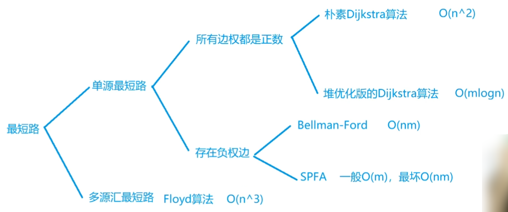
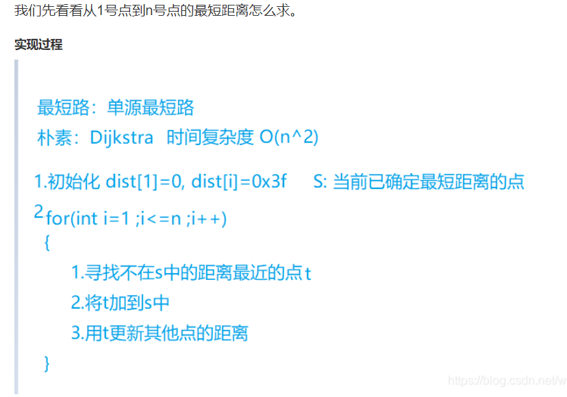
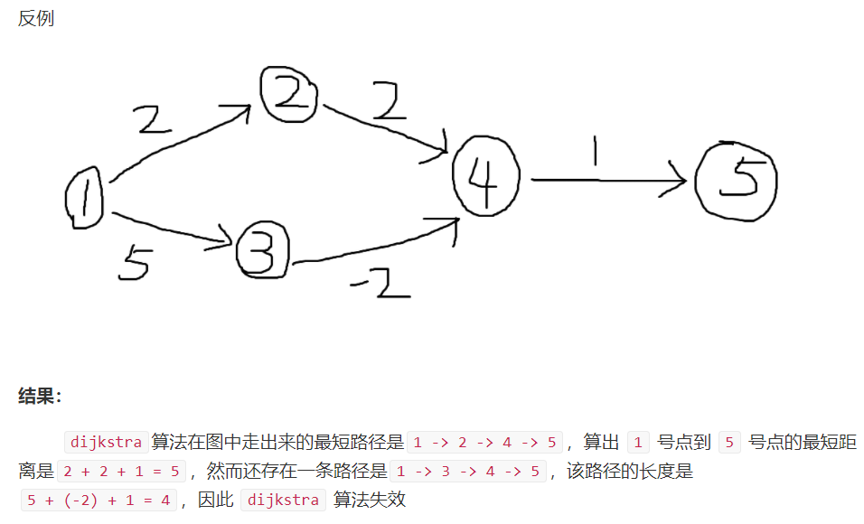
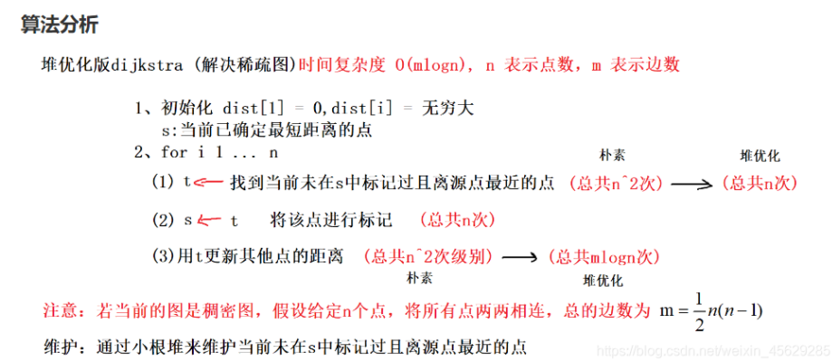

## 3.6：最短路

图上两点之间最短的距离就是最短路。求最短路的算法有很多种。

最短路一般分为单源最短路和多源汇最短路。

源点也就是起点，汇点也就是终点。

<!--more-->

最短路问题的**考察重点**在于**如何将问题抽象建图**，而不在算法的正确性。（说白了多背模板）

最短路问题不考虑有向图和无向图的区别，因为无向图就是一种特殊的有向图。

本文将注重算法实现，而不会细讲算法原理，原理有兴趣的可以了解。




其中n表示点数，m表示边数。

稠密图(m~n^2同一级别)用朴素版的Dijkstra算法，稀疏图(m~n同一级别)用堆优化版的Dijkstra算法。

### 3.6.1：朴素版Dijkstra 算法

用来求有权图的单源最短路径的算法，基于贪心思想。

这种算法只适用于**非负权图**，但是时间复杂度非常优秀。

参考笔记： https://www.acwing.com/blog/content/4973/。（非常棒！）

参考文章： https://zhuanlan.zhihu.com/p/161384831。

y总讲解：https://www.acwing.com/video/24/ 20:10。（讲得很细致了）

需要求两距离的最小值，所以距离初始化为INF。



实际上最外层循环只需要执行n-1次，因为1号点在循环外已经加入了st集合，每次循环加入1个点。

松弛操作：图论术语。

对于一条从顶点u指向顶点v的边u-->v来说，如果满足 **d[u]+w(u,v)<d[v]**,就更新`d[v]`,使得`d[v]=d[u]+w(u,v)`；这就是对边u-->v的一次松弛操作；

其中，w(u,v)表示边的权重，d(u)表示源s到达顶点u的最短距离(目前已知)

d(u)也就是用来描述从源点s到u的最短路径上权值的上界，称为最短路径估计。

在for循环中，每次用新加入的t来更新到其他点的距离，也就是边的松弛操作。

Dijkstra 算法需要对图中每条边进行一次边松弛操作。

**存储方式**：朴素版Dijkstra 算法适用于稠密图，而稠密图一般用邻接矩阵来存储。

**例题：849. Dijkstra求最短路 I（模板题）**

```C++
给定一个 n 个点 m 条边的有向图，图中可能存在重边和自环，所有边权均为正值。
请你求出 1 号点到 n 号点的最短距离，如果无法从 1 号点走到 n 号点，则输出 −1。

输入格式
第一行包含整数 n 和 m。
接下来 m 行每行包含三个整数 x,y,z，表示存在一条从点 x 到点 y 的有向边，边长为 z。

输出格式
输出一个整数，表示 1 号点到 n 号点的最短距离。
如果路径不存在，则输出 −1。

数据范围
1≤n≤500,
1≤m≤10^5,
图中涉及边长均不超过10000。

输入样例：
3 3
1 2 2
2 3 1
1 3 4
输出样例：
3
```

本题需要特殊处理重边，自环显然不可能出现在最短路中，重边只需要保留权值最小的边。

自环对朴素版Dijkstra没有任何影响（不可能出现在最短路），只要不是负数就行，要求是非负权图。

时间复杂度：O(n^2+m)。

```C++
#include <iostream>
#include <cstring>
#include <algorithm>
using namespace std;
#define IOS \
    ios::sync_with_stdio(false); \
    cin.tie(0); \
    cout.tie(0)
const int N = 510;// 图的点数
int g[N][N];// 邻接矩阵存储图，边权
bool s[N];// 判断节点i是否在最短路集合s中
int d[N];
int n,m;

int dijkstra()  // 求1号点到n号点的最短路距离，如果从1号点无法走到n号点则返回-1
{
    memset(d, 0x3f, sizeof d);// 距离初始化为INF
    d[1] = 0;// 1号点距离为0
    
    for (int i = 1;i < n;i ++){//n次迭代，每次寻找1个不在s中距离最近的点t
        int t = -1;// 初始化为-1，方便更新第一个点
        // 找到所有s[j] = false的点中d最小的一个点t
        for (int j = 1;j <= n;j ++)// 注意是!s[j]，里面不是t
            if (!s[j] && (t == -1 || d[j] < d[t])) t = j;// 找到不在s中且距离最近的点
        s[t] = true;// 将t放入最短路集合s中
        for (int j = 1; j <= n; j ++ )// 用t更新其他点的距离
            d[j] = min(d[j],d[t] + g[t][j]);// 边松弛
    }
    if (d[n] == 0x3f3f3f3f) return -1;// n号点的距离未更新，说明没有路径到达
    return d[n];
}


int main(){
    IOS;
    
    cin >> n >> m;
    memset(g,0x3f,sizeof g);// 邻接矩阵初始化INF，因为要求min
    int x,y,z;
    for (int i = 0;i < m;i ++){
        cin >> x >> y >> z;
        g[x][y] = min(g[x][y],z);// 存储x-->y的有向边，重边取最小值
    }
    
    cout << dijkstra() << '\n';
    return 0;
}
```

可以加上`if (t == n) break;`找到n的最短路，就退出。

其实dijkstra的最外层循环可以改成`for (int i = 1;i < n;i ++)`，只需要n-1次循环，因为第n次循环最后更新的边距离是最远的，它无法用来更新其他点的距离。

初始化时，`g[i][i]`应该设为0会比较好，**这样能去掉自环**，但不初始化也没关系。因为题目中说所有边权都是正的，所以 `dist[i] + g[i][i]` 一定大于 dist[i]，所以i->i这条边一定不会被用到。(权值>=0的自环不影响)

本题的INF最好取0x3f，取0x7f的话两个INF相加可能溢出。

为什么dijkstra不能处理负权图？

因为dijkstra不会更新已经确定的点，这是因为dijkstra是基于贪心做的，也就是它只会贪当前最小的，因为在没有负权值路径的情况下，后面绝对不会出现比我当前这个路径更优的路径，而负权值的出现会导致我无法确定是当前路径最优还是走另一个带负权值的路径最优，这就需要不断更新路径来比较，就有了spfa。

松弛操作对正权边所具有单调性，而负边权破坏了这种单调性，从而不能保证当前d最小的点可以放入s集合中。



### 3.6.2：堆优化版Dijkstra 算法

**例题：850. Dijkstra求最短路 II（模板题）**

```C++
给定一个 n 个点 m 条边的有向图，图中可能存在重边和自环，所有边权均为非负值。
请你求出 1 号点到 n 号点的最短距离，如果无法从 1 号点走到 n 号点，则输出 −1。

输入格式
第一行包含整数 n 和 m。
接下来 m 行每行包含三个整数 x,y,z，表示存在一条从点 x 到点 y 的有向边，边长为 z。

输出格式
输出一个整数，表示 1 号点到 n 号点的最短距离。
如果路径不存在，则输出 −1。

数据范围
1≤n,m≤1.5×10^5,
图中涉及边长均不小于 0，且不超过 10000。

输入样例：
3 3
1 2 2
2 3 1
1 3 4
输出样例：
3
```

n和m一个级别，稀疏图，采用堆优化版Dijkstra算法。



堆优化可以手写堆，也可以用优先队列。STL优先队列不支持修改任意元素，只能插入新元素。

这里不需要处理重边，因为小根堆会保证每次取出边权小的边。

数组模拟邻接表需要多维护一个权值数组。

```C++
#include <iostream>
#include <cstring>
#include <queue>
#include <vector>
#include <algorithm>
using namespace std;
typedef pair<int, int> PII;
#define IOS \
    ios::sync_with_stdio(false); \
    cin.tie(0); \
    cout.tie(0)
const int N = 1e6;
int h[N], w[N],e[N], ne[N], idx;
bool s[N];
int d[N];
int n,m;

void add(int a, int b, int c)  // 添加一条边a->b，边权为c
{
    e[idx] = b, w[idx] = c, ne[idx] = h[a], h[a] = idx ++ ;
}

int dijkstra(){
    priority_queue<PII,vector<PII>,greater<PII>> heap;// 定义小根堆heap
    memset(d, 0x3f, sizeof d);
    d[1] = 0;// 这步不能忘
    heap.push({0,1});// 分别存放距离，顶点编号，因为对距离排序
    
    while (heap.size()){
        PII t = heap.top();
        heap.pop();// 取出堆顶并弹出，已经用过
        int ver = t.second,dist = t.first;
        if (s[ver]) continue;// 找到当前未在s中且距离d最小的点ver
        if (ver == n) break;// 优化判断
        s[ver] = true;// 将ver放入最短路集合s中
        for (int i = h[ver]; ~i;i = ne[i]){// 遍历ver的出边
            int j = e[i];
            if (s[j]) continue;// j以及放入了最短路集合s中，没必要再计算距离
            if (d[j] > d[ver] + w[i]){// 更新其他点的距离
                d[j] = d[ver] + w[i];// 边松弛
                heap.push({d[j],j});// 更新距离的点插入堆中
            }
        }
    }
    if (d[n] == 0x3f3f3f3f) return -1;
    return d[n];
}


int main(){
    IOS;
    
    cin >> n >> m;
    
    memset(h, -1, sizeof h);
    while (m -- ){
        int x,y,z;
        cin >> x >> y >> z;
        add(x, y, z);
    }
    cout << dijkstra() << '\n';
    return 0;
}
```

时间复杂度：O(m*logn)。

首先看while循环次数，就是q.size() 的大小，q.size()的大小由内层循环q.push()决定，push是在遍历边时才可能发生的，最多等于边数，所以外层最多m次；内层循环，q.pop() 最坏时O(lgm); 总的循环次数： m(lgm) + m; 然后 m < n^2; 所以 lgm < 2lgn; 所以时间复杂度可以写成 O(mlogn); 如果变数m很大，接近n^2的话，就不如朴素的了。

最后，放上**y总名言：算法光靠理解是没用的，过两天就忘了，要多写！**

图论的几个算法要常写常练！