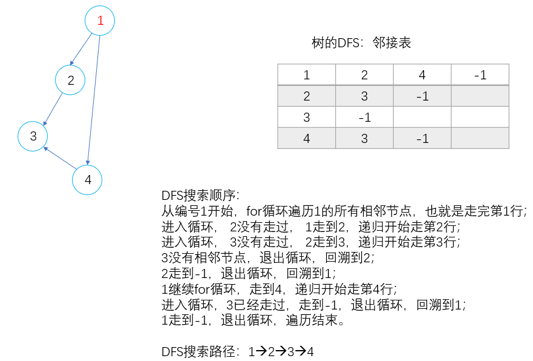
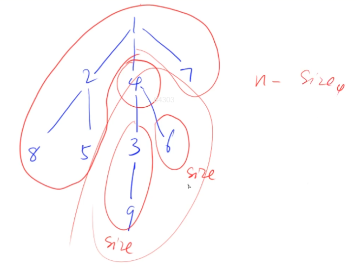

## 3.2：BFS

蓝桥杯（十八）中介绍过广度优先搜索（BFS）。

**BFS所求出来的路径就是最短路径！**

而DFS要求最短路径需要遍历所有可行路径求最小值。（太慢了！）

推荐资料： 极客时间[《数据结构与算法之美》](https://time.geekbang.org/column/article/70891)专栏。

<!--more-->

关于为什么BFS走到的路径一定是最短路径的解释？

在 BFS 中，我们使用了数据结构中的一个队列（queue），我们知道队列的特性是 FIFO（First In First Out），也就是先进先出。正是这个 FIFO 特性，保证了我们第一个到达目标节点一定是最短路径。

首先，我们将起点入队。然后每次入队出队，我们将队头所能拓展的相邻点都入队，就能找到这些点到起点的最短路。第一次操作，能找到距离起点为1的所有路径；第二次，能找到距离为2的所有路径；反复入队出队，就能找到到达终点的最短路。而且在搜索过程中维护的dist数组，能够保证每个节点到起点的距离都是最短路。

y总视频的讲解很妙！https://www.acwing.com/video/21/ 1:01:03，手动模拟过程能加深理解！

DFS和BFS都是暴力搜索，时间复杂度都比较高。

BFS只能求解边权为1（等权图）的最短路问题，如果边权不是1需要专门的最短路算法。

**例题：844. 走迷宫（模板题）**

```C++
给定一个 n×m 的二维整数数组，用来表示一个迷宫，数组中只包含 0 或 1，其中 0 表示可以走的路，1 表示不可通过的墙壁。
最初，有一个人位于左上角 (1,1) 处，已知该人每次可以向上、下、左、右任意一个方向移动一个位置。
请问，该人从左上角移动至右下角 (n,m) 处，至少需要移动多少次。
数据保证 (1,1) 处和 (n,m) 处的数字为 0，且一定至少存在一条通路。

输入格式
第一行包含两个整数 n 和 m。
接下来 n 行，每行包含 m 个整数（0 或 1），表示完整的二维数组迷宫。

输出格式
输出一个整数，表示从左上角移动至右下角的最少移动次数。

数据范围
1≤n,m≤100
输入样例：
5 5
0 1 0 0 0
0 1 0 1 0
0 0 0 0 0
0 1 1 1 0
0 0 0 1 0
输出样例：
8
```

BFS数组模拟队列。

```C++
#include <cstdio>
#include <iostream>
#include <cstring>
using namespace std;
typedef pair<int, int> PII;

const int N = 110;
char g[N][N];
int d[N][N];
PII q[N*N];
int n,m;

int bfs(){// 数据保证一定有解
    q[0] = {0,0};// 队列原始状态:head=0,tail=-1
    int head = 0,tail = 0;// 队头插入起点,tail=0
    
    memset(d,-1,sizeof d);// 距离数组置为-1
    d[0][0] = 0;// 初始化起点距离
    int dx[4] = {-1, 0, 1, 0}, dy[4] = {0, 1, 0, -1};// 坐标偏移量
    
    while (head <= tail){// 当队列不空
        auto t = q[head++];// 取出队头并将其出队
        
        for (int i = 0;i < 4;i ++){// 拓展四个方向的可行节点
            int x = t.first + dx[i],y = t.second + dy[i];
            if (x >=0 && x < n && y >= 0 && y < m && g[x][y] == '0' && d[x][y] == -1){
                d[x][y] = d[t.first][t.second] + 1;// 更新距离
                if (x == n-1 && y == m-1) return d[x][y];
                q[++tail] = {x,y};// 拓展节点从队尾入队
            }
        }
    }
    return d[n-1][m-1];
}
int main(){
        
    scanf("%d%d", &n, &m);
    
    for (int i = 0;i < n;i ++)
        for (int j = 0;j < m;j ++) scanf(" %c", &g[i][j]);
    
    printf("%d\n",bfs());
    return 0;
}
```

queue实现BFS。

```C++
// 把数组q替换成queue即可。
queue<PII> q;
q.push({0,0});
while (q.size()){
    PII t = q.front();
    q.pop();
    xxx;  
}
```

如何打印最短路径？

只需要维护一个Prev数组。

完整程序： https://www.acwing.com/problem/content/submission/code_detail/7182559/。

```C++
// 先把if (x == n-1 && y == m-1) return d[x][y];注释掉
PII Prev[N][N];// 开一个全局数组，指向节点的前一个节点，记录坐标
Prev[x][y] = t;// 在d[x][y] = d[t.first][t.second] + 1;之后加上，记录父节点
// 在while (head <= tail)之后，return之前倒序打印路径
int x = n-1,y = m-1;
while (x || y){
    cout << x << ' ' << y << '\n';
    PII t = Prev[x][y];
    x = t.first,y = t.second;
}
cout << 0 << ' ' << 0 << '\n';
```

## 3.3：树与图的遍历

树与图的存储方式：在蓝桥杯（二一）有过介绍。

树是一种特殊的图（无环连通图），无向图又可以看成加双边的有向图，所以存储方式都参照有向图。

1.邻接矩阵（适合稠密图），空间复杂度：O(n*n)，浪费空间

2.邻接表（适合稀疏图），最常用，两种实现方式

- vector
- 单链表

稠密图：包含很多边；稀疏图：包含较少边。

推荐文章： https://www.cnblogs.com/linfangnan/p/12745834.html。

邻接表y总模板。

```C++
// 对于每个点k，开一个单链表，存储k所有可以走到的点。h[k]存储这个单链表的头结点
M = N * 2;
int h[N], e[M], ne[M], idx;

// 添加一条边a->b
void add(int a, int b)
{
    e[idx] = b, ne[idx] = h[a], h[a] = idx ++ ;
}

// 初始化
idx = 0;
memset(h, -1, sizeof h);// 链表的头节点都指向-1
```

DFS遍历图，每个点只走一次。

DFS与BFS遍历图的时间复杂度都是：O(n+m)，n是点数，m是边数。

```C++
bool st[N];
void dfs(int u){
    st[u] = true;// 标记u被遍历过
    for (int i = h[u]; ~i;i = ne[i]){// 将编号i的所有相邻节点走一遍
        int j = e[i];// 编号i到j有一条边
        if (!st[j]) dfs(j);// 如果i没走过，往下搜索j的所有相邻节点
    }
}
```



idx：作用类似指针，每条边都唯一对应idx值。

h[i]：表示每个节点i的单链表起始idx值，e[i]：表示有向边a-->b的终点b的编号，ne[i]：表示i指向的下一个位置的idx值。

**例题1：846. 树的重心（模板题）**

```C++
给定一颗树，树中包含 n 个结点（编号 1∼n）和 n−1 条无向边。
请你找到树的重心，并输出将重心删除后，剩余各个连通块中点数的最大值。
重心定义：重心是指树中的一个结点，如果将这个点删除后，剩余各个连通块中点数的最大值最小，那么这个节点被称为树的重心。

输入格式
第一行包含整数 n，表示树的结点数。
接下来 n−1 行，每行包含两个整数 a 和 b，表示点 a 和点 b 之间存在一条边。

输出格式
输出一个整数 m，表示将重心删除后，剩余各个连通块中点数的最大值。

数据范围
1≤n≤10^5
输入样例
9
1 2
1 7
1 4
2 8
2 5
4 3
3 9
4 6
输出样例：
4
```

首先手动模拟一下样例。

如何求将每个点删除之后剩余连通块点数的最大值？

采用DFS，DFS可以求出每个点的子树的大小。



以节点4为例，在DFS的时候可以求出4的每个分支的点数，回溯时就能求出以4为根的子树的点数，然后

4以上的连通块的点数=n-Size4。只要比较一下，就能求出删除节点4之后的剩余连通块点数的最大值。

```C++
#include <iostream>
#include <cstring>
#include <algorithm>
using namespace std;
#define IOS \
    ios::sync_with_stdio(false); \
    cin.tie(0); \
    cout.tie(0)
const int N = 1e5+ 5,M = 2*N;
int n;
int h[N],e[M],ne[M],idx;
bool st[N];
int ans = 0x3f3f3f3f;// 答案初始化为INF

void add(int a,int b){
    e[idx] = b,ne[idx] = h[a],h[a] = idx ++;
}

int dfs(int u){
    st[u] = true;
    
    int res  = 0,sum = 1;// res表示删除u之后剩余连通块点数的最大值，sum表示以u为根的子树大小
    for (int i = h[u]; ~i;i = ne[i]){
        int j = e[i];
        if (!st[j]){
            int s = dfs(j);// s表示以u的每个儿子为根的子树大小
            res = max(res,s);
            sum += s;
        }
    }
    res = max(res,n - sum);// n-sum表示u之上的连通块点数
    ans = min(ans,res);
    return sum;
}

int main(){
    IOS;
    
    memset(h, -1, sizeof h);// h数组置为-1
    cin >> n;
    int a,b;
    for (int i = 0;i < n-1;i ++){
        cin >> a >> b;
        add(a, b),add(b,a);
    }
    
    dfs(1);
    cout << ans << '\n';
    return 0;
}
```
