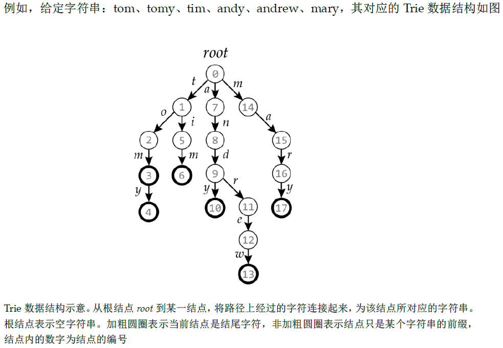
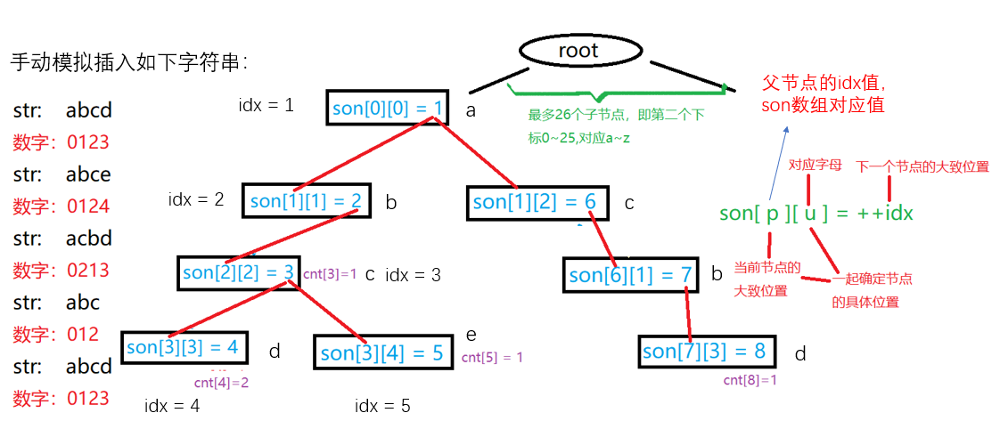

## 2.4：练习

### 2.4.1双指针.acwing.800. 数组元素的目标和（模板题）

<!--more-->

```C++
给定两个升序排序的有序数组 A 和 B，以及一个目标值 x。
数组下标从 0 开始。
请你求出满足 A[i]+B[j]=x 的数对 (i,j)。
数据保证有唯一解。

输入格式
第一行包含三个整数 n,m,x，分别表示 A 的长度，B 的长度以及目标值 x。
第二行包含 n 个整数，表示数组 A。
第三行包含 m 个整数，表示数组 B。

输出格式
共一行，包含两个整数 i 和 j。

数据范围
数组长度不超过 10^5。
同一数组内元素各不相同。
1≤数组元素≤10^9
输入样例：
4 5 6
1 2 4 7
3 4 6 8 9
输出样例：
1 1
```

算法1：二分。时间复杂度：O(n*logn)。

```C++
#include <iostream>
#include <algorithm>
using namespace std;
const int N = 1e5+5;
int a[N],b[N];
// 在b中查找值等于x的下标，找到返回true，下标为l，否则返回false
bool search(int &l,int &r,int x){// l和r传引用，需要修改值并输出
    while (l < r){
        int mid = l + r >> 1;
        if (b[mid] >= x) r = mid;
        else l = mid + 1;
    }
    return b[l] == x;
}

int main(){
    ios::sync_with_stdio(false);
    cin.tie(0);
    cout.tie(0);
    
    int n,m,x;
    cin >> n >> m >> x;
    for (int i = 0;i < n;i ++) cin >> a[i];
    for (int i = 0;i < m;i ++) cin >> b[i];
    // sort(a,a+n);题目说了是2个升序的数组
    // sort(b,b+m);
    
    for (int i = 0;i < n;i ++){
        int t = x - a[i];
        int l = 0,r = m - 1;
        if (search(l,r,t)) cout << i << " " << l; 
    }
    
    return 0;
}
```

算法2：双指针。时间复杂度：O(n*logn)。

先考虑暴力做法：

```C++
for (int i = 0;i < n;i ++)
    	for(int j = 0;j < m;j ++)
            if (a[i] + b[j] == x) cout << i << ' ' << j;
```

由于数组具有单调性，可以用双指针算法。

用指针i正向遍历a数组，然后用指针j反向遍历b数组。对于每一个a[i]，通过指针j找到第一个使得a[i]+b[j]<=x的位置j。

为什么这样做？

a[i]是逐渐变大的，要使得a[i]+b[j]=x，所以要b[j]要从大到小找，反向遍历。

```C++
#include <iostream>
using namespace std;
#define IOS \
    ios::sync_with_stdio(false); \
    cin.tie(0); \
    cout.tie(0)
const int N = 1e5+ 5;
int a[N],b[N];
int n,m,x;

int main(){
    IOS;
    cin >> n >> m >> x;
    
    for (int i = 0;i < n;i ++) cin >> a[i];
    for (int i = 0;i < m;i ++) cin >> b[i];
    
    for (int i = 0,j = m - 1;i < n;i ++){
        while (j > 0 && a[i] + b[j] > x) j --;// 如果改成j>=0会导致越界，j>0则不会
        if (a[i] + b[j] == x){
            cout << i << ' ' << j;
            break;// 题目保证有唯一解
        }
    }
    return 0;
}
```

二分和双指针的区别：

对于每个a[i]，二分是从b数组的两边找到答案，而双指针从b数组的右边往左找到答案，所以双指针更快。暴力做法是每次都从头找答案，最慢。

### 2.4.2双指针.acwing.2816. 判断子序列（模板题）

```C++
给定一个长度为 n 的整数序列 a1,a2,…,an 以及一个长度为 m 的整数序列 b1,b2,…,bm。
请你判断 a 序列是否为 b 序列的子序列。
子序列指序列的一部分项按原有次序排列而得的序列，例如序列 {a1,a3,a5} 是序列 {a1,a2,a3,a4,a5} 的一个子序列。

输入格式
第一行包含两个整数 n,m。
第二行包含 n 个整数，表示 a1,a2,…,an。
第三行包含 m 个整数，表示 b1,b2,…,bm。

输出格式
如果 a 序列是 b 序列的子序列，输出一行 Yes。

否则，输出 No。

数据范围
1≤n≤m≤10^5,
−10^9≤ai,bi≤10^9
输入样例：
3 5
1 3 5
1 2 3 4 5
输出样例：
Yes
```

本题也是一道非常经典的双指针应用题。

和KMP的匹配有点像，KMP是连续的子串，本题是不连续的。

1.j指针用来扫描整个a数组，i指针用来扫描b数组。若发现`a[j]==b[i]`，则让j指针后移一位。

2.整个过程中，i指针随for循环不断后移，而j指针只有当匹配成功时才后移一位，若最后若j==n，则说明匹配成功。

```C++
// 参考Bug-Free同学后的题解
#include <iostream>
using namespace std;
#define IOS \
    ios::sync_with_stdio(false); \
    cin.tie(0); \
    cout.tie(0)
const int N = 1e5+5;
int n,m;
int a[N],b[N];

int main(){
    IOS;
    cin >> n >> m;
    
    for (int i = 0;i < n;i ++) cin >> a[i];
    for (int i = 0;i < m;i ++) cin >> b[i];
    
    int j = 0;// j放在循环外面，判断要用
    // i指针遍历b数组，j指针遍历a数组
    for (int i = 0; i < m; i++) {
        if (j < n && a[j] == b[i]) j ++;// 和KMP类似，这里用if，不用while
    }

    if (j == n) {// j指针走到a数组末尾说明找到子序列
        cout << "Yes" << endl;
    } else {
        cout << "No" << endl;
    }
    return 0;
}
// y总题解
int i = 0,j = 0;
while (i < n && j < m){
    if (a[i] == b[j]) i ++;// 匹配成功i指针再往后走
    j ++;// 不管匹配是否成功j指针都必须往后走
}

if (i == n) xxx
```

补充，关于双指针用if和while的区别的解释：

前两到模板题中，我们需要先固定一个指针，然后另一个指针去连续的判断一段区间，需要while()循环。换句话说，while()循环用来解决**连续一段区间**的判断问题，而这道题中我们需要对a数组和b数组的每一位，逐位去进行比较判断，i指针不断后移，而j指针只有当匹配成功时才后移一位，它不是连续一段区间的判断。而KMP的字符串匹配用if也是一样的原因。

## 2.5：字典树：Trie

参考资料：Programming Challenges。

字典树，英文名 trie。顾名思义，就是一个像字典一样的树，用来高效地查找和存储字符串集合的数据结构。

它主要支持两种操作：插入一个字符串以及查询一个字符串是否存在。


Trie用到的字符串一般都是格式较统一的一些短文本串。



字符串结尾标记不都是在叶子节点上。

**例题：835. Trie字符串统计（模板题）**

```C++
维护一个字符串集合，支持两种操作：
I x 向集合中插入一个字符串 x；
Q x 询问一个字符串在集合中出现了多少次。
共有 N 个操作，输入的字符串总长度不超过 10^5，字符串仅包含小写英文字母。

输入格式
第一行包含整数 N，表示操作数。
接下来 N 行，每行包含一个操作指令，指令为 I x 或 Q x 中的一种。

输出格式
对于每个询问指令 Q x，都要输出一个整数作为结果，表示 x 在集合中出现的次数。
每个结果占一行。

数据范围
1≤N≤2∗10^4
输入样例：
5
I abc
Q abc
Q ab
I ab
Q ab
输出样例：
1
0
1
```

参考题解： https://www.acwing.com/solution/content/14695/。（图解很赞！）

Tire树本质上是一个**多叉树**，最多可以分多少叉呢？因为此题存的都是小写字母，所以是26叉。

`son[N][26]`这个数组的第一维表示每次父节点对应的idx值，第二维表示子节点（当前节点）对应的字母，每个父节点最多扩展出26个字母，有重复插入字母会被cnt数组记录，所以最多只需要26个。

画个图理解一下：



注意：idx为0的节点既表示根节点，也表示空节点！没有被插入的节点对应的son数组值、idx都是0。

每次插入一个新字符串str，都需要从p=0（根节点）处开始遍历。

son数组的作用其实就和ne数组在链表中作为指针索引类似。

感概一句，数组真的NB，什么东西都能模拟出来！

```C++
#include <iostream>
using namespace std;
#define IOS \
    ios::sync_with_stdio(false); \
    cin.tie(0); \
    cout.tie(0)
const int N = 1e5+ 5;
// son[x][i]：表示idx = x的节点的第i+1个孩子的idx值
int son[N][26],cnt[N],idx;// 下标是0的点，既是根节点，又是空节点
char str[N];

void insert(char* str){
    int p = 0;// 类似指针，指向当前节点
    for (int i = 0; str[i]; i ++){
        int u = str[i] - 'a';// 将小写字母转换成整数u方便下标处理
        if (!son[p][u]) son[p][u] = ++ idx;// 没有该子节点就创建一个
        // 此时的p就是str中最后一个字符对应的trie树的位置idx
        p = son[p][u];// 走到p的子节点
    }
    
    cnt[p] ++;
}

int query(char* str){
    int p = 0;
    for (int i = 0; str[i];i ++){
        int u = str[i] - 'a';
        if (!son[p][u]) return 0;// 该节点不存在，即该字符串不存在
        p = son[p][u];
    }
    
    return cnt[p];// 返回字符串出现的次数
}

int main(){
    IOS;
    
    int n;
    cin >> n;
    char op[2];// 注意开到2，读入的是"I\0"
    
    while (n--){
        cin >> op >> str;
        
        if (op[0] == 'I') insert(str);
        else cout << query(str) << '\n';
    }
    return 0;
}
```

