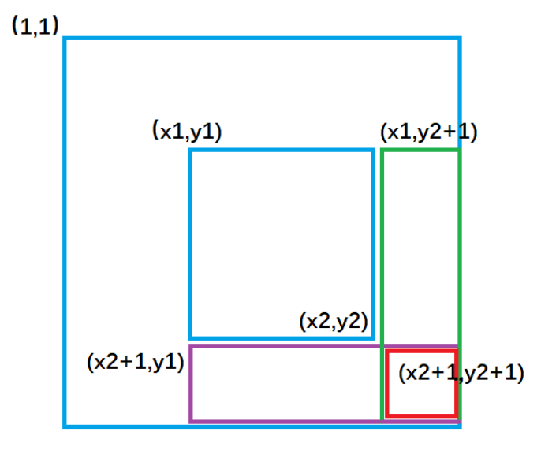

## 1.5：前缀和

前缀和知识在蓝桥杯系列（七）、（八）中有详细讲解。

这里简单回顾一下。

一维前缀和 —— 模板题 AcWing 795. 前缀和

```C++
S[i] = a[1] + a[2] + ... a[i]
a[l] + ... + a[r] = S[r] - S[l - 1]
```

预处理时间复杂度：O(n)，每次查询时间复杂度：O(1)。

```C++
#include <cstdio>
using namespace std;
typedef long long LL;
const int N = 100010;
int a[N];
LL s[N];
int n,m;

int main(){
    scanf("%d%d",&n,&m);
    for (int i = 1;i <= n;i++){
        scanf("%d",&a[i]);
        s[i] = s[i-1] + a[i];// 前缀和初始化
    }
    int l,r;
    while (m--){
        scanf("%d%d",&l,&r);
        printf("%lld\n",s[r] - s[l-1]);// [l,r]s区间和计算
    }
    return 0;
}
```

二维前缀和 —— 模板题 AcWing 796. 子矩阵的和

```C++
S[i, j] = 第i行j列格子左上部分所有元素的和
求前缀和矩阵：预处理
s[i][j] = s[i-1][j]+s[i][j-1]-s[i-1][j-1]+a[i][j];
以(x1, y1)为左上角，(x2, y2)为右下角的子矩阵的和为：
S[x2, y2] - S[x1 - 1, y2] - S[x2, y1 - 1] + S[x1 - 1, y1 - 1]
```

预处理时间复杂度：O(n*m)，每次查询时间复杂度：O(1)。

```C++
#include <cstdio>
using namespace std;

const int N = 1010;
int n,m,q;
int a[N][N],s[N][N];

int main(){
    scanf("%d%d%d",&n,&m,&q);
    // 预处理前缀和数组
    for (int i = 1;i <= n;i++)
        for (int j = 1;j <= m;j++){
            scanf("%d",&a[i][j]);
            s[i][j] = s[i][j-1] + s[i-1][j] - s[i-1][j-1] + a[i][j];
        }
        
    // 子矩阵和计算
    int x1,y1,x2,y2;// [x1,y1]到[x2,y2]的子矩阵的和
    while (q--){
        scanf("%d%d%d%d",&x1,&y1,&x2,&y2);
        printf("%d\n",s[x2][y2]-s[x1-1][y2]-s[x2][y1-1]+s[x1-1][y1-1]);
    }
    return 0;
}
```

## 1.6：差分

差分知识在蓝桥杯系列（二九）中有详细讲解。

这里简单回顾一下。

差分是前缀和的逆运算。

一维差分 —— 模板题 AcWing 797. 差分

```C++
给区间[l, r]中的每个数加上c：B[l] += c, B[r + 1] -= c
对于给定数组a的修改查询，构造差分数组b，数组a就是数组b的前缀和数组
// 计算前缀和并输出修改之后的数组
a[i] = a[i-1] + b[i];// 先修改，再查询，不能合成一步或者调换顺序
```

```C++
#include <cstdio>
using namespace std;
const int N = 100010;

int n,m;
int a[N],b[N];

void insert(int l,int r,int c){
    b[l] += c,b[r+1] -= c;
}

int main(){
    scanf("%d%d",&n,&m);
    for (int i = 1;i <= n;i++){
        scanf("%d",&a[i]);
        insert(i,i,a[i]);// 差分数组初始化
    }
    
    int l,r,c;
    while (m--){
        scanf("%d%d%d",&l,&r,&c);
        insert(l,r,c);
    }
    
    for (int i = 1;i <= n;i++){
        b[i] += b[i-1];// 先修改，再查询
        printf("%d ",b[i]);// 求前缀和并输出
        // 两种方式等价
        // a[i] = a[i-1] + b[i];
        // printf("%d ",a[i]);
    }
    return 0;
}
```

二维差分 —— 模板题 AcWing 798. 差分矩阵

```C++
给以(x1, y1)为左上角，(x2, y2)为右下角的子矩阵中的所有元素加上c：
S[x1, y1] += c, S[x2 + 1, y1] -= c, S[x1, y2 + 1] -= c, S[x2 + 1, y2 + 1] += c
// 求b[1][1]到b[i][j]的前缀和a[i][j]并输出修改之后的数组
a[i][j] = a[i-1][j] + a[i][j-1] - a[i-1][j-1] + b[i][j];
```



```C++
#include <cstdio>
using namespace std;

const int N = 1010;
int a[N][N],b[N][N];
int n,m,q;

void insert(int x1,int y1,int x2,int y2,int c){
    b[x1][y1] += c;
    b[x2+1][y1] -= c;
    b[x1][y2+1] -= c;
    b[x2+1][y2+1] += c;
}

int main(){
    scanf("%d%d%d",&n,&m,&q);
    
    for (int i = 1;i <= n;i++)
        for (int j = 1;j <= m;j++){
            scanf("%d",&a[i][j]);
            insert(i,j,i,j,a[i][j]);// 差分数组初始化
        }
    
    int x1,y1,x2,y2,c;
    while (q--){
        scanf("%d%d%d%d%d",&x1,&y1,&x2,&y2,&c);
        insert(x1,y1,x2,y2,c);
    }
    
    for (int i = 1;i <= n;i++){
        for (int j = 1;j <= m;j++){// 先修改，再查询
            b[i][j] += b[i-1][j] + b[i][j-1] - b[i-1][j-1];
            printf("%d ",b[i][j]);// 求前缀和并输出
            // 两种方式等价
            // a[i][j] = a[i-1][j] + a[i][j-1] - a[i-1][j-1] + b[i][j];
            // printf("%d ",a[i][j]);
        }
        puts("");
    }
    return 0;
}
```

## 1.7：练习

### 1.7.1快排.acwing.786.第k个数

```C++
给定一个长度为 n 的整数数列，以及一个整数 k，请用快速选择算法求出数列从小到大排序后的第 k 个数。

输入格式
第一行包含两个整数 n 和 k。
第二行包含 n 个整数（所有整数均在 1∼10^9 范围内），表示整数数列。

输出格式
输出一个整数，表示数列的第 k 小数。

数据范围
1≤n≤100000,
1≤k≤n
输入样例：
5 3
2 4 1 5 3
输出样例：
3
```

考察算法：快速选择排序。（选择数列中第k小数）


时间复杂度分析：每次递归一层会减少到一半。

`T = n + n/2 + n/4 + ... = n*(1 + 1/2 + 1/4 + ...) <= 2*n`，所以为：O(n)。

```C++
#include <cstdio>
#include <algorithm>
using namespace std;

const int N = 100010;
int a[N];
int n,k;

int quick_sort(int l,int r,int k){
    if (l >= r) return a[l];// 区间只有1个数时找到答案，也可写成l == r
    int i = l-1,j = r+1,x = a[l+r>>1];
    while (i < j){
        while (a[++i] < x);
        while (a[--j] > x);
        if (i < j) swap(a[i],a[j]);
    }
    // 取j为左右区间划分点，a[l..j] <= x,a[j+1..r] >= x，左区间数的个数sl为l到j
    int sl = j-l+1;
    if (k <= sl) return quick_sort(l,j,k);// 递归左边，右区间的第k小数
    else return quick_sort(j+1,r,k-sl);// 递归右边，右区间的第k-sl小数
}

int main(){
    scanf("%d%d",&n,&k);
    
    for (int i = 0;i < n;i++) scanf("%d",&a[i]);
    printf("%d",quick_sort(0,n-1,k));
    return 0;
}
```


