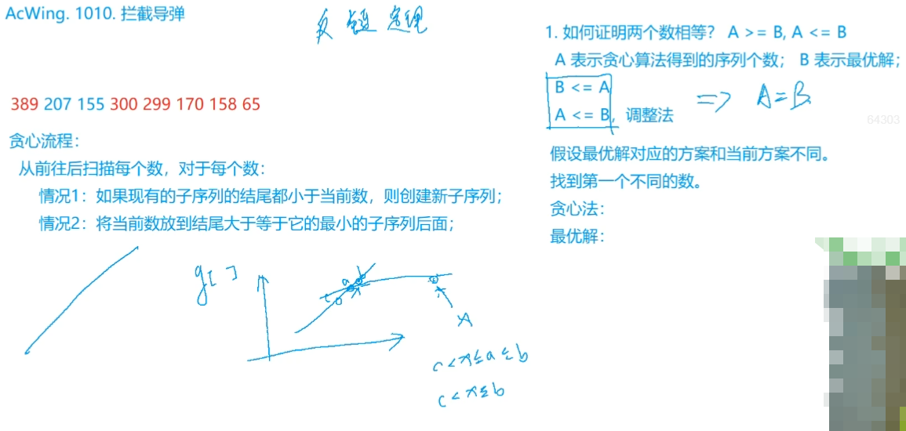
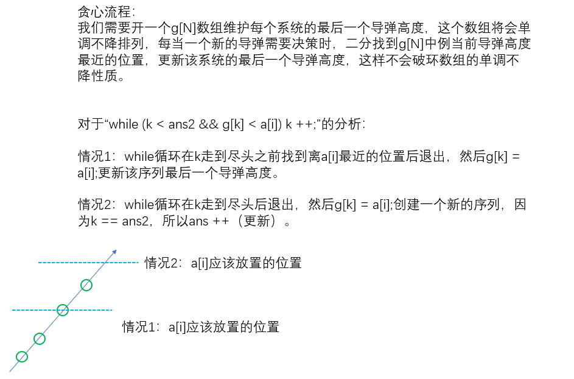

### 1012. 友好城市

<!--more-->

```C++
Palmia国有一条横贯东西的大河，河有笔直的南北两岸，岸上各有位置各不相同的N个城市。
北岸的每个城市有且仅有一个友好城市在南岸，而且不同城市的友好城市不相同。
每对友好城市都向政府申请在河上开辟一条直线航道连接两个城市，但是由于河上雾太大，政府决定避免任意两条航道交叉，以避免事故。
编程帮助政府做出一些批准和拒绝申请的决定，使得在保证任意两条航线不相交的情况下，被批准的申请尽量多。

输入格式
第1行，一个整数N，表示城市数。
第2行到第n+1行，每行两个整数，中间用1个空格隔开，分别表示南岸和北岸的一对友好城市的坐标。

输出格式
仅一行，输出一个整数，表示政府所能批准的最多申请数。

数据范围
1≤N≤5000,
0≤xi≤10000
输入样例：
7
22 4
2 6
10 3
15 12
9 8
17 17
4 2
输出样例：
4
```

本题如何转化为最长上升子序列问题呢？

不妨先画图思考一下。


什么情况下两座桥会交叉呢？

当每一边的两座城市的坐标大小关系不一致时，它们会交叉。

那么如何保证任意两座桥不会相交呢？

每座桥连接的两座城市构成一个二元组，我们先对下边的所有城市坐标从小到大排序，当对应上边的城市坐标发生逆序时，证明出现了交叉。

接下来只要保证对应上边的城市坐标构成LIS就行。

思路比较难想到。

本题采用DP+二分的LIS优化解法。

如果坐标数据很大，比较分散，还需要离散化处理。

```C++
#include <iostream>
#include <algorithm>
using namespace std;
#define fi first
#define se second
typedef pair<int, int> PII;
const int N = 5005;
PII a[N];
int d[N];

int main(){
    int n;
    cin >> n;
    
    int x,y;
    for (int i = 1;i <= n;i ++){
        cin >> x >> y;
        a[i] = {x,y};
    }
    
    sort(a + 1,a + n + 1);
    int len = 1;
    d[1] = a[1].se;
    
    for (int i = 2;i <= n;i ++){
        if (d[len] == a[i].se) continue;
        else if (d[len] < a[i].se) d[++len] = a[i].se;
        else{
            int l = 1,r = len;
            while (l < r){
                int mid = l+r>>1;
                if (d[mid] < a[i].se) l = mid + 1;
                else r = mid;
            }
            d[l] = a[i].se;
        }
    }
    
    cout << len << '\n';
    return 0;
}
```

###  1016. 最大上升子序列和

```C++
一个数的序列 bi，当 b1<b2<…<bS 的时候，我们称这个序列是上升的。
对于给定的一个序列(a1,a2,…,aN)，我们可以得到一些上升的子序列(ai1,ai2,…,aiK)，这里1≤i1<i2<…<iK≤N。
比如，对于序列(1,7,3,5,9,4,8)，有它的一些上升子序列，如(1,7),(3,4,8)等等。
这些子序列中和最大为18，为子序列(1,3,5,9)的和。
你的任务，就是对于给定的序列，求出最大上升子序列和。
注意，最长的上升子序列的和不一定是最大的，比如序列(100,1,2,3)的最大上升子序列和为100，而最长上升子序列为(1,2,3)。

输入格式
输入的第一行是序列的长度N。
第二行给出序列中的N个整数，这些整数的取值范围都在0到10000(可能重复)。

输出格式
输出一个整数，表示最大上升子序列和。

数据范围
1≤N≤1000
输入样例：
7
1 7 3 5 9 4 8
输出样例：
18
```

这题看起来很简单，实际上也很简单。

只要对LIS的状态表示，计算简单修改一下就行。

`f[i]`表示所有以`a[i]`结尾的子序列中和的最大值。

```C++
#include <iostream>
#include <algorithm>
using namespace std;
const int N = 1005;
int a[N],f[N];

int main(){
    int n;
    cin >> n;
    
    for (int i = 1; i <= n; i ++ ) cin >> a[i];
    
    int res = 0;
    for (int i = 1;i <= n;i ++ ){
        f[i] = a[i]; // 修改1
        for (int j = 1;j < i;j ++ ){
            if (a[j] < a[i]) f[i] = max(f[i],f[j]+ a[i]); // 修改2
        }
        res = max(res,f[i]);
    }
    cout << res << '\n';
    return 0;
}
```

### 1010. 拦截导弹

```C++
某国为了防御敌国的导弹袭击，发展出一种导弹拦截系统。
但是这种导弹拦截系统有一个缺陷：虽然它的第一发炮弹能够到达任意的高度，但是以后每一发炮弹都不能高于前一发的高度。
某天，雷达捕捉到敌国的导弹来袭。
由于该系统还在试用阶段，所以只有一套系统，因此有可能不能拦截所有的导弹。
输入导弹依次飞来的高度（雷达给出的高度数据是不大于30000的正整数，导弹数不超过1000），计算这套系统最多能拦截多少导弹，如果要拦截所有导弹最少要配备多少套这种导弹拦截系统。

输入格式
共一行，输入导弹依次飞来的高度。

输出格式
第一行包含一个整数，表示最多能拦截的导弹数。
第二行包含一个整数，表示要拦截所有导弹最少要配备的系统数。

数据范围
雷达给出的高度数据是不大于 30000 的正整数，导弹数不超过 1000。

输入样例：
389 207 155 300 299 170 158 65
输出样例：
6
2
```

第一问就是**最长不升子序列问题**，题目要求之后的高度不超过前面的。

第二问就是**最少的最长不升子序列的数目**，思维不要受第一问限制，考察贪心，有难度。

对于第二问，考虑如何多个构造拦截系统。

假设对于当前导弹（高度`a[i]`），前面已经构造了多个拦截系统，每个系统都分配了一定数量的导弹。

当前导弹只有两种选择，情况1：加入到其中一个构造好的系统中；情况2：构造一个新的系统。

该怎么选呢？

考虑每个构造好的系统中的最后一个导弹高度，1.假设存在多个`>= a[i]`的导弹高度，那么在这其中（贪心）选择一个离`a[i]`最近的高度，加入这个系统中；2.假设所有导弹高度都`< a[i]`，那么就构造一个新的系统。

证明贪心策略的正确性：设贪心系统数为la，最优解系统数为lb。

目标：证明 `la == lb`。

方法：先证明`la >= lb`，再证明`la <= lb`。

具体过程见题解：  https://www.acwing.com/solution/content/52042/。

如何实现贪心流程？

我们需要开一个`g[N]`数组维护每个系统的最后一个导弹高度，这个数组将会单调不降排列，每当一个新的导弹需要决策时，二分找到`g[N]`中例当前导弹高度最近的位置，更新该系统的最后一个导弹高度，这样不会破环数组的单调不降性质。



**可以发现这样的做法和LIS问题的贪心优化解法非常相似。**

> Dilworth's theorem：对偏序集<A，≤>，设A中最长链的长度是n，则将A中元素分成不相交的反链，反链个数至少是n。

根据上述定理，把一个数列划分成**最少的最长不升子序列的数目**就等于这个数列的**最长上升子序列的长度**。

它们是对偶关系。可以把它作为一个结论记住。

y总代码：DP+贪心  $O(n^2)$

第二问可以改成二分求LIS的做法。（PS：y总这里的思路太妙了！没有利用定理结论，用贪心做法）

```C++
#include <iostream>
#include <algorithm>
using namespace std;
const int N = 1005;
int a[N],f[N],g[N];
int n;

int main(){
    int ans1 = 0,ans2 = 0;// ans2表示现有不升子序列的个数
    while (cin >> a[n]) n ++;// 导弹个数不确定，巧妙的读入方式
    
    for (int i = 0;i < n;i ++){
        // 第一问
        f[i] = 1;
        for (int j = 0;j < i;j ++){
            if (a[j] >= a[i]) 
                f[i] = max(f[i],f[j] + 1);
        }
        ans1 = max(ans1,f[i]);// ans1维护最长不升子序列长度
        // ---------------------------
        // 第二问
        int k = 0;// 当前扫描到第k个不升子序列，g[]的下标范围（也将就是k扫描的范围）是0到ans2-1
        while (k < ans2 && g[k] < a[i]) k ++;// 扫描现有不升子序列，取离a[i]最近的加入
        g[k] = a[i];
        if (k == ans2) ans2 ++; // ans2维护最少的不升子序列的个数
    }
    
    cout << ans1 << '\n' << ans2;
    return 0;
}
/*q[]的成立条件是现有的结尾元素都比当前值a[i]小才会创建新的序列，所以q排序一定是从小到大的，这样顺序查找就相当于 >= a[i]的最小的元素。*/
```



我的代码：贪心+贪心（二分）， $O(n*logn)$ 利用狄尔沃思定理的结论。

参考题解： https://www.acwing.com/solution/content/10173/。

（**详细讲解了upper/lower_bound的用法，建议看一下**）

```C++
#include <iostream>
#include <algorithm>
using namespace std;
const int N = 1005;
int a[N],f[N],g[N];
int n;

int main(){
    while (cin >> a[n]) n ++;
    
    int ans1 = 0,ans2 = 0; // 分别表示最长不升子序列长度，最长上升子序列长度
    for (int i = 0;i < n;i ++){ // 加上greater<int>()对递减数组二分
        int pos = upper_bound(f,f+ans1,a[i],greater<int>()) - f; // 找不到返回ans1
        if (pos == ans1) f[ans1++] = a[i];
        else f[pos] = a[i];
        
        pos = lower_bound(g,g+ans2,a[i]) - g;
        if (pos == ans2) g[ans2++] = a[i];
        else g[pos] = a[i];
    }
    
    cout << ans1 << '\n' << ans2;
    return 0;
}
------
// xxx
while (cin >> a[n]) n ++;

int ans1 = 1,ans2 = 1; // 分别表示最长不升子序列长度，最长上升子序列长度
f[1] = a[0],g[1] = a[0];
for (int i = 1;i < n;i ++){
    if (f[ans1] >= a[i]) f[++ans1] = a[i];
    else f[upper_bound(f+1,f+ans1,a[i],greater<int>()) - f] = a[i];

    if (g[ans2] < a[i]) g[++ans2] = a[i];
    else g[lower_bound(g+1,g+ans2,a[i]) - g] = a[i];
}
// xxx
```

