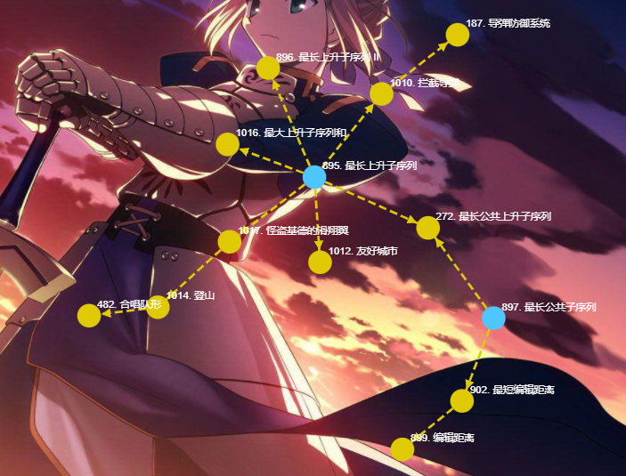

## 1.2：最长上升子序列模型

<!--more-->

> 最长上升子序列模板题见：算法基础课笔记（二四）。

建议先把两道模板题做一遍。

一个是朴素DP做法，一个是DP+二分做法。



### 1017. 怪盗基德的滑翔翼

```C++
怪盗基德是一个充满传奇色彩的怪盗，专门以珠宝为目标的超级盗窃犯。
而他最为突出的地方，就是他每次都能逃脱中村警部的重重围堵，而这也很大程度上是多亏了他随身携带的便于操作的滑翔翼。
有一天，怪盗基德像往常一样偷走了一颗珍贵的钻石，不料却被柯南小朋友识破了伪装，而他的滑翔翼的动力装置也被柯南踢出的足球破坏了。
不得已，怪盗基德只能操作受损的滑翔翼逃脱。
假设城市中一共有N幢建筑排成一条线，每幢建筑的高度各不相同。
初始时，怪盗基德可以在任何一幢建筑的顶端。
他可以选择一个方向逃跑，但是不能中途改变方向（因为中森警部会在后面追击）。
因为滑翔翼动力装置受损，他只能往下滑行（即：只能从较高的建筑滑翔到较低的建筑）。
他希望尽可能多地经过不同建筑的顶部，这样可以减缓下降时的冲击力，减少受伤的可能性。
请问，他最多可以经过多少幢不同建筑的顶部(包含初始时的建筑)？

输入格式
输入数据第一行是一个整数K，代表有K组测试数据。
每组测试数据包含两行：第一行是一个整数N，代表有N幢建筑。第二行包含N个不同的整数，每一个对应一幢建筑的高度h，按照建筑的排列顺序给出。

输出格式
对于每一组测试数据，输出一行，包含一个整数，代表怪盗基德最多可以经过的建筑数量。

数据范围
1≤K≤100,
1≤N≤100,
0<h<10000
输入样例：
3
8
300 207 155 299 298 170 158 65
8
65 158 170 298 299 155 207 300
10
2 1 3 4 5 6 7 8 9 10
输出样例：
6
6
9
```

思路：

首先要选择起点，然后要选择方向。

考虑一般性的问题，起点和方向已经选好，接下来就是求起点往这个方向最多可以经过的楼房数量。

关于起点选择问题，因为LIS问题中DP的状态表示就是：`f[i]`表示以`a[i]`结尾的LIS的长度，刚好对应以不同起点结尾的LIS的长度，本题也就转化为LIS问题。

因为只有左右两个方向，**转化为LIS和LDS问题，也可以看成正向和反向的LIS问题**。

这题考察的就是**LIS模型的抽象转化能力**。

参考题解： https://www.acwing.com/solution/content/4599/。

```C++
#include <iostream>
#include <algorithm>
using namespace std;
const int N = 105;
int a[N],f[N];

int main(){
    int k,n;cin >> k;
    while (k -- ){
        cin >> n;
        int res = 0;
        for (int i = 1; i <= n; i ++ ) cin >> a[i];
        // 正向LIS
        for (int i = 1; i <= n; i ++ ){
            f[i] = 1;
            for (int j = 1;j < i;j ++){
                if (a[j] < a[i]) f[i] = max(f[i],f[j] + 1);
            }
            res = max(res,f[i]);
        }
        // 反向LIS
        for (int i = n;i >= 1;i --){
            f[i] = 1;
            for (int j = n;j > i;j --){
                if (a[j] < a[i]) f[i] = max(f[i],f[j] + 1);
            }
            res = max(res,f[i]);
        }
        cout << res << '\n';
    }
    return 0;
}
```

### 1014. 登山

```C++
五一到了，ACM队组织大家去登山观光，队员们发现山上一共有N个景点，并且决定按照顺序来浏览这些景点，即每次所浏览景点的编号都要大于前一个浏览景点的编号。
同时队员们还有另一个登山习惯，就是不连续浏览海拔相同的两个景点，并且一旦开始下山，就不再向上走了。
队员们希望在满足上面条件的同时，尽可能多的浏览景点，你能帮他们找出最多可能浏览的景点数么？

输入格式
第一行包含整数N，表示景点数量。
第二行包含N个整数，表示每个景点的海拔。

输出格式
输出一个整数，表示最多能浏览的景点数。

数据范围
2≤N≤1000
输入样例：
8
186 186 150 200 160 130 197 220
输出样例：
4
```

本题是上一题的拓展。

第一次读题错误认为是和上题一模一样，先整体求LIS，再整体求LDS。

实际题目意思是**可以先上升再下降，或者只有上升或下降**。（注意审题）

那么接下来只要确定峰点就能确定路线。

直接枚举峰点的话，再做LIS问题，这样时间复杂度是：O(n^3)，效率较低；可以开2个数组`f[N],g[N]`，分别表示以`a[i]`结尾的从左、右开始的最长上升子序列长度，先求出`f[N],g[N]`，再计算：`f[k]+g[k]-1`，处理完LIS问题，最后枚举峰点，这样时间复杂度是：O(n^2)。

```C++
#include <iostream>
#include <algorithm>
using namespace std;
const int N = 1005;
int a[N],f[N],g[N];

int main(){
    int n;
    cin >> n;
    
    for (int i = 1; i <= n; i ++ ) cin >> a[i];
    // 正向LIS
    for (int i = 1;i <= n;i ++){
        f[i] = 1;
        for (int j = 1;j < i;j ++){
            if (a[j] < a[i]) f[i] = max(f[i],f[j]+1);
        }
    }
    // 反向LIS
    for (int i = n;i >= 1;i --){
        g[i] = 1;
        for (int j = n;j > i;j --){
            if (a[j] < a[i]) g[i] = max(g[i],g[j]+1);
        }
    }
    
    int res = 0;
    for (int k = 1;k <= n;k ++) res = max(res,f[k]+g[k]-1);// f[k]和g[k]的计算相互独立
    cout << res << '\n';
    return 0;
}
```

### 482. 合唱队形

```C++
N 位同学站成一排，音乐老师要请其中的 (N−K) 位同学出列，使得剩下的 K 位同学排成合唱队形。     
合唱队形是指这样的一种队形：设 K 位同学从左到右依次编号为 1，2…，K，他们的身高分别为 T1，T2，…，TK，  则他们的身高满足 T1<…<Ti>Ti+1>…>TK(1≤i≤K)。     
你的任务是，已知所有 N 位同学的身高，计算最少需要几位同学出列，可以使得剩下的同学排成合唱队形。

输入格式
输入的第一行是一个整数 N，表示同学的总数。
第二行有 N 个整数，用空格分隔，第 i 个整数 Ti 是第 i 位同学的身高(厘米)。

输出格式
输出包括一行，这一行只包含一个整数，就是最少需要几位同学出列。

数据范围
2≤N≤100,
130≤Ti≤230
输入样例：
8
186 186 150 200 160 130 197 220
输出样例：
4
```

本题是上一题的拓展。

同学们从左往右按编号排序，身高**可以先上升再下降，或者只有上升或下降**。

题目说最少需要几位同学出列，也就是说最多能有几位同学留在队中。

最终答案就是：`n - res`。

```C++
int main(){
    // xxx
    cout << n-res << '\n'; // 将上一题的res换成n-res
    return 0;
}
```

