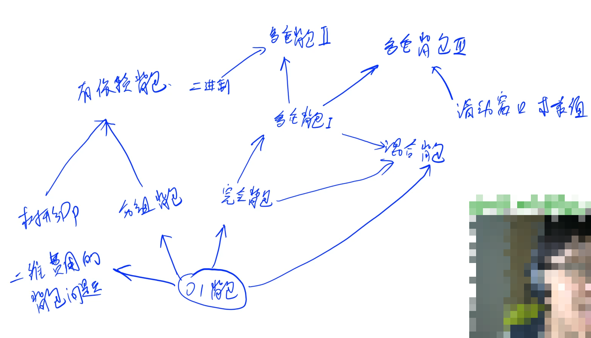
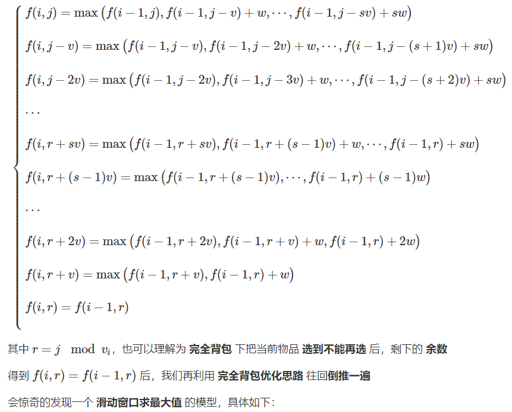
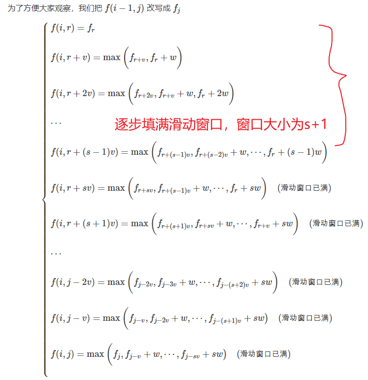
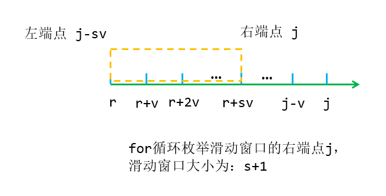

## 1.3：背包模型

<!--more-->

> 背包模板题见：蓝桥杯学习总结（十一），DP背包问题详解。

建议先把几道模板题做一遍。

背包问题优化规律：

**当空间优化成一维后，只有完全背包问题和多重背包问题的单调队列优化的体积是正向循环的，其余所有背包问题的体积都是反向循环的。**



### 423. 采药

```C++
辰辰是个天资聪颖的孩子，他的梦想是成为世界上最伟大的医师。
为此，他想拜附近最有威望的医师为师。
医师为了判断他的资质，给他出了一个难题。
医师把他带到一个到处都是草药的山洞里对他说：“孩子，这个山洞里有一些不同的草药，采每一株都需要一些时间，每一株也有它自身的价值。我会给你一段时间，在这段时间里，你可以采到一些草药。如果你是一个聪明的孩子，你应该可以让采到的草药的总价值最大。”
如果你是辰辰，你能完成这个任务吗？

输入格式
输入文件的第一行有两个整数 T 和 M，用一个空格隔开，T 代表总共能够用来采药的时间，M 代表山洞里的草药的数目。
接下来的 M 行每行包括两个在 1 到 100 之间（包括 1 和 100）的整数，分别表示采摘某株草药的时间和这株草药的价值。

输出格式
输出文件包括一行，这一行只包含一个整数，表示在规定的时间内，可以采到的草药的最大总价值。

数据范围
1≤T≤1000,
1≤M≤100
输入样例：
70 3
71 100
69 1
1 2
输出样例：
3
```

很简单，典型的01背包问题模型。

```C++
#include <iostream>
#include <algorithm>
using namespace std;
const int N = 1005;
int f[N];

int main(){
    int m,n;
    cin >> m >> n;
    
    int t,v;
    for (int i = 1;i <= n;i ++){ // 01背包滚动数组优化
        cin >> t >> v;
        for (int j = m;j  >= t;j --){
            f[j] = max(f[j],f[j-t] + v);
        }
    }
    
    cout << f[m] << '\n';
    return 0;
}
```

### 多重背包问题 III

```C++
有 N 种物品和一个容量是 V 的背包。
第 i 种物品最多有 si 件，每件体积是 vi，价值是 wi。
求解将哪些物品装入背包，可使物品体积总和不超过背包容量，且价值总和最大。
输出最大价值。

输入格式
第一行两个整数，N，V (0<N≤1000, 0<V≤20000)，用空格隔开，分别表示物品种数和背包容积。
接下来有 N 行，每行三个整数 vi,wi,si，用空格隔开，分别表示第 i 种物品的体积、价值和数量。

输出格式
输出一个整数，表示最大价值。

数据范围
0<N≤1000
0<V≤20000
0<vi,wi,si≤20000
提示
本题考查多重背包的单调队列优化方法。

输入样例
4 5
1 2 3
2 4 1
3 4 3
4 5 2
输出样例：
10
```

本题来自楼教主的男人八题，思路很有难度，数据量比较极限。

本题是对多重背包问题的进一步优化，采用单调队列（滑动窗口）优化。

参考题解： https://www.acwing.com/solution/content/53507/。（很详细）

参考图解： https://www.acwing.com/solution/content/5163/。

先来回顾一下多重背包的朴素做法。

```C++
dp[i][j] 表示将前 i 种物品放入容量为 j 的背包中所得到的最大价值
dp[i][j] = max(不放入物品 i，放入1个物品 i，放入2个物品 i, ... , 放入k个物品 i)
这里 k 要满足：k <= s, j - k*v >= 0

不放物品  i = dp[i-1][j]
放k个物品 i = dp[i-1][j - k*v] + k*w

dp[i][j] = max(dp[i-1][j], dp[i-1][j-v] + w, dp[i-1][j-2*v] + 2*w,..., dp[i-1][j-k*v] + k*w)
dp[i][j-v] = max(          dp[i-1][j-v],     dp[i-1][j-2*v] + w, ...,  dp[i-1][j-k*v] + (k-1)*w, dp[i-1][j-(k+1)*v] + k*w) 必须满足：k+1 <= s, j - (k+1)*v >= 0才有最后一项
```

由上面的两个式子，我们发现并不能推导出一个递推式。

但是可以发现下面的式子滑动一位，加上偏移量就能得到上面的式子。

**这就是一个滑动窗口模型，通过单调队列求出滑动窗口中的最大值。**

我们可以把这个式子 **继续** 推导下去，直到背包**体积被用到不能再用为止**。（递推式改成`r`的形式）



关键要理解`r`的含义。



多重背包对每种物品的数量做了限制，所以`f[i][j]`最多只能由`s+1`个式子转移而来，从`f[i][r+s*v]`及之后，滑动窗口填满，开始滑动，每滑动一位就放入单调队列。

滑动窗口在算法基础课笔记（八）中讲解过了，忘了的回去复习。

图解滑动窗口：记得滑动时要处理偏移量！偏移量由两个式子作差可以得到。



题解一：二维朴素做法。时间复杂度：O(n*m)，大概计算一下。

```C++
#include <iostream>
using namespace std;
const int N = 1005,M = 20005;
int f[N][M];
int q[M];
int m,n;

int main(){
    cin >> m >> n;
    
    int v,w,s;
    for (int i = 1;i <= m;i ++){
        cin >> v >> w >> s;
        for (int r = 0;r < v;r ++){ // r = j (mod v), j = r + x *v
            int head = 0,tail = -1; // 单调队列中存的是坐标
            for (int j = r;j <= n;j += v){ // j对应坐标轴上的坐标，跨度为 v
                while (head <= tail && q[head] < j-s*v) head ++; // 队头出队，窗口移动
                while (head <= tail && f[i-1][q[tail]] + (j-q[tail])/v*w <= f[i-1][j]) -- tail; // 维护队列单调性
                q[++tail] = j;
                f[i][j] = f[i-1][q[head]] + (j-q[head])/v*w; // 队头存的就是最大值
            }
        }
    }
    cout << f[m][n] << '\n';    
    return 0;
}
```

题解二：两层滚动数组。比题解一要慢。

```C++
#include <iostream>
using namespace std;
const int N = 1005,M = 20005;
int f[2][M];
int q[M];
int m,n;

int main(){
    cin >> m >> n;
    
    int v,w,s;
    for (int i = 1;i <= m;i ++){
        cin >> v >> w >> s;
        for (int r = 0;r < v;r ++){
            int head = 0,tail = -1;
            for (int j = r;j <= n;j += v){
                while (head <= tail && q[head] < j-s*v) head ++;
                while (head <= tail && f[(i-1)&1][q[tail]] + (j-q[tail])/v*w <= f[(i-1)&1][j]) -- tail;
                q[++tail] = j;
                f[i&1][j] = f[(i-1)&1][q[head]] + (j-q[head])/v*w;
            }
        }
    }
    cout << f[m&1][n] << '\n';    
    return 0;
}
```

题解三：一维优化。最快。

```C++
#include <iostream>
#include <cstring>
using namespace std;
const int N = 1010, M = 20010;
int n, m;
int v[N], w[N], s[N];
int f[M], g[M];
int q[M];

int main()
{
    cin >> n >> m;
    for (int i = 1; i <= n; ++ i) cin >> v[i] >> w[i] >> s[i];
    for (int i = 1; i <= n; ++ i)
    {
        memcpy(g, f, sizeof g); // 避免串联反应，记得备份
        for (int r = 0; r < v[i]; ++ r)
        {
            int hh = 0, tt = -1;
            for (int j = r; j <= m; j += v[i])
            {
                while (hh <= tt && j - q[hh] > s[i] * v[i]) hh ++ ;
                while (hh <= tt && g[q[tt]] + (j - q[tt]) / v[i] * w[i] <= g[j]) -- tt;
                q[ ++ tt] = j;
                f[j] = g[q[hh]] + (j - q[hh]) / v[i] * w[i];
            }
        }
    }
    cout << f[m] << endl;
    return 0;
}
```

多重背包一维优化中体积可以正向枚举，是背包问题中的特例。

本题不能用一般的一维优化处理，会导致串联反应（见Bellman-Ford算法），需要特殊处理：1.备份数组+一维状态表示；2.两层滚动数组。

---

完全背包也能用类似的做法解决，不同的是完全背包不需要滑动窗口，只需要维护最大值就行。

但没必要这样写，完全背包最低时间复杂度已经是O(n*m)。