## 向量范数与矩阵范数

<!--more-->

### 1范数概念的引入

为了度量线性空间中向量或矩阵的“大小”，我们引入范数。

### 2向量范数：向量的长度模

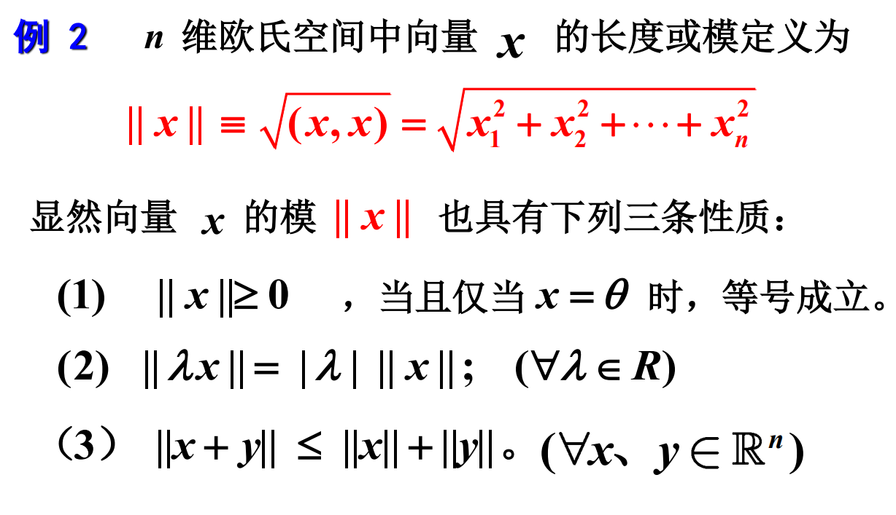

**定义：**

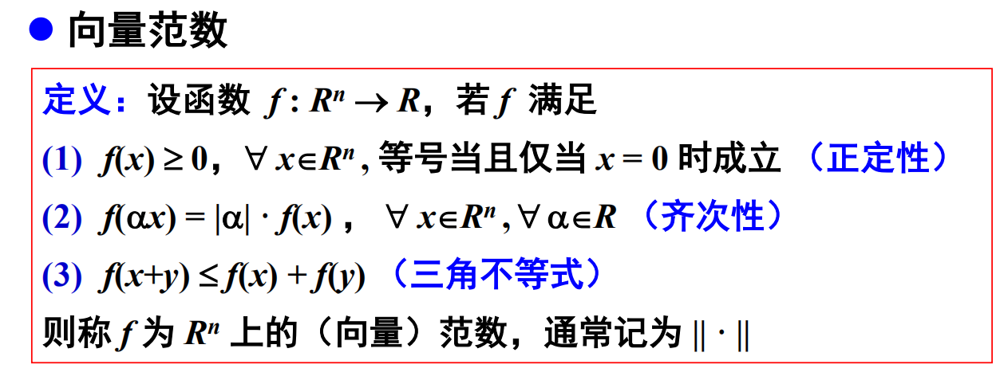

**常见的几种范数：**

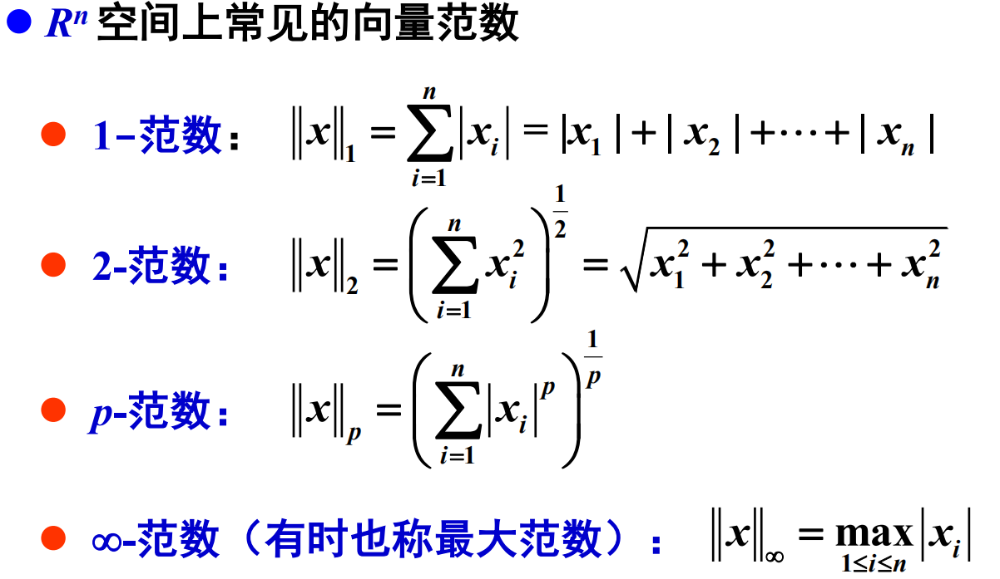

**定义向量间的距离：**

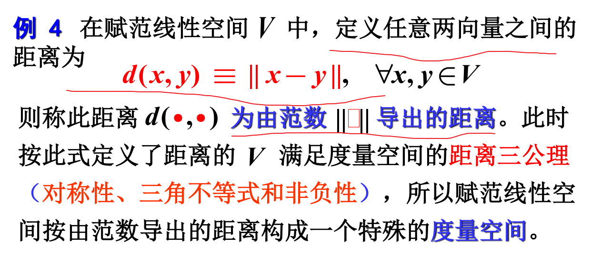

**从几何角度理解范数：**

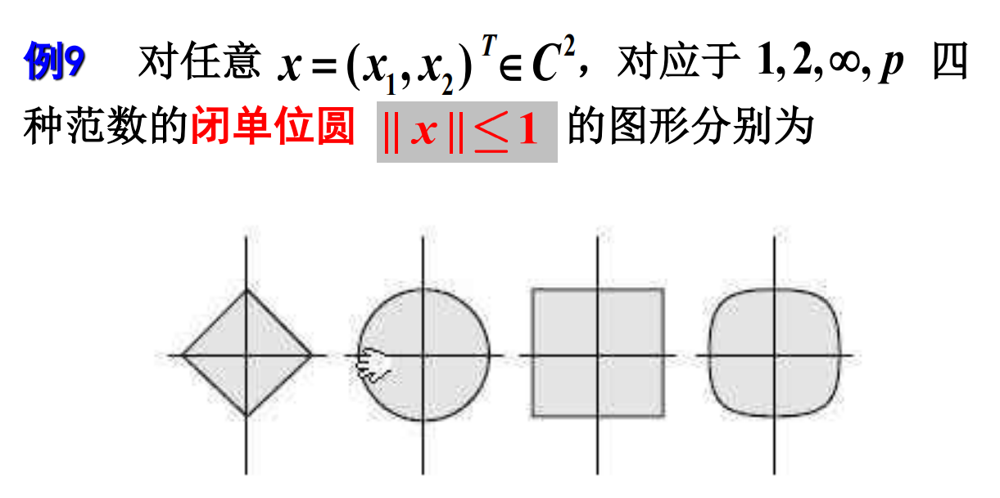

### 3矩阵范数

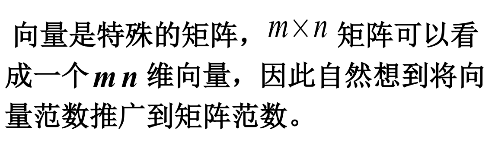

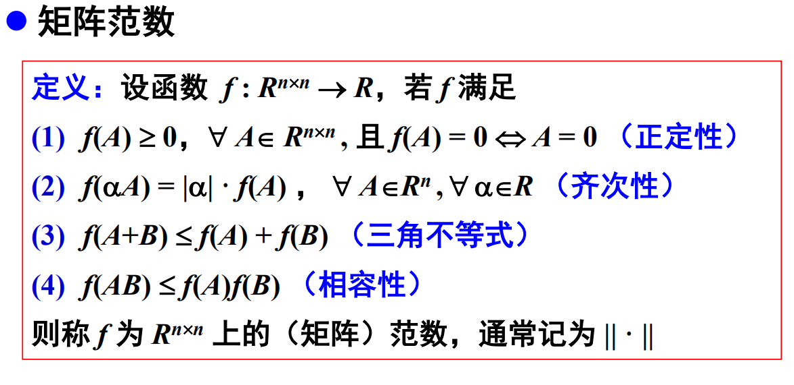

**常见矩阵范数：**

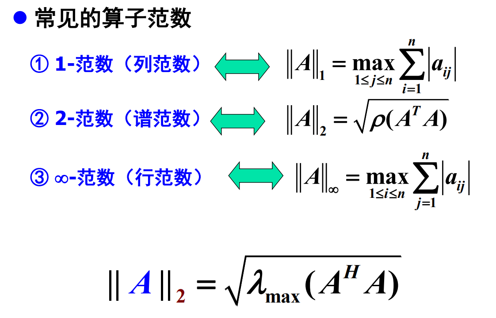

**求矩阵范数：**

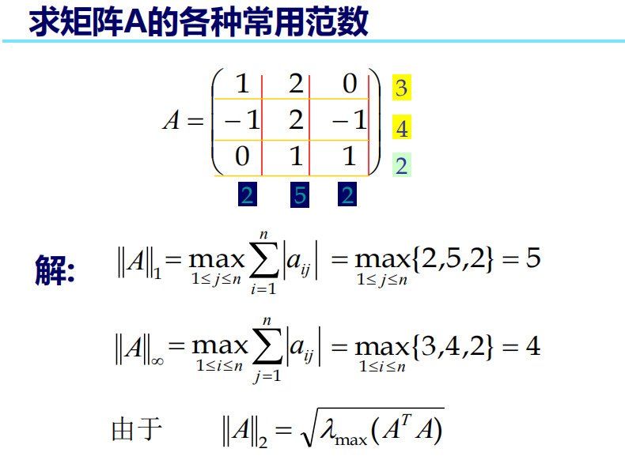

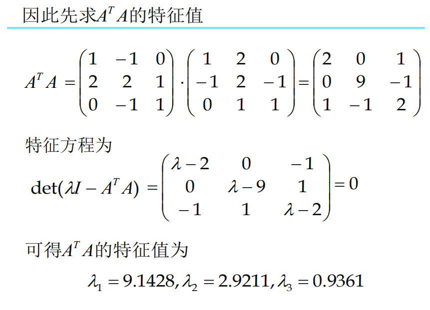

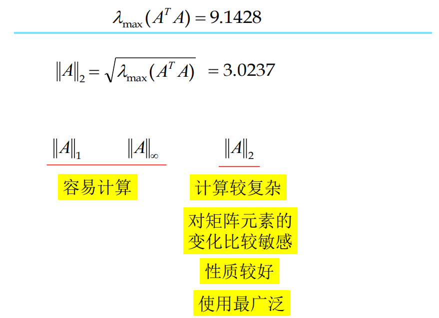

**从几何角度理解范数：**

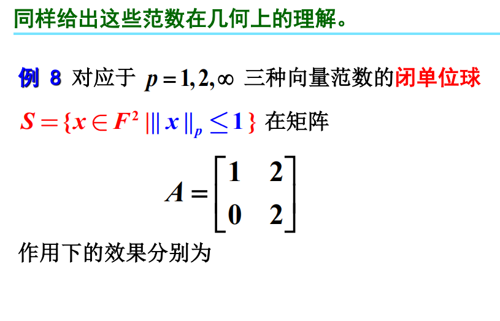

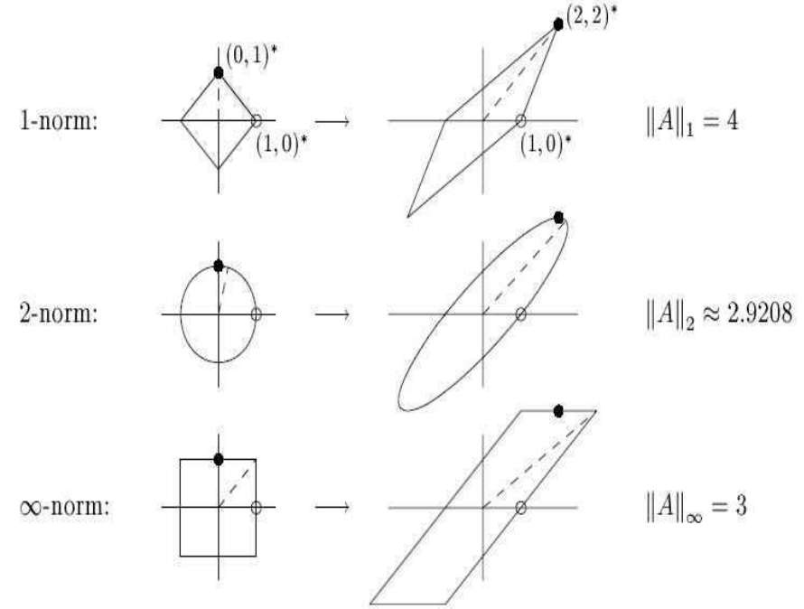