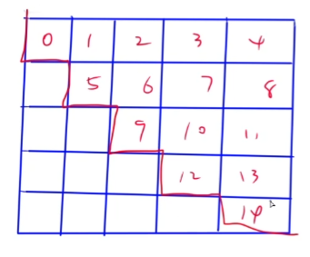
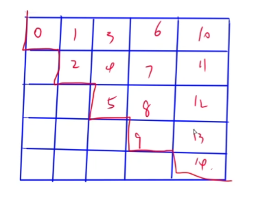

# 1.关于408数据结构

<!--more-->

y总原话：考研DS，笔试和上机是两回事，关系不大。笔试考背诵，上机是敲代码（正儿八经的算法）。这两块东西需要分开独立复习。（PS：过了初试才有上机呀~）

笔试整体难度不大，但细节很多，需要记忆。

408算法考纲：

```
考纲：
一、线性表
	（一）线性表的定义和基本操作
	（二）线性表的实现
		1. 顺序存储
		2. 链式存储
		3. 线性表的应用
二、栈、队列和数组
	（一）栈和队列的基本概念
	（二）栈和队列的顺序存储结构
	（三）栈和队列的链式存储结构
	（四）栈和队列的应用
	（五）特殊矩阵的存储和压缩
三、树与二叉树
	（一）树的基本概念
	（二）二叉树
		1. 二叉树的定义及其主要特征
		2. 二叉树的顺序存储结构和链式存储结构
		3. 二叉树的遍历
		4. 线索二叉树的基本概念和构造
	（三）树、森林
		1. 树的存储结构
		2. 森林与二叉树的转换
		3. 树和森林的遍历
	（四）树与二叉树的应用
		1. 二叉排序树
		2. 平衡二叉树
		3. 哈夫曼（Huffman）树的哈弗曼编码
四、图
	（一）图的基本概念
	（二）图的存储及基本操作
		1. 邻接矩阵法
		2. 邻接表法
		3. 邻接多重表、十字链表
	（三）图的遍历
		1. 深度优先搜索
		2. 广度优先搜索
	（四）图的基本应用
		1. 最小（代价）生成树
		2. 最短路径
		3. 拓扑排序
		4. 关键路径
五、查找
	（一）查找的基本概念
	（二）顺序查找法
	（三）分块查找法
	（四）折半查找法
	（五）B树及其基本操作、B+树及其基本概念
	（六）散列（Hash）表
	（七）字符串模式匹配（KMP）
	（八）查找算法的分析及应用
六、排序
	（一）排序的基本概念
	（二）插入排序
		1. 直接插入排序
		2. 折半插入排序
	（三）起泡排序（bubble sort）
	（四）简单选择排序
	（五）希尔排序（shell sort）
	（六）快速排序
	（七）堆排序
	（八）二路归并排序（merge sort）
	（九）基数排序
	（十）外部排序
	（十一）各种内部排序算法的比较
	（十二）排序算法的应用
```

# 2.第一讲

## 2.1时间、空间复杂度

只考虑次数，不考虑常数。也就是说考虑 n 的相关项，不考虑系数。

常见复杂度有：O(1)、O(n)、O(sqrt(n))、O(n^k)、O(logn)、O(nlogn)。

考题：2011-1、2012-1、2013-1、2014-1、2017-1、2019-1。

比较简单，直接去文件里看真题。

## 2.2特殊矩阵的存储和压缩

矩阵的按行展开、按列展开，展开后下标从0开始。

按行展开（以行序为主）图示：



按列展开（以列序为主）图示：



知道了矩阵怎么压缩就可以计算它在一维数组中的下标。