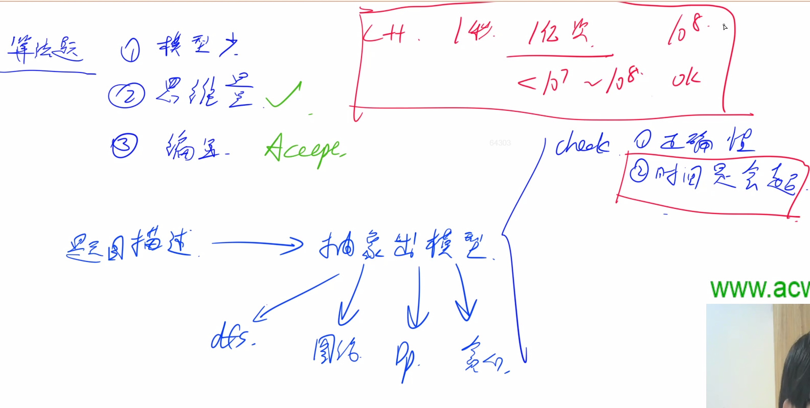
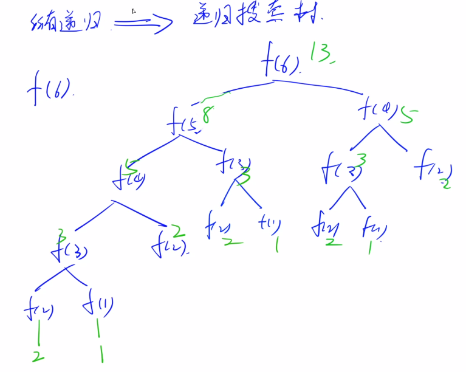
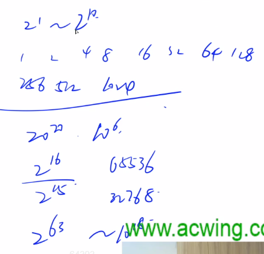
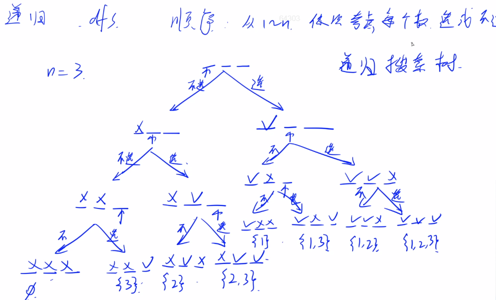
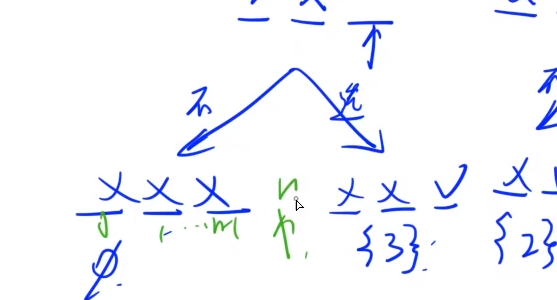
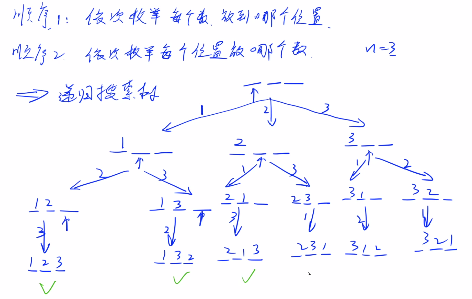
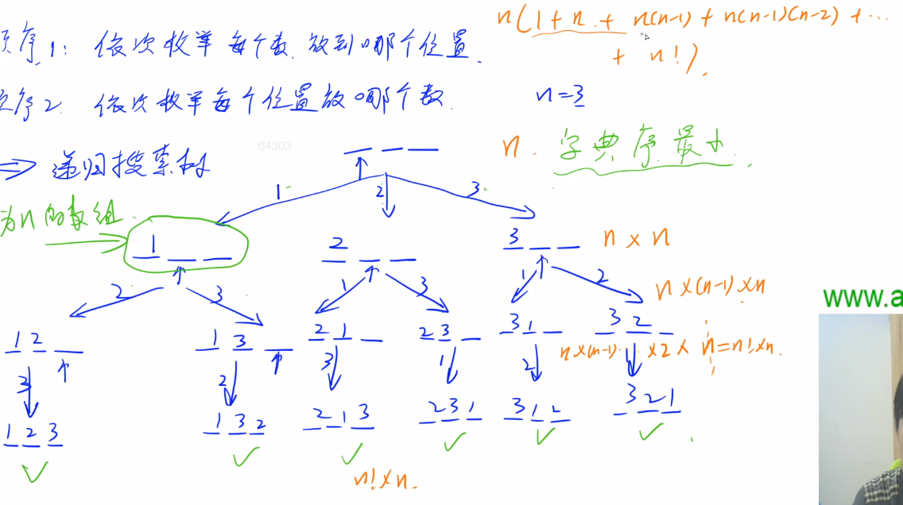
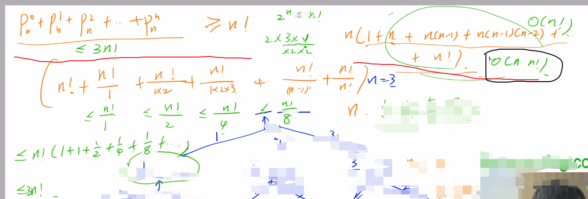

## 前期准备

1.有足够的刷题量（最好200+）

2.锻炼自己的调试能力

3.最好参加模拟赛

4.安排：周日（知识点+例题，取自真题）；周六（扩展+练习）

5.在参考时间内AC（从开始写到AC的时间），练熟练度

6.强调，算法一定要落实到代码的具体实现上

<!--more-->




## 由数据范围反推算法复杂度以及算法内容

一般ACM或者笔试题的时间限制是1秒或2秒。
在这种情况下，C++代码中的操作次数控制在 10$^7$∼10$^8$最佳。

题目中的数据范围可以给我们很大的提示！！！

注：

1. O(logn)一般指$\log_2n$.
2. int范围约是2*10$^9$.
3. long long的范围约是10$^{18}$.

下面给出在**不同数据范围下**，代码的时间复杂度和算法该如何选择：

1. n≤30, 指数级别, dfs+剪枝，状态压缩dp
2. n≤100 => O(n$^3$)，floyd，dp，高斯消元
3. n≤1000 => O(n$^2$)，O($n^2logn$)，dp，二分，朴素版Dijkstra、朴素版Prim、Bellman-Ford
4. n≤10000 => O(n∗$\sqrt n$)，块状链表、分块、莫队
5. n≤100000 => O($nlogn$) => 各种sort，线段树、树状数组、set/map、heap、拓扑排序、dijkstra+heap、prim+heap、spfa、求凸包、求半平面交、二分、CDQ分治、整体二分
6. n≤1000000 => O(n), 以及常数较小的 O($nlogn$) 算法 => 单调队列、 hash、双指针扫描、并查集，kmp、AC自动机，常数比较小的 O($nlogn$)的做法：sort、树状数组、heap、dijkstra、spfa
7. n≤10000000 => O(n)，双指针扫描、kmp、AC自动机、线性筛素数
8. n≤10$^9$=> O($\sqrt n$)，判断质数
9. n≤10$^{18}$ => O($logn$)，最大公约数，快速幂（接近long long范围）
10. n≤10$^{1000}$=> O($(logn)^2$)，高精度加减乘除
11. n≤10$^{100000}$=> O($logk×loglogk$)，k表示位数，高精度加减、FFT/NTT

作者：yxc
链接：https://www.acwing.com/blog/content/32/
来源：AcWing
著作权归作者所有。商业转载请联系作者获得授权，非商业转载请注明出处。

## 一 递归与递推

### 1.关于`scanf/printf`与`cin/cout`的比较：

`cin/cout`速度稍慢，当数据范围< 10$^5$时用；

`scanf/printf`速度巨快，当数据范围>= 10$^5$时用。

### 2.递归(dfs)

dfs也即深度优先搜索。

所有递归问题都能画出一棵递归搜索树，方便分析。



常用数字最好记一下：




#### 2.1 acwing.92. 递归实现指数型枚举

从 1~n 这 n 个整数中随机选取任意多个，输出所有可能的选择方案。

输入格式

输入一个整数n。

输出格式

每行输出一种方案。

**同一行内的数必须升序排列**，相邻两个数用恰好1个空格隔开。

对于没有选任何数的方案，输出空行。

本题有自定义校验器（SPJ），各行（不同方案）之间的顺序任意。

数据范围

1≤n≤15

输入样例：

```
3
```

输出样例：

```C++
3
2
2 3
1
1 3
1 2
1 2 3
```

**y总思路：**

从数据范围推断时间复杂度约为O(2$^n$)/O(n*2$^n$)。

**递归最重要**的是顺序，要把所有方案不重复不遗漏的找出来。

先画图：



注意边界问题：



再考虑代码实现：

```C++
// soluition 1，y总题解，直接输出排列
#include <iostream>
#include <algorithm>
#include <cstring>
#include <cstdio>// 4个最常见的头文件先写上
using namespace std;
const int N = 16;
int n;
int st[N];// 状态，记录每个位置当前状态，0表示还没考虑，1表示选他，2表示不选
void dfs(int u)
{
    if (u > n)
    {
        for (int i = 1;i <= n;i ++) // 记录方案，，下标从1开始
        {
            if (st[i] == 1) cout << i << ' ';
        }
        cout << endl;
        return;
    }
    
    st[u] = 1;// 第一个分支
    dfs(u+1);
    st[u] = 0;// 恢复现场
    
    st[u] = 2;// 第二个分支
    dfs(u+1);
    st[u] = 0;
}
int main()
{
    cin >> n;
    dfs(1);
    return 0;
}
// solution 2，用vector存储数组再输出，y总思路
#include <algorithm>
#include <cstdio>
#include <cstring>
#include <iostream>
#include <vector>
using namespace std;
const int N = 16;
int n;
int st[N];
vector<vector<int>> ways;
void dfs(int u)
{
    if (u > n)
    {
        vector<int> way;
        for (int i = 1; i <= n; i ++ )  // 记录方案，下标从1开始
            if (st[i] == 1)
                way.push_back(i);
        ways.push_back(way);
        return;
    }
    st[u] = 2;
    dfs(u + 1);     // 第一个分支：不选
    st[u] = 0;  // 恢复现场

    st[u] = 1;
    dfs(u + 1);     // 第二个分支：选
    st[u] = 0;  // 恢复现场
}
int main()
{
    cin >> n;
    dfs(1);
    for (int i = 0; i < ways.size(); i ++ )
    {
        for (int j = 0; j < ways[i].size(); j ++ ) printf("%d ", ways[i][j]);
        puts("");
    }
    return 0;
}
作者：Bug_FreeOωO
链接：https://www.acwing.com/solution/content/6682/
来源：AcWing
著作权归作者所有。商业转载请联系作者获得授权，非商业转载请注明出处。
```

#### 2.2 acwing.94.递归实现排列型枚举

 [语法课有一道类似题目823.排列](https://grant1499.github.io/2021/02/24/C-%E7%AB%9E%E8%B5%9B%E8%AF%AD%E6%B3%95%E6%80%BB%E7%BB%93%EF%BC%88%E4%BA%94%EF%BC%89/)

把 1~n 这 n 个整数排成一行后随机打乱顺序，输出所有可能的次序。

输入格式
			一个整数n。

输出格式
        按照从小到大的顺序输出所有方案，每行1个。

首先，同一行相邻两个数用一个空格隔开。

其次，对于两个不同的行，对应下标的数一一比较，**字典序较小的排在前面**。

数据范围
         1≤n≤9
		输入样例：
      		3
		输出样例：

```C++
1 2 3
1 3 2
2 1 3
2 3 1
3 1 2
3 2 1
```

##### 1思路：

顺序1：依次枚举每个数放在哪个位置；

顺序2：依次枚举每个位置放哪个数。

##### **2画出递归搜索树**（以顺序2为例）：



##### **3代码实现**：

```C++
// y总题解
#include <iostream>
#include <algorithm>
#include <cstring>
#include <cstdio>
using namespace std;
const int N = 10;
int  state[N]; // 0表示还没放数，1~n表示放了哪个数
bool used[N]; // true表示用过，false表示没用过
int n;
void dfs(int u)
{
	if (u > n)// 边界
	{
		for (int i = 1;i <= n;i ++)
		{
			printf("%d ",state[i]);// 打印方案
		}
		puts("");
		return;
	}
	// 依次枚举每个分支，当前位置可以填哪些数
	for (int i = 1;i <= n;i ++)
	{
		if (!used[i])
		{
			state[u] = i;// 第一个位置放1
			used[i] = true;
			dfs(u+1);// 在第2到n个位置放数
			// 恢复现场
			state[u] = 0;// 其实没必要加
			used[i] = false;
		}
	}
}
int main()
{
	scanf("%d",&n);
	dfs(1);// 注意：下标从1开始，所以dfs(1)
	return 0;
}
```

u代表层数（也就是放数的第n个位置），n代表分支数。搜索完一个分支，再搜索另一个分支。递归其实就是函数调用，你手动模拟一下函数的执行过程就清楚了。

##### **4时间复杂度分析**：

（作为扩展内容，蓝桥杯不要求掌握，但以后面试会用到）





第一层：枚举分支，有一个for循环，复杂度为n；

第二层：有n个函数，每个函数有一个for循环，复杂度为n*n；

第三层：填完一个位置后，还有n-1个位置，复杂度为`n*(n-1)*n`；

...

最后一层：每个叶子节点输出方案，有一个for循环，复杂度为`n!*n`。

加起来，通过不等式放缩证明：`n! <= (1+n+n(n-1)+n(n-1)(n-2)+...+n!) <= 3*n!`，因为括号外层还有个n，所以最终时间复杂度为$O(n*n!)$
