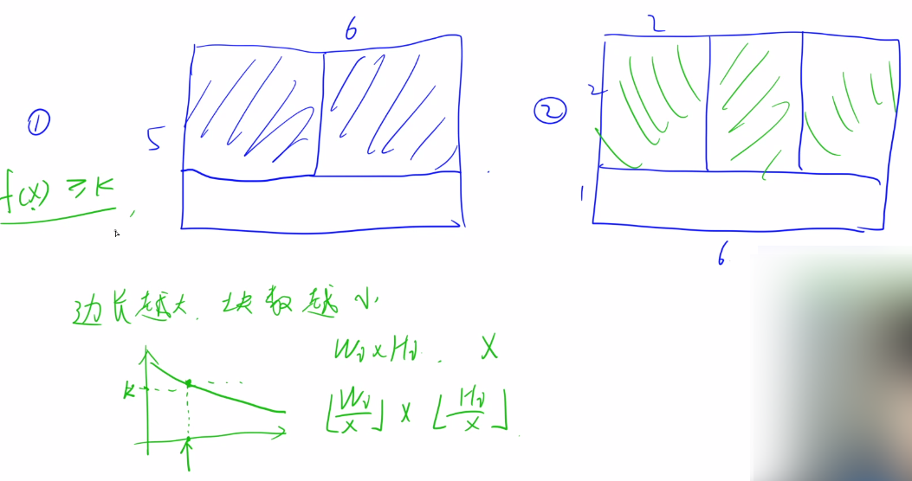
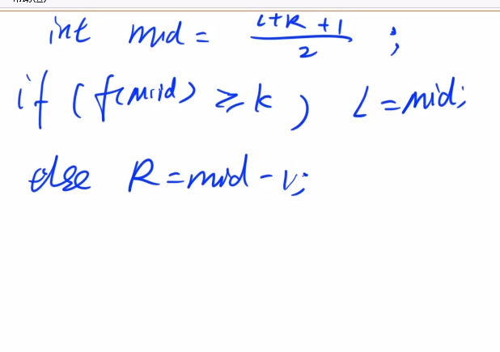
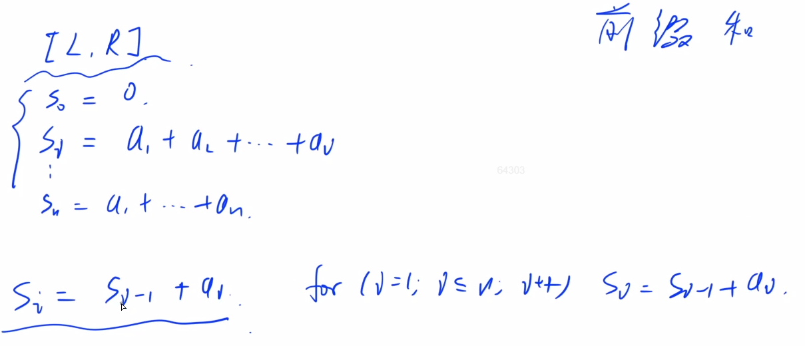
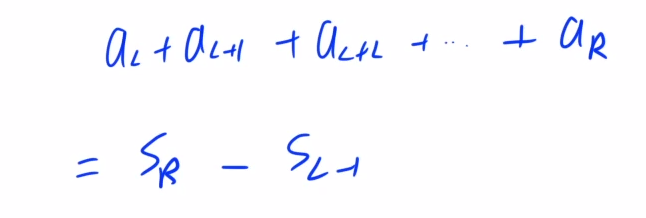

#### 1.7 acwing.1227. 分巧克力（蓝桥杯省赛C++A/B组）

<!--more-->

```C++
儿童节那天有 K 位小朋友到小明家做客。
小明拿出了珍藏的巧克力招待小朋友们。
小明一共有 N 块巧克力，其中第 i 块是 Hi×Wi 的方格组成的长方形。
为了公平起见，小明需要从这 N 块巧克力中切出 K 块巧克力分给小朋友们。
切出的巧克力需要满足：
形状是正方形，边长是整数
大小相同
例如一块 6×5 的巧克力可以切出 6 块 2×2 的巧克力或者 2 块 3×3 的巧克力。
当然小朋友们都希望得到的巧克力尽可能大，你能帮小明计算出最大的边长是多少么？

输入格式
第一行包含两个整数 N 和 K。
以下 N 行每行包含两个整数 Hi 和 Wi。
输入保证每位小朋友至少能获得一块 1×1 的巧克力。

输出格式
输出切出的正方形巧克力最大可能的边长。

数据范围
1≤N,K≤105,
1≤Hi,Wi≤105
输入样例：
2 10
6 5
5 6
输出样例：
2
```

y总思路：





时间复杂度：求f(mid)是O(N)，二分是O(logH)，总的是`O(N*logH)`，也就是`10^5*log10^5`.

```C++
// y总题解
#include <cstdio>
#include <algorithm>
using namespace std;
const int N = 100000;
int n,k;
int h[N],w[N];
bool check(int mid){
    int res = 0;
    for (int i = 0;i < n;i++){
        res += (h[i]/mid)*(w[i]/mid); // res求边长为mid时的块数,h[i]/mid下取整
        if (res >= k) return true;
    }
    return false;    
}
int main(){
    scanf("%d%d",&n,&k);
    for (int i = 0;i < n;i++) scanf("%d%d",&h[i],&w[i]);
    int l = 1,r = 1e5;
    while (l < r){
        int mid = (l+r+1) >> 1;
        if (check(mid)) l = mid;
        else r = mid - 1;
    }
    printf("%d\n",r);
    return 0;
}
```

详细题解思路请参考：https://www.acwing.com/solution/content/6883/

### 2.前缀和

#### 2.1 acwing.795. 前缀和（模板题）

```C++
输入一个长度为 n 的整数序列。
接下来再输入 m 个询问，每个询问输入一对 l,r。
对于每个询问，输出原序列中从第 l 个数到第 r 个数的和。

输入格式
第一行包含两个整数 n 和 m。
第二行包含 n 个整数，表示整数数列。
接下来 m 行，每行包含两个整数 l 和 r，表示一个询问的区间范围。

输出格式
共 m 行，每行输出一个询问的结果。

数据范围
1≤l≤r≤n,
1≤n,m≤100000,
−1000≤数列中元素的值≤1000
输入样例：
5 3
2 1 3 6 4
1 2
1 3
2 4
输出样例：
3
6
10
```





预处理计算完$S_i$之后，查询L到R的和的时间复杂度就从O(n)降低到O(1)。

暴力做法的话<u>每次</u>查询都得遍历数组，时间复杂度为O(n)。

前缀和思想虽然很简单，但是**非常的重要**。

**前缀和能快速查询，但不支持修改。**

```C++
// y总题解
#include <cstdio>
#include <algorithm>
using namespace std;
const int N = 100010;
int n,m;
int a[N],s[N];// 表示原数组和前缀和数组

int main()
{
    scanf("%d%d",&n,&m);
    // i从1开始，不然i-1越界
    for (int i = 1;i <= n;i++){
        scanf("%d",&a[i]);
        s[i] = s[i-1] + a[i];
    }
    while (m--){
        int l,r;
        scanf("%d%d",&l,&r);
        printf("%d\n",s[r]-s[l-1]);
    }
    return 0;
}
```

#### 2.2 acwing.796.子矩阵的和（二维模板题）

```C++
输入一个 n 行 m 列的整数矩阵，再输入 q 个询问，每个询问包含四个整数 x1,y1,x2,y2，表示一个子矩阵的左上角坐标和右下角坐标。
对于每个询问输出子矩阵中所有数的和。

输入格式
第一行包含三个整数 n，m，q。
接下来 n 行，每行包含 m 个整数，表示整数矩阵。
接下来 q 行，每行包含四个整数 x1,y1,x2,y2，表示一组询问。

输出格式
共 q 行，每行输出一个询问的结果。

数据范围
1≤n,m≤1000,
1≤q≤200000,
1≤x1≤x2≤n,
1≤y1≤y2≤m,
−1000≤矩阵内元素的值≤1000
输入样例：
3 4 3
1 7 2 4
3 6 2 8
2 1 2 3
1 1 2 2
2 1 3 4
1 3 3 4
输出样例：
17
27
21
```

