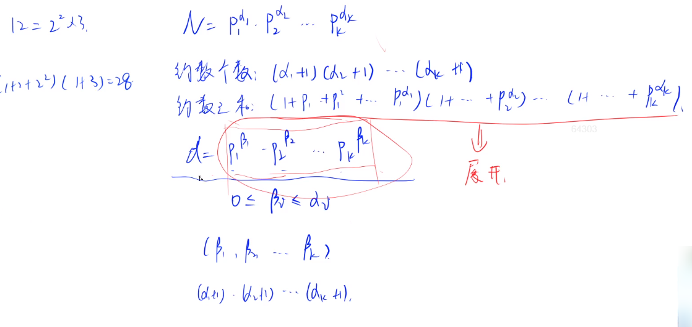
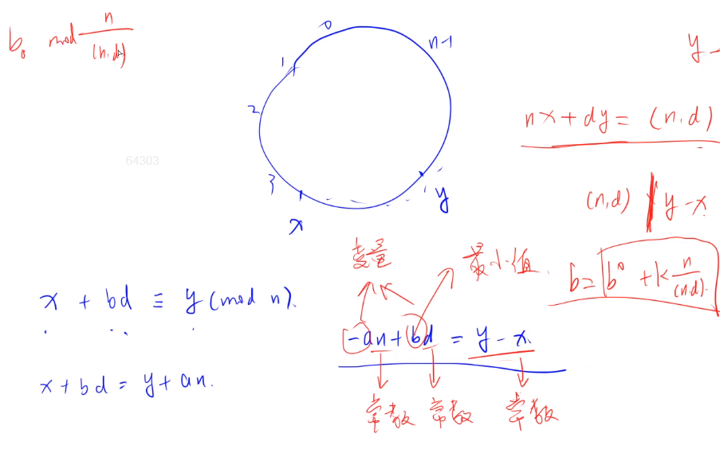

#### 1.3 acwing.1296. 聪明的燕姿（难）

《信息学奥赛一本通》 , JLOI2014

<!--more-->

```C++
城市中人们总是拿着号码牌，不停寻找，不断匹配，可是谁也不知道自己等的那个人是谁。
可是燕姿不一样，燕姿知道自己等的人是谁，因为燕姿数学学得好！
燕姿发现了一个神奇的算法：假设自己的号码牌上写着数字 S，那么自己等的人手上的号码牌数字的所有正约数之和必定等于 S。
所以燕姿总是拿着号码牌在地铁和人海找数字（喂！这样真的靠谱吗）。
可是她忙着唱《绿光》，想拜托你写一个程序能够快速地找到所有自己等的人。

输入格式
输入包含 k 组数据。
对于每组数据，输入包含一个号码牌 S。

输出格式
对于每组数据，输出有两行。
第一行包含一个整数 m，表示有 m 个等的人。
第二行包含相应的 m 个数，表示所有等的人的号码牌。
注意：你输出的号码牌必须按照升序排列。

数据范围
1≤k≤100,
1≤S≤2×10^9
输入样例：
42
输出样例：
3
20 26 41
```

思路：

抓住题目核心，也就是求一个数的所有正约数之和等于给定号码牌，这样的数有多少个。

比如S = 42，这个时候就有3个数满足条件：

41 = (1 + 41) == 42，20 = (1 + 2 + 4 + 5 + 10 + 20) == 42，26 = (1 + 2 + 13 + 26) == 42

约数与因数的区别：约数必须在整除的前提下才存在，而因数是从乘积的角度来提出的。

约数只能对在整数范围内而言，而因数就不限于整数的范围。 

**约数个数定理**

定理: 若 $n=\prod_{i=1}^{m} p_{i}^{c_{i}}$ 则 $d_{i}=\prod_{i=1}^{m} c_{i}+1$.

证明：我们知道 $p_{i}^{c_{i}}$ 的约数有 $p_{i}^{0}, p_{i}^{1}, \ldots, p_{i}^{c_{i}}$ 共 $c_{i}+1$ 个，根据乘法原理, $n$ 的约数个数就是 $\prod_{i=1}^{m} c_{i}+1$



假设d为N的约数，d必然由N的质因数相乘得到。

参考题解：https://www.acwing.com/solution/content/10545/

观察约数之和的公式，猜测满足所有正约数之和等于给定号码牌的数非常少，所以用dfs暴搜。

应该先从小到大枚举p，

```C++
for(p : 2,3,5,7,...)
    for(a : 1,2,3,...)
        if(S mod (1+p1+p1^2+...+p1^a1) == 0)
            dfs(下一层)
```

直接枚举p的话，素数个数非常多，时间复杂度很大，所以必须优化。

考虑特殊情况：

1. 如果ai = 1的话，S = (1+Pi)的时候，因为Pi为质数，那么S-1也一定为质数，那么这个时候只需要判断S-1是否为质数即可。

2. 如果不满足1，S只会有两种情况，就是一种情况包括一个因子里面有(1+Pi)，另一种情况不包括(1+Pi)，

    S = (1+Pi)(1+Pj+Pj^2.....)
    S = (1+Pi+Pi^2+...)(1+.....)

    这两种情况都可以看出来Pi ^2 <= S，所以我们dfs枚举Pi的上限就是$\sqrt S$。

找个实际的例子模拟一下，就会很清楚整个过程了。

代码：

```C++
#include <iostream>
#include <algorithm>
using namespace std;
const int N = 50000;// 比s最大值2*10^9开根号大一点

int primes[N],cnt;
bool st[N];
int ans[N],len;

void get_primes(int n){// 线性筛法
    for (int i = 2;i <= n;i++){
        if (!st[i]) primes[cnt++] = i;
        for (int j = 0;j < cnt && primes[j] * i <= n;j++){
            int t = primes[j];
            st[t*i] = true;
            if (i % t == 0) break;
        }
    }
}

bool is_prime(int x){// 判断素数
    if (x < N) return !st[x];// 2~N-1的数已经筛过了，通过st[i]来判断是不是素数
    for (int i = 0;primes[i] <= x/primes[i];i++){// >= N的数需要用求出的素数来筛
        if (x % primes[i] == 0) return false;
    }
    return true;
}

void dfs(int last,int prod,int s){//last表示上一个素数的下标，prod表示当前数，s表示剩余未除的数
    if (s == 1){// 剩余未除的数=1，递归边界
        ans[len++] = prod;
        return;
    }
    // last=-1时，s至少为3=1+2才行，s-1>上一层素数，而且素数时递增枚举的，保证不会重复
    if (s-1 > (last<0 ? 1:primes[last]) && is_prime(s-1)) ans[len++] = prod*(s-1);
    // 素数p只需要枚举到根号s
    for (int i = last+1;primes[i] <= s/primes[i];i++){// 防止相乘爆int，改成除法
        int p = primes[i];
        for (int j = 1+p,t = p;j <= s;t *= p,j += t){
            if (s % j == 0) dfs(i,prod*t,s/j);
        }
    }
}

int main(){
    get_primes(N-1);

    int s;
    while (cin >> s){
        len = 0;// 每次计算前把len清零
        dfs(-1,1,s);

        cout << len << endl;
        if (len){
            sort(ans,ans+len);// 记得排序答案
            for (int i = 0;i < len;i++){
                cout << ans[i] << ' ';
            }
            puts("");
        }
    }
    return 0;
}
```

#### 1.4 acwing.1299. 五指山

《信息学奥赛一本通》

```C++
大圣在佛祖的手掌中。
我们假设佛祖的手掌是一个圆圈，圆圈的长为 n，逆时针记为：0,1,2,…,n−1，而大圣每次飞的距离为 d。
现在大圣所在的位置记为 x，而大圣想去的地方在 y。
要你告诉大圣至少要飞多少次才能到达目的地。
注意：孙悟空的筋斗云只沿着逆时针方向翻。

输入格式
有多组测试数据。
第一行是一个正整数 T，表示测试数据的组数；
每组测试数据包括一行，四个非负整数，分别为如来手掌圆圈的长度 n，筋斗所能飞的距离 d，大圣的初始位置 x 和大圣想去的地方 y。

输出格式
对于每组测试数据，输出一行，给出大圣最少要翻多少个筋斗云才能到达目的地。
如果无论翻多少个筋斗云也不能到达，输出 Impossible。

数据范围
2<n<10^9,
0<d<n,
0≤x,y<n
输入样例：
2
3 2 0 2
3 2 0 1
输出样例：
1
2
```

思路：

参考文章：[扩展欧几里得——裴蜀（贝祖）定理](https://zhuanlan.zhihu.com/p/114568325)

参考资料：《算法笔记》，https://oi-wiki.org/math/gcd/

首先介绍**裴蜀定理**。（其实已经介绍过一遍了）

> 其内容是：
>
> 设a, b是不全为零的整数, 则存在整数x, y,使 $a x+b y=\operatorname{gcd}(a, b).$
>
> 对于任意的一组整数x、y，ax+by一定是gcd(a,b)的整数倍。

注意：裴蜀等式的**解的个数不唯一**！

举例：a=24，b=16，d = gcd(24,16) = 8，(x,y) = (-1,1) = (2,-1) = ... ，这里就列出了两组解，它们可以称为裴

蜀数。 

然后是**扩展欧几里得算法**。已经介绍过了欧几里得算法求最大公约数gcd。

而扩展欧几里得算法不仅能求最大公约数，还能求解裴蜀等式的一组整数解x、y。

下面叙述一下具体的**数学形式**的求解思路。

首先假设：我们已经通过扩展欧几里得算法求解出裴蜀等式的一组整数解$x_0,y_0$。

也即：$ax_0+by_0=gcd(a,b)=d$。

令：$a^{'}=\frac a d,b^{'}=\frac b d$。则有结论，裴蜀等式的通解有这样的形式：$\begin{cases}x=x_0+k*b^{'}\\ y=y_0-k*a^{'}\end{cases}$，其中k为任意整数。

验证上述解的形式是否裴蜀等式：$ax+by=a(x_0+k*b^{'})+b(y_0-k*a^{'})=d$，所以必然是等式的解。

下证等式的通解必然是满足上述形式：不妨设$x^{'},y^{'}$是等式的通解，则有：$ax^{'}+by^{'}=d$。

与等式$ax_0+by_0=d$联立可以求得：$a(x^{'}-x_0)=b(y_0-y^{'})$，则有：$a^{'}(x^{'}-x_0)=b^{'}(y_0-y^{'})$，所以

有：$b^{'}|a^{'}(x^{'}-x_0)$，又：$(a^{'},b^{'})=1$，所以：$b^{'}|(x^{'}-x_0)$，即：$x^{'}-x_0=kb^{'}$，再代入

$a^{'}(x^{'}-x_0)=b^{'}(y_0-y^{'})$，有：$ka^{'}=y_0-y^{'}$。综上所述，**上述解的形式必然是裴蜀等式的通解**。

接下来讲解一下**算法形式**的求解思路。

设$a x_{1}+b y_{1}=\operatorname{gcd}(a, b)$，$b x_{2}+(a \bmod b) y_{2}=\operatorname{gcd}(b, a \bmod b)$。

由欧几里得定理可知： $\operatorname{gcd}(a, b)=\operatorname{gcd}(b, a \bmod b)$，所以 $a x_{1}+b y_{1}=b x_{2}+(a \bmod b) y_{2}$。

又因为 $a \bmod b=a-\left(\left\lfloor\frac{a}{b}\right\rfloor \times b\right)$，所以 $a x_{1}+b y_{1}=b x_{2}+\left(a-\left(\left\lfloor\frac{a}{b}\right\rfloor \times b\right)\right) y_{2}$，

$a x_{1}+b y_{1}=a y_{2}+b x_{2}-\left\lfloor\frac{a}{b}\right\rfloor \times b y_{2}=a y_{2}+b\left(x_{2}-\left\lfloor\frac{a}{b}\right\rfloor y_{2}\right)$。

因为 $a=a, b=b$, 所以 $x_{1}=y_{2}, y_{1}=x_{2}-\left\lfloor\frac{a}{b}\right\rfloor y_{2}$。

将 $x_{2}, y_{2}$ 不断代入递归求解直至递归边界 $x=1, y=0$ 回溯反解出$x_{1},y_{1}$。

扩展欧几里得算法代码：

```C++
#include <iostream>
#include <algorithm>
using namespace std;

int exGcd(int a,int b,int &x,int &y){ // x和y的值需要更新
    if (!b){// 递归边界
        x = 1,y = 0;
        return a;
    }
    int d = exGcd(b,a%b,y,x);// 求公约数，注意x和y交换了顺序，和证明不一样，这样更方便
    y -= a/b*x;// 更新x和y，x不变不用写
    return d;
}
int main(){
    int a,b,x,y;
    cin >> a >> b;
    int d = exGcd(a,b,x,y);
    printf("%d * %d + %d * %d = %d\n",a,x,b,y,d);
    return 0;
}
```

由上面的代码可以求出裴蜀等式的一组特解，再通过通解公式我们就能得到全部解。

思路回到题目。



再介绍一下同余式的概念。形如$ax\equiv c(mod\;n)$的式子称为同余式，表示：`(ax-c)mod n = 0`。

我们要求的就是满足方程`-a*n+b*d=y-x`的b的最小正整数值，这些量都是整数。

1. 当$(n,d)\nmid y-x$时，由于左边是常量n与d的线性组合，必然被(n,d)整除，所以方程肯定没有整数解。
2. 当$(n,d)\mid y-x$时，对于裴蜀等式`n*x+d*y=(n,d)`，只要左右两边同乘$\frac {y-x} {(n,d)}$，就能转化为所求方程。

由裴蜀等式的通解知道：$b=b_0+k*\frac n {(n,d)}$，b的最小正整数值=$b_0\;mod\;\frac n {(n,d)}$。

原理：不论b0是个多大或者多小的一个数字，它通过k∗n/gcd(n,d)都能把这个数缩小到0−n/gcd(n,d)之间。

`int get_mod(int a,int b)  return (a % b + b) % b;// 将负余数转成正的`

代码：

```C++
#include <cstdio>
#include <iostream>
using namespace std;

typedef long long LL;

LL exGcd(LL a,LL b,LL &x,LL &y){
    if (!b){
        x = 1,y = 0;
        return a;
    }
    LL d = exGcd(b,a%b,y,x);
    y -= a/b*x;
    return d;
}
int main(){
    int T;
    LL n,d,x,y,a,b,gcd;
    scanf("%d",&T);
    while (T--){
        scanf("%lld%lld%lld%lld",&n,&d,&x,&y);
        gcd = exGcd(n,d,a,b);
        if ((y-x) % gcd != 0) puts("Impossible");
        else{
            b *= (y-x)/gcd,n /= gcd;
            printf("%lld\n",(b%n+n)%n);// 求b%n的正余数
        }
    }
    return 0;
}
```

