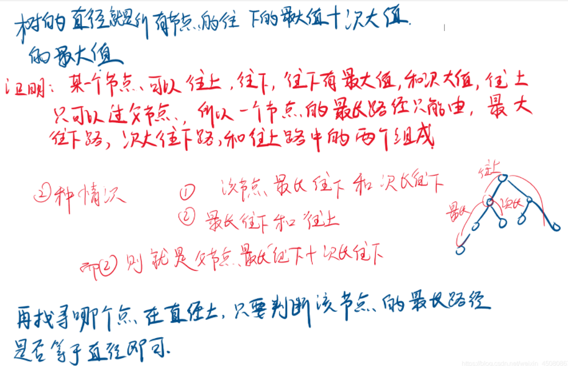
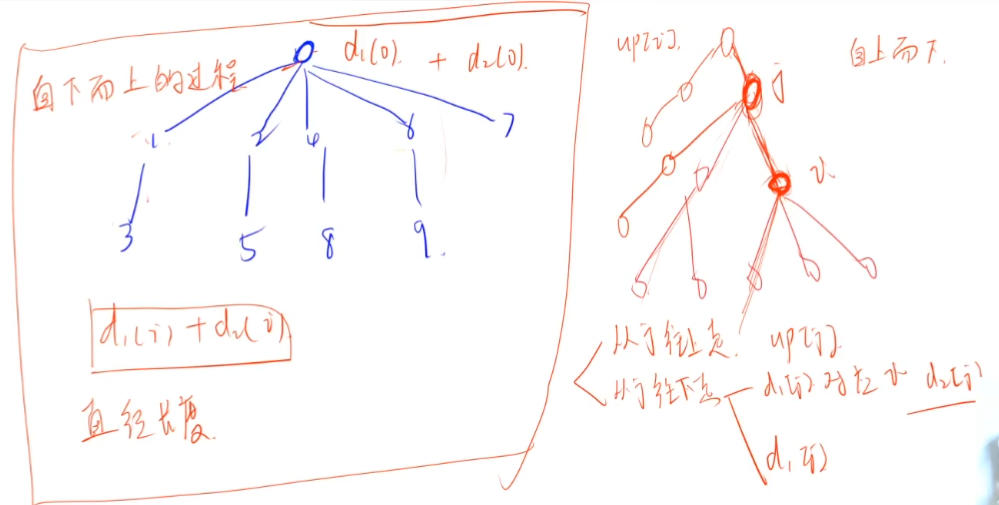
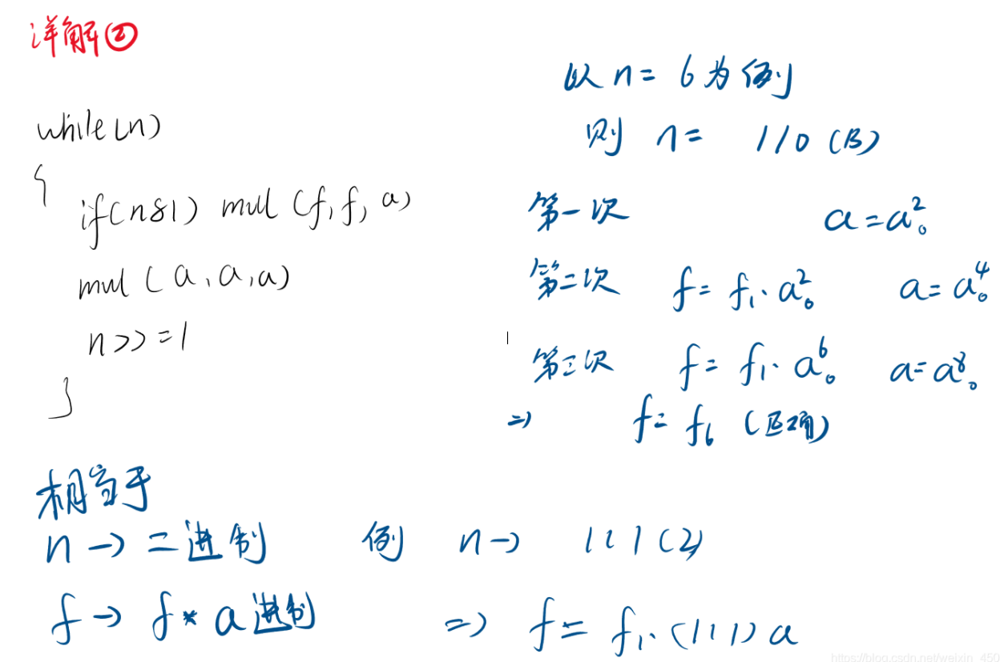

#### 2.3 acwing.1078. 旅游规划（蓝桥压轴级别）

《信息学奥赛一本通》

<!--more-->

```C++
W 市的交通规划出现了重大问题，市政府下定决心在全市各大交通路口安排疏导员来疏导密集的车流。
但由于人员不足，W 市市长决定只在最需要安排人员的路口安排人员。
具体来说，W 市的交通网络十分简单，由 n 个交叉路口和 n−1 条街道构成，交叉路口路口编号依次为 0,1,…,n−1 。
任意一条街道连接两个交叉路口，且任意两个交叉路口间都存在一条路径互相连接。
经过长期调查，结果显示，如果一个交叉路口位于 W 市交通网最长路径上，那么这个路口必定拥挤不堪。
所谓最长路径，定义为某条路径 p=(v1,v2,…,vk)，路径经过的路口各不相同，且城市中不存在长度大于 k 的路径（因此最长路径可能不唯一）。
因此 W 市市长想知道哪些路口位于城市交通网的最长路径上。

输入格式
第一行包含一个整数 n。
之后 n−1 行每行两个整数 u,v，表示编号为 u 和 v 的路口间存在着一条街道。

输出格式
输出包括若干行，每行包括一个整数——某个位于最长路径上的路口编号。
为了确保解唯一，请将所有最长路径上的路口编号按编号顺序由小到大依次输出。

数据范围
1≤n≤2×10^5
输入样例：
10
0 1
0 2
0 4
0 6
0 7
1 3
2 5
4 8
6 9
输出样例：
0
1
2
3
4
5
6
8
9
```

思路：

考察树形DP。

题目中的最长路径也就是指树的直径，在蓝桥杯总结（二一）提到。

在AcWing 1207. 大臣的旅费中用了2次**dfs来求树的直径**。

本题介绍**树形DP解法求树的直径**。（题目要求最长路径上所有点）

观察树的形状我们可以直到每条直径都必然有一个最高点，可以将以哪个点作为最高点作为集合划分的依据。

对于每个最高点i，我们只要求出每个子结点**往下走**的最大长度d1(i)和次大长度d2(i)（从树的形状可以直观地理解），d1(i)、d2(i)加起来就是经过最高点i的直径。

求出以每个结点为最高点的直径，取max就得到树的直径ans了。

直径求法的正确性证明如下：

参考题解：https://www.acwing.com/solution/content/8986/



那么问题来了，如何判断一个结点i是否在一条直径上呢？

从结点i出发走到树的尽头一共有三条可能的最长路径：1.往下走，最大长度d1(i)和次大长度d2(i)，上面已经求出；2.通过父结点j往上走，最大值用数组up[j]记录；3.通过父结点j往（下）子结点走，又分为2种情况，当`d1(j)`经过结点i时，结点i通过父结点j走到尽头的最长路径就是`up[i] = max(up[j]+1,d2(j)+1)`，当`d1(j)`不经过结点i时，那么这个最长路径就是`up[i] = max(up[j]+1,d1(j)+1) `。（对照下图）

最后，如果对d1(i),d2(i)以及up[i]中的三个取最大的两个，加起来记为人，如果`r = ans`，那么经过结点i的最大路径=树的直径，说明结点i在一条直径上。

求树的直径的过程是自下而上的，因为父结点往下走的长度取决于子结点往下走的长度；判断一个结点是否在一条直径上的过程是自上而下的，因为求子结点往上走的长度取决于父结点往上走的长度。

两次dfs都是O(n)的，所以**时间复杂度是O(n)**。



注意：交叉路口下标从0开始。

还是用数组模拟邻接表。

```C++
#include <cstdio>
#include <cstring>
#include <algorithm>
using namespace std;
const int N = 200010,M = 2*N;

int n,maxd;// 树的直径maxd
int h[N],e[M],ne[M],idx;
int d1[N],d2[N],p[N],up[N];// d1、d2分别存结点u往下走的最大、次大长度
//p存下结点u往下最大路走的子结点，up存下结点u往上走的最长路径
void add(int a,int b){
	e[idx] = b,ne[idx] = h[a],h[a] = idx++;
}

void dfs_d(int u,int father){// dfs求每个结点最大、次大长度
    // 第二个参数记录父节点，防止往回走
	for (int i = h[u]; ~i;i = ne[i]){// ~i等价于i != -1
		// -1:原码，1,001，补码，1,111，补码全为1，取反就是0,000
		int j = e[i];
		if (j != father){
			dfs_d(j,u);// 递归子结点
			int distance = d1[j] + 1;// 结点u经过子结点j往下走的路径distance
			if (distance > d1[u]){// 更新最大值和次大值
				d2[u] = d1[u],d1[u] = distance;
				p[u] = j;// 记录最大路径经过的子结点j
			}
			else if (distance > d2[u]) d2[u] = distance;// 更新次大值
		}
	}
	maxd = max(maxd,d1[u] + d2[u]);// 求树的直径
}

void dfs_u(int u,int father){
	for (int i = h[u]; ~i;i = ne[i]){
		int j = e[i];
		if (j != father){// 判断结点j是否经过直径
			up[j] = up[u] + 1;// 记录通过父结点u往上走的长度up[j]
			if (p[u] == j) up[j] = max(up[j],d2[u] + 1);// 父结点的d1路径过子结点j
			else up[j] = max(up[j],d1[u] + 1);// 不经过则用d2路径求max 
			dfs_u(j,u);
		}
	}
}

int main(){
    scanf("%d",&n);
    memset(h,-1,sizeof h);// 记得h数组置-1
    
    int a,b;
    for (int i = 0;i < n-1;i++){// n个顶点，n-1条边
    	scanf("%d%d",&a,&b);
    	add(a,b),add(b,a);// 构建邻接表
    }
    
    dfs_d(0,-1);// 先递归再计算，自下而上的过程
    dfs_u(0,-1);// 先计算再递归，自上而下的过程
    
    for (int i = 0;i < n;i++){
    	int d[3] = {d1[i],d2[i],up[i]};// 排序求三者最大的两个
    	 sort(d,d+3);
    	 if (d[1] + d[2] == maxd) printf("%d\n",i);
    }
    return 0;
}
```

#### 2.4 acwing.1303. 斐波那契前 n 项和

《信息学奥赛一本通》

```C++
大家都知道 Fibonacci 数列吧，f1=1,f2=1,f3=2,f4=3,…,fn=fn−1+fn−2。
现在问题很简单，输入 n 和 m，求 fn 的前 n 项和 Sn mod m。

输入格式
共一行，包含两个整数 n 和 m。

输出格式
输出前 n 项和 Sn mod m 的值。

数据范围
1≤n≤2000000000,
1≤m≤1000000010
输入样例：
5 1000
输出样例：
12
```

思路：

n的范围是2*10^9，m的范围是10^9+10。数据范围特别大，考察**矩阵快速幂**，也就是**矩阵运算+快速幂**。

参考文章：[y总求解Fibonacci数列的若干方法](https://www.acwing.com/blog/content/25/)

文中介绍了几种算法。

其中递归时间复杂度为O(2^n)，最慢，最常见的做法。

在众多算法中，矩阵快速幂时间复杂度是O(logn)，最快。

补充一种通项公式解法：

时间复杂度可能和矩阵快速幂差不多（个人猜测），但是数据量特大时**精度会降低很多**！（不太推荐使用）

```C++
int Fibonacci(int n) {
double sqrt5 = sqrt(5);
double alpha = (1 + sqrt5) / 2;
double beta = (1 - sqrt5) / 2;
double ret = (pow(alpha, n) - pow(beta, n)) / sqrt5;
return (int) ret;
}
```

算法：**矩阵快速幂**。

首先要掌握**快速幂算法**，求 m^k%p，时间复杂度 O(logk)。

参考文章：[快速幂算法](https://www.grantdrew.top/posts/50ce0ed6.html)

问题：如何构造Fibonacci数列的矩阵？
定义序列$f_i$为Fibonacci数列的第i项，i从1开始。
我们首先定义一个向量：$F_n = [f_n\ f_{n+1}],F_{n+1} = [f_{n+1}\ f_{n+2}]$，然后可以找到一个矩阵A使得:$F_{n+1} = F_n * A$。
不难得出：$A = \left[ \begin{matrix} 0 & 1 \\ 1 & 1 \end{matrix} \right]\ (f_{n+2} = f_n +f_{n+1})$
由此可以得到递推公式：$F_n = F_1 * A^{n-1}$。
利用快速幂的算法我们能够很快计算出$A^n$，只是把数字换成了矩阵。

---
回到题目，我们要求的是$f_n$的前n项和$S_n\ mod\ m$，所以我们构造的向量需要多加一个维度$S_n$。
$F_n = [f_n\ f_{n+1}\ S_n],F_{n+1} = [f_{n+1}\ f_{n+2}\ S_{n+1}]$，然后可以找到一个矩阵A使得:$F_{n+1} = F_n * A$。
不难得出：$A = \left[ \begin{matrix} 0 & 1 & 0 \\ 1 & 1 & 1 \\ 0 & 0 & 1 \end{matrix} \right]$
由此可以得到递推公式：$F_n = F_1 * A^{n-1}$。

---
代码：
参考1：y总快速幂模板
参考2：[快速幂算法](https://www.grantdrew.top/posts/50ce0ed6.html)
参考3：https://www.acwing.com/solution/content/8881/

```C++
// 快速幂模板,二进制迭代写法
// 通过二进制将乘法转化成加法来处理，效率高
int qmi(int m, int k, int p)
{
    int res = 1 % p, t = m;
    while (k)
    {
        if (k&1) res = res * t % p;
        t = t * t % p;
        k >>= 1;
    }
    return res;
}
```


因为快速幂的时间复杂度是$O(logn)$，而第二个mul函数的for循环次数为$3^3$,所以本题的时间复杂度为$O(3^3*logn)$。
```C++
// AC代码
#include <cstdio>
#include <algorithm>
#include <cstring>

using namespace std;
typedef long long LL;
const int N = 3;
int n,m;

void mul(int c[],int a[],int b[][N]){// 计算F1 = F1 * a
    int temp[N] = {0};
    for (int i = 0;i < N;i++)
        for (int j = 0;j < N;j++)
            temp[i] = (temp[i] + (LL)a[j]*b[j][i]) % m;
        
    memcpy(c,temp,sizeof temp);// 注意：sizeof后面不能写c，是指针的大小
}

void mul(int c[][N],int a[][N],int b[][N]){// 计算a = a * a
    int temp[N][N] = {0};
    for (int i = 0;i < N;i++)
        for (int j = 0;j < N;j++)
            for (int k = 0;k < N;k++)
                temp[i][j] = (temp[i][j] + (LL)a[i][k]*b[k][j]) % m;
    memcpy(c,temp,sizeof temp);
}

int main(){
    scanf("%d%d",&n,&m);
    
    // 计算初始向量F_1
    int F1[3] = {1,1,1};
    int a[N][N] = {// 快速幂矩阵a
      {0,1,0},
      {1,1,1},
      {0,0,1}
    };
    
    n--;// 矩阵快速幂求F_n
    while (n){// n&1，偶数返回1，否则返回0
        if (n & 1) mul(F1,F1,a);// F1 = F1 * a
        mul(a,a,a);// a = a * a
        n >>= 1;
    }
    
    printf("%d\n",F1[2]);
    return 0;
}
```
