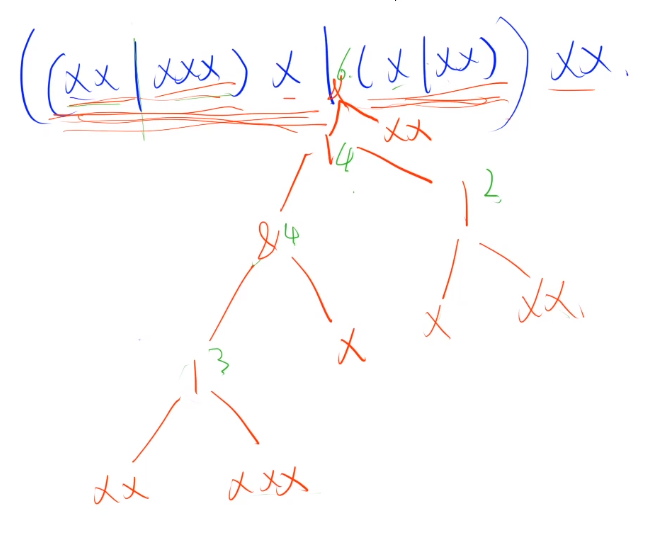
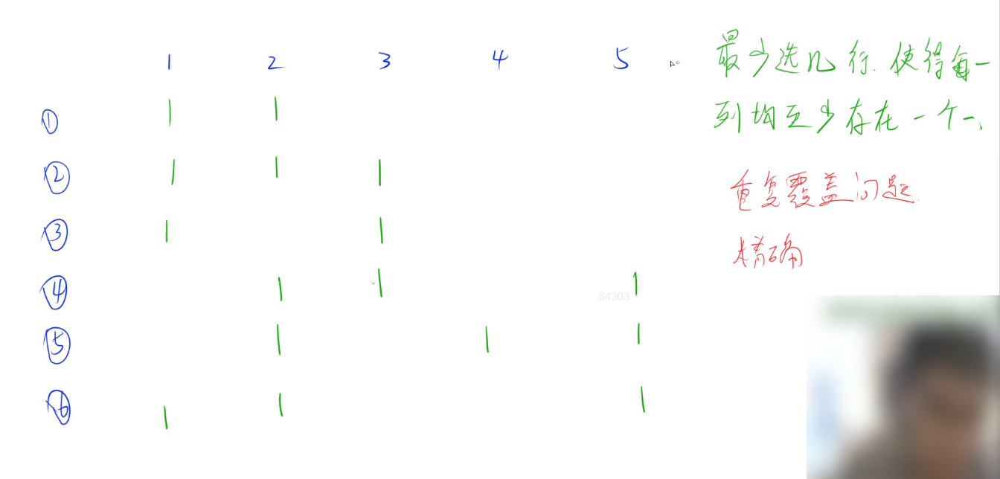

#### 1.7 acwing.1225. 正则问题

第八届蓝桥杯省赛C++A组,第八届蓝桥杯省赛JAVAA组

<!--more-->

```C++
考虑一种简单的正则表达式：
只由 x ( ) | 组成的正则表达式。
小明想求出这个正则表达式能接受的最长字符串的长度。
例如 ((xx|xxx)x|(x|xx))xx 能接受的最长字符串是： xxxxxx，长度是6。

输入格式
一个由x()|组成的正则表达式。

输出格式
输出所给正则表达式能接受的最长字符串的长度。

数据范围
输入长度不超过100，保证合法。

输入样例：
((xx|xxx)x|(x|xx))xx 
输出样例：
6
```

思路：

这两题都与数论无关。

本题考察**递归**，应当放在第一讲。

题意是求在规则之下的xxxxx…的最大长度。

- 规则1：() 的意思是有括号的先算括号里面的，优先级最高，把括号计算的结果在和括号外的字符拼接，即括号是相对独立，完整的个体


- 规则2：|的意思是|这个符号两侧的字符串只能选其中一个，由于这题要求能拼接的字符串最长，因此应该选择字符|字符串xxx...长度较大的一侧

再次强调，所有递归问题都可以画一棵递归搜索树来帮助理解。



代码·：

```C++
import java.util.Scanner;
class Main{
    static String str;
    static int k = 0;
    public static void main(String[] args){
        Scanner s = new Scanner(System.in);
        str = s.next();
        System.out.println(dfs());
    }
    public static int dfs(){
        int res = 0;
        while (k < str.length()){
            if (str.charAt(k) == '('){
                k++;// 跳过'('
                res += dfs();// 遇到()或者|都往下递归一层
                k++;// 跳过')'
            }
            else if (str.charAt(k) == '|'){
                k++;// 跳过'|'
                int t = dfs();
                res = res > t ? res : t;// 取左右两边的最大值
            }
            else if (str.charAt(k) == ')') break;// 跳出循环，这一层已经算完了
            else{
                k++;// 跳过'x'
                res++;// 数量+1
            }
        }
        return res;
    }
}
```

#### 1.8 acwing.1225. 正则问题（巨难）

第十届蓝桥杯省赛C++A组,第十届蓝桥杯省赛JAVAA组

```C++
糖果店的老板一共有 M 种口味的糖果出售。
为了方便描述，我们将 M 种口味编号 1∼M。
小明希望能品尝到所有口味的糖果。
遗憾的是老板并不单独出售糖果，而是 K 颗一包整包出售。
幸好糖果包装上注明了其中 K 颗糖果的口味，所以小明可以在买之前就知道每包内的糖果口味。
给定 N 包糖果，请你计算小明最少买几包，就可以品尝到所有口味的糖果。

输入格式
第一行包含三个整数 N,M,K。
接下来 N 行每行 K 这整数 T1,T2,⋅⋅⋅,TK，代表一包糖果的口味。

输出格式
一个整数表示答案。
如果小明无法品尝所有口味，输出 −1。

数据范围
1≤N≤100,
1≤M,K≤20,
1≤Ti≤M
输入样例：
6 5 3
1 1 2
1 2 3
1 1 3
2 3 5
5 4 2
5 1 2
输出样例：
2
```

思路：

本题也是考察**递归**，自我感觉难度比较大。

观前提示：第一次接触的铁汁需要高能预警，全程信息密度超大需要反复听！！！（每看一遍都有新的收获）

重复覆盖问题。



大致顺序：先枚举可选择数最少的一列，然后再在这一列中枚举选择哪一行。

三个优化方向：迭代加深-->枚举可选择数最少的列-->可行性剪枝。

其中迭代加深与可行性剪枝合起来称为**IDA*算法**。（DFS版本的A*算法）

迭代加深的意思也就是在dfs函数中添加一个参数（本题是depth）来控制迭代次数，1次不能搜到答案，参数

+1搜2次，2次不够就3次，直到达到参数的限制范围，如本题糖果包数最多不可能超过m次。这样做的好处是

防止答案在浅层而dfs搜索到很深找不到答案。

可行性剪枝用到的是估价函数h，用来确定答案的下界（至少的方案数）。

本题的各种**位运算**的操作也是非常之精妙！

```C++
#include<iostream>
#include<cstdio>
#include<vector>
using namespace std;

const int N=110, M=1<<20;
vector<int > col[N];//用来记录col中每一列可选择的行数有哪些
int n,m,k;
int log2[M];//预处理，方便计算 log2(2的n次方)
int lowbit(int x)// 返回二进制最后一位1及以后的数
{
    return x & -x;
}

int h(int state)
{
    //编写估价函数，可行性剪枝，看这时的state最少需要用几行来完成
    int res=0;
    //求最小方案数时，假设选择了某一列，则等价于选择了这一列的全部方案数
    for(int i=(1<<m)-1-state;i;i-=lowbit(i))
        // i表示剩下哪些位数为1的列需要选择方案，lowbit可以高效地找到1的位置
    {
        int c=log2[lowbit(i)];//i返回最后一位1，通过log2直接映射为最后一位1的位置
        res++;
        // 举例：可能选择第2列的3种方案，但res只计算了一次，所以是估计最少需要的行数
        for(auto row:col[c])
        {
            i=i&~row; //row表示哪一列有1，每次选择一种方案，等价于将这种方案对应的位变为0，通过&操作实现
        }


    }
    return res;
}
// 搜索使得所有口味都被选到时返回true
bool dfs(int depth,int state)// depth表示层数，state用于维护选择糖果过程中已经选择了哪些口味
{
    if(!depth||h(state)>depth)// 递归边界
    {
        //若层数为0或者最小需要选择的方案数大于当前可选的方案数的话，则判断是否合法
        //判断方法：看state是否全为1
        return state==(1<<m)-1;// (1<<m)-1表示m位全是一，即2^m-1
    }

    //接下来找可选择数最少的一列，这样需要的时间最少
    int t=-1;//t是指向选择数最少的那一列的指针
    for (int i = (1 << m) - 1 - state; i; i -= lowbit(i))
    {
        int c = log2[lowbit(i)];
        if (t == -1 || col[t].size() > col[c].size())
            t = c;
    }
    //接下来枚举选择哪一行
    for(auto row: col[t])
    {
        // 每搜索一层就表示选择了一种方案
        if(dfs(depth-1,state|row)) return true;
    }
    return false;
}


int main()
{
    scanf("%d%d%d",&n,&m,&k);
    //预处理log2
    for(int i=0;i<m;i++)
    {
        log2[1<<i]=i;
    }

    for(int i=0;i<n;i++)
    {
        int state=0;
        //将该包糖果所包含的糖果对应的位数置为1
        for(int j=0;j<k;j++)
        {
            int c;
            cin>>c;
            state=state|1<<c-1;// 左移c-1位，c=1时不用移
        }
        // 枚举每一列
        //找出这包糖果 哪个位置可以填成1，将该列对应的col+1
        for(int j=0;j<m;j++)
        {
            if(state>>j&1)//若第j位有1
            {
                col[j].push_back(state);
            }
        }
    }

    int depth=0;// depth用于控制搜索层数不超过限制m，state参数用于搜索的判断
    while(!dfs(depth,0)&&depth<=m) depth++;
    if(depth>m) depth=-1;// m种口味的糖果至多需要m包
    // 迭代加深控制层数不超过m，防止答案在浅层而dfs搜索到很深找不到答案
    cout<<depth<<endl;
    return 0;
}
```

