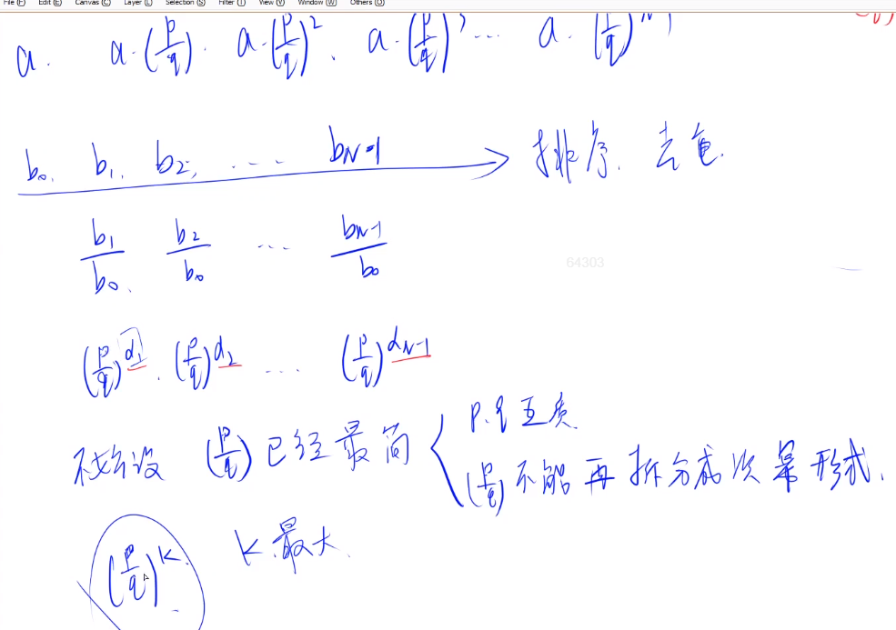
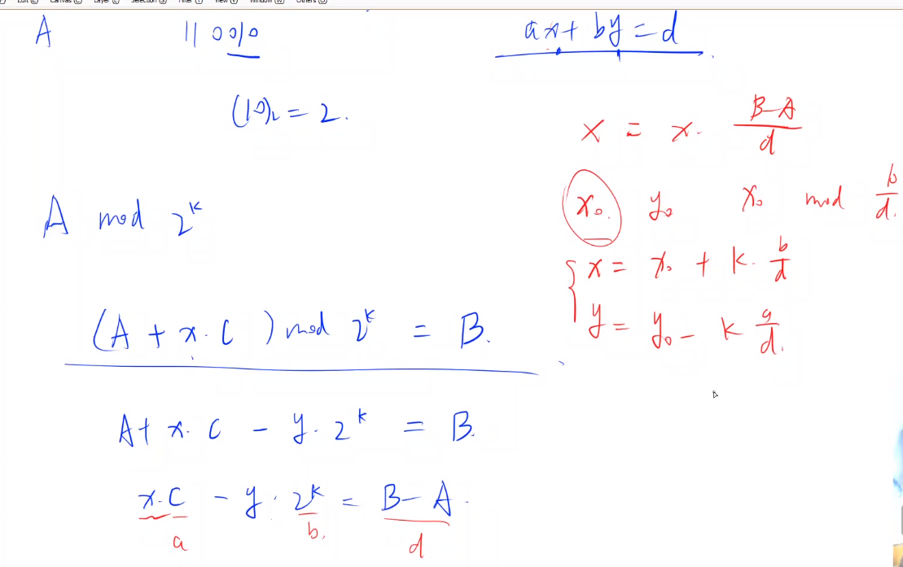
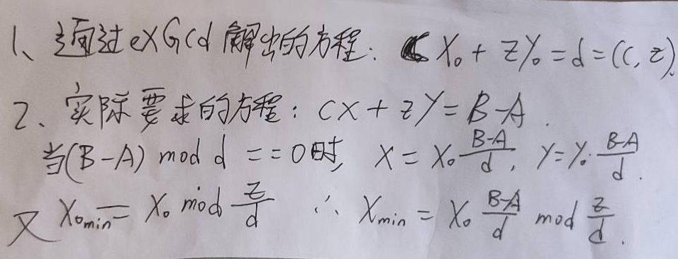

#### 1.5 acwing.1223. 最大比例

第七届蓝桥杯省赛C++A/B组

<!--more-->

```C++
X星球的某个大奖赛设了 M 级奖励。
每个级别的奖金是一个正整数。
并且，相邻的两个级别间的比例是个固定值。
也就是说：所有级别的奖金数构成了一个等比数列。
比如：16,24,36,54，其等比值为：3/2。
现在，我们随机调查了一些获奖者的奖金数。
请你据此推算可能的最大的等比值。

输入格式
第一行为数字 N ，表示接下的一行包含 N 个正整数。
第二行 N 个正整数 Xi，用空格分开，每个整数表示调查到的某人的奖金数额。

输出格式
一个形如 A/B 的分数，要求 A、B 互质，表示可能的最大比例系数。

数据范围
0<N<100
0<Xi<10^12
数据保证一定有解。

输入样例1：
3
1250 200 32
输出样例1：
25/4
输入样例2：
4
3125 32 32 200
输出样例2：
5/2
输入样例3：
3
549755813888 524288 2
输出样例3：
4/1
```

思路：

与等差数列那题有类似之处。

辗转相减法：也称为更相减损术，用于求两数的最大公约数。数学表达：`(a,b) = (b,a-b)`

基本原理是：大数减小数，直到两数相等时，即为最大公约数。

这个原理很容易理解，也很好证明。

辗转相除法的时间复杂度是O(logn)，而辗转相减法的时间复杂度是O(n)，当数据量达到10^9这种级别时，差

距很大，后者用到的情况很少。



我们要求最大的公比，也就是要保证k的取值最大，所以k是$\alpha_1,\alpha_2,...,\alpha_{N-1}$的最大公约数。

所以问题就是：给定两个数$p^x$和$p^y$，如何求出$f(p^x,p^y)=p^{(x,y)}$。

利用辗转相减法，$p^{(x,y)}=p^{(y,y-x)}=f(p^y,p^{y-x})=f(p^y,\frac {p^y} {p^x})$，就转化成了一个递归问题。

```C++
#include <iostream>
#include <cstdio>
#include <algorithm>
using namespace std;
typedef long long LL;
const int N = 110;

LL x[N],a[N],b[N];
int n;

LL gcd(LL a,LL b){
    return b ? gcd(b,a%b):a;
}
//我们这里要用更相减损术的是指数，所以要让(p/q)^x1,(p/q)^x2,...,(p/q)^x(N-1)，两两计算，互除，除到结果为1,即x1=x2,此时幂次为0，结果为1，这其实就是y总的思路
//把分子分母分别去算，结果是相同的因为，分子分母的幂次是相同的
LL gcd_sub(LL a,LL b){
    if (a < b) swap(a,b);// 保证a>b，大的除以小的
    if (b == 1) return a;// 递归边界
    return gcd_sub(b,a/b);
}

int main(){
    cin >> n;
    for (int i = 0;i < n;i++) cin >> x[i];
    sort(x,x+n);// 排序

    int cnt = 0;
    for (int i = 1;i < n;i++){
        if (x[i] != x[i-1]){// 判重
            LL d = gcd(x[i],x[0]);
            a[cnt] = x[i]/d;//得到x[i]/x[0]的分子
            b[cnt] = x[0]/d;//得到x[i]/x[0]的分母
            cnt++;
        }
    }

    LL up = a[0],down = b[0];
    for (int i = 1;i < cnt;i++){// a[i1]/b[i1] = p^x,a[i2]/b[i2] = p^y，求p^(x,y)
        up = gcd_sub(up,a[i]);
        down = gcd_sub(down,b[i]);
    }
    cout << up << '/' << down << endl;
    return 0;
}
```

#### 1.6 acwing.1301. C 循环

《信息学奥赛一本通》 , POJ

```C++
对于 C 语言的循环语句，形如：
for (variable = A; variable != B; variable += C)
  statement;
请问在 k 位存储系统中循环几次才会结束。
若在有限次内结束，则输出循环次数。否则输出死循环。

输入格式
多组数据，每组数据一行四个整数 A,B,C,k。
读入以 0 0 0 0 结束。

输出格式
若在有限次内结束，则输出循环次数。
否则输出 FOREVER。

数据范围
1≤k≤32,
0≤A,B,C<^2k
输入样例：
3 3 2 16
3 7 2 16
7 3 2 16
3 4 2 16
0 0 0 0
输出样例：
0
2
32766
FOREVER
```

思路：类似五指山那题。

k位系统指的是对于一个数A只能存储k个二进制位，也就是A mod 2^k的结果。

比如110010，对于3位系统只能存下后三位(010)2 = (2)10。

所以退出循环的条件就是：(A + xC) mod 2^k = B，求x的最小值。

转化为：xC - y*2^k = B - A。

再利用扩展欧几里得算法求解方程ax+by = c的方式来解上面的方程。



当(a,b)|B-A时，有解，否则无解。

```C++
#include <algorithm>
#include <iostream>
using namespace std;

typedef long long LL;

LL exGcd(LL a,LL b,LL &x,LL &y){// ax + by = d
    if (b==0){
        x = 1,y = 0;
        return a;
    }
    LL d = exGcd(b,a%b,y,x);
    y -= a/b*x;
    return d;
}
int main(){
    LL a,b,c,k;
    while(cin >> a >> b >> c >> k,a || b || c || k){
        LL z = 1ll << k,x,y;// z是long long的1
        LL d = exGcd(c,z,x,y);
        if ((b-a) % d)  puts("FOREVER");
        else{
            x *= (b-a)/d;
            z /= d;
            cout << (x%z+z)%z << endl;
        }   
    }
    return 0;
}
```



