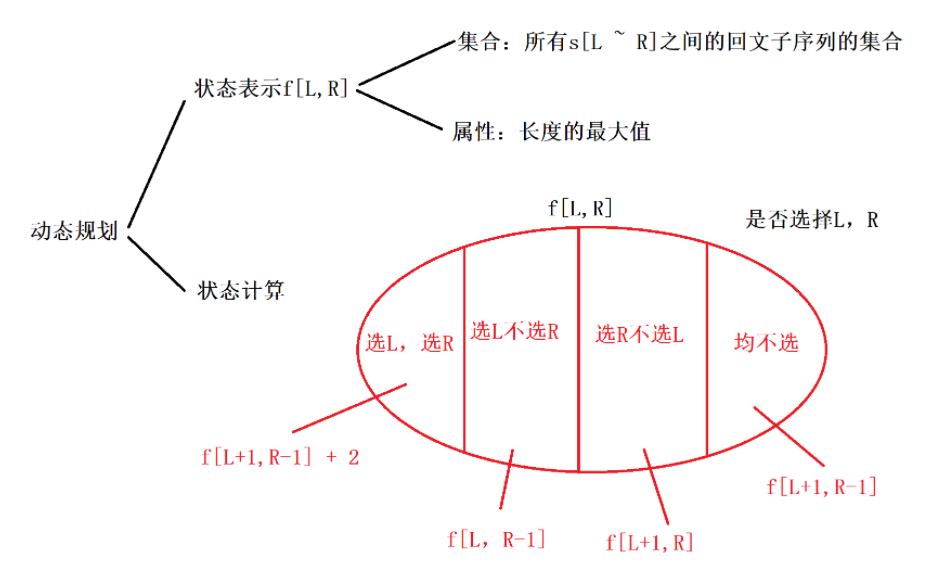
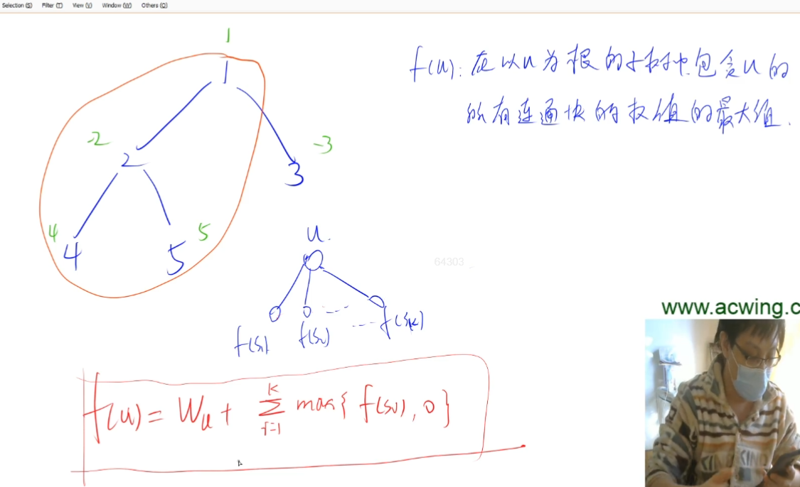
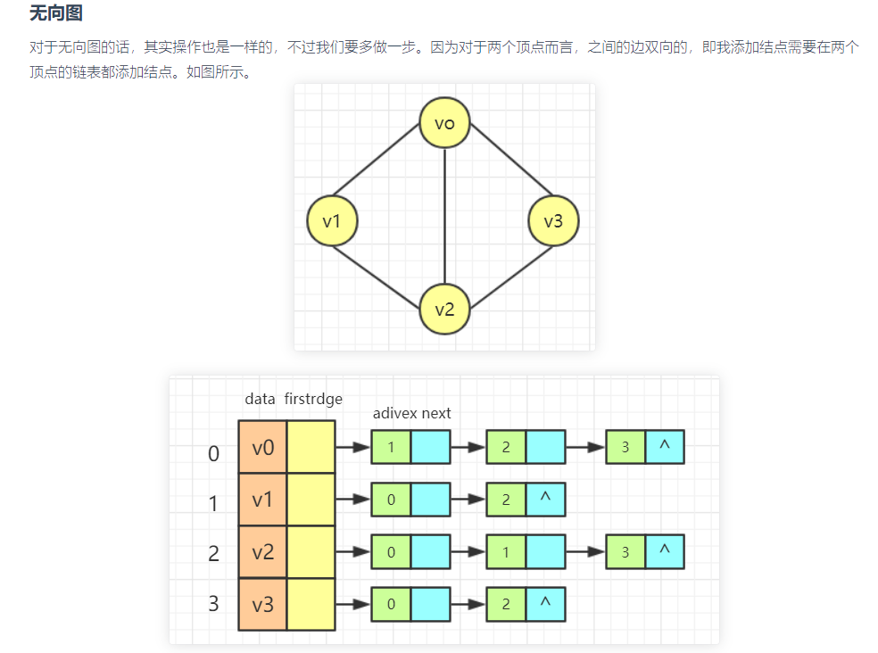
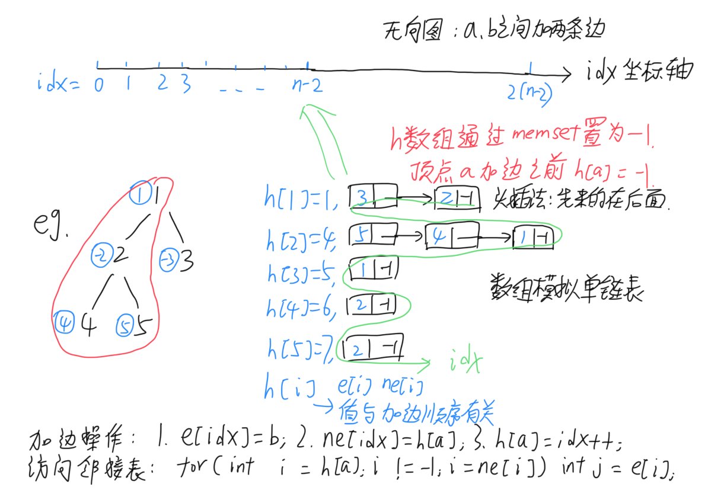

#### 1.3 acwing.1222. 密码脱落

第七届蓝桥杯省赛C++A/C组,第七届蓝桥杯省赛JAVAC组

<!--more-->

```C++
X星球的考古学家发现了一批古代留下来的密码。
这些密码是由A、B、C、D 四种植物的种子串成的序列。
仔细分析发现，这些密码串当初应该是前后对称的（也就是我们说的镜像串）。
由于年代久远，其中许多种子脱落了，因而可能会失去镜像的特征。
你的任务是：
给定一个现在看到的密码串，计算一下从当初的状态，它要至少脱落多少个种子，才可能会变成现在的样子。

输入格式
共一行，包含一个由大写字母ABCD构成的字符串，表示现在看到的密码串。

输出格式
输出一个整数，表示至少脱落了多少个种子。

数据范围
输入字符串长度不超过1000

输入样例1：
ABCBA
输出样例1：
0
输入样例2：
ABDCDCBABC
输出样例2：
3
```

思路：

考察**区间DP**问题。区间DP属于线性DP的一种。（参考[oi-wiki](https://oi-wiki.org/dp/interval/)）

令状态 f(i,j)表示将下标位置 i 到 j 的所有元素合并能获得的价值的最大值，那么 

f(i,j)=max{f(i,k)+f(k+1,j)+cost}，cost为将这两组元素合并起来的代价。

区间 DP 的特点：

**合并**：即将两个或多个部分进行整合，当然也可以反过来；

**特征**：能将问题分解为能两两合并的形式；

**求解**：对整个问题设最优值，枚举合并点，将问题分解为左右两个部分，最后合并两个部分的最优值得到原问题的最优值。

题目问的是已知当前序列，求从原始状态到现在至少脱落了多少个种子。

将题意转化一下：已知当前序列，求至少添加几个种子使它成为镜像串。（逆向思维）

还可以继续转化一下：**已知当前序列，求至少删去几个种子使它成为镜像串。**（可行性：添加种子使得左右配对也就等价于删去无法配对的单独种子）

所以最终的答案就是：**至少脱落的种子数量=序列总长度 - 最长回文子序列长度**。

注意：子串和子序列有区别，前者要求是序列中连续的一段，后者没有要求连续。

**算法1：y氏DP分析法。**



关于第2和3种情况：情况2是包含L且不包含R；而f[L,R-1]表示的是所有从L到R-1的回文子序列的集合，它一定不包含R，但L是否包含不确定，所以它表示的子序列范围比情况2更大。由于集合属性是长度的最大值，且包含L的长度一定比不包含L的长度大，所以情况2集合的属性等价于f[L,R-1]的属性。（情况3分析类似）

我们发现第4种情况实际上是包含在第2和3种情况中的，所以可以省略第4种情况，前3种情况就能覆盖全部情况了。

对于端点从小到大枚举，这种做法是错误的，因为求f[L,R]会涉及到f[L+1,R-1]，而后者还没计算。

所以我们采用下面的方法，保证现在计算的状态所用到的之前的状态都已经计算过了。

每个区间状态都是由被它包含的更小的区间状态转移而来，所以我们一般先枚举区间长度，再枚举区间左右端点，再枚举决策，构成三层循环。（决策可能不需要多一重循环）

```C++
#include <cstdio>
#include <cstring>
#include <algorithm>
using namespace std;

int n;
char s[1010];
int dp[1010][1010];// 求max，dp数组初始化为0

int main(){
    scanf("%s",&s);
    int n = strlen(s);
    for (int len = 1;len <= n;len++)
        for (int i = 0;i + len - 1 < n;i++){// i,j分别表示左右端点
            int j = i + len - 1;
            if (len == 1) dp[i][j] = 1;// 初始化len=1的情况,dp[0][1]的len=2
            else{
                dp[i][j] = max(dp[i+1][j],dp[i][j-1]);// 情况2和3
                if (s[i] == s[j]) dp[i][j] = max(dp[i][j],dp[i+1][j-1] + 2);// 情况1
            }// 当len=2时，情况1计算f[0][1]会用到f[1][0]，这个数不合法，这时的子序列长度应为2
            // 而f[1][0]=0，所以不会影响
        }
    printf("%d\n",n - dp[0][n-1]);
    return 0;
}
```

**算法2：另一种DP解法。**

参考自：https://www.acwing.com/solution/content/37925/。

```C++
#include <iostream>
#include <cstring>

using namespace std;

const int N = 1010;

int f[N][N];//f[l][r]:表示将s[l~r]变成镜像串的最小操作数
/*
    状态转移方程：
        ①s[l] == s[r]，此时可以直接从f[l + 1][r - 1]转移而来，并且操作数不用变
        ②s[l] != s[r]，此时可以选择从f[l + 1][r] 或 f[l][r - 1]转移而来，并且操作数+1
*/
string s;
int main()
{
    cin >> s;
    int n = s.size();
    memset(f , 0x3f , sizeof f);// 求min，所以f数组置为INF，否则结果一直是0

    for(int len = 0 ; len <= n ; len++)// len必须从0开始枚举，与上一种方法不同
        for(int l = 0 ; l + len - 1 < n ; l++)
        {
            int r = l + len - 1;
            if(len <= 1) f[l][r] = 0;// 初始化len<=1的情况，长度为1或0就是镜像串
            else
            {
                if(s[l] == s[r]) f[l][r] = f[l + 1][r - 1];
                else f[l][r] = min(f[l][r] , min(f[l + 1][r] , f[l][r - 1]) + 1);
            }// 当len=2时，情况1计算f[0][1]会用到f[1][0]，这个数不合法，这时的子序列操作数应为0
            // 而len=0的时候已经令f[1][0]=0，所以不会影响
        }

    cout << f[0][n - 1] << endl;
}
```

以上2种做法最好都掌握。**注意DP数组的初始化问题**，看决策是求max还是求min，还是别的。

#### 1.4 acwing.1220. 生命之树

第六届蓝桥杯省赛C++B组,第六届蓝桥杯省赛JAVAB组

```C++
在X森林里，上帝创建了生命之树。
他给每棵树的每个节点（叶子也称为一个节点）上，都标了一个整数，代表这个点的和谐值。
上帝要在这棵树内选出一个非空节点集 S，使得对于 S 中的任意两个点 a,b，都存在一个点列 {a,v1,v2,…,vk,b} 使得这个点列中的每个点都是 S 里面的元素，且序列中相邻两个点间有一条边相连。
在这个前提下，上帝要使得 S 中的点所对应的整数的和尽量大。
这个最大的和就是上帝给生命之树的评分。
经过 atm 的努力，他已经知道了上帝给每棵树上每个节点上的整数。
但是由于 atm 不擅长计算，他不知道怎样有效的求评分。
他需要你为他写一个程序来计算一棵树的分数。

输入格式
第一行一个整数 n 表示这棵树有 n 个节点。
第二行 n 个整数，依次表示每个节点的评分。
接下来 n−1 行，每行 2 个整数 u,v，表示存在一条 u 到 v 的边。
由于这是一棵树，所以是不存在环的。
树的节点编号从 1 到 n。

输出格式
输出一行一个数，表示上帝给这棵树的分数。

数据范围
1≤n≤10^5,
每个节点的评分的绝对值均不超过 10^6。

输入样例：
5
1 -2 -3 4 5
4 2
3 1
1 2
2 5
输出样例：
8
```

思路：

考察**树形DP**，其实就是把DP放在树上处理，一般采用深度优先遍历的方式递归处理。

图的存储方式在蓝桥杯总结（二一）介绍过了，这里就不重复了。（这里用邻接表存储）

题意：找到一个无向图中的连通块，使得它的节点权值的总和最大。

深度优先遍历每个子结点。



状态表示：f[u]:在以u为根的子树中包含u的所有连通块的权值的最大值

状态计算：假设s1，s2,…sk 是u的孩子，f[u]=w[u]+max(f[s1],0)+max(f[s2],0)+…max(f[sk],0)从根结点开始

时间复杂度：O(n)。只需要计算每条边，一共n-1条边。

这里采用数组实现邻接表来存储图。（图论一章介绍过数组实现单链表，忘记了的话看看826.单链表）

对于图的各种存储方式还不懂的话建议参考：https://www.cnblogs.com/linfangnan/p/12745834.html





```C++
#include <cstdio>
#include <cstring>
#include <algorithm>

using namespace std;

typedef long long LL;

const int N = 100010, M = N * 2;// N个顶点至多2*N条有向边

int n;
int w[N];// 节点的权值
int h[N], e[M], ne[M], idx;
// h是顶点集（头结点），e[i]=b表示a指向b（一条边），ne[i]表示结点i的next的指针，idx指向当前需要插入（已经用过）的结点
LL f[N];// 在以u为根的子树中包含u的所有连通块的权值的最大值

void add(int a, int b)// 这里采用数组实现邻接表来存储图，也就是将多个单链表h[i]拼起来
{
    e[idx] = b, ne[idx] = h[a], h[a] = idx ++ ;// 头插法创建单链表，新节点指向已有节点
    // h[a]是单链表a的起点，相当于头结点，最后一个插入元素的地址，也是idx区间的终点
}

void dfs(int u, int father)// 求f[i]，第二个参数记录父节点，防止往回走
{
    f[u] = w[u];
    for (int i = h[u]; i != -1; i = ne[i])// i != -1等价于~i
    {
        int j = e[i];
        if (j != father)
        {
            dfs(j, u);
            f[u] += max(0ll, f[j]);// long long的0，和0比较一下，如果<=0没必要加上
        }
    }
}

int main()
{
    scanf("%d", &n);
    memset(h, -1, sizeof h);// 记得h数组置-1

    for (int i = 1; i <= n; i ++ ) scanf("%d", &w[i]);
    for (int i = 0; i < n - 1; i ++ )// 一共n-1条边
    {
        int a, b;
        scanf("%d%d", &a, &b);
        add(a, b), add(b, a);// 构建无向图
    }

    dfs(1, -1);

    LL res = f[1];
    for (int i = 2; i <= n; i ++ ) res = max(res, f[i]);// 求f[1]到f[n]的max

    printf("%lld\n", res);

    return 0;
}
```

