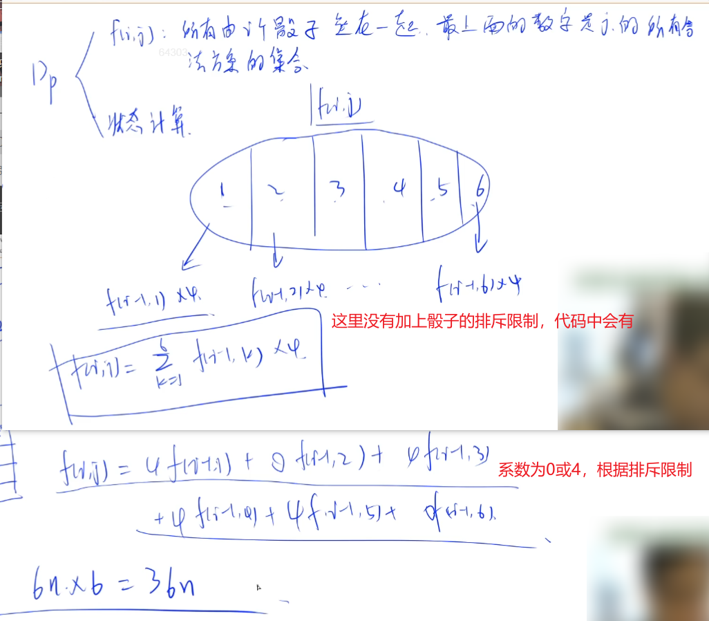
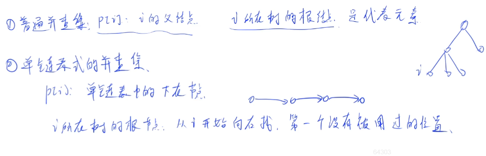
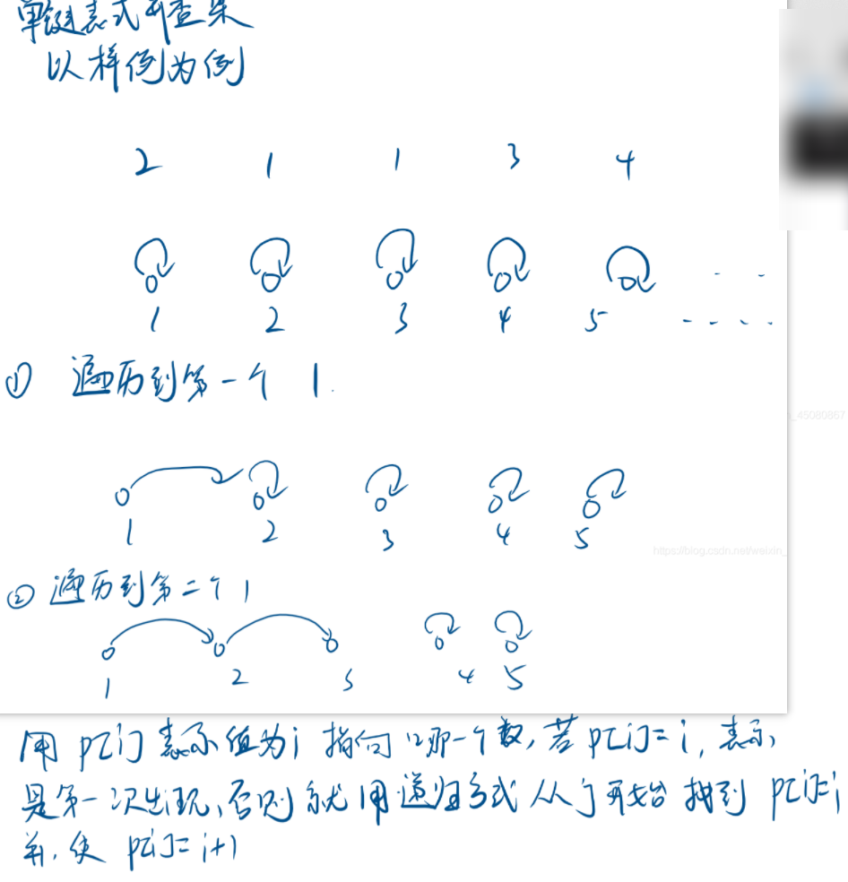
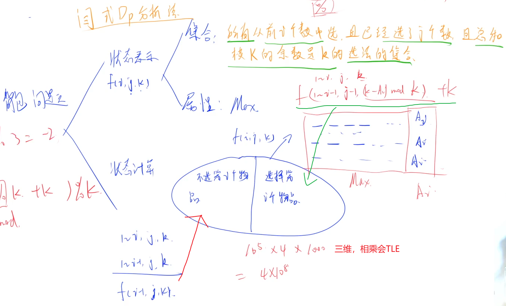

#### 2.5 acwing.1217.垒骰子

第六届蓝桥杯省赛C++A/B/C组,第六届蓝桥杯省赛JAVAA/B/C组

<!--more-->

```C++
 赌圣atm晚年迷恋上了垒骰子，就是把骰子一个垒在另一个上边，不能歪歪扭扭，要垒成方柱体。
经过长期观察，atm 发现了稳定骰子的奥秘：有些数字的面贴着会互相排斥！
我们先来规范一下骰子：1 的对面是 4，2 的对面是 5，3 的对面是 6。
假设有 m 组互斥现象，每组中的那两个数字的面紧贴在一起，骰子就不能稳定的垒起来。
atm想计算一下有多少种不同的可能的垒骰子方式。
两种垒骰子方式相同，当且仅当这两种方式中对应高度的骰子的对应数字的朝向都相同。
由于方案数可能过多，请输出模 10^9+7 的结果。

输入格式
第一行包含两个整数 n,m，分别表示骰子的数目和排斥的组数。
接下来 m 行，每行两个整数 a,b，表示 a 和 b 数字不能紧贴在一起。

输出格式
共一个数，表示答案模 10^9+7 的结果。

数据范围
1≤n≤10^9,
1≤m≤36,
1≤a,b≤6
输入样例：
2 1
1 2
输出样例：
544
```

思路：

考察矩阵快速幂算法，感觉很难想到。

看完题，先不考虑巨大的数据量，根据一步步往上垒骰子这种模式，首先要想到DP解法，然后再考虑优化。

一个骰子的摆放方式是24种 (任意一面朝上侧面都可以旋转四次 4 * 6 = 24)

状态划分根据加入的第i个骰子最上面的数字j是几分为6种情况。

状态数量是`6*n`，状态转移量是6，所以复杂度为`36*n`。



接下来再考虑通过矩阵快速幂来优化时间复杂度。

由于DP数组的这种迭代的特点和Fibonacci数列很相似，所以构造矩阵处理。

因为数字的互斥关系是固定的且只有一组样例，所以矩阵A是不变的，可以计算快速幂。

计算A^2的时候需要三重循环6^3，所以时间复杂度为O(216*logn)。

构造向量和矩阵：$F_i = [f_{i,1}\ f_{i,2}\ ...\ f_{i,6}],F_{i-1} = [f_{i-1,1}\ f_{i-1,2}\ ...\ f_{i-1,6}]$，然后可以找到一个矩阵A使得:$F_{i} = F_{i-1} * A$，所以：$F_n = F_1*A^{n-1}$。矩阵A由0和4构成。

规则：1 的对面是 4，2 的对面是 5，3 的对面是 6。

再根据排斥规则来计算A矩阵，每组排斥数会使得A中的两项为0。

这里做法可以改进一下，不用像Fibonacci数列构造向量，直接把F扩充成矩阵，第一行不变，后面全部置零，就不用多写一个矩阵乘向量的函数。

代码：

```C++
#include <cstdio>
#include <algorithm>
#include <cstring>
using namespace std;
typedef long long LL;
const int N = 6,P = 1e9+7;
int n,m;
int a[N][N];

int get_op(int x){// 求对面的数，0、1、2的对面是3、4、5
    if (x <= 2) return x + 3;
    else return x - 3;
}

void mul(int c[][N],int a[][N],int b[][N]){// 矩阵乘法：c = a*b
    int temp[N][N] = {0};
    for (int i = 0;i < N;i++)
        for (int j = 0;j < N;j++)
            for (int k = 0;k < N;k++)// a * b先用LL存，防止爆int
                temp[i][j] = (temp[i][j] + (LL)a[i][k]*b[k][j]) % P;
    memcpy(c,temp,sizeof temp);
}

int main(){
    scanf("%d%d",&n,&m);
    for (int i = 0;i < N;i++)
        for (int j = 0;j < N;j++) a[i][j] = 4;
    
    int x,y;
    while (m--){// 初始化矩阵a
        scanf("%d%d",&x,&y);
        x--,y--;// 从0开始计算，骰子上的数都-1
        a[x][get_op(y)] = 0,a[y][get_op(x)] = 0;
    }

    int f[N][N] = {4,4,4,4,4,4};// 初始化f矩阵，f1的第一行都是4，后面都是0
    for (int k = n-1;k;k >>= 1){// 快速幂的for循环写法
        if (k & 1) mul(f,f,a);
        mul(a,a,a);
    }

    int res = 0;// 计算i个骰子的所有摆放方案
    for (int i = 0;i < N;i++) res = (res + f[0][i]) % P;
    printf("%d\n",res);
    return 0;
}
```

## 十 疑难杂题

最后剩下的7道题难度还比较大。（前2道还好，后面更难）

最后一章写完，蓝桥杯系列文章也就结束了！

#### 1 acwing.1242. 修改数组

```C++
给定一个长度为 N 的数组 A=[A1,A2,⋅⋅⋅AN]，数组中有可能有重复出现的整数。
现在小明要按以下方法将其修改为没有重复整数的数组。
小明会依次修改 A2,A3,⋅⋅⋅,AN。
当修改 Ai 时，小明会检查 Ai 是否在 A1∼Ai−1 中出现过。
如果出现过，则小明会给 Ai 加上 1；如果新的 Ai 仍在之前出现过，小明会持续给 Ai 加 1，直到 Ai 没有在 A1∼Ai−1 中出现过。
当 AN 也经过上述修改之后，显然 A 数组中就没有重复的整数了。
现在给定初始的 A 数组，请你计算出最终的 A 数组。

输入格式
第一行包含一个整数 N。
第二行包含 N 个整数 A1,A2,⋅⋅⋅,AN。

输出格式
输出 N 个整数，依次是最终的 A1,A2,⋅⋅⋅,AN。

数据范围
1≤N≤10^5,
1≤Ai≤10^6
输入样例：
5
2 1 1 3 4
输出样例：
2 1 3 4 5
```

思路：

看到题目我大概能猜到是模拟题，果不其然。

本题有2种做法，平衡树和并查集。

如果不熟悉**朴素并查集**请移步：https://www.grantdrew.top/posts/ad6fe702.html。

算法1：并查集。（推荐做法，比较好写）

本题的并查集比较特殊，它是一个单链状的树。一般的并查集大多是多分支的树。

用到并查集的查找操作，没用到合并操作。

参考：https://www.acwing.com/solution/content/9045/





时间复杂度：O(N)。（N = Ai）

```C++
#include <cstdio>

using namespace std;
const int N = 1e6+5;// Ai的大小

int n;
int p[N];

int find(int a){
    if (p[a] != a) p[a] = find(p[a]);// p[a] = a表示还没用过，递归查找没用过的第1个数
    return p[a];
}

int main(){
    scanf("%d",&n);
    for (int i = 1;i < N;i++) p[i] = i;// 初始化，编号最大值是N，不是n

    int x;
    for (int i = 0;i < n;i++){
        scanf("%d",&x);
        x = find(x);// 找到第1个没有用过的数
        printf("%d ",x);
        p[x] = x + 1;// p[x]表示x在树中的下一个结点
    }
    return 0;
 }
```

算法2：平衡树/STL set。这里先不介绍，比较麻烦。

有兴趣参考题解：https://www.acwing.com/solution/content/43965/。

#### 2 acwing.1234. 倍数问题

第九届蓝桥杯省赛C++A组,第九届蓝桥杯省赛JAVAA组

```C++
众所周知，小葱同学擅长计算，尤其擅长计算一个数是否是另外一个数的倍数。
但小葱只擅长两个数的情况，当有很多个数之后就会比较苦恼。
现在小葱给了你 n 个数，希望你从这 n 个数中找到三个数，使得这三个数的和是 K 的倍数，且这个和最大。
数据保证一定有解。

输入格式
第一行包括 2 个正整数 n, K。
第二行 n 个正整数，代表给定的 n 个数。

输出格式
输出一行一个整数代表所求的和。

数据范围
1≤n≤10^5,
1≤K≤10^3,
给定的 n 个数均不超过 10^8
输入样例：
4 3
1 2 3 4
输出样例：
9
```

思路：

这题考察背包问题。

与 acwing.1047. 糖果 类似，只不过多了一个只能选择3个数的限制。

本题要选择n个数，选3个数，且和是k的倍数。限制条件有3个，所以DP需要3个维度，是背包问题的变形。

将k的倍数问题转化为mod k的余数是多少，这样就很容易用DP处理。（y总的技巧）

注意可能出现负余数需要处理一下。

y氏DP分析法：



算法1：三维朴素DP解法，TLE+MLE。y总上面计算过了，空间太大了。（测试的2个样例都能过）

```C++
#include <cstdio>
#include <algorithm>
#include <cstring>
using namespace std;

const int N = 1e5+5,M = 1005;
int n,t;
int dp[N][4][M];// j从0到3都需要使用，至少开4

int main(){
    scanf("%d%d",&n,&K);
    memset(dp,-0x3f,sizeof dp);// 求max置为-INF
    for (int i = 0;i <= n;i++) dp[i][0][0] = 0;// 初始化条件

    int x;
    for (int i = 1;i <= n;i++){
        scanf("%d",&x);// 边读入边处理
        for (int j = 1;j <= 3;j++){
            for (int k = 0;k < K;k++){// 记得处理负余数
                dp[i][j][k] = max(dp[i-1][j][k],dp[i-1][j-1][((k-x)%t + t) % t] + x);
            }
        }
    }
    printf("%d\n",dp[n][3][0]);
    return 0;
}
```

算法2：二维DP+贪心优化。时间复杂度：O(3m*3m)。

贪心策略：我们会发现，选取一个数x和它本身的大小无关，而与x mod K的值有关，当有多个数取值相等时，取最大的数。

算法1中DP数组第1维大小是10^8，贪心优化之后，对于0~10^3-1的每个余数取值，只需要取前三大的数就行，所以DP数组第1维大小是3*10^3。这里用二维优化，n个数用另外的数组存。

二维优化类似01背包的滚动数组，第二维j必须逆序遍历！

```C++
#include <cstdio>
#include <vector>
#include <cstring>
#include <algorithm>
using namespace std;
const int N = 1005;
int n,m;
int dp[4][N];
vector<int> a[N];

int main(){
    scanf("%d%d",&n,&m);

    int x;
    for (int i = 1;i <= n;i++){
        scanf("%d",&x);
        a[x % m].push_back(x);
    }

    memset(dp,-0x3f,sizeof dp);
    dp[0][0] = 0;

    for (int i = 0;i < m;i++){
        sort(a[i].begin(),a[i].end());
        reverse(a[i].begin(),a[i].end());// 从小到大排序再反转，实现从大到小排序
        for (int u = 0;u < 3 && u < a[i].size();u++){
            // 加上<size的判断，a[i]的数可能不够3个
            int x = a[i][u];
            for (int j = 3;j >= 1;j--){
                for (int k = 0;k < m;k++){
                    dp[j][k] = max(dp[j][k],dp[j-1][(k - x%m + m) % m] + x);
                    //原式：f[i][j][k]=max(f[i-1][j][k], 
                    //f[i-1][j-1][(k-x%m + m)%m] + x)
                    //等价变形即为代码式子<-让j从大到小枚举即为等价变形
                }
            }
        }
    }

    printf("%d\n",dp[3][0]);
    return 0;
}
```


