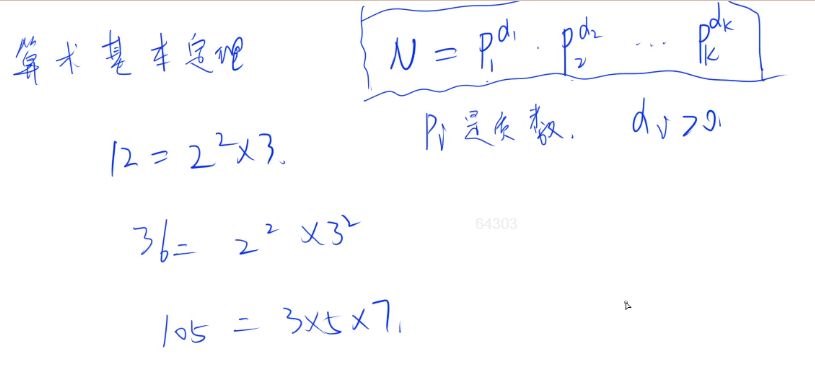

#### 3.3 acwing.1237. 螺旋折线

第九届蓝桥杯省赛C++B组,第九届蓝桥杯省赛JAVAB组

<!--more-->


```C++
对于整点 (X,Y)，我们定义它到原点的距离 dis(X,Y) 是从原点到 (X,Y) 的螺旋折线段的长度。
例如 dis(0,1)=3,dis(−2,−1)=9
给出整点坐标 (X,Y)，你能计算出 dis(X,Y) 吗？

输入格式
包含两个整数 X,Y。

输出格式
输出一个整数，表示 dis(X,Y)。

数据范围
−10^9≤X,Y≤10^9
输入样例：
0 1
输出样例：
3
```

思路：

算法1：模拟。参考[756.蛇形矩阵](https://www.acwing.com/problem/content/description/758/)

需要遍历所有点，大概10^18，TLE。

算法2：找规律。

把红线上所有点的dis(x,y)算出来，直接找规律。

观察数据范围，发现时间复杂度应该控制到$O(\sqrt n)$。

我们按正方形的圈数n来找规律。上面是对称的，下面不是对称的。


判断点在哪个方向的边上时，可以画两条线y=x和y=-x来判断。

时间复杂度：O(1)。

```C++
#include <iostream>
#include <algorithm>
using namespace std;
typedef long long LL;
int x,y;
int main(){
    cin >> x >> y;
    if (abs(x) <= y){// 在上方
        int n = y;// dis = 起点dis + 偏移量
        cout << (LL)(2*n-1)*(2*n) + x - (-n);
    }
    else if (abs(y) <= x){// 在右方
        int n = x;
        cout << (LL)(2*n)*(2*n) + n - y;
    }
    else if (abs(x) <= abs(y) + 1 && y < 0){// 在下方
        // 必须满足y < 0，如果不加可能在左方，eg.(-3,2)
        int n = abs(y);
        cout << (LL)(2*n)*(2*n+1) + n - x;
    }
    else{// 在左方
        int n = abs(x);
        cout << (LL)(2*n-1)*(2*n-1) + y - (-n+1);
    }
    return 0;
}
```

## 八 数论

推荐一个系列文章：https://mp.weixin.qq.com/s/dFBbbTB8Fz2_n3YeMIj7nw

推荐一个数学系（ACM选手）UP主：https://www.bilibili.com/video/BV1Nb411y7ZX

这是他的知乎文章：https://www.zhihu.com/question/379824357/answer/1088257294

最大公约数与最大公倍数问题请参考[gcd问题与lcm问题](https://www.grantdrew.top/posts/e808698d.html).

参考资料：https://oi-wiki.org/math/gcd/。


`int gcd(int a,int b){return !b?a:gcd(b,a%b);} // 注意加上{}`

注意：这里要求a>b，但是a<b也能计算，会多递归一次，相当于交换。

#### 1.1 acwing.1246. 等差数列

第十届蓝桥杯省赛C++B/C组,第十届蓝桥杯省赛JAVAC组

```C++
数学老师给小明出了一道等差数列求和的题目。
但是粗心的小明忘记了一部分的数列，只记得其中 N 个整数。
现在给出这 N 个整数，小明想知道包含这 N 个整数的最短的等差数列有几项？

输入格式
输入的第一行包含一个整数 N。
第二行包含 N 个整数 A1,A2,⋅⋅⋅,AN。(注意 A1∼AN 并不一定是按等差数
列中的顺序给出)

输出格式
输出一个整数表示答案。

数据范围
2≤N≤100000,
0≤Ai≤10^9
输入样例：
5
2 6 4 10 20
输出样例：
10
样例解释
包含 2、6、4、10、20 的最短的等差数列是 2、4、6、8、10、12、14、16、18、20。
```

思路：


当公差d取到每个数与第一个数的差的最大公约数时，项数最少。前提时d != 0。

如果d = 0，那么项数 = n。

0与任何数a的最大公约数(0,a)是a。

```C++
#include <cstdio>
#include <algorithm>
using namespace std;
const int N = 100010;

int n;
int a[N];

int gcd(int a,int b){
    return b ? gcd(b,a%b):a;    
}

int main(){
    scanf("%d",&n);
    for (int i = 0;i < n;i++) scanf("%d",&a[i]);
    sort(a,a+n);
    
    int d = 0;// 求gcd，i从1开始
    for (int i = 1;i < n;i++) d = gcd(d,a[i] - a[0]);
    
    if (d == 0) printf("%d\n",n);
    else printf("%d\n",(a[n-1] - a[0])/d + 1);
    
    return 0;
}
```

#### 1.2 acwing.1295. X的因子链

《信息学奥赛一本通》 , POJ

```C++
输入正整数 X，求 X 的大于 1 的因子组成的满足任意前一项都能整除后一项的严格递增序列的最大长度，以及满足最大长度的序列的个数。

输入格式
输入包含多组数据，每组数据占一行，包含一个正整数表示 X。

输出格式
对于每组数据，输出序列的最大长度以及满足最大长度的序列的个数。
每个结果占一行。

数据范围
1≤X≤2^20
输入样例：
2
3
4
10
100
输出样例：
1 1
1 1
2 1
2 2
4 6
```

思路：

**算术基本定理**

> 每一个正整数都可以表示成若干整数的乘积，这种分解方式在忽略排列次序的条件下是唯一的。



将题目中所给的正整数X进行质因数分解：$X=p_1^{\alpha_1}·p_2^{\alpha_2}····p_k^{\alpha_k}$($\alpha_i>0$，且$p_i$是质数)

所以X一共有$\alpha_1+\alpha_2+...+\alpha_k$个质因子。

审题：构建了一个序列{$a_k$}，序列中的每个数由X 的大于 1 的因子组成，

且满足任意前一项都能整除后一项的严格递增序列。求该序列的最大长度，以及满足最大长度的序列的个数。

注意：序列中每个数的构建方式，从X的因子中选取，**X的因子k满足k|X**。（质因子和因子不一样）

我们首先选取X的一个质因子作为首项，然后逐步加入一个新的质因子，这样序列的**最大长度**就是：

$\alpha_1+\alpha_2+...+\alpha_k$。所以，满足最大长度的序列的个数也就是**X的所有质因子的排列个数**。

但是要注意重复的质因子交换顺序还是同一种序列！所以我们先计算全排列，再去除相同项的排列。

举个例子：$X = 2^2*3^3*5$，一共有2+3+1=6个质因子，最大长度是6。最大长度序列个数有$\frac {6!} {2!*3!}$个。

6!是所有质因子（包括重复的）的全排列，2!表示相同的序列如2,3,3,5,2,3中在全排列中计算了2!次，但是实

际上是同一种，所以/2!。3!同理。

由特殊到一般，我们归纳出多重集的排列数问题的计算公式：

满足最大长度的序列的个数=$\frac {(\alpha_1+\alpha_2+...+\alpha_k)!} {\alpha_1!*\alpha_2!*...*\alpha_k!}$.

多重集的排列数常被称作 **多重组合数**，属于组合（离散）数学知识。

多重集的排列数 | 多重组合数参考资料：https://oi-wiki.org/math/combination/

**素数筛法**

如果我们想要知道小于等于n有多少个素数呢？

一个自然的想法是对于小于等于n的每个数进行一次质数检验。这种暴力的做法显然不能达到最优复杂度。

所以我们需要素数筛法，先来看**线性筛法**，也称**Euler 筛法**（欧拉筛法）。

它的时间复杂度是O(n)，可以求出1~n内的所有质数以及其中每个数的最小质因子。

在实现形式上，埃氏筛是直接用素数遍乘自然数删去自身倍数；线性筛是先建立一个素数数列，然后用每个自然数遍乘数列中的素数删去素数倍数。

线性筛法的思想：用**最小的质因子**筛掉合数。

如何保证线性:一个合数只能被筛掉一次。

如何保证一个数字只被筛掉一次:这个数字只被它的最小质因数筛掉，当它的其他质因数想要筛掉它时，将无法进行筛除操作。

参考文章1：https://blog.csdn.net/Wansit/article/details/115439545

参考文章2：https://blog.csdn.net/m0_49959202/article/details/108684545

参考文章3：https://zhuanlan.zhihu.com/p/124068032，把原理解释得很清楚。

```C++
#include <cstdio>
#include <iostream>
using namespace std;
const int N = 1000010;

int primes[N],cnt;// primes存放所有质数
bool st[N];// 当前数是否被筛过，1表示筛过，0表示没有被筛过
int min_p[N];// 存放i的最小质因数

void get_primes(int n){
    for (int i = 2;i <= n;i++){
        if (!st[i]) min_p[i] = i,primes[cnt++] = i;// 如果i未被筛过，那么这i必为素数
        for (int j = 0;j < cnt && primes[j] * i <= n;j++){// 筛掉pj*i这个合数
            st[primes[j] * i] = true;// pj一定不大于i的最小质因子，如果大于一定会break
            min_p[primes[j]*i] = primes[j];// pj*i的最小质因数是pj
            if (i % primes[j] == 0) break;// 保证要筛除的数只会被最小质因子筛除，不重复筛
        }
    }
}

int main(){
    get_primes(1000000);

    for (int i = 0;i < 20;i++) printf("%d\n",primes[i]);
    return 0;
}
```


`if(i%p[j]==0)break;`语句实现不重复删。证明很简单，自然数i从最小素数2开始乘，`i×p[j]`以每个`p[j]`为最小质因数，直到`p[j]`整除i时，`i×p[j]`还是以`p[j]`为最小质因数，但下一个数`i×p[j+1]=(i/p[j])×p[j]×p[j+1]`中`p[j+1]`就不是最小质因数了，所以不必继续乘了。

eg.当`i = 4`时，素数数组已经有2和3，`4*2`以`p[0]=2`为最小质因数，要筛掉。因为`4 % 2 == 0`，所以`break`。但是`4*3`不是以3而是2为最小质因数，它应该被`2*6`筛掉。

---

有了多重组合数和线性筛法的补充知识，再来看题目。

首先用线性筛法求出每个数的最小质因数，然后分解质因数，求出多重组合数。

代码：

```C++
#include <cstdio>
#include <iostream>
#include <algorithm>
using namespace std;
const int N = (1<<20)+1;
typedef long long LL;// 最多要计算20!，long long最大是2^31-1，可以存下
int primes[N],cnt;// primes存放所有质数
bool st[N];
int min_p[N];// 存放i的最小质因数
int fact[30],sum[25];// fact存放i的所有质因数，sum存放对应的次数，sum的次数最多不超过20

void get_primes(int n){
    for (int i = 2;i <= n;i++){
        if (!st[i]) min_p[i] = i,primes[cnt++] = i;
        for (int j = 0;j < cnt && primes[j]*i <= n;j++){
            int t = primes[j]*i;
            st[t] = true;
            min_p[t] = primes[j];
            if (i % primes[j] == 0) break;
        }
    }
}

int main(){
    get_primes(N);

    int x;
    while (scanf("%d",&x) != EOF){
    // 分解x的质因数，p为最小质因数，x = p*y,y=p1*z,z=p2*w,...,每次用最小质因数来分解，直到1
        int k = 0,tot = 0;// k记录质因数的个数，tot记录总的次数
        while (x > 1){
            int p = min_p[x];
            fact[k] = p,sum[k] = 0;
            while (x % p == 0){
                x /= p;
                sum[k] ++,tot++;
            }
            k++;
        }

        // 计算多重组合数
        LL res = 1;// 计算阶乘可以用前缀和方式处理一下，不用重复计算
        for (int i = 2;i <= tot;i++) res *= i;// 求tot!
        for (int i = 0;i < k;i++)
            for (int j = 2;j <= sum[i];j++) res /= j;// tot/(sum[i])!

        printf("%d %lld\n",tot,res);
    }
    return 0;
}
```

