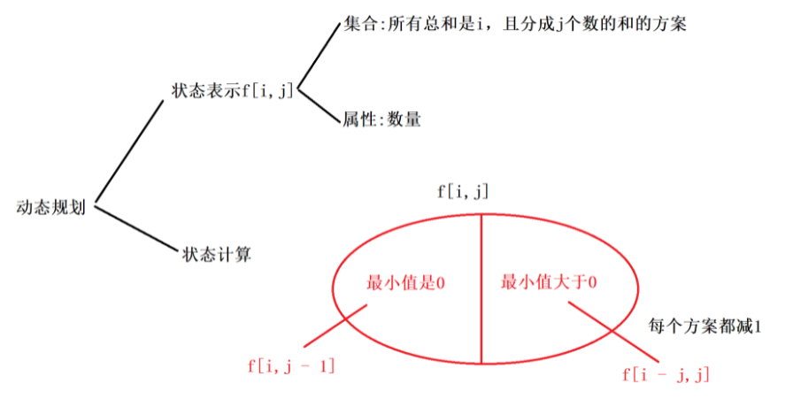
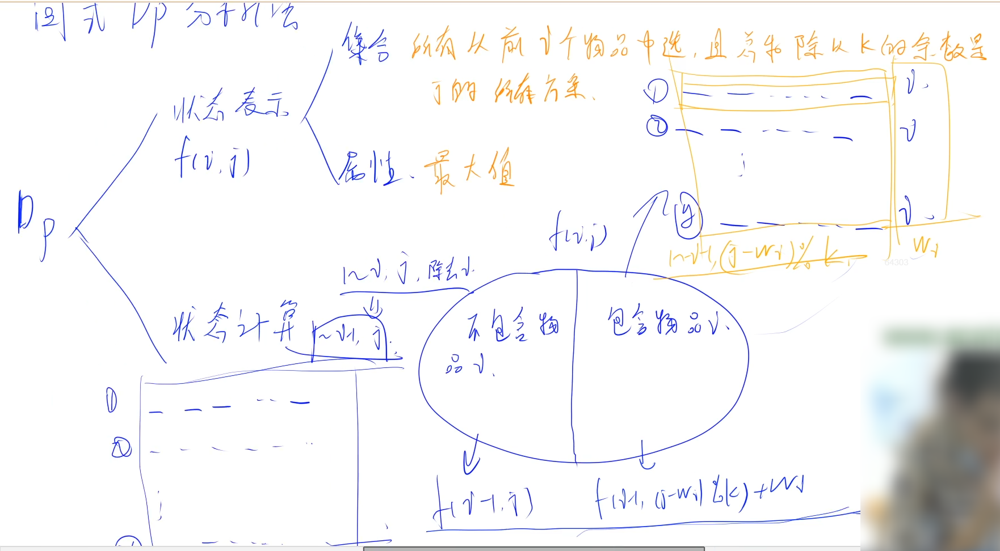

## 九 复杂DP

### 1.例题

#### 1.1 acwing.1050. 鸣人的影分身

《信息学奥赛一本通》

<!--more-->

```C++
在火影忍者的世界里，令敌人捉摸不透是非常关键的。
我们的主角漩涡鸣人所拥有的一个招数——多重影分身之术——就是一个很好的例子。
影分身是由鸣人身体的查克拉能量制造的，使用的查克拉越多，制造出的影分身越强。
针对不同的作战情况，鸣人可以选择制造出各种强度的影分身，有的用来佯攻，有的用来发起致命一击。
那么问题来了，假设鸣人的查克拉能量为 M，他影分身的个数最多为 N，那么制造影分身时有多少种不同的分配方法？
注意：
影分身可以分配0点能量。
分配方案不考虑顺序，例如：M=7,N=3，那么 (2,2,3) 和 (2,3,2) 被视为同一种方案。
    
输入格式
第一行是测试数据的数目 t。
以下每行均包含二个整数 M 和 N，以空格分开。

输出格式
对输入的每组数据 M 和 N，用一行输出分配的方法数。

数据范围
0≤t≤20,
1≤M,N≤10
输入样例：
1
7 3
输出样例：
8
```

思路：

**整数划分问题**，经典问题，积累。

算法1：递归dfs。(20ms)

这道题目相当于是把n个苹果放m个盘子里的一道题。（比较经典的题目）

```C++
#include<cstdio>
#include<algorithm>
#include<iostream>

using namespace std;

int f(int x,int y){
    if(x == 0) return 1;//没有苹果，全部盘子为0
    if(y == 0) return 0;//没有盘子，没法放
    if(y > x){//盘子数大于苹果数，至多只能x个盘子上都放一个 
        return f(x,x);
    }
    return f(x - y, y) + f(x, y - 1);//盘子数小于等于苹果数 -> 分类讨论：有盘子为空，没有盘子为空
//有盘子为空的时候即至少有一个盘子为空，f(x,y-1);没有盘子为空即最少每个盘子都有一个,f(x-y,y)     
}

int main(){
    int t,n,m;//n个苹果分到m个盘子里去，运行盘子为空 
    cin >> t;
    while(t --){
        cin >> n >> m;
        cout << f(n,m) << endl;
    }
    return 0;
}
作者：白線流つ
链接：https://www.acwing.com/solution/content/8444/
来源：AcWing
著作权归作者所有。商业转载请联系作者获得授权，非商业转载请注明出处。
```

算法2：dp。(20ms)

实际上我们可以发现，在递归的过程中就是要用到之前的数据，继而这道题可以转换为记忆化搜索将结果保存来做，即dp做法，但是这个dp是从递归去思考出来的- -而不是像灿总那样直接思考dp做法。

```C++
#include<iostream>
#include<cstdio>
using namespace std;
int a[25][25],m,n;
int main()
{
    int t,m,n;
    for(m=0;m<=10;m++)
        {
            for(n=0;n<=10;n++)
            {
                if(m<n)a[m][n]=a[m][m]; 
                else if(m==0)a[m][n]=1;// 注意a[0][0]是1
                else if(n==0)a[m][n]=0;
                else a[m][n]=a[m-n][n]+a[m][n-1];
            }
        }
    scanf("%d",&t);
    for(int i=1;i<=t;i++)
    {
        scanf("%d%d",&m,&n);

        printf("%d\n",a[m][n]);
    }
    return 0;
}
```

算法3：爆搜。(Java782ms,C++22ms)

暴力枚举每个盒子放多少个球，为了方便从左到右的球的数量从小到大递增，dfs过程中需要添加多start作为开始枚举的位置。

枚举时注意方案是不考虑顺序的！所以球的数量从小到大递增。可以画递归搜索树帮助理解！

```Java
import java.util.Scanner;

public class Main {
    static int n;
    static int m;
    static int ans = 0;
    //枚举第u个盒子，nums表示当前剩下多少个能量，从start数开始枚举
    static void dfs(int u,int nums,int start)
    {
        if(u == n + 1)
        {
            if(nums == 0) 
            {
                ans ++;
            }
            return;
        }
        if(start > nums) return;//可行性剪枝
        for(int i = start ;i <= nums;i ++)
        {
            dfs(u + 1,nums - i,i);
        }
    }
    public static void main(String[] args) {
        Scanner scan = new Scanner(System.in);
        int T = scan.nextInt();
        while(T -- > 0)
        {
             ans = 0;// 计算之前将ans置零
             m = scan.nextInt();//能量
             n = scan.nextInt();//分身个数
             dfs(1,m,0);
             System.out.println(ans);
        }
    }
}
作者：小呆呆
链接：https://www.acwing.com/solution/content/8648/
来源：AcWing
著作权归作者所有。商业转载请联系作者获得授权，非商业转载请注明出处。
```

算法4：y总DP分析。(11ms)

这里的集合划分依据比较难想到，但思路和前面2种算法有联系。



最小值=0：f[i,j]表示的所有方案中都空出至少1个盘子，转化为f[i,j-1]；

最小值>0：f[i,j]表示的所有方案中每个盘子至少有1个苹果，就可以让所有盘子的苹果数-1，是等价的，转化

为f[i-j,j]。

**注意初始化f[0,0]为1而不是0。状态计算满足的条件是j>=1和i>=j。**DP问题注意细节！！！

```C++
#include <iostream>
#include <cstring>
using namespace std;

int m,n;
int dp[11][11];

int main(){
    int t;
    cin >> t;
    while (t--){
        cin >> m >> n;
        //memset(dp,0,sizeof dp);也可以不加，会覆盖掉
        
        for (int i = 0;i <= n;i++) dp[0][i] = 1;// 0个苹果方案数都初始化为1
        
        for (int i = 1;i <= m;i++)
            for (int j = 1;j <= n;j++){
                dp[i][j] = dp[i][j-1];
                if (i >= j)  dp[i][j] += dp[i-j][j];
            }
            
        cout << dp[m][n] << endl;
    }
    return 0;
}
```

#### 1.2 acwing.1047. 糖果

《信息学奥赛一本通》

```C++
由于在维护世界和平的事务中做出巨大贡献，Dzx被赠予糖果公司2010年5月23日当天无限量糖果免费优惠券。
在这一天，Dzx可以从糖果公司的 N 件产品中任意选择若干件带回家享用。
糖果公司的 N 件产品每件都包含数量不同的糖果。
Dzx希望他选择的产品包含的糖果总数是 K 的整数倍，这样他才能平均地将糖果分给帮助他维护世界和平的伙伴们。
当然，在满足这一条件的基础上，糖果总数越多越好。
Dzx最多能带走多少糖果呢？
注意：Dzx只能将糖果公司的产品整件带走。

输入格式
第一行包含两个整数 N 和 K。
以下 N 行每行 1 个整数，表示糖果公司该件产品中包含的糖果数目，不超过 1000000。

输出格式
符合要求的最多能达到的糖果总数，如果不能达到 K 的倍数这一要求，输出 0。

数据范围
1≤N≤100,
1≤K≤100,

输入样例：
5 7
1
2
3
4
5
输出样例：
14
样例解释
Dzx的选择是2+3+4+5=14，这样糖果总数是7的倍数，并且是总数最多的选择。
```

思路：

考察背包问题的应用，本题考察01背包问题。背包问题也就是一种选择模型。

DP数组的第1维度往往是数量，第2维度往往是限制条件。



自己想不到DP集合的状态表示内容。这里状态表示的是方案，不是方案数量，属性是糖果总数的最大值。

筛选标准：最后不同的一步 (在这里是选不选这个物品) 

不选的话：子集合都不包括第 $i$ 个物品, 表示的意义就是前 $i-1$ 个物品, $\% k=j$ 的集合: $d p(i-1, j)$ 。

 选择第 $i$ 个物品：子集合都包括第 $i$ 个物品, 并且前面选择的商品和 $S$ 满足 $(S+a[i]) \% k=j$, 而我们需要从和这个 $S$ 有关的集合, 状态记录的都是% $k$ 后的结果, 所以我们只需要知道 $S \% k(=(j-a[i]) \% k)$ 的那个状态的值。

由于第2维度不具有单调性，所以不能优化成1维，其实01背包问题大多数情况下也没必要优化，一般空间大小都够。

```C++
#include <cstdio>
#include <cstring>
#include <algorithm>
using namespace std;

const int N = 105;
int dp[N][N];
int main(){
    int n,k;
    scanf("%d%d",&n,&k);
    
    memset(dp,-0x3f,sizeof dp);
    dp[0][0] = 0;// 初始化为0
    
    int w;
    for (int i = 1;i <= n;i++){
        scanf("%d",&w);
        for (int j = 0;j < k;j++) dp[i][j] = max(dp[i-1][j],dp[i-1][(j+k-w%k)%k] + w);
    }
    printf("%d\n",dp[n][0]);
    return 0;
}
```

设置memset(f,-0x3f,sizeof f);的解释，因为memset是按照字节赋值的。一个整型int有四个字节，所以这样赋值后，每个数组元素的值都变成了 -0x3f3f3f3f,而这个数的大小在-1e9的左右，由于一般的数据都不会小于-1e9，所以这时候它可以作为无穷小来用。

初始化：$d p(0,0)=0, d p(0, i)(i \neq 0)$ 都是**不合法的状态**, 所以必须要初始化为**负无穷**，不然的话可以选择先初始化第一件物品的所有情况，再迭代第二个物品之后(仔细想想, 如果不合法的状态初始化为0了, 后面递推的时候, 答案就会变大)

关于负余数的说明：下面大致说明下正确性，
1.假如 $(j-w[i]>=0)$, 由于 $k \% k=0$, 所以不会影响。
2.假如 $(j-w[i]<0)$, 带个负数进去试下就可以验证，在这里 $+k$ 可以使 $(j-w[i]) \% k$ 变成 $[0, n-1]$之间，再取余仍然是 $[0, n-1]$ 之间。