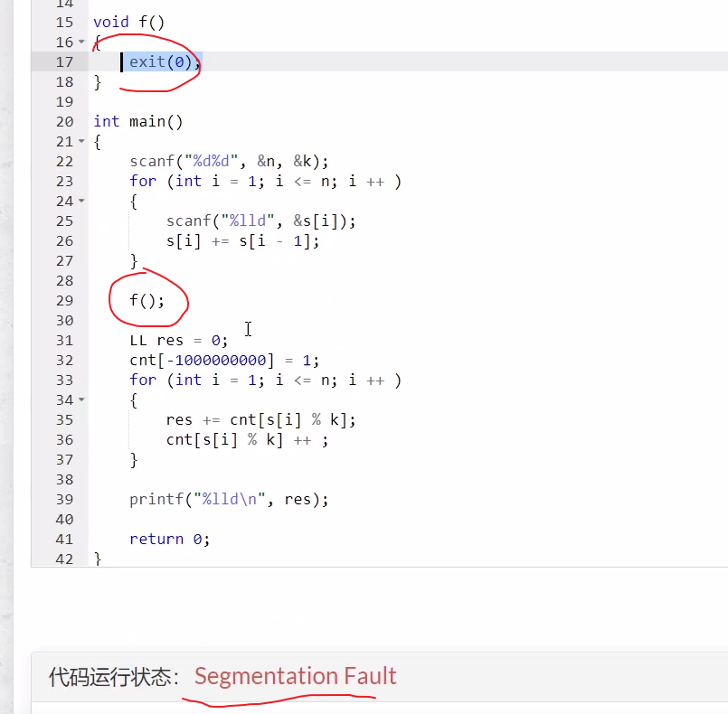

**100里程碑！！！**


<!--more-->

#### 2.4 acwing.1230. K倍区间（蓝桥杯第八届B组）

```C++
给定一个长度为 N 的数列，A1,A2,…AN，如果其中一段连续的子序列 Ai,Ai+1,…Aj 之和是 K 的倍数，我们就称这个区间 [i,j] 是 K 倍区间。
你能求出数列中总共有多少个 K 倍区间吗？

输入格式
第一行包含两个整数 N 和 K。
以下 N 行每行包含一个整数 Ai。

输出格式
输出一个整数，代表 K 倍区间的数目。

数据范围
1≤N,K≤100000,
1≤Ai≤100000
输入样例：
5 2
1
2
3
4
5
输出样例：
6
```

思路：

在比赛时，未必能一下就想到最优的解法，可以先从简单的暴力做法写起，拿到一部分分数，不要放弃。


对于第三重循环计算一段区间的总和，可以用前缀和简化。

我们发现可以存余数来判断是否满足要求，则可以优化成O(n)。

先开一个数组cnt[i]来存余数是i的数有多少个，用空间换时间。

附上一份高赞题解：https://www.acwing.com/solution/content/6909/

我们可以用一个数组cnt，规定cnt[i]表示当前位置之前，前缀和取模后等于i的个数，以后每出现一次前缀和

（取模后）和它相等，那么k倍区间就加上`cnt[s[i] % k]`，然后`cnt[s[i] % k]++`。

`res += cnt[s[i] % k];`先执行，因为要判断当前区间右端点的左边的同余元素，再更新当前位置。

`cnt=0`必须加上，当右端点为1时，若刚好是k的倍数，此时答案应该+1，若没有这句不会+1。

代码：

```C++
// y总题解
#include <cstdio>
using namespace std;
typedef long long LL; // 可能爆int
const int N = 100010;

LL s[N],cnt[N];
int n,k;
int main(){
    scanf("%d%d",&n,&k);
    for (int i = 1;i <= n;i++){
        scanf("%lld",&s[i]);
        s[i] += s[i-1];
    }
    LL res = 0;
    cnt[0] = 1;
    for (int i = 1;i <= n;i++){
        res += cnt[s[i]%k];
        cnt[s[i]%k]++;
    }
    printf("%lld",res);
    return 0;
}
```

补充：有关段错误的调试方法，使用exit(0)进行二分判断出错位置。

对于类似的没有输出信息的错误都可以采用这种二分找错的方法。



## 三 数学与简单DP

### 1.数学问题

关于数学问题，OIwiki是个好东西！

#### 1.1 acwing.1205. 买不到的数目（第四届A组）

```C++
小明开了一家糖果店。
他别出心裁：把水果糖包成4颗一包和7颗一包的两种。
糖果不能拆包卖。
小朋友来买糖的时候，他就用这两种包装来组合。
当然有些糖果数目是无法组合出来的，比如要买 10 颗糖。
你可以用计算机测试一下，在这种包装情况下，最大不能买到的数量是17。

大于17的任何数字都可以用4和7组合出来。
本题的要求就是在已知两个包装的数量时，求最大不能组合出的数字。

输入格式
两个正整数 n,m，表示每种包装中糖的颗数。

输出格式
一个正整数，表示最大不能买到的糖数。

数据范围
2≤n,m≤1000，
保证数据一定有解。

输入样例：
4 7
输出样例：
17
```

思路：

这是一个非常经典的问题，可以当作一个定理来用。（靠数学积累了）

先分析一下：

根据学过的代数知识，对于给定的数n，m，显然有：$(n,m)|n,(n,m)|m$，推出：$(n,m)|xn+ym$

也就是说，n和m的线性组合一定是(n,m)的倍数，只有这种情况才有解。

**给定a，b，若d=gcd(a,b)>1,则一定不能凑出最大数。答案要求a，b互质！**

有线性代数线性相关、无关，线性表出內味了！

没思路？试试打表找规律！（对于数学问题，没思路不妨试试打表）

**补充知识：裴蜀定理**，https://oi-wiki.org/math/bezouts/

是一个关于最大公约数的定理。

> 其内容是：
>
> 设a, b是不全为零的整数, 则存在整数x, y,使 $a x+b y=\operatorname{gcd}(a, b).$

证明过程看上面链接。它的一个重要推论是：a,b互质的充分必要条件是存在整数x,y使ax+by=1.

其实在高等代数的多项式部分有相关的定理、结论。

尝试dfs打表：

```C++
#include <iostream>
using namespace std;

bool dfs(int m,int p,int q){
    if (!m) return true;
    if (m >= p && dfs(m-p,p,q)) return true;
    if (m >= q && dfs(m-q,p,q)) return true;
    return false;
}
int main(){
    int p,q;
    cin >> p >> q;
    int res = 0;
    for (int i = 1;i <= 1000;i++){
        if (!dfs(i,p,q)) res = i;
        // res会不断更新到最大值
    }
    cout << res << endl;
    return 0;
}
/*
3 2 1
3 4 5
3 5 7
3 7 11
4 9 23
5 9 31
*/
```

m表示当前要凑的总数量，如果m == 0，就表示m已经被凑出来了，否则枚举当前选哪种糖，如果选p并且m - p可以被凑出来，那就是说明m可以被凑出；同理如果选q并且m - q可以被凑出来，那就说明m可以被凑出。

找规律：固定p不变，观察q变化时，答案怎么变化，再固定q不变，观察p变化时，答案怎么变化

```C++
2:n+2 m+2
3:n+1 m+2
4:n+2 m+6    3: m = 2n-3
                 1 = 2*2 + x x=-3   2n-3 = m
             4: m = 3n-4
             5: m = 4n-5
             p q
             ans = (q-1)p - q
```

找到规律直接给出代码：

```C++
// 证明比较复杂，以后可以当作结论直接记住
#include <iostream>
using namespace std;

int main(){
    int p,q;
    cin >> p >> q;
    cout << (p-1)*(q-1)-1;
    return 0;
}
```

