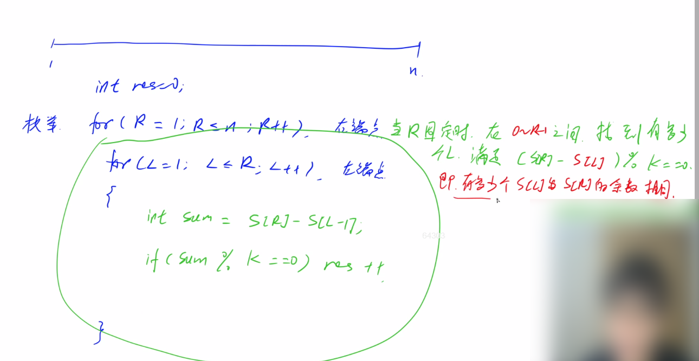

**100里程碑！！！**


<!--more-->

#### 2.4 acwing.1230. K倍区间（蓝桥杯第八届B组）

```C++
给定一个长度为 N 的数列，A1,A2,…AN，如果其中一段连续的子序列 Ai,Ai+1,…Aj 之和是 K 的倍数，我们就称这个区间 [i,j] 是 K 倍区间。
你能求出数列中总共有多少个 K 倍区间吗？

输入格式
第一行包含两个整数 N 和 K。
以下 N 行每行包含一个整数 Ai。

输出格式
输出一个整数，代表 K 倍区间的数目。

数据范围
1≤N,K≤100000,
1≤Ai≤100000
输入样例：
5 2
1
2
3
4
5
输出样例：
6
```

思路：

在比赛时，未必能一下就想到最优的解法，可以先从简单的暴力做法写起，拿到一部分分数，不要放弃。



对于第三重循环计算一段区间的总和，可以用前缀和简化。

我们发现可以存余数来判断是否满足要求，则可以优化成O(n)。

先开一个数组cnt[i]来存余数是i的数有多少个，用空间换时间。

附上一份高赞题解：https://www.acwing.com/solution/content/6909/

我们可以用一个数组cnt，规定cnt[i]表示当前位置之前，前缀和取模后等于i的个数，以后每出现一次前缀和

（取模后）和它相等，那么k倍区间就加上`cnt[s[i] % k]`，然后`cnt[s[i] % k]++`。

`res += cnt[s[i] % k];`先执行，因为要判断当前区间右端点的左边的同余元素，再更新当前位置。

`cnt=0`必须加上，当右端点为1时，若刚好是k的倍数，此时答案应该+1，若没有这句不会+1。

代码：

```C++
// y总题解
#include <cstdio>
using namespace std;
typedef long long LL; // 可能爆int
const int N = 100010;

LL s[N],cnt[N];
int n,k;
int main(){
    scanf("%d%d",&n,&k);
    for (int i = 1;i <= n;i++){
        scanf("%lld",&s[i]);
        s[i] += s[i-1];
    }
    LL res = 0;
    cnt[0] = 1;
    for (int i = 1;i <= n;i++){
        res += cnt[s[i]%k];
        cnt[s[i]%k]++;
    }
    printf("%lld",res);
    return 0;
}
```

