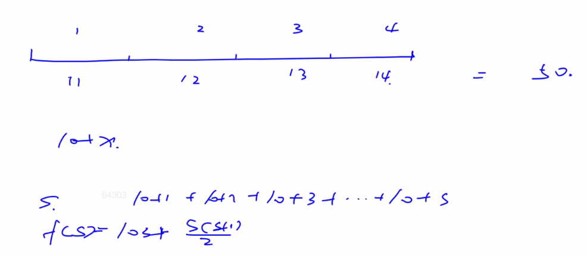
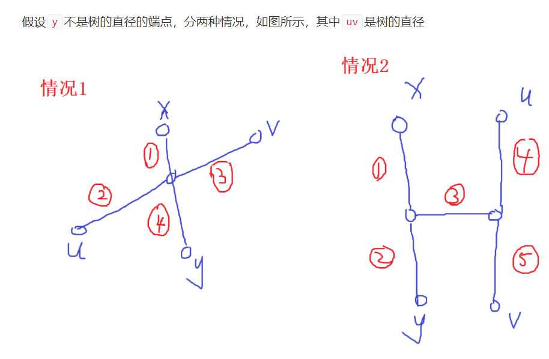
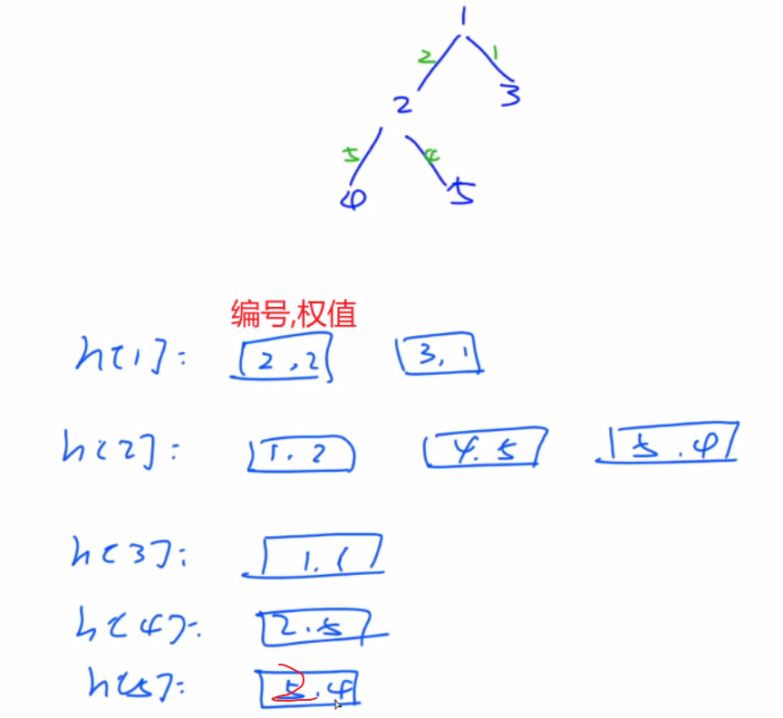
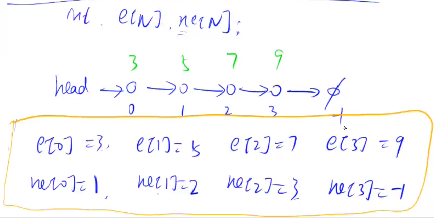

#### 4.4 acwing.1207. 大臣的旅费

第四届蓝桥杯省赛C++A组,第四届蓝桥杯省赛JAVAA组

<!--more-->

```C++
很久以前，T王国空前繁荣。
为了更好地管理国家，王国修建了大量的快速路，用于连接首都和王国内的各大城市。
为节省经费，T国的大臣们经过思考，制定了一套优秀的修建方案，使得任何一个大城市都能从首都直接或者通过其他大城市间接到达。
同时，如果不重复经过大城市，从首都到达每个大城市的方案都是唯一的。
J是T国重要大臣，他巡查于各大城市之间，体察民情。
所以，从一个城市马不停蹄地到另一个城市成了J最常做的事情。
他有一个钱袋，用于存放往来城市间的路费。
聪明的J发现，如果不在某个城市停下来修整，在连续行进过程中，他所花的路费与他已走过的距离有关，在走第x千米到第x+1千米这一千米中（x是整数），他花费的路费是x+10这么多。也就是说走1千米花费11，走2千米要花费23。
J大臣想知道：他从某一个城市出发，中间不休息，到达另一个城市，所有可能花费的路费中最多是多少呢？

输入格式
输入的第一行包含一个整数 n，表示包括首都在内的T王国的城市数。
城市从 1 开始依次编号，1 号城市为首都。
接下来 n−1 行，描述T国的高速路（T国的高速路一定是 n−1 条）。
每行三个整数 Pi,Qi,Di，表示城市 Pi 和城市 Qi 之间有一条双向高速路，长度为 Di 千米。

输出格式
输出一个整数，表示大臣J最多花费的路费是多少。

数据范围
1≤n≤10^5,
1≤Pi,Qi≤n,
1≤Di≤1000
输入样例：
5 
1  2  2 
1  3  1 
2  4  5 
2  5  4 
输出样例：
135
```

思路：

参考题解：https://www.acwing.com/solution/content/7826/



经过简单计算，得出路费计算公式：长度为S，路费为`f(S) = 10*S + 1/2*S*(S+1)`。

我们要求的就是给定的树中长度最长的路径。（也就是树的直径）

这里的图也可以看成是一种特殊的树。

**经典问题：求树的直径？**（任意2点之间的路径唯一）

一种简单的做法。

1.在树中任取一点x，分别求x到其他点的距离，存到dist[]；

2.通过第1步，找到距离x最远的点y，再求y到其他点的距离，存到dist[]，在dist中的最大值就是答案，直径。

证明：反证法



- 情况1：xy与uv有交点，由于离x最远的点是y，因此

    有 1 + 3 <= 3 + 4

    即 3 <= 4

    则 3 + 2 <= 4 + 2

    由于 3 + 2是树的直径，因此4 + 2一定是树的直径，因此y不是树的直径的端点矛盾

- 情况2:xy与uv没有交点，由于离x最远的点是y，因此

    有 1 + 2 >= 1 + 3 + 5

    即 2 >= 3 + 5

    即 2 > 5

    则 2 + 3 > 5

    则 2 + 3 + 5 > 4 + 5

    由于 4 + 5是树的直径，但存在着一个长度更长的路径，因此y不是树的直径的端点矛盾

因此，y一定是树的直径的端点。所以从y开始到达的最远距离就是树的直径。

时间复杂度：O(n)。

求直径的过程会把树遍历两边，但是要忽略常数。

**图的存储方式：**

1.邻接矩阵（适合稠密图），本题的话要开10^10，不可取

2.邻接表（适合稀疏图），两种实现方式

- vector
- 单链表

稠密图：包含很多边；稀疏图：包含较少边。

3.补充：[链式前向星--最通俗易懂的讲解](https://blog.csdn.net/sugarbliss/article/details/86495945)，前向星也就是数组模拟链表

推荐文章：https://www.cnblogs.com/linfangnan/p/12745834.html，非常全面



1.y总DFS题解

```C++
#include <cstdio>
#include <cstring>
#include <algorithm>
#include <iostream>
#include <vector>
using namespace std;

const int N = 1e5+10;
int n;
int dist[N];
struct Edge{
    int id,w;
};
vector <Edge> h[N];// 构建邻接表

void dfs(int u,int father,int distance){
    dist[u] = distance;
    for (auto node : h[u]){// father表示已经遍历过的城市
        if (node.id != father) dfs(node.id,u,distance + node.w);
    }
}

int main(){
    scanf("%d",&n);

    for (int i = 0;i < n-1;i++){
        int a,b,c;
        scanf("%d%d%d",&a,&b,&c);
        h[a].push_back({b,c});// a连向b
        h[b].push_back({a,c});// b连向a
    }

    dfs(1,-1,0);// 求首都1到其他城市的距离

    int u = 1;
    for (int i = 2;i <= n;i++){
        if (dist[i] > dist[u]) u = i;
    }

    dfs(u,-1,0);
    for (int i = 1;i <= n;i++){
        if ((dist[i] > dist[u])) u = i;
    }
    int s = dist[u];
    printf("%lld\n",s*10+s*(s+1ll)/2);// 1ll，long long的1，因为会爆int
    return 0;
}
```

2.自己写的BFS题解，本菜鸡出息了，终于能写一题了

```C++
#include <cstdio>
#include <cstring>
#include <algorithm>
#include <iostream>
#include <vector>
using namespace std;

const int N = 1e5+10;
int n; 
int dist[N];
int st[N];
struct Edge{
    int id,w;
};
vector <Edge> h[N];// 构建邻接表
int q[N];// bfs数组

void bfs(int u){
    memset(st,0,sizeof st);// 判重数组必须更新

    dist[u] = 0;
    q[0] = u;
    st[u] = true
    
    int hh = 0,tt = 0;
    while (hh <= tt){
        int t = q[hh++];
        for (auto node:h[t]){
            if (st[node.id] != true){// 判重
                dist[node.id] = dist[t]+node.w;
                q[++tt] = node.id;
                st[node.id] = true;
            }
        }
    }
}

int main(){
    scanf("%d",&n);

    for (int i = 0;i < n-1;i++){
        int a,b,c;
        scanf("%d%d%d",&a,&b,&c);
        h[a].push_back({b,c});
        h[b].push_back({a,c});
    }

    bfs(1);// 求首都1到其他城市的距离

    int u = 1;
    for (int i = 2;i <= n;i++){
        if (dist[i] > dist[u]) u = i;
    }

    bfs(u);
    for (int i = 1;i <= n;i++){
        if ((dist[i] > dist[u])) u = i;
    }
    int s = dist[u];
    printf("%lld\n",s*10+s*(s+1ll)/2);// 1ll，long long的1
    return 0;
}
```

### 5.拓展内容

如何用数组实现链表与邻接表？

- 我们可以用结构体+指针的方式来实现（动态）链表，但是每生成一个节点，需要调用`new Node();`，非常慢，笔试**容易超时**，面试才会考虑这种方式。

- 数组模拟（静态）单链表，算法笔试中应用较多的邻接表（本质就是多个单链表），它用于存储树和图。
- 双链表，主要用来优化某些问题。

####  5.1 acwing.826.单链表（模板题）

```C++
实现一个单链表，链表初始为空，支持三种操作：

向链表头插入一个数；
删除第 k 个插入的数后面的数；
在第 k 个插入的数后插入一个数。
现在要对该链表进行 M 次操作，进行完所有操作后，从头到尾输出整个链表。
注意:题目中第 k 个插入的数并不是指当前链表的第 k 个数。例如操作过程中一共插入了 n 个数，则按照插入的时间顺序，这 n 个数依次为：第 1 个插入的数，第 2 个插入的数，…第 n 个插入的数。

输入格式
第一行包含整数 M，表示操作次数。
接下来 M 行，每行包含一个操作命令，操作命令可能为以下几种：

H x，表示向链表头插入一个数 x。
D k，表示删除第 k 个插入的数后面的数（当 k 为 0 时，表示删除头结点）。
I k x，表示在第 k 个插入的数后面插入一个数 x（此操作中 k 均大于 0）。
输出格式
共一行，将整个链表从头到尾输出。

数据范围
1≤M≤100000
所有操作保证合法。

输入样例：
10
H 9
I 1 1
D 1
D 0
H 6
I 3 6
I 4 5
I 4 5
I 3 4
D 6
输出样例：
6 4 6 5
```

数组实现单链表图示：



数组和结构体+指针分别实现静、动态单链表，数组更快。

如何用数组实现栈与队列？

代码：

```C++
#include <iostream>
#include <cstdio>
#include <algorithm>
using namespace std;

const int N = 1e5+10;
// head表示头结点的下标，也即指向头结点
// e[i]表示结点i的值
// ne[i]表示结点i的next的指针
// idx指向当前需要插入（已经用过）的结点
int head,e[N],ne[N],idx;

void init(){
    head = -1;
}
// 头插法
void add_to_head(int x){
    e[idx] = x;
    ne[idx] = head,head = idx,idx++;// idx已经用过，需要往后推进一位
}
// 将x插入下标是k的结点之后
void add(int k,int x){
    e[idx] = x;
    ne[idx] = ne[k];
    ne[k] = idx;
    idx++;// 同理idx要往后推进一位
}
// 将下标为k的结点的后一个结点删除
void remove(int k){
    ne[k] = ne[ne[k]];
}

// 第k个插入的数其实就是下标k-1的数
// 插入第1个点，下标idx=0；第2个点，下标idx=1；... ；插入第k个点，下标idx=k-1
int main(){
    init();
    
    int m;
    scanf("%d",&m);
    while (m--){
        char op;
        int x,y;
        //scanf("%c",&op);
        cin >> op;
        if (op == 'I'){
            //scanf("%d %d",&x,&y);
            cin >> x >> y;
            add(x-1,y);
        }
        if (op == 'H'){
            //scanf("%d",&x);
            cin >> x;
            add_to_head(x);
        }
        if (op == 'D'){
            //scanf("%d",&x);
            cin >> x;
            if (x == 0) head = ne[head];// 删除头一个结点
            else remove(x-1);
        }
    }
    
    for (int i = head;i != -1;i = ne[i]) printf("%d ",e[i]);
    puts("");
    return 0;
}
```

特别注意：如果用scanf输入会读入末尾的回车符，需要再读入k和x时处理，`scanf("%d\n",xxx);`