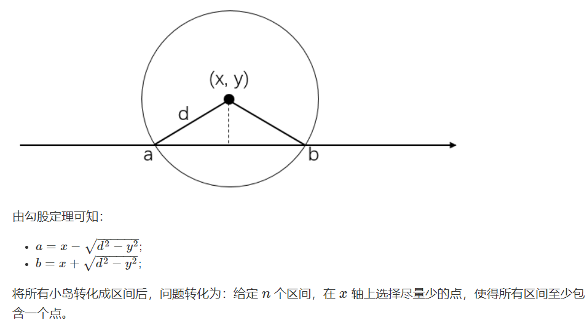
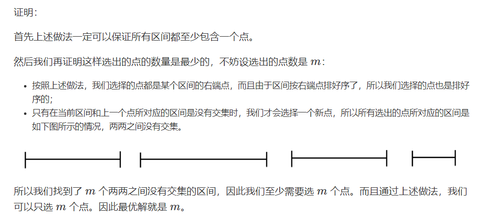
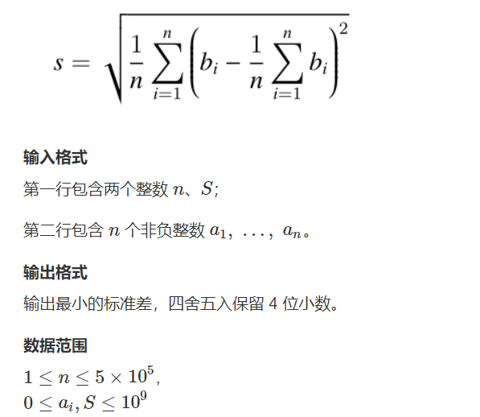
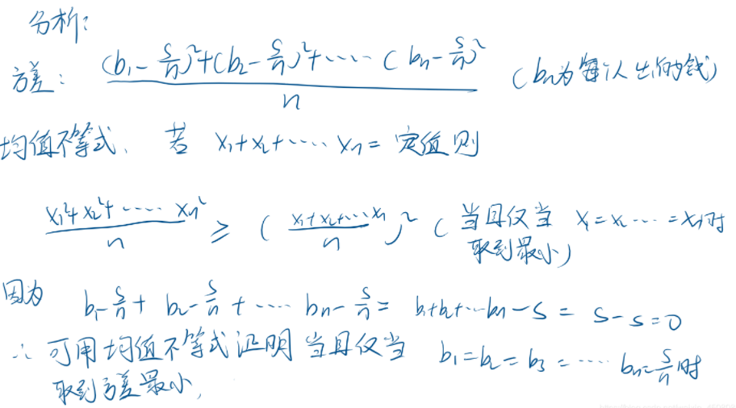
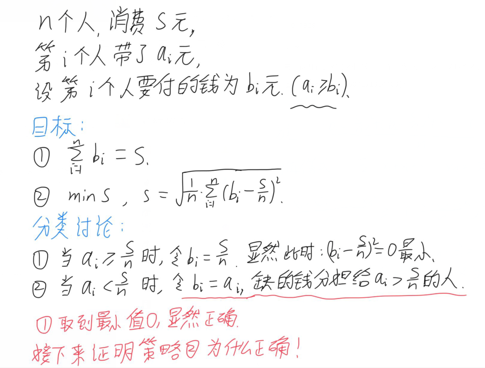
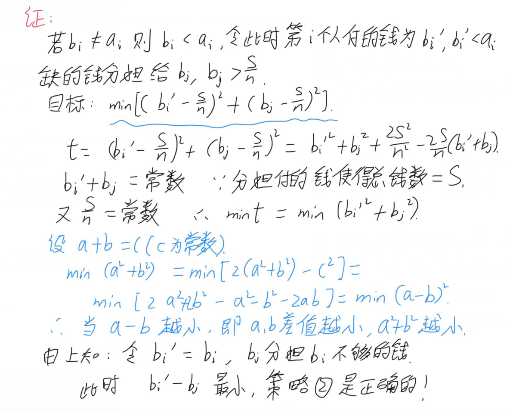
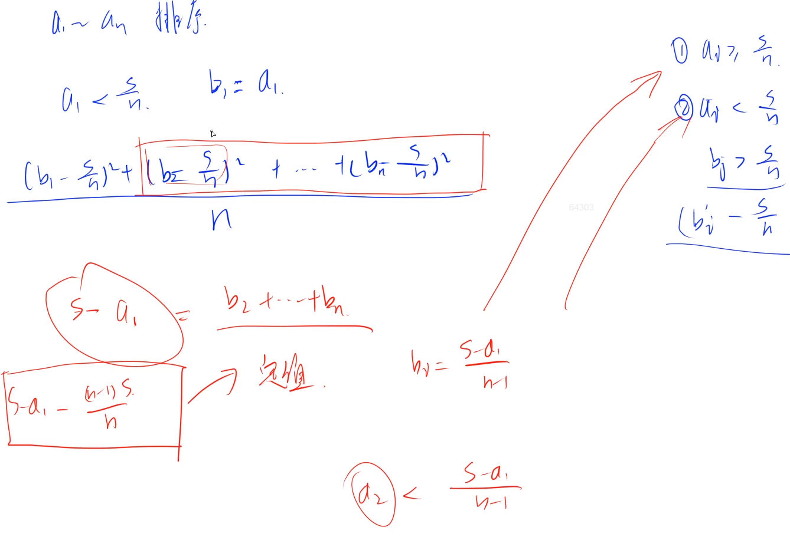
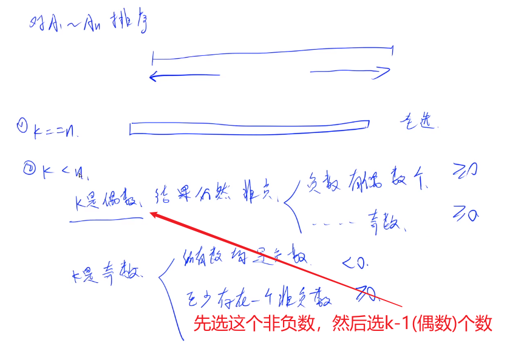
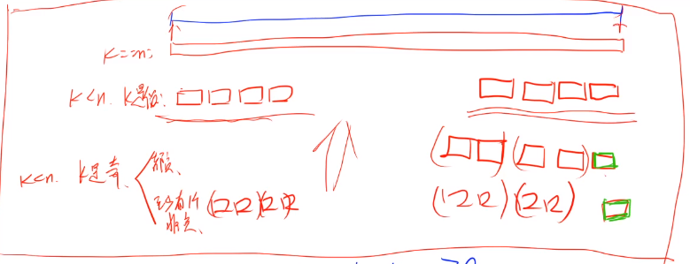

#### 4 acwing.112. 雷达设备（算法竞赛进阶指南）

<!--more-->

```C++
假设海岸是一条无限长的直线，陆地位于海岸的一侧，海洋位于另外一侧。
每个小岛都位于海洋一侧的某个点上。
雷达装置均位于海岸线上，且雷达的监测范围为 d，当小岛与某雷达的距离不超过 d 时，该小岛可以被雷达覆盖。
我们使用笛卡尔坐标系，定义海岸线为 x 轴，海的一侧在 x 轴上方，陆地一侧在 x 轴下方。
现在给出每个小岛的具体坐标以及雷达的检测范围，请你求出能够使所有小岛都被雷达覆盖所需的最小雷达数目。

输入格式
第一行输入两个整数 n 和 d，分别代表小岛数目和雷达检测范围。
接下来 n 行，每行输入两个整数，分别代表小岛的 x，y 轴坐标。
同一行数据之间用空格隔开。

输出格式
输出一个整数，代表所需的最小雷达数目，若没有解决方案则所需数目输出 −1。

数据范围
1≤n≤1000
输入样例：
3 2
1 2
-3 1
2 1
输出样例：
2
```

思路：区间贪心（区间选点），可以参考算法笔记P122

y总题解（少见hh）：https://www.acwing.com/solution/content/1061/

问题转化（很重要，求圆不方便）：

将根据坐标点寻找覆盖它的雷达圆，转化成为根据若干给定区间，求最少选取多少个点，使得每个区间上最少

选一个点。

如下图所示，对于任意一个小岛 (x,y)，我们都可以在海岸线上求出能覆盖该小岛的建造雷达的区间 [a,b]。



对于上面这个图片的小岛而言,它可以被雷达搜索到,只有当他的x坐标在[a,b]区间才会被搜索到.当然y坐标也不

能够太大了,如果太大了那么肯定是无解的情况.

贪心策略：

- 将所有区间按右端点从小到大排序；

- 依次考虑每个区间：（扫描每个线段）
    - 如果当前区间包含最后一个（上一个）选择的点，则直接跳过；
    - 如果当前区间不包含最后一个选择的点，则在当前区间的右端点的位置选一个新的点。



时间复杂度

计算每个坐标所对应的区间，需要 O(n) 的计算量；

将所有区间排序需要 O(nlogn)的计算量；

扫描所有区间需要 O(n)的计算量；

所以总共的时间复杂度是 O(nlogn)。

代码：

```C++
#include <cstdio>
#include <cmath>
#include <algorithm>
#include <iostream>
using namespace std;

const int N = 1010;
const int INF = 0x3f3f3f3f;
struct Segment{
    double l,r;// 用double，区间端点有小数
    bool operator< (const Segment& s) const{// 重载<，按右端点排序
        return r < s.r;
    }
}seg[N];
int n,d;
int main(){
    scanf("%d%d",&n,&d);

    bool failed = false;
    for (int i = 0;i < n;i ++){
        int x,y;
        scanf("%d%d",&x,&y);
        if (y > d) failed = true;
        else{
            double len = sqrt(d*d - y*y);
            seg[i] = {x - len,x + len};
            // C++11之前的写法：seg[i].l = x - len,seg[i].r = x + len;
        }
    }

    if (failed){ // 纵坐标超过雷达半径
        puts("-1");
    }
    else{
        sort(seg,seg + n);// 对区间右端点排序

        int cnt = 0;
        double last = -INF;
        for (int i = 0;i < n;i++){
            if (last < seg[i].l){// 如果当前区间不包含最后一个选择的点，则选择当前右端点
                cnt++;
                last = seg[i].r;
            }
        }

        printf("%d\n",cnt);
    }
    return 0;
}
```

#### 5 acwing.1235. 付账问题

第九届蓝桥杯省赛C++A组,第九届蓝桥杯省赛JAVAA组

```C++
几个人一起出去吃饭是常有的事。
但在结帐的时候，常常会出现一些争执。
现在有 n 个人出去吃饭，他们总共消费了 S 元。
其中第 i 个人带了 ai 元。

幸运的是，所有人带的钱的总数是足够付账的，但现在问题来了：每个人分别要出多少钱呢？
为了公平起见，我们希望在总付钱量恰好为 S 的前提下，最后每个人付的钱的标准差最小。
这里我们约定，每个人支付的钱数可以是任意非负实数，即可以不是 1 分钱的整数倍。
你需要输出最小的标准差是多少。
    
标准差的介绍：标准差是多个数与它们平均数差值的平方平均数，一般用于刻画这些数之间的“偏差有多大”。
形式化地说，设第 i 个人付的钱为 bi 元，那么标准差为 :
```



```C++
输入样例1：
5 2333
666 666 666 666 666
输出样例1：
0.0000
输入样例2：
10 30
2 1 4 7 4 8 3 6 4 7
输出样例2：
0.7928
```

思路：

最后这几道题难度都比较大，都是作为倒数2道的压轴题，而且贪心题目之间关联性不是很大。







以上分类讨论中的两点就是本题的贪心策略。

先对$a_1$到$a_n$排序，然后判断$a_1$与S/n的大小。



当$b_1$确定之后，后面的$b_2$到$b_n$的和也是一个定值，可以接着第一步的思路，继续比较$a_2$与新的平均值的大

小。排序是因为要把钱多的人放在后面，因为他们要分担前面钱不够的人，也就是说他们付的钱是由钱少同学

确定的。

代码：

```C++
#include <cstdio>
#include <iostream>
#include <algorithm>
#include <cmath>
using namespace std;

const int N = 5e5+10;

int n;
double S;// 用double存，要计算平均值
int a[N];
int main(){
    scanf("%d %lf",&n,&S);
    for (int i = 0;i < n;i++) scanf("%d",&a[i]);

    sort(a,a+n); // 记得排序
    double res = 0,avg = S / n;
    for (int i = 0;i < n;i++){
        double cur = S/(n-i);// 当前平均值
        if (a[i] < cur) cur = a[i];// 带的钱a[i]不够平均值则全交
        // 带的钱a[i]够平均值则交平均值
        res += (cur-avg)*(cur-avg)/n;
        S -= cur;// 更新当前要付的总费用
    }

    printf("%.4lf\n",sqrt(res));
    return 0;
}
```

#### 6 acwing.1239. 乘积最大

第九届蓝桥杯省赛C++B组

```C++
给定 N 个整数 A1,A2,…AN。
请你从中选出 K 个数，使其乘积最大。
请你求出最大的乘积，由于乘积可能超出整型范围，你只需输出乘积除以 1000000009 的余数。
注意，如果 X<0， 我们定义 X 除以 1000000009 的余数是负(−X)除以 1000000009 的余数，即：0−((0−x)%1000000009)
    
输入格式
第一行包含两个整数 N 和 K。
以下 N 行每行一个整数 Ai。

输出格式
输出一个整数，表示答案。

数据范围
1≤K≤N≤10^5,
−10^5≤Ai≤10^5
输入样例1：
5 3
-100000
-10000
2
100000
10000
输出样例1：
999100009
输入样例2：
5 3
-100000
-100000
-2
-100000
-100000
输出样例2：
-999999829
```

思路：

负余数：

- 数论中：`-2 mod 10 = 8`，取模运算不会得到负值
- C++中：`-2 mod 10 = -2`

注意本题中所定义的负余数是按照C++的。

在蓝桥杯（十三）中提到负余数的处理问题，

`int get_mod(int a,int b)  return (a % b + b) % b;// 将负余数转成正的`

本题要分五种情况讨论！



```C++
// 大佬文字版思路
该题的题解是整理了一下 y总视频里面讲解思路,希望对看完视频还不大理解的同学有点帮助
首先我们知道 如果 k == n ,那么就证明所有的数字是全部都选,
             如果 k < n , 那么就要思考怎样去选择了:
1.k 如果是偶数的话,选出来的结果一定是非负数 , 原因如下:
             (1) # 负数的个数是偶数个的话,负负得正,那么一定是非负数
             (2) # 负数的个数如果是奇数个的话,那么我们就只选偶数个绝对值最大的负数
2.k 如果是奇数个的话,
             (1)# 所有的数字如果都是负数,那么选出来的结果也一定都是负数    
             (2)# 否则的话,则一定至少有 1个非负数, 那么我们将最大的数取出来, 此时要选的个数就是 k--, 
                # k-- 是偶数,那么就又转化为 k-- 是偶数的情况思考
作者：大厂狗狗
链接：https://www.acwing.com/solution/content/8724/
来源：AcWing
著作权归作者所有。商业转载请联系作者获得授权，非商业转载请注明出处。
```



k是奇数时，两种情况都需要先选择最大的那个数，然后问题就转化成了k是偶数的情况。

找到几种情况的共同点之后，就可以统一处理了。

代码：

```C++
#include <cstdio>
#include <algorithm>
#include <iostream>
using namespace std;
typedef long long LL;
const int N = 100010;
const int mod = 1000000009;

int n,k;
int a[N];
int main(){
    scanf("%d%d",&n,&k);
    for (int i = 0;i < n;i++) scanf("%d",&a[i]);
    sort(a,a+n);

    int sign = 1,res = 1;// sign作为正负号标志，res作为乘积
    int l = 0,r = n-1;// 双指针算法
    if (k % 2){
        res = a[r--];
        k--;
        if (res < 0) sign = -1;// 说明全部是负数，最终结果也是负数
    }
    while (k){// 把所有数选完退出
        LL x = (LL)a[l]*a[l+1],y = (LL)a[r-1]*a[r];// 可能爆int
        if (x*sign > y*sign){// 如果最终结果是正的，挑绝对值大的，反之挑小的
            // 通过sign巧妙将几种情况统一了，y总yyds
            res = x%mod * res%mod;// res也要取模再相乘
            l += 2;
        }
        else{
            res = y%mod * res%mod;
            r -= 2;
        }
        k -= 2;
    }

    printf("%d\n",res);
    return 0;
}
```

