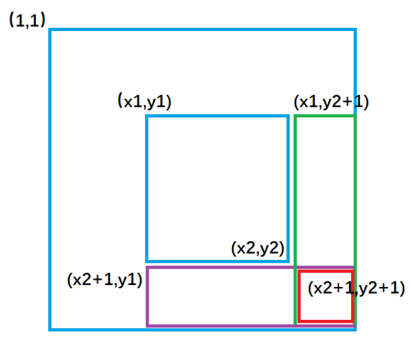
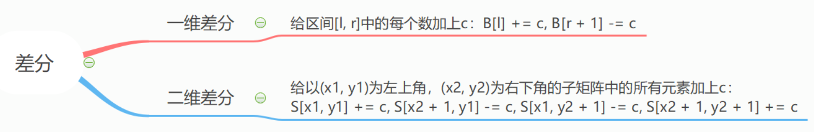

### 4.补充：差分算法

参考资料：https://oi-wiki.org/basic/prefix-sum/。

差分是一种和前缀和相对的策略，可以当做是求和的逆运算。

墙推：[前缀和与差分算法总结](https://blog.csdn.net/weixin_45629285/article/details/111146240)

<!--more-->

#### 4.1 acwing.797. 差分（一维差分）

模板题, Hulu面试题

```C++
输入一个长度为 n 的整数序列。
接下来输入 m 个操作，每个操作包含三个整数 l,r,c，表示将序列中 [l,r] 之间的每个数加上 c。
请你输出进行完所有操作后的序列。

输入格式
第一行包含两个整数 n 和 m。
第二行包含 n 个整数，表示整数序列。
接下来 m 行，每行包含三个整数 l，r，c，表示一个操作。

输出格式
共一行，包含 n 个整数，表示最终序列。

数据范围
1≤n,m≤100000,
1≤l≤r≤n,
−1000≤c≤1000,
−1000≤整数序列中元素的值≤1000
输入样例：
6 3
1 2 2 1 2 1
1 3 1
3 5 1
1 6 1
输出样例：
3 4 5 3 4 2
```

思路：

差分可以维护多次对序列的一个区间加上一个数，并在最后询问某一位的数或是多次询问某一位的数。

注意：**修改操作一定要在查询操作之前**。

对于给定的序列a[1],a[2],...,a[n]，我们构造一个差分数组b[n]，使得：`a[i] = b[1]+b[2]+...+b[i]`，也就

是说a[N]是b[N]的前缀和数组。

$\text { 这种策略的定义是令 } b_{i}=\left\{\begin{array}{ll}
a_{i}-a_{i-1} & i \in[2, n] \\
a_{1} & i=1
\end{array}\right.$

**核心操作**：将a[L~R]全部加上c，等价于：b[L] += c,b[R+1] -= c。

简单证明一下：

1. 对于a[1~L-1]：没有影响；
2. 对于a[L~R]：b[L] += c，所以a[L~R] += c；
3. 对于a[R+1~n]：b[L] += c,b[R+1] -= c，所以无影响。

初始化差分数组b[n]：相当于按a[1~1],a[2~2],a[n-n]的顺序分别加上一个给出的数。

```C++
#include <cstdio>
using namespace std;
const int N = 100010;
int n,m;
int a[N],b[N];
void insert(int l,int r,int c){
    b[l] += c,b[r+1] -= c;
}
int main(){
    scanf("%d%d",&n,&m);
    for (int i = 1;i <= n;i++){
        scanf("%d",&a[i]);
        insert(i,i,a[i]);// 初始化差分数组
    }
    
    int l,r,c;
    for (int i = 0;i < m;i++){
        scanf("%d%d%d",&l,&r,&c);
        insert(l,r,c);
    }
    
    for (int i = 1;i <= n;i++){// 计算前缀和并输出
        a[i] = a[i-1] + b[i];// 先修改，再查询，不能合成一步或者调换顺序
        printf("%d ",a[i]);
    }
    return 0;
}
```

#### 4.2 acwing.798. 差分矩阵（二维差分）

```C++
输入一个 n 行 m 列的整数矩阵，再输入 q 个操作，每个操作包含五个整数 x1,y1,x2,y2,c，其中 (x1,y1) 和 (x2,y2) 表示一个子矩阵的左上角坐标和右下角坐标。
每个操作都要将选中的子矩阵中的每个元素的值加上 c。
请你将进行完所有操作后的矩阵输出。
 
输入格式
第一行包含整数 n,m,q。
接下来 n 行，每行包含 m 个整数，表示整数矩阵。
接下来 q 行，每行包含 5 个整数 x1,y1,x2,y2,c，表示一个操作。

输出格式
共 n 行，每行 m 个整数，表示所有操作进行完毕后的最终矩阵。

数据范围
1≤n,m≤1000,
1≤q≤100000,
1≤x1≤x2≤n,
1≤y1≤y2≤m,
−1000≤c≤1000,
−1000≤矩阵内元素的值≤1000
输入样例：
3 4 3
1 2 2 1
3 2 2 1
1 1 1 1
1 1 2 2 1
1 3 2 3 2
3 1 3 4 1
输出样例：
2 3 4 1
4 3 4 1
2 2 2 2
```

思路：

对于给定的矩阵`a[N][N]`，我们构造一个差分矩阵b`[N][N]`，使得：`a[i][j]`是`b[i][j]`的二维前缀和。

**核心操作**：给以(x1, y1)为左上角，(x2, y2)为右下角的子矩阵中的所有元素`a[i][j]`加上c。

等价于：B[x1, y1] += c, B[x2 + 1, y1] -= c, B[x1, y2 + 1] -= c, B[x2 + 1, y2 + 1] += c。



`b[x1][ y1 ] +=c ;` 让整个a数组中(x1,y1)到大矩形右下角范围的元素都加上了c。

`b[x1,][y2+1]-=c` ; 让整个a数组中绿色矩形面积的元素再减去c，使其内元素不发生改变。

`b[x2+1][y1]- =c ;` 对应图3 ,让整个a数组中紫色矩形面积的元素再减去c，使其内元素不发生改变。

`b[x2+1][y2+1]+=c;` 对应图4,让整个a数组中红色矩形面积的元素再加上c，红色内的相当于被减了两次，再

加上一次c，才能使其恢复。

初始化差分数组`b[N][N]`：相当于按{(1,1),(1,1)}，{(1,2),(1,2)}，{(n,m),(n,m)}的顺序分别加上一个给出的数。

```C++
#include <iostream>
#include <cstdio>
#include <algorithm>
using namespace std;
const int N = 1010;

int n,m,q;
int a[N][N],b[N][N];

void insert(int x1,int y1,int x2,int y2,int c){
    b[x1][y1] += c;
    b[x1][y2+1] -= c;
    b[x2+1][y1] -= c;
    b[x2+1][y2+1] += c;
}

int main(){
    scanf("%d%d%d",&n,&m,&q);
    for (int i = 1;i <= n;i++)
        for (int j = 1;j <= m;j++){
            scanf("%d",&a[i][j]);
            insert(i,j,i,j,a[i][j]);
        }
        
    int x1,y1,x2,y2,c;
    while (q--){
        scanf("%d%d%d%d%d",&x1,&y1,&x2,&y2,&c);
        insert(x1,y1,x2,y2,c);
    }
    
    for (int i = 1;i <= n;i++){
        for (int j = 1;j <= m;j++){// 求b[1][1]到b[i][j]的前缀和a[i][j]
            a[i][j] = a[i-1][j] + a[i][j-1] - a[i-1][j-1] + b[i][j];
            printf("%d ",a[i][j]);
        }
        puts("");
    }
    return 0;
}
```

差分知识总结：



>前缀和与差分模板总结（来自于yls视频）

```C++
// 一维前缀和
S[i] = a[1] + a[2] + ... a[i]
从a[l]到a[r]的和为：a[l] + ... + a[r] = S[r] - S[l - 1]
// 二维前缀和
S[i, j] = 第i行j列格子左上部分所有元素的和
S{x,y} = S{x-1,y}+S{x,y-1}-S{x-1,y-1}+a{x,y}
以(x1, y1)为左上角，(x2, y2)为右下角的子矩阵的和为：
S[x2, y2] - S[x1 - 1, y2] - S[x2, y1 - 1] + S[x1 - 1, y1 - 1]
// 一维差分
给区间[l, r]中的每个数加上c：
B[l] += c, B[r + 1] -= c
// 二维差分
给以(x1, y1)为左上角，(x2, y2)为右下角的子矩阵中的所有元素加上c：
B[x1, y1] += c, B[x2 + 1, y1] -= c, B[x1, y2 + 1] -= c, B[x2 + 1, y2 + 1] += c
```

#### 4.3 acwing.1232. 三体攻击（三维差分，困难）

第九届蓝桥杯省赛C++A组,第九届蓝桥杯省赛JAVAA组

```C++
三体人将对地球发起攻击。
为了抵御攻击，地球人派出了 A×B×C 艘战舰，在太空中排成一个 A 层 B 行 C 列的立方体。
其中，第 i 层第 j 行第 k 列的战舰（记为战舰 (i,j,k)）的生命值为 d(i,j,k)。
三体人将会对地球发起 m 轮“立方体攻击”，每次攻击会对一个小立方体中的所有战舰都造成相同的伤害。
具体地，第 t 轮攻击用 7 个参数 lat,rat,lbt,rbt,lct,rct,ht 描述；
所有满足 i∈[lat,rat],j∈[lbt,rbt],k∈[lct,rct] 的战舰 (i,j,k) 会受到 ht 的伤害。
如果一个战舰累计受到的总伤害超过其防御力，那么这个战舰会爆炸。
地球指挥官希望你能告诉他，第一艘爆炸的战舰是在哪一轮攻击后爆炸的。

输入格式
第一行包括 4 个正整数 A,B,C,m；
第二行包含 A×B×C 个整数，其中第 ((i−1)×B+(j−1))×C+(k−1)+1 个数为 d(i, j, k)；
第 3 到第 m+2 行中，第 (t − 2) 行包含 7 个正整数 lat, rat, lbt, rbt, lct, rct, ht。

输出格式
输出第一个爆炸的战舰是在哪一轮攻击后爆炸的。
保证一定存在这样的战舰。

数据范围
1≤A×B×C≤10^6,
1≤m≤10^6,
0≤d(i, j, k), ht≤10^9,
1≤lat≤rat≤A,
1≤lbt≤rbt≤B,
1≤lct≤rct≤C
层、行、列的编号都从 1 开始。

输入样例：
2 2 2 3
1 1 1 1 1 1 1 1
1 2 1 2 1 1 1
1 1 1 2 1 2 1
1 1 1 1 1 1 2
输出样例：
2
样例解释
在第 2 轮攻击后，战舰 (1,1,1) 总共受到了 2 点伤害，超出其防御力导致爆炸。
```

思路：

考察二分、前缀和与差分。（PS：本题与树状数组和线段树无关）

问题：从第几轮攻击开始，某个格子的生命小于0。

由题意知道生命值一定是递减的，满足二分的条件。如果从头开始遍历，比较慢，所以用二分优化。

由于是立方体，所以用到三维差分，

设读入的数据存入`S[N][N][N]`（这里为了方便展开成三维，代码中做了映射处理，实际只有一维），构造差

分数组`b[N][N][N]`。

类比一维和二维，我们得到三维前缀和公式：用到三个集合的**容斥原理**，**奇数个-1就+，偶数个-1就-**

S{x,y,z} = S{x-1,y,z}+S{x,y-1,z}+S{x,y,z-1}-S{x-1,y-1,z}-S{x,y-1,z-1}-S{x-1,y,z-1}+S{x-1,y-1,z-1}+b{x,y,z}

由此可以反求出b{x,y,z}，**构造差分数组**。

同理类比一维和二维，我们得到三维差分公式：从(x1, y1,z1)到(x2,y2,z2)范围内的S{i,j,k}都**减去**一个数h

注意这里是减去一个数h！！！

b{x1,y1,z1} -= h,b{x1,y1,z2+1} += h,b{x1,y2+1,z1} += h,b{x1,y2+1,z2+1} -= h,

b{x2+1,y1,z1} += h,b{x2+1,y1,z1+1} -= h,b{x2+1,y2+1,z2+1} += h    **奇数个+1就+=h，偶数个就-=h**

由于题目只给出了A×B×C的范围，不知道每个维度具体范围，所以直接开一维数组，需要映射处理一下。

二维映射：`AXB，(i,j)-->i*B+j`；三维映射：AXBXC，`(i,j,k)-->(i*B+j)*C+k`

代码：

```C++
#include <cstdio>
#include <cstring>
#include <algorithm>
#include <iostream>
using namespace std;
typedef long long LL;
const int N = 2000010;// 开2倍1e6，因为数组从1开始，有三个面不能用
// 最坏情况只有一层，底下整个面不能用，开2倍
int A,B,C,m;
LL s[N],b[N],bp[N];// 防止爆int
int op[N>>1][7];// 三体攻击的伤害

int d[8][4] = {
    {0,0,0,1},
    {0,0,1,-1},
    {0,1,0,-1},
    {0,1,1,1},
    {1,0,0,-1},
    {1,0,1,1},
    {1,1,0,1},
    {1,1,1,-1}
};

int get(int i,int j,int k){// 三维坐标的映射
    return (i*B+j)*C+k;
}

bool check(int mid){
    memcpy(b,bp,sizeof b);// 拷贝原始差分数组
    // 对伤害范围内的数减去伤害值h
    for (int i = 1;i <= mid;i++){// 计算从1到mid的累积伤害
        int x1 = op[i][0],x2 = op[i][1],y1 = op[i][2];
        int y2 = op[i][3],z1 = op[i][4],z2 = op[i][5];
        int h = op[i][6];
        b[get(x1,y1,z1)] -= h;
        b[get(x1,y1,z2 + 1)] += h;
        b[get(x1,y2 + 1,z1)] += h;
        b[get(x1,y2 + 1,z2 + 1)] -= h;
        b[get(x2 + 1,y1,z1)] += h;
        b[get(x2 + 1,y1,z2 + 1)] -= h;
        b[get(x2 + 1,y2 + 1,z1)] -= h;
        b[get(x2 + 1,y2 + 1,z2 + 1)] += h;
    }
    // 重新计算前缀和数组s，判断生命值是否<0
    memset(s,0,sizeof s);// 前缀和数组置0
    for (int i = 1;i <= A;i++)
        for (int j = 1;j <= B;j++)// 把求差分数组的公式反过来就是求前缀和
            for (int k = 1;k <= C;k++)
            {
                s[get(i,j,k)] = b[get(i,j,k)];
                for (int u = 1;u < 8;u++){// u从1开始，因为不用第1项
                    int x = i - d[u][0],y = j - d[u][1],z = k - d[u][2],t = d[u][3];
                    
                    s[get(i,j,k)] -= s[get(x,y,z)]*t;
                }
                if (s[get(i,j,k)] < 0) return true;
            }
    return false;
}
int main(){
    scanf("%d%d%d%d",&A,&B,&C,&m);
    // 读入s数组
    for (int i = 1;i <= A;i++)
        for (int j = 1;j <= B;j++)
            for (int k = 1;k <= C;k++) scanf("%lld",&s[get(i,j,k)]);
    // 初始化差分数组b
    // 也可以像二维差分那题用insert数组s中的数初始化，代码会短一点
    for (int i = 1;i <= A;i++)
        for (int j = 1;j <= B;j++)
            for (int k = 1;k <= C;k++)
                for (int u = 0;u < 8;u++){// 求差分数组一共8项，t表示正负号
                    int x = i - d[u][0],y = j - d[u][1],z = k - d[u][2],t = d[u][3];
                    bp[get(i,j,k)] += s[get(x,y,z)] * t;
                }
    
    for (int i = 1;i <= m;i++)// 读取三体攻击伤害值
        for (int j = 0;j < 7;j++) scanf("%d",&op[i][j]);
    
    // 对每轮攻击进行二分，判断那一轮生命达到0
    int l = 1,r = m;
    while (l < r){
        int mid = l+r >> 1;
        if (check(mid)) r = mid;
        else l = mid + 1;
    }
    printf("%d\n",r);
    return 0;
}
```

insert的写法：

```C++
void insert(LL b[],int x1,int x2,int y1,int y2,int z1,int z2,int c)
{
    b[get(x1,  y1,   z1)  ] +=c;
    b[get(x1,  y1,   z2+1)] -=c;
    b[get(x1,  y2+1, z1)  ] -=c;
    b[get(x1,  y2+1, z2+1)] +=c;
    b[get(x2+1,y1,   z1)  ] -=c;
    b[get(x2+1,y1,   z2+1)] +=c;
    b[get(x2+1,y2+1, z1)  ] +=c;
    b[get(x2+1,y2+1, z2+1)] -=c;
}
```

代码太长的debug方式：

1. 使用文本对比工具，比如Vscode自带的，ctrl选择两个文件，右键比较，也可以用专业软件像beyond compare
2. 与AC代码比较，一段一段CV，二分找到错误点

