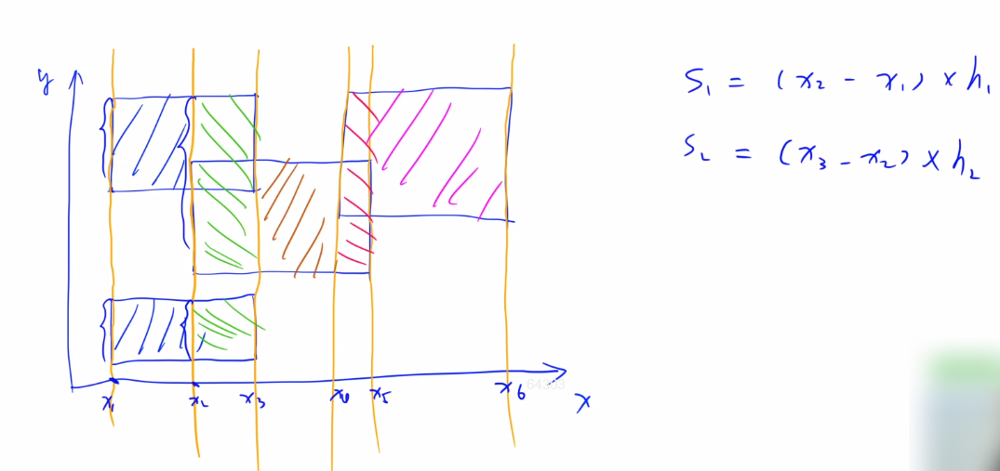

#### 3.2 acwing.1228. 油漆面积（困难）

第八届蓝桥杯省赛C++A组,第八届蓝桥杯省赛JAVAA组

<!--more-->

```C++
X星球的一批考古机器人正在一片废墟上考古。
该区域的地面坚硬如石、平整如镜。
管理人员为方便，建立了标准的直角坐标系。
每个机器人都各有特长、身怀绝技。
它们感兴趣的内容也不相同。
经过各种测量，每个机器人都会报告一个或多个矩形区域，作为优先考古的区域。
矩形的表示格式为 (x1,y1,x2,y2)，代表矩形的两个对角点坐标。
为了醒目，总部要求对所有机器人选中的矩形区域涂黄色油漆。
小明并不需要当油漆工，只是他需要计算一下，一共要耗费多少油漆。
其实这也不难，只要算出所有矩形覆盖的区域一共有多大面积就可以了。
注意，各个矩形间可能重叠。

输入格式
第一行，一个整数 n，表示有多少个矩形。
接下来的 n 行，每行有 4 个整数 x1,y1,x2,y2，空格分开，表示矩形的两个对角顶点坐标。

输出格式
一行一个整数，表示矩形覆盖的总面积。

数据范围
1≤n≤10000,
0≤x1,x2,y2,y2≤10000
数据保证 x1<x2 且 y1<y2。

输入样例1：
3
1 5 10 10
3 1 20 20
2 7 15 17
输出样例1：
340
输入样例2：
3
5 2 10 6
2 7 12 10
8 1 15 15
输出样例2：
128
```

思路：

蓝桥杯压轴题，考察线段树、扫描线。

参考资料：https://oi-wiki.org/geometry/scanning/。

线段树的一个特例，很少见的应用。

题解1：暴力法。acwing过5个数据，一半，TLE，蓝桥杯OJ可以过。用boolean处理比int稍好一些。

参考代码：https://blog.csdn.net/qq_43515011/article/details/87926698。

```Java
import java.util.*;
public class Main {
    public static void main(String[] args) {
    	Scanner sn = new Scanner(System.in);
    	
    	boolean [][]coordinate = new boolean[10000][10000];
    	
    	int n = sn.nextInt();
    	for(int i = 0;i < n;i++)
    	{
    		int x1 = sn.nextInt();
    		int y1 = sn.nextInt();
    		int x2 = sn.nextInt();
    		int y2 = sn.nextInt();
    		for(int j = x1;j < x2;j++)
    			for(int k = y1;k < y2;k++)
    			{
    				if(coordinate[j][k] == false)
    					coordinate[j][k] = true;
    			}
    	}
    	int count = 0;
    	for(int i = 0;i < 10000;i++)
    		for(int j = 0;j < 10000; j++)
    		{
    			if(coordinate[i][j] == true)
    				count++;
    		}
    	
    	System.out.print(count);
    	sn.close();
    }
}
```

题解2：扫描线+线段树。这题太**劝退**了。

扫描线一般运用在图形上面，它和它的字面意思十分相似，就是一条线在整个图上扫来扫去，它一般被用来解

决图形面积，周长等问题。本题就是一个求矩形面积并问题。扫描线属于计算几何的知识。

参考视频：https://www.bilibili.com/video/BV1yo4y197Zd。

参考资料：https://blog.csdn.net/tomorrowtodie/article/details/52048323。

扫描线图示：有一条扫描线从左往右扫描。



扫描线问题的两种类型：

1. 数据量大：需要通过**线段树**由O(n^2)优化到O(n*logn)
2. 矩形是斜着摆的，包含三角形、圆形等：计算几何，公式复杂，需要自己推

构建一个”非常特殊“的线段树，维护的是矩形纵坐标区间的有效长度。

```C++
struct Node{
    int l,r;// 左右边界
    int cnt;// 当前区间被覆盖的次数
    int len;// 至少被覆盖1次的区间长度
}
// cnt和len都是不考虑父结点的情况下的结果，只考虑子结点
```

我们用扫描线去扫描每一条边的时候，都需要更新线段树的有效长度。

是如何更新的呢？

如果扫到的这条边是某矩形的入边，这段高度的矩形开始覆盖，覆盖次数cnt+1，则往区间插入这条线段。

如果扫到的这条边是某矩形的出边，这段高度的矩形结束覆盖，覆盖次数cnt-1，则往区间删除这条线段。

细节问题：要将区间转化为点。

C++版本：

```C++
#include <cstdio>
#include <cstring>
#include <iostream>
#include <algorithm>

using namespace std;

const int N = 10010;

int n;
struct Segment// 线段结构体
{
    int x, y1, y2;
    int k;
    bool operator< (const Segment &t)const// 重载小于号，按横坐标排序
    {
        return x < t.x;
    }
}seg[N * 2];// 每个矩形两段边，最多N*2
struct Node
{
    int l, r;
    int cnt, len;// cnt：当前区间被覆盖的次数，len：至少被覆盖1次的区间长度
}tr[N * 4];

void pushup(int u)
{
    // cnt是成对+1，-1的，所以cnt>=0
    // cnt非0说明区间被整段覆盖，线段树区间[0,0]对应的实际线段是[0,1]，所以len=0-0+1
    if (tr[u].cnt > 0) tr[u].len = tr[u].r - tr[u].l + 1;
    // 未被整段覆盖但已经是最小单位，不能再划分，有效长度为0
    else if (tr[u].l == tr[u].r) tr[u].len = 0;
    // 未被整段覆盖，有缝隙，合并左右孩子长度
    else tr[u].len = tr[u << 1].len + tr[u << 1 | 1].len;
}

void build(int u, int l, int r)
{
    tr[u] = {l, r};
    if (l == r) return;
    int mid = l + r >> 1;
    // 将0到10000的整个区间二分至叶子节点（单位长度为1，坐标都是整数）
    // 读入的线段[0,1]对应线段树[0,0]
    build(u << 1, l, mid), build(u << 1 | 1, mid + 1, r);
    // 和一般线段树不一样，不用pushup
}

void modify(int u, int l, int r, int k)// 区间修改，但特殊在于懒标记cnt不往下传递
{
    if (tr[u].l >= l && tr[u].r <= r)// 线段树区间被读入的Segment完全覆盖
    {
        tr[u].cnt += k;// 入边+1，出边-1
        pushup(u);// 更新区间被覆盖的有效长度
    }
    else
    {
        int mid = tr[u].l + tr[u].r >> 1;
        if (l <= mid) modify(u << 1, l, r, k);
        if (r > mid) modify(u << 1 | 1, l, r, k);
        pushup(u);
    }
}

int main()
{
    scanf("%d", &n);
    int m = 0;
    for (int i = 0; i < n; i ++ )
    {
        int x1, y1, x2, y2;
        scanf("%d%d%d%d", &x1, &y1, &x2, &y2);
        seg[m ++ ] = {x1, y1, y2, 1};
        seg[m ++ ] = {x2, y1, y2, -1};
    }

    sort(seg, seg + m);

    build(1, 0, 10000);

    int res = 0;
    for (int i = 0; i < m; i ++ )
    {
        // 注意用的是根结点的len，本题的特殊之处
        // 第一条线段不用算面积
        // 顺序不可换
        if (i > 0) res += tr[1].len * (seg[i].x - seg[i - 1].x);// 面积=宽度*有效长度
        modify(1, seg[i].y1, seg[i].y2 - 1, seg[i].k);// [y1,y2]对应线段树的[y1,y2-1]
    }

    printf("%d\n", res);

    return 0;
}
```

Java版本：

```Java
import java.io.BufferedReader;
import java.io.InputStreamReader;
import java.io.PrintWriter;
import java.io.IOException;
import java.util.Arrays;

class Main {
    static BufferedReader br = new BufferedReader(new InputStreamReader(System.in));
    static PrintWriter pw = new PrintWriter(System.out);
    static int N = 10010,n;
    static Node[] node = new Node[N*4];
    static Segment[] seg = new Segment[N*2];

    public static void main(String[] args) throws IOException {
        n = Integer.parseInt(br.readLine());
        int m = 0;
        for (int i = 0;i < n;i++){
            String[] s = br.readLine().split(" ");
            int x1 = Integer.parseInt(s[0]);
            int y1 = Integer.parseInt(s[1]);
            int x2 = Integer.parseInt(s[2]);
            int y2 = Integer.parseInt(s[3]);
            seg[m++] = new Segment(x1,y1,y2,1);
            seg[m++] = new Segment(x2,y1,y2,-1);
        }
        Arrays.sort(seg,0,m);
        build(1,0,10000);

        int res = 0;
        for (int i = 0;i < m;i++) {
            if (i > 0) res += node[1].len * (seg[i].x - seg[i - 1].x);
            modify(1,seg[i].y1,seg[i].y2-1,seg[i].k);
        }
        pw.print(res);
        pw.flush();
        br.close();
        pw.close();
    }
    public static void build(int u,int l,int r){
        node[u] = new Node(l,r);
        if (l == r) return;
        int mid = (l+r)>>1;
        build(u<<1,l,mid);
        build(u<<1 | 1,mid+1,r);
    }
    public static void modify(int u,int l,int r,int k){
        if (node[u].l >= l && node[u].r <= r){
            node[u].cnt += k;
            pushup(u);
        }
        else{
            int mid = node[u].l + node[u].r >>1;
            if (l <= mid) modify(u<<1,l,r,k);
            if (r > mid) modify(u<<1 | 1,l,r,k);
            pushup(u);
        }
    }
    public static void pushup(int u){
        if (node[u].cnt > 0) node[u].len = node[u].r - node[u].l + 1;
        else if (node[u].l == node[u].r) node[u].len = 0;
        else node[u].len = node[u<<1].len + node[u<<1 | 1].len;
    }
}

class Node{
    int l,r;
    int cnt,len;
    public Node(int l,int r){
        this.l = l;
        this.r = r;
    }
}

class Segment implements Comparable<Segment>{
    int x,y1,y2;
    int k;
    public Segment(int x,int y1,int y2,int k){
        this.x = x;
        this.y1 = y1;
        this.y2 = y2;
        this.k = k;
    }

    @Override
    public int compareTo(Segment seg){
        // 如果指定的数与参数相等返回0，小于返回-1，大于返回1
        return this.x - seg.x;
    }
}
```

