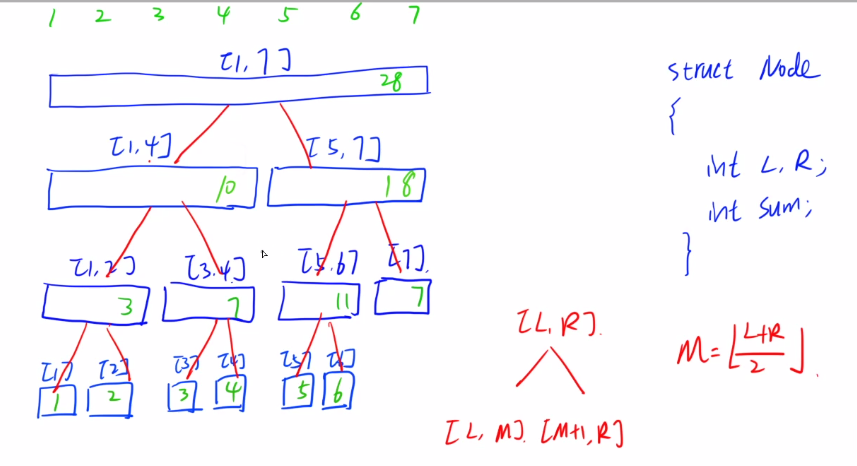
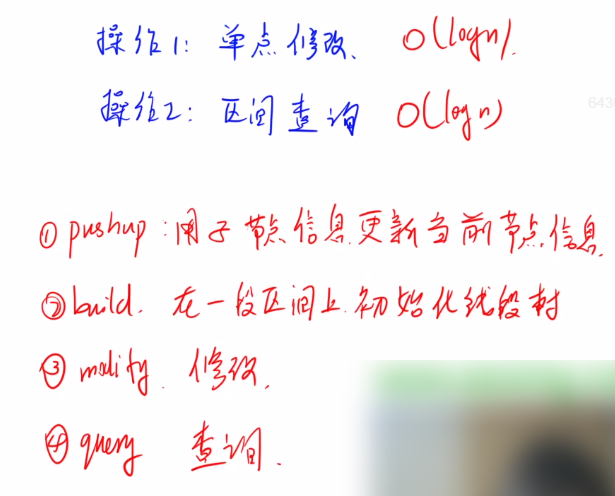
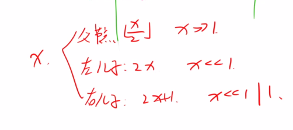
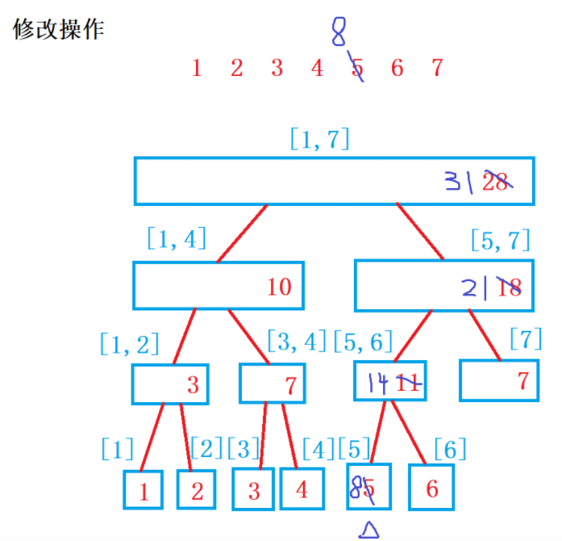
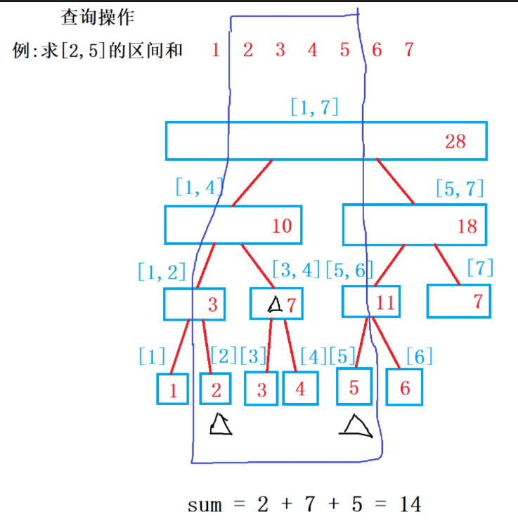

### 2.线段树

线段树（segment tree）是一种以**二叉树**为基础的数据结构，可以用于进行高效的范围最大（小）值查询、范围和查询等。

原理比树状数组要简单，但是代码更复杂。

<!--more-->

推荐文章1：https://www.acwing.com/blog/content/372/。

推荐文章2：https://www.acwing.com/blog/content/392/。

线段树,树上面的**所有节点都是线段,都是一个区间**.

在构建线段树之前，我们先阐述**线段树的性质**：

1、线段树的每个节点都代表一个区间。

2、线段树具有唯一的根节点，代表的区间是整个统计范围，如[1,N]。

3、线段树的每个叶节点都代表一个长度为1的元区间[x,x]。

4、对于每个内部节点[l,r]，它的左子结点是[l,mid]，右子节点是[mid+1,r]，其中mid=(l+r)/2（向下取整）。

以结点node的性质为sum为例，构建线段树：



在声明空间时，一般以查询区间长度的**4倍**来申请存储空间较为“安全”。（结点总数<=4*叶子结点数）

操作1：单点修改，更新指定值的叶子结点，同时更新它的所有祖先结点。O(logn).

操作2：区间查询，对于给定区间，不断二分递归，直到子区间将给定区间完全包含，再合并。O(logn).

对于区间修改操作，需要用到懒惰标记，会使得线段树的难度陡增，这里就不讨论。

四个核心函数：





图解修改操作：



图解查询操作：



#### 2.1 acwing.1264. 动态求连续区间和

上一讲树状数组的模板题。

线段树写法。比树状数组稍慢一点。

```C++
#include <cstdio>
#include <cstring>
#include <algorithm>
#include <iostream>
using namespace std;

const int N = 100010;
struct Node{// 线段树结点
    int l,r;// 左孩子和右孩子
    int sum;// 结点性质为求和
}tr[N*4];
int n,m;
int w[N];

void pushup(int u){// 用子结点更新当前结点的sum，上传操作，把信息往上传递
    tr[u].sum = tr[u << 1].sum + tr[u << 1 | 1].sum;
}

void build(int u,int l,int r){
    if (l == r) tr[u] = {l,r,w[r]};// 叶子结点
    else{
        tr[u] = {l,r};// 初始化左右端点
        int mid = l + r >> 1;// 递归左孩子和右孩子
        build(u << 1,l,mid),build(u << 1 | 1,mid+1,r);
        pushup(u);// 更新当前结点的sum
    }
}

int query(int u,int l,int r){
    // 给定查询区间完全包含线段树结点的区间，可以直接计算
    if (l <= tr[u].l && r >= tr[u].r) return tr[u].sum;
    int sum = 0;
    // 否则二分处理
    int mid = tr[u].l + tr[u].r >> 1;
    if (l <= mid) sum += query(u << 1,l,r);// 说明与左孩子有交集
    if (r > mid) sum += query(u << 1 | 1,l,r);// 即r>=mid+1，说明与右孩子有交集
    return sum;
}

void modify(int u,int x,int v){
    if (tr[u].l == tr[u].r) tr[u].sum += v;// 叶子结点，目标位置
    else{
        int mid = tr[u].l + tr[u].r >> 1;
        if (x <= mid) modify(u << 1,x,v);
        else modify(u << 1 | 1,x,v);
        pushup(u);// 回溯时更新当前结点的sum
    }
}
int main(){
    scanf("%d%d",&n,&m);
    for (int i = 1;i <= n;i++) scanf("%d",&w[i]);
    build(1,1,n);// 初始化线段树，下标从1开始
    while (m--){
        int k,a,b;
        scanf("%d%d%d",&k,&a,&b);
        if (k == 0) printf("%d\n",query(1,a,b));
        else modify(1,a,b);
    }
    return 0;
}
```

