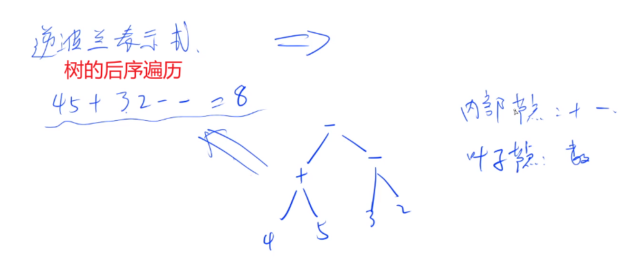
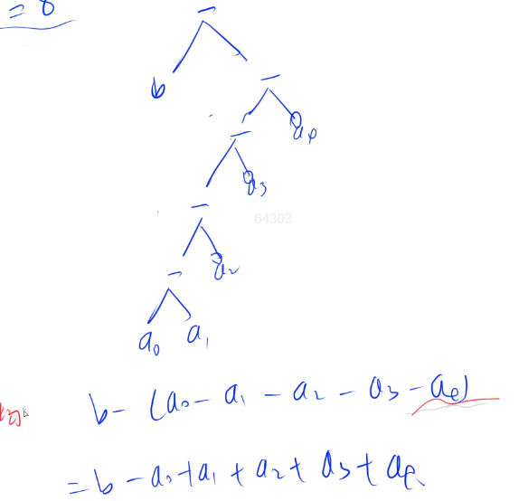
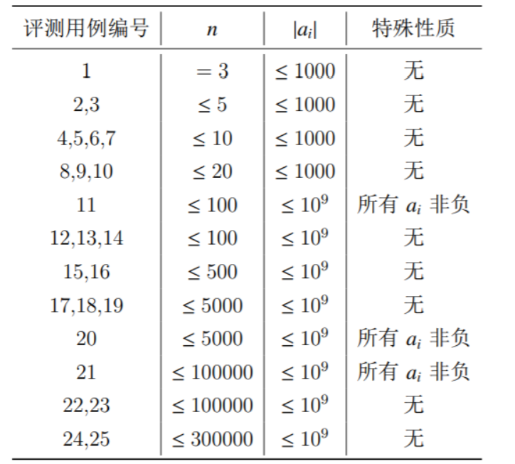
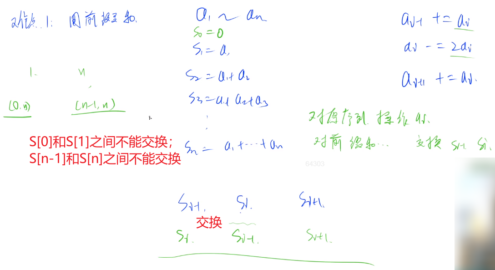
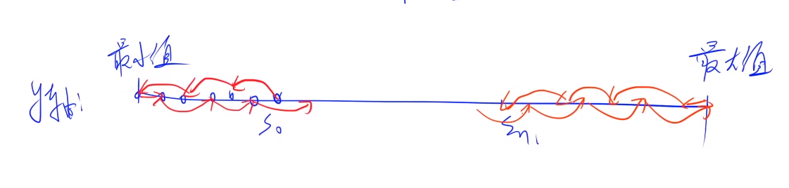

#### 7 acwing.1247. 后缀表达式

第十届蓝桥杯省赛C++B组,第十届蓝桥杯省赛JAVAB组

<!--more-->

```C++
给定 N 个加号、M 个减号以及 N+M+1 个整数 A1,A2,⋅⋅⋅,AN+M+1，小明想知道在所有由这 N 个加号、M 个减号以及 N+M+1 个整数凑出的合法的后缀表达式中，结果最大的是哪一个？
请你输出这个最大的结果。
例如使用 123+−，则 “23+1−” 这个后缀表达式结果是 4，是最大的。

输入格式
第一行包含两个整数 N 和 M。

第二行包含 N+M+1 个整数 A1,A2,⋅⋅⋅,AN+M+1。

输出格式
输出一个整数，代表答案。

数据范围
0≤N,M≤10^5,
−10^9≤Ai≤10^9
输入样例：
1 1
1 2 3
输出样例：
4
```

思路：

后缀表达式又称为逆波兰式。可以用栈来模拟（严奶奶的数据结构），而栈又和树的结构很像，也可以看成树。



树的前、中和后序遍历分别对应前、中和后缀表达式。

我们要将逆波兰式转化成熟悉的中缀表达式。

题目的一个坑：给定M(M>0)个逆波兰式的减号，转化成中缀表达式后减号不一定是M个了。

举个例子：



上图中的M=5个减号，转化成中缀表达式之后只剩下一个减号了。

同理，给定N个逆波兰式的加号，通过把加号放在括号里面，就能变成减号，所以**实际上能构造出1~M+N个**

**减号**。这一步就是分析的关键所在。

对于转化后的中缀表达式，我们至少要加一个数，因为第一个数之前没有符号；至少要减一个数，因为M>0时，最少需要一个减号。

```C++
#include <cstdio>
#include <algorithm>
#include <iostream>
using namespace std;
typedef long long LL;
const int N = 200010;// 有N+M+1个数，开2倍10^5
int n,m;
int a[N];

int main(){
    scanf("%d%d",&n,&m);
    int k = n + m + 1;
    for (int i = 0;i < k;i++) scanf("%d",&a[i]);
    
    LL res = 0;
    if (m == 0){// 特判m = 0的情况，没有减号，全部相加
        for (int i = 0;i < k;i++) res += a[i];
    }else{
        sort(a,a+k);// 也可以不排序，只要找出最大、小值即可
        res = a[k-1] - a[0];
        for (int i = 1;i < k-1;i++) res += abs(a[i]);
    }

    printf("%lld\n",res);
    return 0;
}
```

---

补充一个小知识点：

防止爆int的非常保险的一个做法，

```C++
#include<bits/stdc++.h>
#define int long long // nb!
using namespace std;
signed main(){
    int x;
    scanf("%lld",&x);// scanf记得lld
    return 0;
}
// int == signed int == signed
// unsigned int == unsigned
```

---

#### 8 acwing.1248. 灵能传输

第十届蓝桥杯省赛C++B/研究生组,第十届蓝桥杯省赛JAVAB组

最后一题，比较麻烦，有难度。

```C++
在游戏《星际争霸 II》中，高阶圣堂武士作为星灵的重要 AOE 单位，在游戏的中后期发挥着重要的作用，其技能”灵能风暴“可以消耗大量的灵能对一片区域内的敌军造成毁灭性的伤害。
经常用于对抗人类的生化部队和虫族的刺蛇飞龙等低血量单位。
你控制着 n 名高阶圣堂武士，方便起见标为 1,2,⋅⋅⋅,n。
每名高阶圣堂武士需要一定的灵能来战斗，每个人有一个灵能值 ai 表示其拥有的灵能的多少（ai 非负表示这名高阶圣堂武士比在最佳状态下多余了 ai 点灵能，ai 为负则表示这名高阶圣堂武士还需要 −ai 点灵能才能到达最佳战斗状态）。

现在系统赋予了你的高阶圣堂武士一个能力，传递灵能，每次你可以选择一个 i∈[2,n−1]，若 ai≥0 则其两旁的高阶圣堂武士，也就是 i−1、i+1 这两名高阶圣堂武士会从 i 这名高阶圣堂武士这里各抽取 ai 点灵能；若 ai<0 则其两旁的高阶圣堂武士，也就是 i−1,i+1 这两名高阶圣堂武士会给 i 这名高阶圣堂武士 −ai 点灵能。

形式化来讲就是 ai−1+=ai,ai+1+=ai,ai−=2ai。

灵能是非常高效的作战工具，同时也非常危险且不稳定，一位高阶圣堂武士拥有的灵能过多或者过少都不好，定义一组高阶圣堂武士的不稳定度为 max(i from 1 to n)|ai|，请你通过不限次数的传递灵能操作使得你控制的这一组高阶圣堂武士的不稳定度最小。

输入格式
本题包含多组询问。输入的第一行包含一个正整数 T 表示询问组数。
接下来依次输入每一组询问。
每组询问的第一行包含一个正整数 n，表示高阶圣堂武士的数量。
接下来一行包含 n 个数 a1,a2,⋅⋅⋅,an。

输出格式
输出 T 行。
每行一个整数依次表示每组询问的答案。

数据范围
1≤T≤3,3≤n≤300000,|ai|≤10^9,
每个评测用例的限制如下：
```



```C++
输入样例1：
3
3
5 -2 3
4
0 0 0 0
3
1 2 3
输出样例1：
3
0
3
输入样例2：
3
4
-1 -2 -3 7
4
2 3 4 -8
5
-1 -1 6 -1 -1
输出样例2：
5
7
4
样例解释
样例一
对于第一组询问：
对 2 号高阶圣堂武士进行传输操作后 a1=3，a2=2，a3=1。答案为 3。
对于第二组询问：
这一组高阶圣堂武士拥有的灵能都正好可以让他们达到最佳战斗状态。
```

思路：

由题意可知，对于中间的圣堂武士来说，无论是吸收还是给出灵能给两边的武士，都可以统一处理：

ai−1+=ai,ai+1+=ai,ai−=2ai。

难点1：想到**前缀和**的做法。



构造前缀和序列，我们每次操作a[i]（i = 2,3,...,n-1）时，相当于交换S[i-1]和S[i]的值，这个性质很重要。

因为`a[i] == S[i] - S[i-1]`，所以有：`max{|a[i]|} == max{|S[i] - S[i-1]|}`.

难点2：如何求最小不稳定度，贪心策略。

如果S[0]和S[n]也能参与交换的话，我们只要对前缀和数组排序使得它是单调的，这样差值才会最小，然后就

可以通过直接计算max(s[i]-s[i-1]的值 获得不稳定度的最小值。

然而S[0]和S[n]是不能参与交换的！

我们用数轴来思考会简单很多。前缀和数组S[N]的每个元素分布在一个数轴上，我们需要从S[0]跳到S[n]，每

个点都必须经过且只经过一次。**那所求的最小不稳定度也就是跳步的最短距离。**



由上图可知，**最优的贪心策略**必然是：S[0]-->最小值-->最大值-->S[n]。（难点，双指针实现）

必须间隔一个点跳一步，因为每个点只能经过一次。

时间复杂度：O(n*logn)

代码：

```C++
#include <cstdio>
#include <algorithm>
#include <iostream>
#include <cstring>
using namespace std;
const int N = 300010;
typedef long long LL;
bool st[N];
LL s[N],a[N];
int n,T;
int main(){// 注意细节
    scanf("%d",&T);
    while (T--){
        scanf("%d",&n);
        s[0] = 0;// s[0]定义为0
        for (int i = 1;i <= n;i++){
            scanf("%lld",&a[i]);
            s[i] = s[i-1] + a[i];// 计算前缀和数组
        }
        LL s0 = s[0],sn = s[n];// 排序之前拿出s0,sn
        if (s0 > sn) swap(s0,sn);// s0必须小于sn，否则交换
        sort(s,s+n+1);// 记得对前缀和数组排序

        for (int i = 0;i <= n;i++){
            if (s[i] == s0){// 从前往后找到s[0]在排序之后的下标
                s0 = i;
                break;
            }
        }
        for (int i = n;i >= 0;i--){
            if (sn == s[i]){// 从后往前，因为s[0]可能==s[n]，找到s[n]在排序之后的下标
                sn = i;
                break;
            }
        }

        memset(st,0,sizeof st);// 判重数组置零
        int l = 0,r= n;
        // 第1步：从起点s[s0]跳到最小值s[0]
        for (int i = s0;i >= 0;i -= 2){// 间隔1个点跳一步
            a[l++] = s[i];//a[]存入对s[]调整顺序后的s[i]
            st[i] = true;// 用于判重
        }
        // 第3步：从最大值s[n]跳到终点s[sn]
        for (int i = sn;i <= n;i += 2){// 间隔1个点跳一步
            a[r--] = s[i];// 反向计算
            st[i] = true;
        }
		//  第2步：从最小值s[0]跳到最大值s[n]
        for (int i = 0;i <= n;i++){
            if (!st[i]){// 把之前没走过的点都走完
                a[l++] = s[i];
            }
        }

        LL res = 0;
        for (int i = 1;i <= n;i++) res = max(res,abs(a[i] - a[i-1]));
        printf("%lld\n",res);
    }
    
    return 0;
}
```

