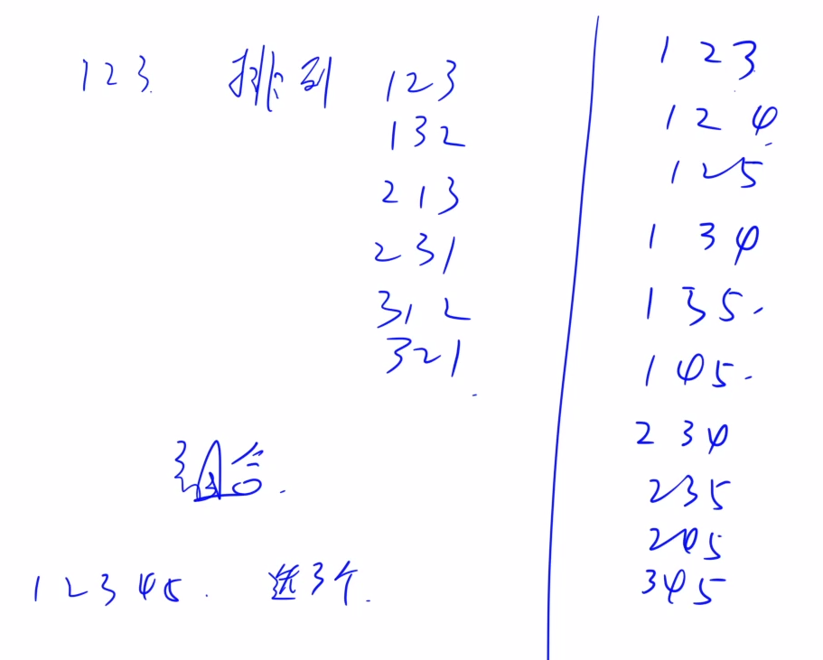
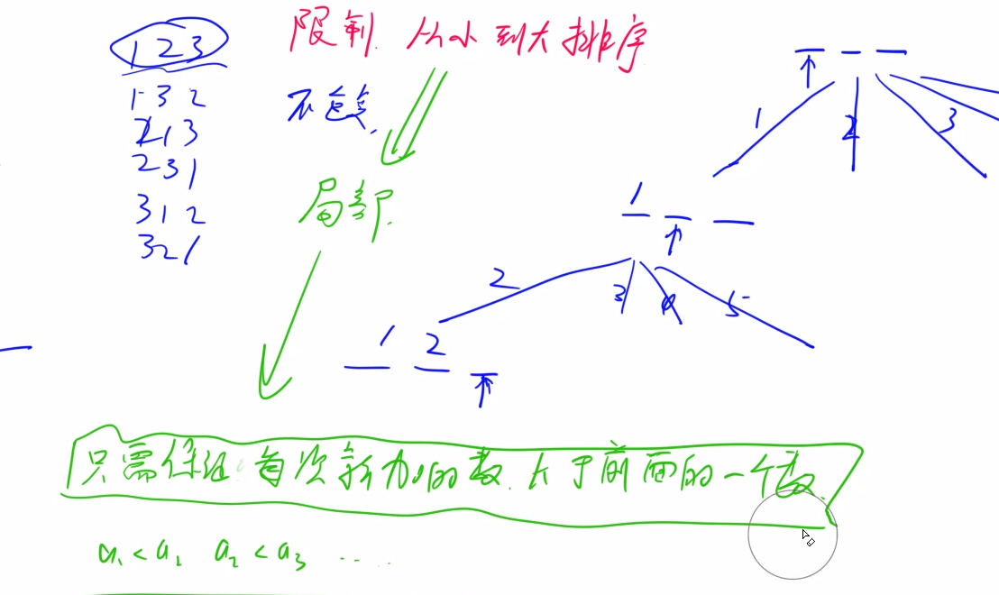
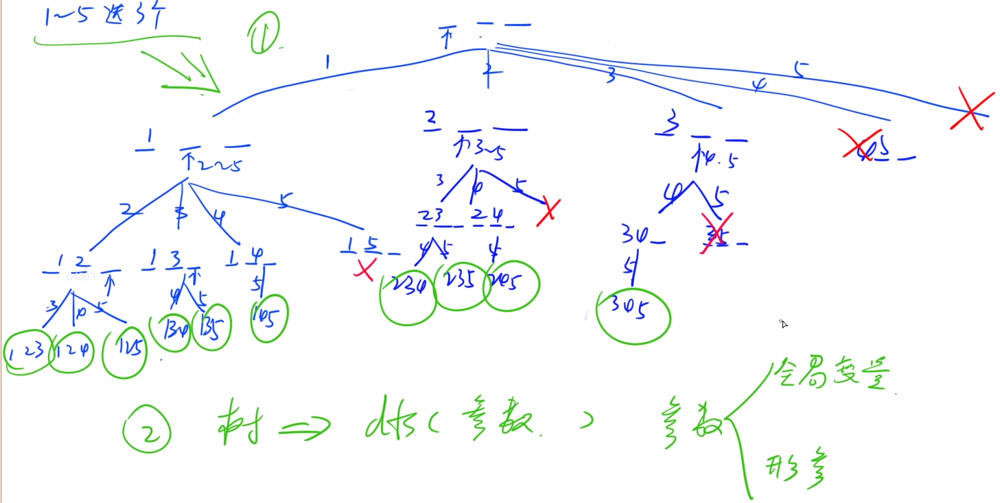
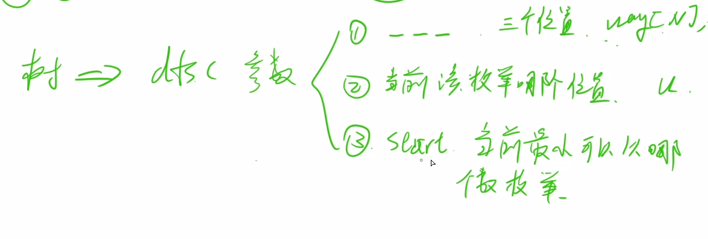
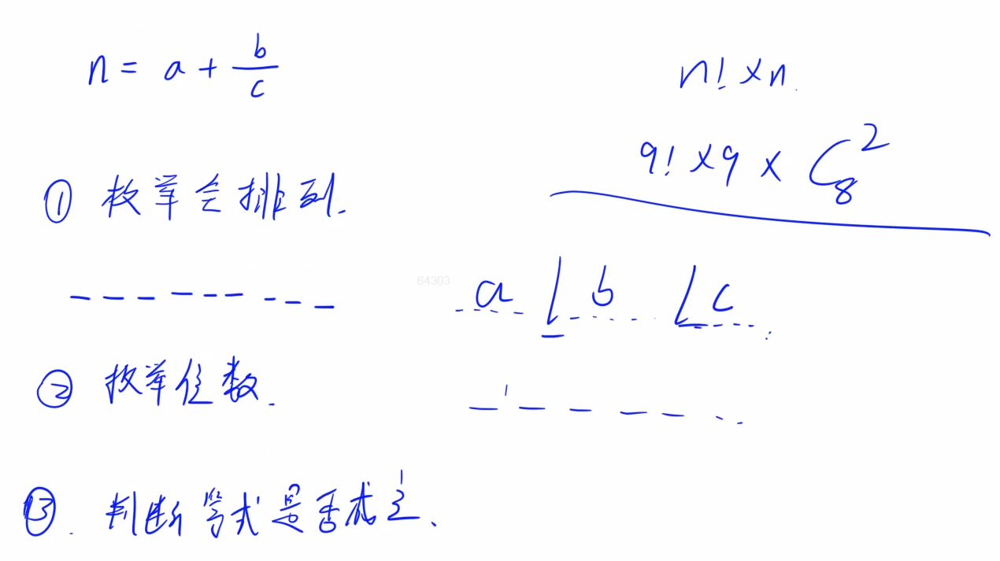
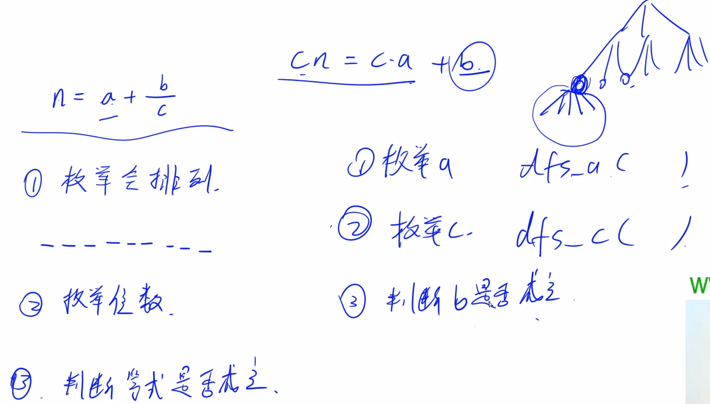
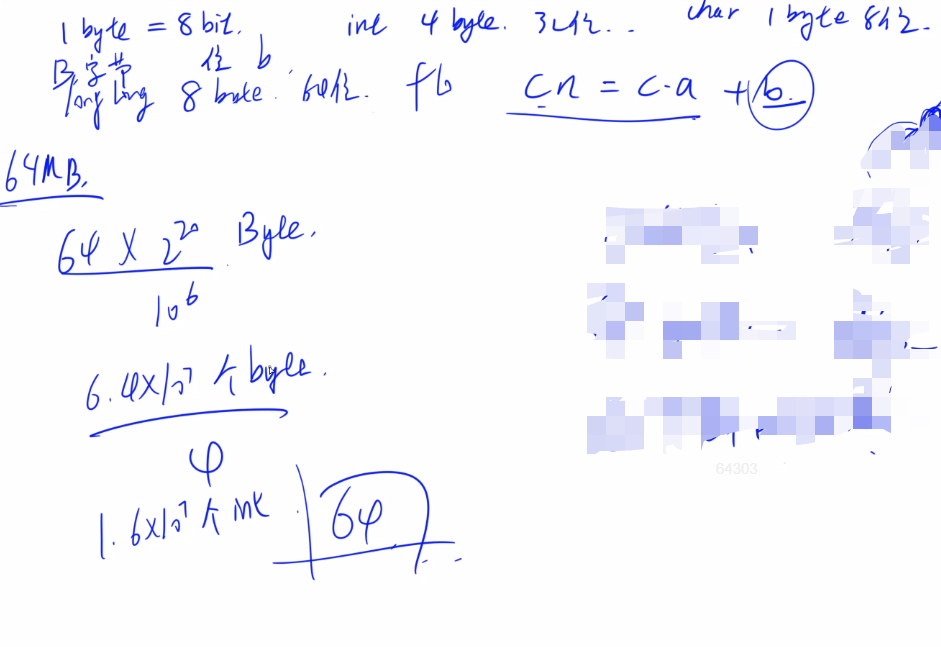
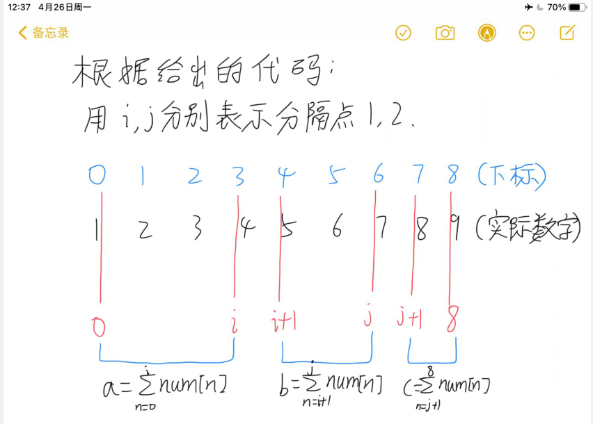

> 续蓝桥杯学习总结（一）。

#### 2.3 acwing.93.递归实现组合型枚举

从 1∼n 这 n 个整数中随机选出 m 个，输出所有可能的选择方案。

<!--more-->

**输入格式**
两个整数 n,m ,在同一行用空格隔开。

**输出格式**
按照**从小到大的顺序输出**所有方案，每行 1 个。

首先，同一行内的数升序排列，相邻两个数用一个空格隔开。

其次，对于两个不同的行，对应下标的数一一比较，字典序较小的排在前面（例如 1 3 5 7 排在 1 3 6 8 前面）。

```C++
数据范围
n>0 ,
0≤m≤n ,
n+(n−m)≤25
输入样例：
5 3
输出样例：
1 2 3 
1 2 4 
1 2 5 
1 3 4 
1 3 5 
1 4 5 
2 3 4 
2 3 5 
2 4 5 
3 4 5 
```

思考题：如果要求使用非递归方法，该怎么做呢？

##### 1思路：

先在纸上模拟一遍（不要空想，为难自己），拿笔写一写。



为避免方案的重复，需要限制方案内部是升序的。（与排列型的关键区别）



##### 2画出递归搜索树：





##### 3代码实现：

```c++
#include <iostream>
#include <cstdio>
#include <algorithm>
using namespace std;
const int N = 30;
int n,m;
int way[N];
void dfs(int u,int start)
{
    // 当前进行dfs(u...)，已经选u-1个数，剩下n-strat+1个数可选
    // u-1 + n-strat+1 < m，把后面所有的数都选上，加起来也不够m，直接退出
    if (u + n - start < m) return;// 递归搜索的剪枝优化，快了近三倍
    if (u == m + 1)
    {
        for (int i = 1;i <= m;i ++) printf("%d ",way[i]);
        puts("");
        return;
    }
    for (int i = start;i <= n;i ++)
    {
        way[u] = i;
        dfs(u+1,i+1);

        way[u] = 0; //恢复现场
    }

}
int main()
{
    scanf("%d%d",&n,&m);
    dfs(1,1);
    return 0;
}
```

#### 2.4 acwing.1209.带分数（cpp B/C组）

100可以表示为带分数的形式：$100=3+\frac{69258}{714}$

还可以表示为：$100=82+\frac{3546}{197}$

注意特征：带分数中，数字 1∼9 分别出现且只出现一次（不包含 0）。

类似这样的带分数，100 有 11种表示法。

输入格式

一个正整数。

输出格式

输出输入数字用数码 1∼9不重复不遗漏地组成带分数表示的全部种数。

数据范围

1≤N<$10^6$

输入样例1：

```
100
```

输出样例1：

```
11
```

输入样例2：

```
105
```

输出样例2：

```
6
```

##### y总思路：



剪枝优化：

根据等式，实际上只需要枚举两个变量，另外一个可以算出来。



补充空间复杂度的计算：



代码如下：

两层dfs嵌套是扩展内容，不要求掌握，会一般的全排列暴力搜索就行。

太难了，恐怖如斯。

[参考思路](https://www.acwing.com/solution/content/38879/)

```C++
#include <cstdio>
#include <cstring>
#include <iostream>
#include <algorithm>

using namespace std;

const int N = 10;

int n;
bool st[N], backup[N];
int ans;

bool check(int a, int c)
{
    long long b = n * (long long)c - a * c;

    if (!a || !b || !c) return false;

    memcpy(backup, st, sizeof st);// 将st数组复制到backup
    while (b)
    {
        int x = b % 10;     // 取个位
        b /= 10;    // 个位删掉
        if (!x || backup[x]) return false;
        backup[x] = true;
    }

    for (int i = 1; i <= 9; i ++ )
        if (!backup[i])
            return false;

    return true;
}

void dfs_c(int u, int a, int c)
{
    if (u > 9) return;

    if (check(a, c)) ans ++ ;

    for (int i = 1; i <= 9; i ++ )
        if (!st[i])
        {
            st[i] = true;
            dfs_c(u + 1, a, c * 10 + i);
            st[i] = false;
        }
}

void dfs_a(int u, int a)
{
    if (a >= n) return;
    if (a) dfs_c(u, a, 0);// 对于每一个a，再对c进行枚举

    for (int i = 1; i <= 9; i ++ )
        if (!st[i])
        {
            st[i] = true;
            dfs_a(u + 1, a * 10 + i);
            st[i] = false;
        }
}

int main()
{
    cin >> n;

    dfs_a(0, 0);

    cout << ans << endl;

    return 0;
}

作者：yxc
链接：https://www.acwing.com/activity/content/code/content/159648/
来源：AcWing
著作权归作者所有。商业转载请联系作者获得授权，非商业转载请注明出处。
```

##### 解题思路2（看懂这个就行）：

- 暴力枚举出9个数的全排列，然后用一个长度为9的数组保存全排列的结果
- 从全排列的结果中用两重循环暴力分解出三段，每段代表一个数
- 验证枚举出来的三个数是否满足题干条件，若满足则计数
  代码如下：

```c++
#include <iostream>

using namespace std;

const int N = 10;

int target; //题目给出的目标数
int num[N]; //保存全排列的结果
bool used[N]; //生成全排列过程中标记是否使用过
int cnt; //计数，最后输出的结果

//计算num数组中一段的数是多少
//因为c*n == a*c+b有概率会爆int 保险起见longlong 
int calc(int l, int r){//l是num[l]之前,r是num[r]之后
    int res = 0;
    for(int i = l; i <= r; i++)
        res = res * 10 + num[i];
    return res;
}

void dfs(int u){
	//当全排列生成后进行分段
    //用两层循环分成三段
    if(u == 9){
        for(int i = 0; i < 7; i++)// 枚举分隔点1
            for(int j = i + 1; j < 8; j++){// 枚举分隔点2
                if(j-i+1<9-j)continue; // 剪枝优化1，b的位数一定>=c的位数
                // 位数,a:i + 1; b:j - i; c:8-j
                int a = calc(0, i);
                if (a >= target) continue; // 剪枝优化2，参考自别人
                int b = calc(i + 1, j);
                int c = calc(j + 1, 8);
                //注意判断条件，因为C++中除法是整除，所以要转化为加减乘来计算
                if(a * c + b == c * target) cnt++;// 小心爆int
            }

        return;
    }

    //生成全排列
    //搜索模板
    for(int i = 1; i <= 9; i++)
        if(!used[i]){
            used[i] = true; //标记使用
            num[u] = i;
            dfs(u + 1);
            used[i] = false; //还原现场
        }
}

int main(){

    scanf("%d", &target);

    dfs(0);

    printf("%d\n", cnt);
    return 0;
}

作者：Daniel丶y
链接：https://www.acwing.com/solution/content/6724/
来源：AcWing
著作权归作者所有。商业转载请联系作者获得授权，非商业转载请注明出处。
```



