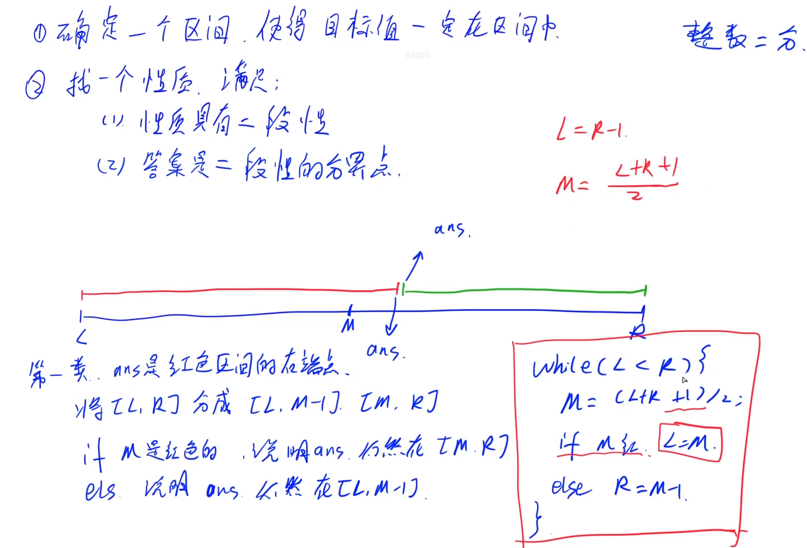
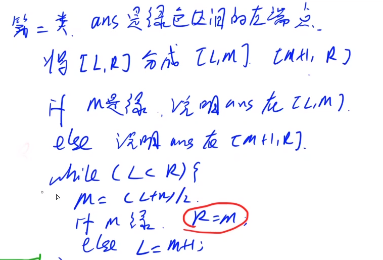
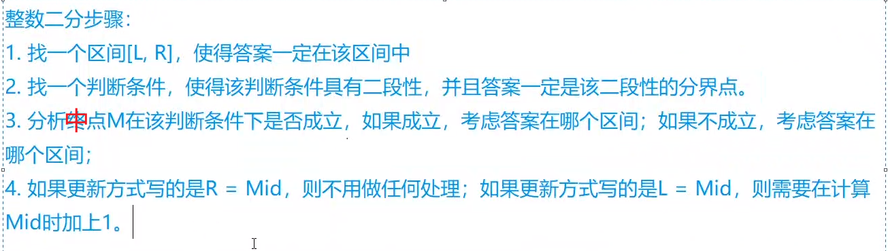
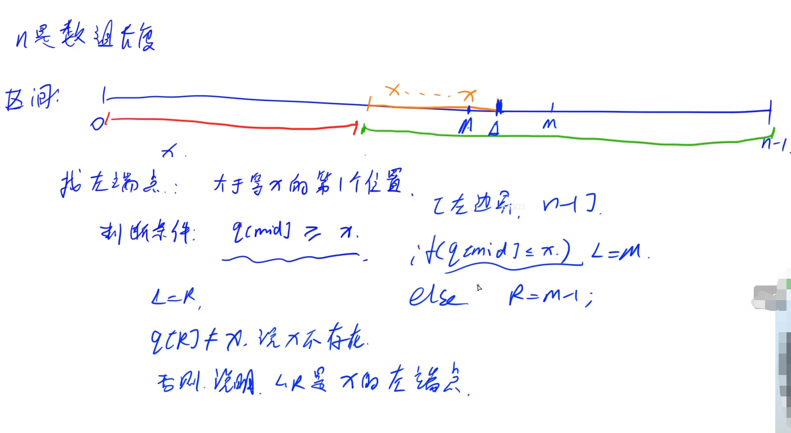
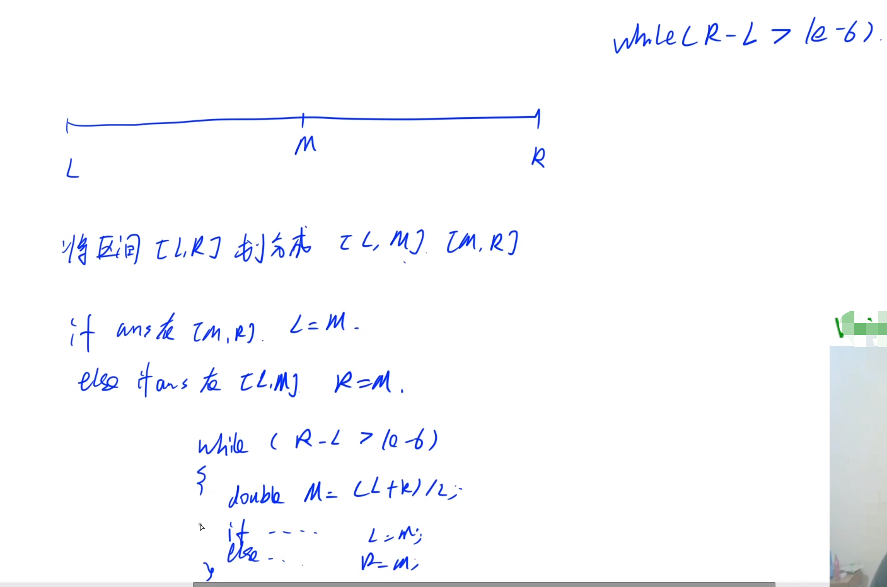

## 二分与前缀和

<!--more-->

### 1.二分

#### 1.1 整数二分

> 推荐配合[二分查找](https://grant1499.github.io/2021/03/30/%E4%BA%8C%E5%88%86%E6%9F%A5%E6%89%BE/#more)食用。最好先看一遍，方便理解。

对于整数二分，我们可以分成两个模版，下图中给出的是模板1的代码。



注意：当M取红色时，有`L=M`，这里的模板1必须保证M等于`(L+R+1)/2`，括号里加上1对`(L+R)/2`向上取整，否则会对它向下取整，会导致左边界L一直取到M，陷入死循环。

模板2：



总结：



#### 1.2 acwing.789. 数的范围（模板题）

```C++
给定一个按照升序排列的长度为 n 的整数数组，以及 q 个查询。
对于每个查询，返回一个元素 k 的起始位置和终止位置（位置从 0 开始计数）。
如果数组中不存在该元素，则返回 -1 -1。

输入格式
第一行包含整数 n 和 q，表示数组长度和询问个数。
第二行包含 n 个整数（均在 1∼10000 范围内），表示完整数组。
接下来 q 行，每行包含一个整数 k，表示一个询问元素。

输出格式
共 q 行，每行包含两个整数，表示所求元素的起始位置和终止位置。
如果数组中不存在该元素，则返回 -1 -1。

数据范围
1≤n≤100000
1≤q≤10000
1≤k≤10000
输入样例：
6 3
1 2 2 3 3 4
3
4
5
输出样例：
3 4
5 5
-1 -1
```

题解1：STL

```C++
// soluition 1，自己写的STL写法
#include <iostream>
#include <algorithm>
using namespace std;
const int N = 100010;
int num[N];
int main(){
    int n,q,k,i;
    cin >> n >> q;
    for (i=0;i<n;i++) cin >> num[i];

    while (q--){
        cin >> k;
        int l = lower_bound(num, num +i, k)-num;
        int r = upper_bound(num, num +i, k)-num;
        //特判一下，l==r时说明上下界重合，未找到
        if (l==r) cout << -1 << " " << -1 << endl;
        else cout << l << " " << r-1 << endl;

    }
    return 0;
}
```

题解2：手打二分



```C++
// y总题解，更快一点
#include <iostream>
#include <cstdio>
#include <cstring>
using namespace std;
const int N = 100010;

int n,m;
int q[N];
int main(){
    scanf("%d%d",&n,&m);
    for(int i = 0;i < n;i++) scanf("%d",&q[i]);

    for (int i = 0;i < m;i++){
        int x;
        scanf("%d",&x);
        // 求二分左端点
        int l = 0,r = n-1;// 确定区间范围
        while (l < r){
            int mid = l+r >> 1;
            if (q[mid]>=x) r = mid;
            else l = mid+1;
        }

        if (q[r] == x){
            printf("%d ",r);
            // 求二分x的右端点
            r = n-1;// 右端点一定在[左端点, n - 1] 之间
            while (l < r){
                // 因为写的是l = mid，所以需要补上1
                int mid = l+r+1 >> 1;
                if (q[mid]<=x) l = mid;
                else r = mid-1;
            }
            printf("%d\n",r);
        }
        else puts("-1 -1");
    }
    return 0;
}
```

#### 1.3 实数二分

实数二分比整数二分简单多了。



注意：这里的二分除法是严格的除法，不是整数除法。

#### 1.4 acwing.790.数的三次方根

```C++
给定一个浮点数 n，求它的三次方根。
输入格式
共一行，包含一个浮点数 n。

输出格式
共一行，包含一个浮点数，表示问题的解。
注意，结果保留 6 位小数。

数据范围
−10000≤n≤10000
输入样例：
1000.00
输出样例：
10.000000
```

```C++
#include <iostream>
#include <cstdio>
using namespace std;
int main(){
    double n;
    cin >> n;
    double l = -10000,r = 10000;
    while (r-l>1e-8){ // 比题目要求多求几位
        double mid = (l+r)/2;
        if (mid*mid*mid>=n) r = mid;
        else l = mid;
    }
    printf("%lf",r); // 默认输出6位小数
    return 0;
}
```

