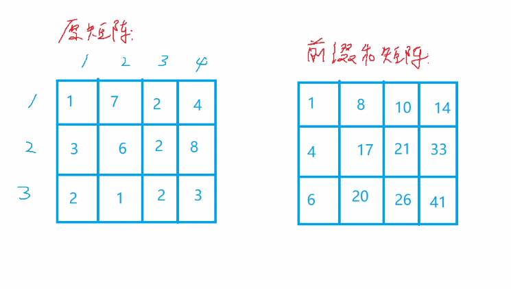
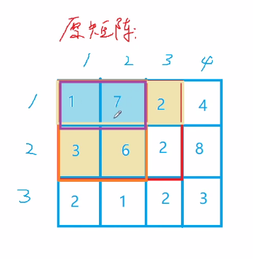
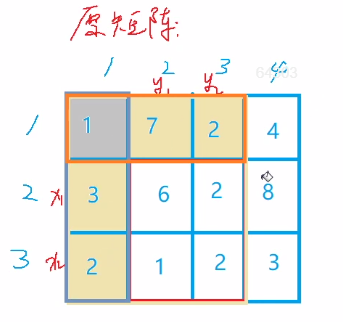
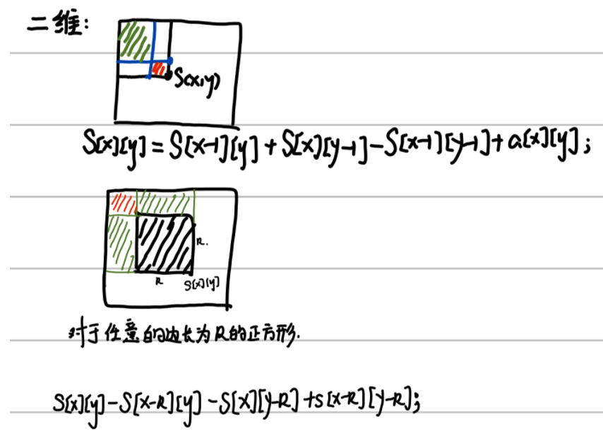
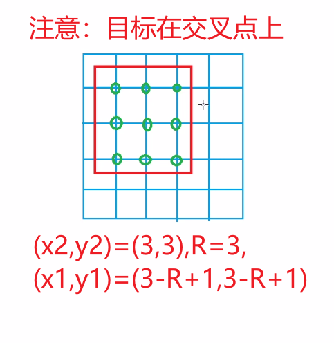

#### 2.2 acwing.796.子矩阵的和（二维模板题）

<!--more-->

```C++
输入一个 n 行 m 列的整数矩阵，再输入 q 个询问，每个询问包含四个整数 x1,y1,x2,y2，表示一个子矩阵的左上角坐标和右下角坐标。
对于每个询问输出子矩阵中所有数的和。

输入格式
第一行包含三个整数 n，m，q。
接下来 n 行，每行包含 m 个整数，表示整数矩阵。
接下来 q 行，每行包含四个整数 x1,y1,x2,y2，表示一组询问。

输出格式
共 q 行，每行输出一个询问的结果。

数据范围
1≤n,m≤1000,
1≤q≤200000,
1≤x1≤x2≤n,
1≤y1≤y2≤m,
−1000≤矩阵内元素的值≤1000
输入样例：
3 4 3
1 7 2 4
3 6 2 8
2 1 2 3
1 1 2 2
2 1 3 4
1 3 3 4
输出样例：
17
27
21
```

思路：

前缀和矩阵每个格子的数就是从原矩阵(1,1)到当前格子构成矩阵的和。

二维前缀和和一维一样，**有一个起始点**，然后再计算前缀和序列。



那么如何计算前缀和矩阵呢？

我们采用**容斥原理**的思想。



计算(1,1)到(2,3)的矩阵和：

先计算1,7,3,6，再计算1,7,2，最后加上最后格子的2。

所以黄色格子算了1次，蓝色格子算了2次。

由此可以得到前缀和矩阵的推导公式：$S_{x,y} = S_{x-1,y}+S_{x,y-1}-S_{x-1,y-1}+a_{x,y}$

正如一维一样，二维前缀和也能得到一个类似递推的公式。

这样计算的话是线性时间复杂度，而通过循环将非常费时间。

接下来怎么根据前缀和矩阵计算子矩阵的和呢？



计算(1,1)到(2,3)的矩阵和：

原理和上面类似，先减去左边一列，再减去上面一行，最后加上左上角被多减去的部分。

直接给出公式：$S_{x_2,y_2}-S_{x_2,y_1-1}-S_{x_1-1,y_2}+S_{x_1-1,y_1-1}$

通过前缀和算法，我们将时间复杂度从$O(n*m)$降低到$O(1)$。

代码：

```C++
// y总题解
#include <iostream>
#include <cstdio>
using namespace std;

const int N = 1010;
int a[N][N],s[N][N];
int n,m,q;

int main(){
    scanf("%d%d%d",&n,&m,&q);
    for (int i = 1;i <= n;i++)
        for (int j = 1;j <= m;j++){
            scanf("%d",&a[i][j]);
            // 求前缀和矩阵
            s[i][j] = s[i-1][j]+s[i][j-1]-s[i-1][j-1]+a[i][j];
        }
    
    while (q--){
        int x1,y1,x2,y2;
        scanf("%d%d%d%d",&x1,&y1,&x2,&y2);
        printf("%d\n",s[x2][y2]-s[x2][y1-1]-s[x1-1][y2]+s[x1-1][y1-1]);
    }
    return 0;
}
```

#### 2.3 acwing.99. 激光炸弹（进阶指南）

```C++
地图上有 N 个目标，用整数 Xi,Yi 表示目标在地图上的位置，每个目标都有一个价值 Wi。
注意：不同目标可能在同一位置。
现在有一种新型的激光炸弹，可以摧毁一个包含 R×R 个位置的正方形内的所有目标。
激光炸弹的投放是通过卫星定位的，但其有一个缺点，就是其爆炸范围，即那个正方形的边必须和 x，y 轴平行。
求一颗炸弹最多能炸掉地图上总价值为多少的目标。

输入格式
第一行输入正整数 N 和 R，分别代表地图上的目标数目和正方形的边长，数据用空格隔开。
接下来 N 行，每行输入一组数据，每组数据包括三个整数 Xi,Yi,Wi，分别代表目标的 x 坐标，y 坐标和价值，数据用空格隔开。

输出格式
输出一个正整数，代表一颗炸弹最多能炸掉地图上目标的总价值数目。

数据范围
0≤R≤10^9
0<N≤10000,
0≤Xi,Yi≤5000
0≤Wi≤1000
输入样例：
2 1
0 0 1
1 1 1
输出样例：
1
```

思路：

按照题意，就是求边长为R的正方形的覆盖的最大值。**本质上就是二维前缀和的应用。**

参考大佬题解1：https://www.acwing.com/solution/content/10116/

参考大佬题解2：https://www.acwing.com/solution/content/31983/



**注意子矩阵和的公式**，套用上一题的公式时，3-R+1与公式里的x1-1,y1-1抵消了一个1，所以变成x-R,y-R了。



```C++
// y总题解
// 目标坐标从0到5000，移动到1到5001
#include <iostream>
#include <cstdio>
#include <algorithm>
using namespace std;

const int N = 5010;
int s[N][N];
int n,m;
int main(){
    int cnt,R;
    scanf("%d%d",&cnt,&R);
    R = min(5001,R);
    n = m = R;
    while (cnt--){
        int x,y,w;
        scanf("%d%d%d",&x,&y,&w);
        // 坐标+1，防止越界问题
        x++,y++;
        // 枚举的上限是最大坐标和R的最大值
        n = max(n,x),m = max(m,y);
        // 这里必须是+=，因为目标可能重复
        s[x][y] += w;
    }
    // 预处理前缀和
    for (int i = 1;i <= n;i++)
        for (int j = 1;j <= m;j++)
            s[i][j] += s[i-1][j]+s[i][j-1]-s[i-1][j-1];
    
    int res = 0;
    // 必须保证n,m >= R，才能保证至少循环一次
    // 枚举所有边长是R的矩形，枚举(i, j)为右下角
    for (int i = R;i <= n;i++)
        for (int j = R;j <= m;j++){
            res = max(res,s[i][j]-s[i-R][j]-s[i][j-R]+s[i-R][j-R]);
        }
    printf("%d",res);
    return 0;
}

```

注意卡空间，题目上限是168MB，开两个`s[5000][5000]`大概是200MB，所以只开一个数组。

因为同用一个数组，所以求前缀和矩阵的公式里`+a[i][j]`变成了`+s[i][j]`。

所以以后用二维前缀和，完全可以只开一个数组。