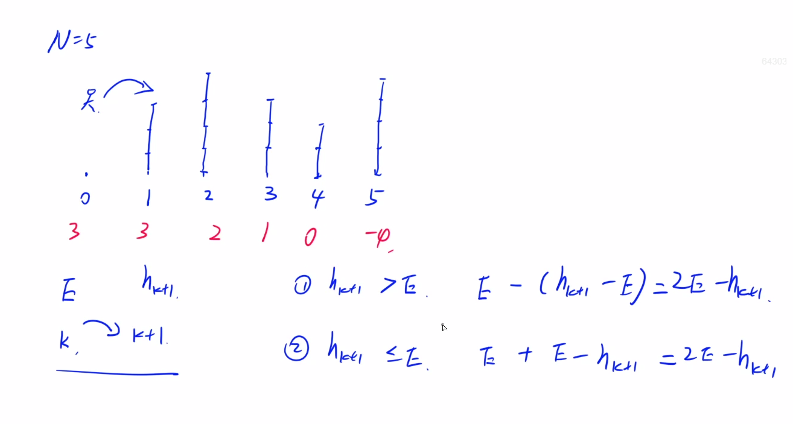
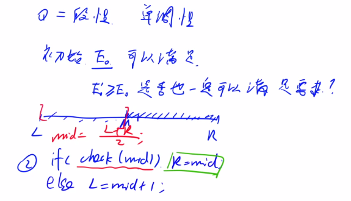
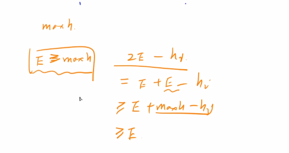
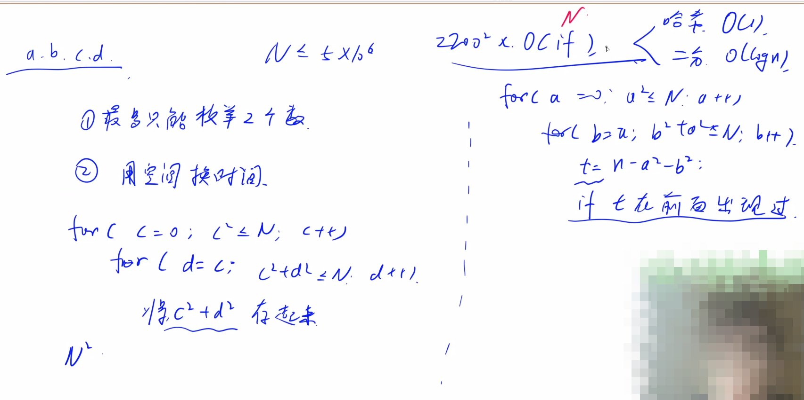

>  续蓝桥杯学习总结（五）。

<!--more-->

#### 1.5 acwing.730. 机器人跳跃问题（头条2019笔试题）

```C++
机器人正在玩一个古老的基于 DOS 的游戏。
游戏中有 N+1 座建筑——从 0 到 N 编号，从左到右排列。
编号为 0 的建筑高度为 0 个单位，编号为 i 的建筑高度为 H(i) 个单位。
起初，机器人在编号为 0 的建筑处。
每一步，它跳到下一个（右边）建筑。
假设机器人在第 k 个建筑，且它现在的能量值是 E，下一步它将跳到第 k+1 个建筑。
如果 H(k+1)>E，那么机器人就失去 H(k+1)−E 的能量值，否则它将得到 E−H(k+1) 的能量值。
游戏目标是到达第 N 个建筑，在这个过程中能量值不能为负数个单位。
现在的问题是机器人至少以多少能量值开始游戏，才可以保证成功完成游戏？

输入格式
第一行输入整数 N。
第二行是 N 个空格分隔的整数，H(1),H(2),…,H(N) 代表建筑物的高度。

输出格式
输出一个整数，表示所需的最少单位的初始能量值上取整后的结果。

数据范围
1≤N,H(i)≤105,
输入样例1：
5
3 4 3 2 4
输出样例1：
4
输入样例2：
3
4 4 4
输出样例2：
4
输入样例3：
3
1 6 4
输出样例3：
3
```

y总思路：



题目具有二段性，假设有E满足条件，比E小的数都不满足，比E大的数都满足。这点可以简单论证一下。



注意一个坑：如果E接近h的最大值时，`E*2`容易爆int（记住：int范围约是2*10$^9$.），其实我们只要判断`E>=max(h)`，满足的话后面E肯定是递增的，就不用再判断是否大于0了。证明如下：



```C++
// y总题解奉上
#include <iostream>
#include <cstdio>
using namespace std;
const int N = 100010;
int num[N]; // num[0]默认为0
int n;
bool check(int m){
    for (int i = 1;i <= n;i ++){
        m = 2*m - num[i];
        if (m >= 1e5) return true;
        if (m < 0) return false;
    }
    return true; // 这里别忘了
}
int main(){
    scanf("%d",&n);
    // 从num[1]开始读，包括num[0]在内是n+1座建筑
    for (int i = 1;i <= n;i++) scanf("%d",&num[i]);
    int l = 0,r = 1e5;
    while (l < r){
        int mid = (l+r)/2;
        if (check(mid))r = mid;
        else l = mid + 1;
    }
    printf("%d",l);
    return 0;
}
```

#### 1.6 acwing.1221. 四平方和（蓝桥杯省赛C++A/B组）

类似题目：acwing.75.和为S的两个数字，语法（九）题解有暴搜与哈希表两种做法。（PS：本题不可暴搜）

```C++
四平方和定理，又称为拉格朗日定理：
每个正整数都可以表示为至多 4 个正整数的平方和。
如果把 0 包括进去，就正好可以表示为 4 个数的平方和。
比如：
5=0^2+0^2+1^2+2^2
7=1^2+1^2+1^2+2^2
对于一个给定的正整数，可能存在多种平方和的表示法。
要求你对 4 个数排序：
0≤a≤b≤c≤d
并对所有的可能表示法按 a,b,c,d 为联合主键升序排列，最后输出第一个表示法。

输入格式
输入一个正整数 N。

输出格式
输出4个非负整数，按从小到大排序，中间用空格分开。

数据范围
0<N<5∗10^6
输入样例：
5
输出样例：
0 0 1 2
```

强行三重循环爆搜会超时的，怎么优化都过不了。Java能过，C++不行，Java时限更长。

y总思路：



(与带分数的转换方法类似)

1、a^2+b^2+c^2+d^2=n可以转换成 c^2+d^2=n−a^2−b^2

2、通过排序数组（或哈希表）存储c^2+d^2的值

3、枚举a和b，若n−a^2−b^2在排序数组（或哈希表）中存在，则表示一定存在c和d，满足方程

哈希表由于某些原因过不了。

##### 二分

时间复杂度：$O(n^2*logn)$，两重循环加一个二分查找

```C++
// y总二分题解
#include <cstdio>
#include <algorithm>
using namespace std;

const int N = 2500010; // 5*10^6的一半，后面枚举c、d
struct Sum{
    int s,c,d;
    // 结构体排序，重载小于号
    bool operator< (const Sum& t) const
    {
        if (s != t.s) return s < t.s; // s、c、d按字典序排序
        if (c != t.c) return c < t.c;
        return d < t.d;
    }
}sum[N];

int n,m;
int main(){
    scanf("%d",&n);
    for (int c = 0;c*c<= n;c++)
        for (int d = c;c*c+d*d<= n;d++)
        {
            sum[m++] = {c*c+d*d,c,d};
        }
    
    sort(sum,sum+m);

    for (int a = 0;a*a<= n;a++)
        for(int b = a;a*a+b*b<= n;b++)
        {
            int t = n-a*a-b*b;
            int l = 0,r = m-1;
            while (l < r){
                int mid = (l+r) >> 1;
                if (sum[mid].s >= t) r = mid;
                else l = mid + 1;
            }
            if (sum[l].s == t){
                printf("%d %d %d %d",a,b,sum[l].c,sum[l].d);
                return 0;
            }
        }
    return 0;
}
```

##### 哈希表

时间复杂度$O(n^2)$，本题超时，仅作为思路拓展！

不要轻信时间复杂度，这里二分与哈希表之间的常数不能忽略。

```C++
// y总题解
#include <cstring>
#include <iostream>
#include <algorithm>
#include <unordered_map>// 哈希表

#define x first
#define y second

using namespace std;

typedef pair<int, int> PII;// 必须放using...之后

int n, m;
unordered_map<int, PII> S;

int main()
{
    cin >> n;

    for (int c = 0; c * c <= n; c ++ )
        for (int d = c; c * c + d * d <= n; d ++ )
        {
            int t = c * c + d * d;
            if (S.count(t) == 0) S[t] = {c, d};
        }

    for (int a = 0; a * a <= n; a ++ )
        for (int b = 0; a * a + b * b <= n; b ++ )
        {
            int t = n - a * a - b * b;
            if (S.count(t))
            {
                printf("%d %d %d %d\n", a, b, S[t].x, S[t].y);
                return 0;
            }
        }

    return 0;
}
```

