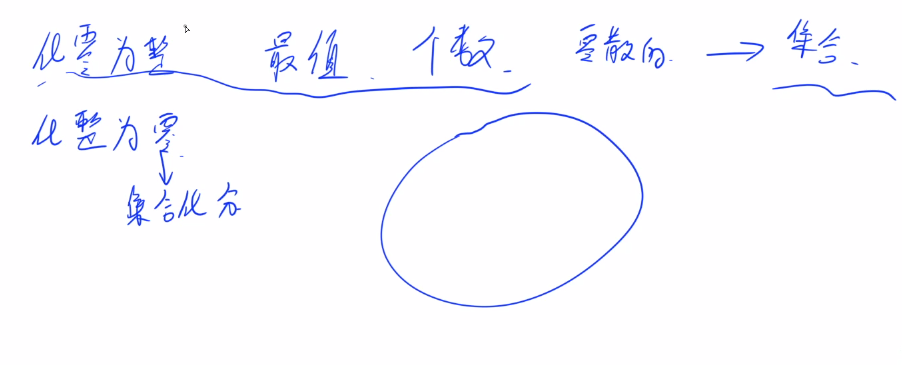
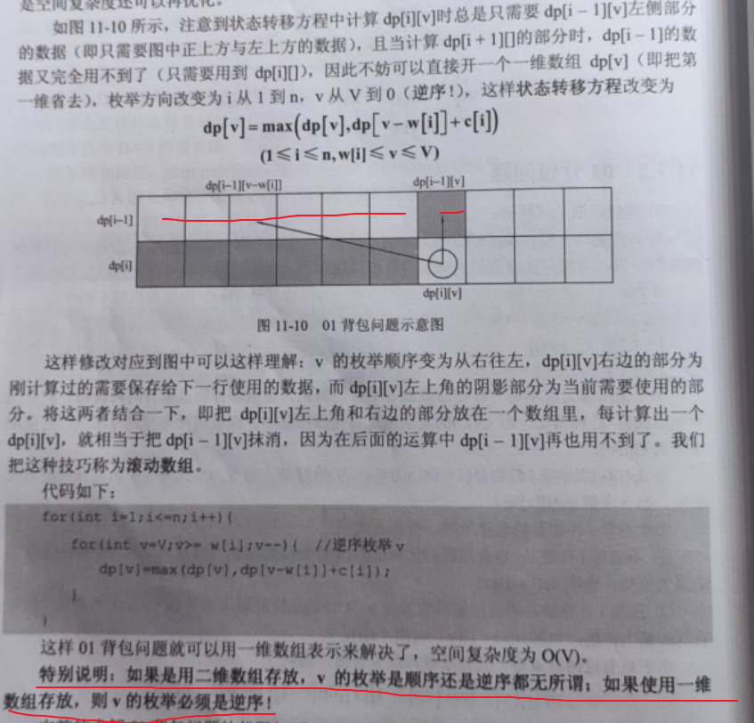
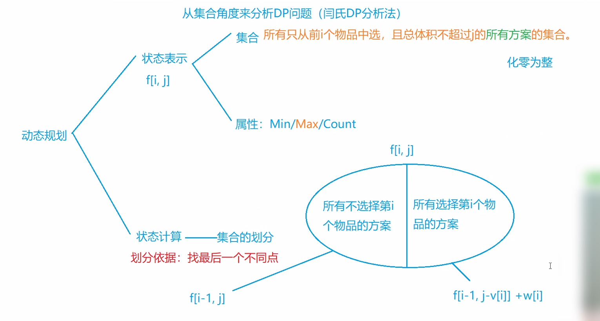
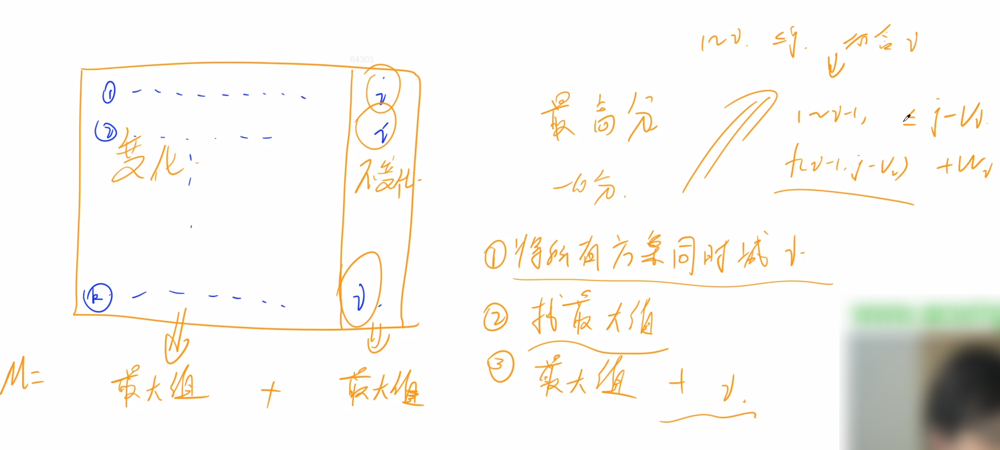
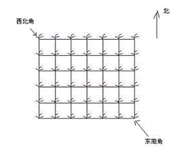
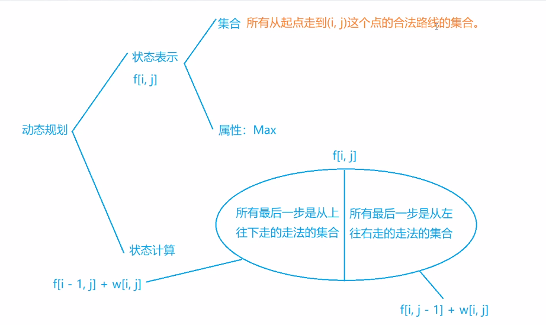

### 2.简单DP

动态规划（Dynamic Programming，DP）是一种用来解决一类**最优化问题**的算法思想。

背包问题是一类经典的DP问题，灵活多变。

[背包问题模板整理点这里](https://valen.blog.csdn.net/article/details/87878853?utm_medium=distribute.pc_relevant_t0.none-task-blog-2%7Edefault%7EBlogCommendFromMachineLearnPai2%7Edefault-1.control&depth_1-utm_source=distribute.pc_relevant_t0.none-task-blog-2%7Edefault%7EBlogCommendFromMachineLearnPai2%7Edefault-1.control)

[DP问题整理点这里](https://www.acwing.com/blog/content/630/)

<!--more-->

#### 2.1 闫氏DP分析法

我们从集合角度来分析DP问题。



#### 2.2 acwing.2. 01背包问题（背包九讲 , 模板题）

背包问题的核心其实就是组合问题，在一个背包中有若干物品，在某种限制条件下，选出最好的组合。

```C++
有 N 件物品和一个容量是 V 的背包。每件物品只能使用一次。
第 i 件物品的体积是 vi，价值是 wi。
求解将哪些物品装入背包，可使这些物品的总体积不超过背包容量，且总价值最大。
输出最大价值。

输入格式
第一行两个整数，N，V，用空格隔开，分别表示物品数量和背包容积。
接下来有 N 行，每行两个整数 vi,wi，用空格隔开，分别表示第 i 件物品的体积和价值。

输出格式
输出一个整数，表示最大价值。

数据范围
0<N,V≤1000
0<vi,wi≤1000
输入样例
4 5
1 2
2 4
3 4
4 5
输出样例：
8
```

思路：

参考1：y总视频讲解，参考2：《算法笔记》，参考3：《LeetCode 101》刷题指南

如果采用暴力枚举每一件物品放或者不放进背包，有两种选择，所以时间复杂度为$O(2^n)$，非常大。

接下来考虑**动态规划**求解。

##### 思路一：

###### 先尝试二维解法。

我们可以定义一个二维数组dp存储最大价值，其中`dp[i][j]` 表示前i 件物品体积不超过j （**即此时背包容量**

**为j**）的情况下能达到的最大价值。

在我们遍历到第i 件物品时，在当前背包总容量为j 的情况下，

1. 如果我们不将物品i 放入背包，那么`dp[i][j]= dp[i-1][j]`，即前i 个物品的最大价值等于只取前i-1 个

   物品时的最大价值；

2. 如果我们将物品i 放入背包，假设第i 件物品体积为wi，价值为vi，那么我们得到

   `dp[i][j] = dp[i-1][j-w[i]] + v[i]`。我们只需在遍历过程中对这两种情况取最大值即可，总时间复杂度和空间复杂度都为$O(NV)$。

综合上面提到的2种选择策略，我们可以得到状态转移方程：

`dp[i][j] = max{dp[i-1][j],dp[i-1][j-w[i]] + v[i]}`

确定初始化边界，`dp[0][0] = 0	`.

注意**理解误区**：

`dp[i][j]`里的`i`不是表示选择了前i个物品，而是表示对前i个物品做出两中策略的选择；

里面的`j`不是表示当前物品的总体积等于j，而是表示前i 件物品体积不超过j 。

这里给出一位大佬的解释：

```C++
无论 j 表示体积正好是 j 还是 不超过 j ，它的式子都是一样的 j - v[i]， 但是理解不同而已。
有一点不同就是：如果 j 表示体积正好是 j 的话，那么答案就需要遍历求max。如果表示的是 不超过 j 的话，答案就是 f[n][m] 。
如果只考虑第1件物品的话，应该只有 f[1][ v[1] ] = w[1] 其他的都是不存在最大质量的（都为0）。
但是按照 原来的初始化的话，f数组的第一行：f[1][ v[1] - v ] = v[1]（而这样的式子却代表的是 j 表示不超过 j 的情况、可以把两种情况的 f 数组画出来）
所以我认为：
1、j 表示 体积正好为 j ：需要 f[1][ v[1] ] = w[1]，其余的赋值为零。这样得到的数组 f 才能被解释赋予意义。答案就需要遍历求max。
2、j 表示 体积不超过 j ：式子不变，初始化不变，只是求答案不需要遍历，答案就是 f[n][m]。
```

再贴一位大佬的题解：（十分详细了）https://www.acwing.com/solution/content/1374/

代码：

```C++
#include <iostream>
#include <algorithm>
using namespace std;
const int N = 1010;
int dp[N][N]; // dp[0][0] = 0
int v[N],w[N];
int n,m;

int main(){
    cin >> n >> m;
    
    for (int i = 1;i <= n;i++) cin >> v[i] >> w[i];
    
    for (int i = 1;i <= n;i++)
        for (int j = 0;j <= m;j++){
            dp[i][j] = dp[i-1][j];
            if (j - v[i] >= 0){
                dp[i][j] = max(dp[i-1][j],dp[i-1][j-v[i]]+w[i]);
            }
        }
    
    cout << dp[n][m];
    return 0;
}
```

###### 再尝试一维优化。

我们可以进一步对0-1 背包进行空间优化，将空间复杂度降低为$O(V)$。时间复杂度已经不能再优化了。



这里可以发现我们`dp[i][j]`永远只依赖于上一排左边的信息，之前算过的其他物品都不需要再使用。因此我

们可以去掉dp 矩阵的第一个维度，在考虑物品i 时变成dp[j]= max(dp[j], dp[j-w] + v)。这里要注意我们在遍

历每一行的时候必须**逆向遍历**，这样才能够调用上一行物品i-1 时dp[j-w] 的值；若按照从左往右的顺序进行正

向遍历，则dp[j-w] 的值在遍历到j 之前就已经被更新成物品i 的值了。

从二维变成一维，相当于把二维中第一个维度变成循环滚动只有1行的数组dp[N]。

如果我们仍然从左往右计算dp[j]，那么可能存在污染，因为后面的数据根据前面递推而来，在滚动的时候可能要用到dp[i-1]（即上一次循环的数据时，实际上这个位置的数据已经在这次循环时被更新过了，用到的是dp[i]的数据，那么就出错了。

只有通过逆序枚举v，即从右往左滚动数组，这次计算dp[i]时依然根据上次循环递推而来，而且dp[i-v[i]]并没有被污染，才能得到正确结果。

模拟过程：https://www.acwing.com/activity/content/code/content/625657/

我们注意到在处理数据时，我们是一个物品一个物品，一个一个体积的枚举。

因此我们可以不必开两个数组记录体积和价值，而是边输入边处理。

代码：

```C++
#include <iostream>
#include <algorithm>
using namespace std;
const int N = 1010;
int dp[N];
int n,m;
int v,w;
int main(){
    cin >> n >> m;
    for (int i = 1;i <= n;i++){
        cin >> v >> w; // 边输入边处理
        for (int j = m;j >= v;j--){
            dp[j] = max(dp[j],dp[j-v]+w);
        }
    }    
    cout << dp[m];
    return 0;
}
```

#####  思路二：闫氏DP法

y总思路，绝了！

根据数据范围，时间复杂度应控制为O(n^2)级别，所以状态表示最多两个维度。





#### 2.3 acwing.1015. 摘花生（信息学奥赛一本通）

Hello Kitty想摘点花生送给她喜欢的米老鼠。

她来到一片有网格状道路的矩形花生地(如下图)，从西北角进去，东南角出来。

地里每个道路的交叉点上都有种着一株花生苗，上面有若干颗花生，经过一株花生苗就能摘走该它上面所有的花生。

Hello Kitty只能向东或向南走，不能向西或向北走。

问Hello Kitty最多能够摘到多少颗花生。



```C++
输入格式
第一行是一个整数T，代表一共有多少组数据。
接下来是T组数据。
每组数据的第一行是两个整数，分别代表花生苗的行数R和列数 C。
每组数据的接下来R行数据，从北向南依次描述每行花生苗的情况。每行数据有C个整数，按从西向东的顺序描述了该行每株花生苗上的花生数目M。

输出格式
对每组输入数据，输出一行，内容为Hello Kitty能摘到得最多的花生颗数。

数据范围
1≤T≤100,
1≤R,C≤100,
0≤M≤1000
输入样例：
2
2 2
1 1
3 4
2 3
2 3 4
1 6 5
输出样例：
8
16
```

提示：2 2是第一组数据，2 3是第二组数据。

##### 思路一：闫氏DP法



关于边界问题，如果涉及到i-1，一般从1开始，否则从0开始，可以认为是一种准则。

时间复杂度为O(n^2)。空间复杂度为O(n^2)。

状态转移方程：`f[i][j] = max(f[i - 1][j], f[i][j - 1]) + a[i][j];`

```C++
// y总题解
#include <iostream>
#include <cstdio>
#include <algorithm>
using namespace std;

const int N = 110;
int f[N][N],w[N][N];

int main(){
    int T;
    cin >> T;
    while (T--){
        int n,m;
        cin >> n >> m;
        
        for (int i = 1;i <= n;i++)
            for (int j = 1;j <= m;j++){
                cin >> w[i][j];
                // 边读入边处理
                f[i][j] = max(f[i-1][j],f[i][j-1]) + w[i][j];
            }
            
        cout << f[n][m]<<endl;
    }
    return 0;
}
```

```C++
// 进一步压缩空间，w[N][N]其实没必要
while (T--){
    int n,m;
    cin >> n >> m;

    for (int i = 1;i <= n;i++)
        for (int j = 1;j <= m;j++){
            cin >> f[i][j];
            // 边读入边处理
            f[i][j] += max(f[i-1][j],f[i][j-1]);
        }

    cout << f[n][m]<<endl;
}
```

##### 思路二：滚动数组

参考自：[CSDN](https://blog.csdn.net/rabbit_ZAR/article/details/80141632?ops_request_misc=%257B%2522request%255Fid%2522%253A%2522162053109216780255296482%2522%252C%2522scm%2522%253A%252220140713.130102334.pc%255Fall.%2522%257D&request_id=162053109216780255296482&biz_id=0&utm_medium=distribute.pc_search_result.none-task-blog-2~all~first_rank_v2~rank_v29-2-80141632.first_rank_v2_pc_rank_v29&utm_term=%E6%91%98%E8%8A%B1%E7%94%9F%E6%BB%9A%E5%8A%A8%E6%95%B0%E7%BB%84)

1. 状态表示
    集合：定义`f[i][j]`为从(1, 1)到达(i, j)的所有方案
    属性：最大值
2. 状态转移
    (i, j)从(i-1, j)即上方过来
    (i, j)从(i, j-1)即左方过来
3. 空间压缩
    `f[i][j]`只需要用到这一层和上一层的f元素，所以可以压缩成滚动数组。在此之上，还可以直接压缩成一维数组。

时间复杂度为O(n^2)。空间复杂度为O(n)。

```C++
#include<bits/stdc++.h>
using namespace std;
 
#define maxn 100
 
int n,m;
int f[maxn+5];
 
int main() {
	int T;
	scanf("%d",&T);
	while(T--){
		scanf("%d%d",&n,&m);
		memset(f,0,sizeof(f));//这步很重要，每组样例前先将f置零
		for(int i=1;i<=n;i++){
			for(int j=1;j<=m;j++){
				int x;//每次计算w[i][j]只需要用到当前值，所以用x就行
				scanf("%d",&x);
				f[j]=max(f[j],f[j-1])+x;//滚动优化
			}
		}
		printf("%d\n",f[m]);
	}
 
	return 0;
}
```

