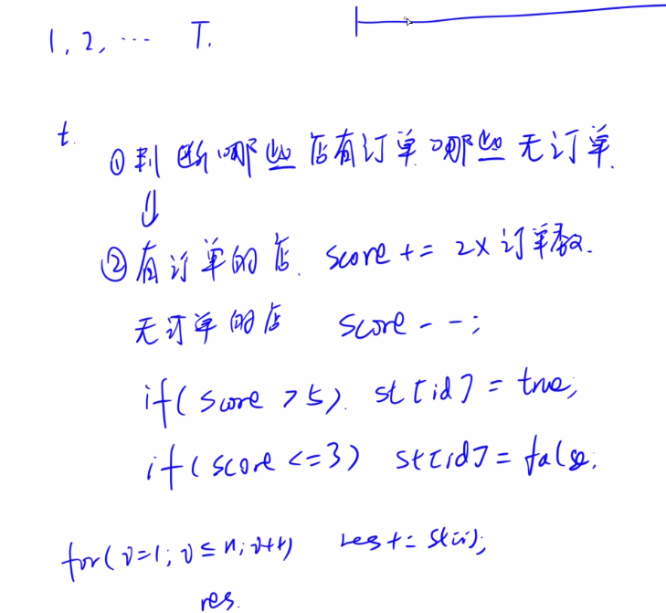
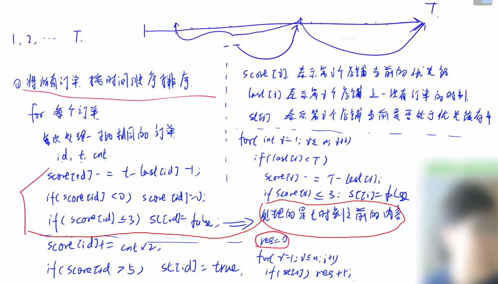
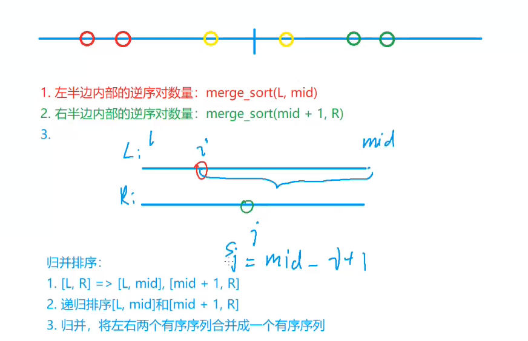

#### 4.4 acwing.1241. 外卖店优先级

第十届蓝桥杯省赛C++A/C组,第十届蓝桥杯省赛JAVAA/B/C组

<!--more-->

```C++
“饱了么”外卖系统中维护着 N 家外卖店，编号 1∼N。
每家外卖店都有一个优先级，初始时 (0 时刻) 优先级都为 0。
每经过 1 个时间单位，如果外卖店没有订单，则优先级会减少 1，最低减到 0；而如果外卖店有订单，则优先级不减反加，每有一单优先级加 2。
如果某家外卖店某时刻优先级大于 5，则会被系统加入优先缓存中；如果优先级小于等于 3，则会被清除出优先缓存。
给定 T 时刻以内的 M 条订单信息，请你计算 T 时刻时有多少外卖店在优先缓存中。

输入格式
第一行包含 3 个整数 N,M,T。
以下 M 行每行包含两个整数 ts 和 id，表示 ts 时刻编号 id 的外卖店收到一个订单。

输出格式
输出一个整数代表答案。

数据范围
1≤N,M,T≤10^5,
1≤ts≤T,
1≤id≤N
输入样例：
2 6 6
1 1
5 2
3 1
6 2
2 1
6 2
输出样例：
1
样例解释
6 时刻时，1 号店优先级降到 3，被移除出优先缓存；2 号店优先级升到 6，加入优先缓存。
所以是有 1 家店 (2 号) 在优先缓存中。
```

思路：

首先想到的就是直接按照题目要求模拟。



对于每个时间点，对有订单和无订单的店分别处理优先级，处理完之后判断状态，最后遍历所有店，输出在优

先缓存中的店的数量。

这种做法比较暴力，计算时间复杂度为O(T*N)，也就是10^10。肯定过不了，只能拿到部分分数。

想想怎么优化？

由于时间段被分割成不连续的一段段，因为不可能每个时刻每个店都有外卖，我们可以压缩没有外卖的时间，

在有外卖的时刻统一处理所有店的情况。



```C++
#include <iostream>
#include <cstdio>
#include <algorithm>
using namespace std;
#define x first
#define y second
typedef pair<int,int> PII;

const int N = 100010;
int score[N],last[N];
bool st[N];
PII order[N];
int main(){
    int n,m,T;
    scanf("%d%d%d",&n,&m,&T);

    for (int i = 0;i < m;i++) scanf("%d %d",&order[i].x,&order[i].y);
    sort(order,order + m);// pair对sort会默认按双关键字排序
    for (int i = 0;i < m;){// 枚举订单
        int j = i;
        while (j < m && order[i] == order[j]) j++;// 找到第一个不同的订单
        int cnt = j-i;
        int t = order[i].x,id = order[i].y;
        i = j;// 直接跳过同一家店同时的订单
        score[id] -= t - last[id] - 1;// 上次有订单到这次有订单减去相应的优先级
        // 当前有订单，所以多减1
        if (score[id] < 0) score[id] = 0;// 优先级最低为0
        if (score[id] <= 3) st[id] = false;// 如果在本次订单之前就出队就不需要在处理当前订单了
		// 以上是处理t时刻之前的信息
        score[id] += cnt*2;
        if (score[id] > 5) st[id] = true;// 处理当前信息

        last[id] = t;
    }

    for (int i = 1;i <= n;i++){
        if (last[i] < T){// 处理上一次有订单时刻到T时刻的信息
            score[i] -= T - last[i];// 对比上面，当前T时刻没有订单，不需要减1
            if (score[i] <= 3) st[i] = false;// T时刻没有订单了，只需要出队，不需要入队
        }
    }

    int res = 0;
    for (int i = 1;i <= n;i++) res += st[i];
    printf("%d\n",res);
    return 0;
}
```

#### 4.5 acwing.788. 逆序对的数量（模板题）

```C++
给定一个长度为 n 的整数数列，请你计算数列中的逆序对的数量。
逆序对的定义如下：对于数列的第 i 个和第 j 个元素，如果满足 i<j 且 a[i]>a[j]，则其为一个逆序对；否则不是。

输入格式
第一行包含整数 n，表示数列的长度。

第二行包含 n 个整数，表示整个数列。

输出格式
输出一个整数，表示逆序对的个数。

数据范围
1≤n≤100000
输入样例：
6
2 3 4 5 6 1
输出样例：
5
```

思路：

首先提一下暴力做法，就是直接两层for循环，遍历数组求解逆序对数量，时间复杂度O(n^2)。

---

再来优化，这题考察归并排序，利用分治思想。

我们先将序列从中间分开，按三种情况计算逆序对数量。

将逆序对分成三类：

1.两个元素都在左边；2.两个元素都在右边；3.两个元素一个在左一个在右；

然后计算逆序对的数量（序列）：
1. 递归算左边的；
2. 递归算右边的；
3. 算一个左一个右的；
4. 把他们加到到一起。



---

参考[讲解视频](https://www.bilibili.com/video/BV1Hv41167ft?share_source=copy_web)。

我们将单调递增的数组称为有序的。

归并排序的过程，其实也就是将**逆序**变成**有序**的过程，就是消灭逆序对。

只要把从逆序到有序的交换次数记下来，就是逆序对的数量。

涉及到交换元素的排序，首先想到的就是冒泡排序了，这是比暴力做法相对优化一步的做法了，但是不如归并

排序。对于冒泡排序，只要记录交换次数就行了。

这题实际上是归并排序的经典应用。

归并过程：1.将数组一分为二；2.递归划分数组，直到两边只有一个元素（此时有序）；3.归并，注意只有两

边都是有序的才能进行，无序则必须递归划分直到有序。

归并排序，时间复杂度当然是O(n*logn)。

```C++
// 注意：当倒序时逆序对数量最多，等于n/2*(n-1)，约为5*10^9，用long long
#include <iostream>
#include <algorithm>
using namespace std;
typedef long long LL;

const int N = 100010;
int n,q[N],tmp[N];

LL merge_sort(int l,int r){
    if (l >= r) return 0;// l == r也可以
    int mid = l + r >> 1;
    LL res = merge_sort(l,mid) + merge_sort(mid+1,r);// 递归
    // 归并过程
    int k = 0,i = l,j = mid+1;
    while (i <= mid && j <= r){
        if (q[i] <= q[j]) tmp[k++] = q[i++];
        else{
            tmp[k++] = q[j++];
            res += mid - i + 1;// 计算逆序对
        }
    }
    // 扫尾
    while (i <= mid) tmp[k++] = q[i++];
    while (j <= r) tmp[k++] = q[j++];
    // 物归原主，不要写错了
    for (int i = l,j = 0;i <= r;i++,j++) q[i] = tmp[j];
    return res;
}
int main(){
    cin >> n;
    for (int i = 0;i < n;i++) cin >> q[i];

    cout << merge_sort(0,n-1) << endl;
    return 0;
}
```

